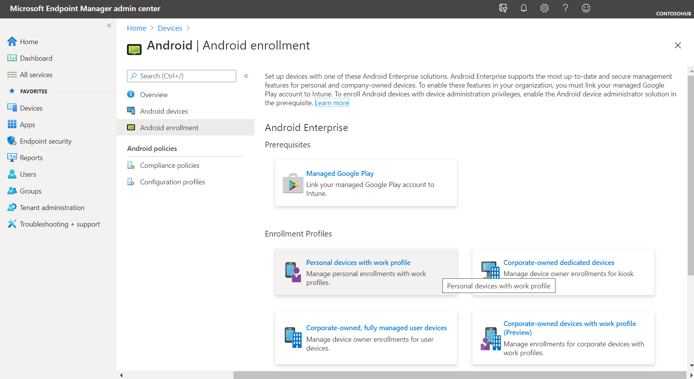
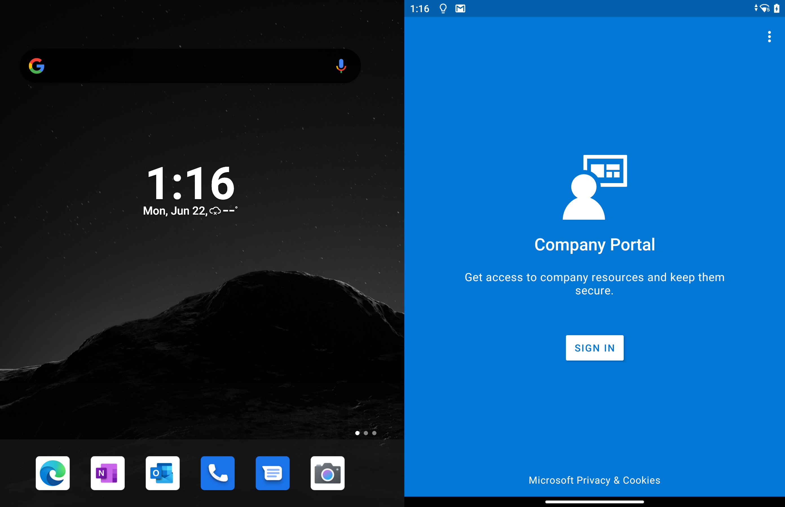
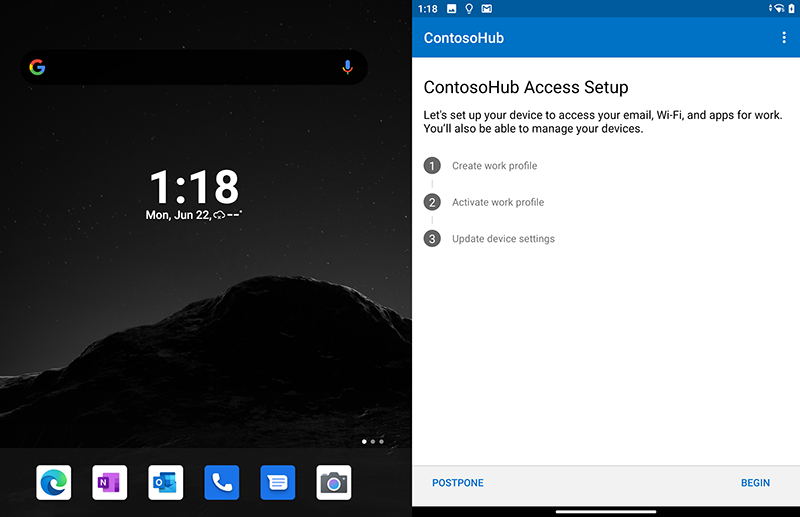
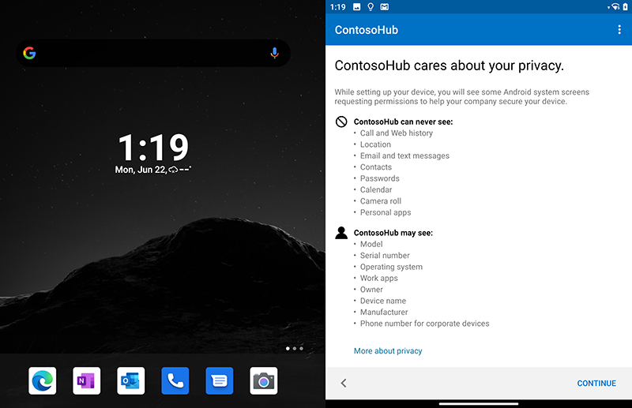
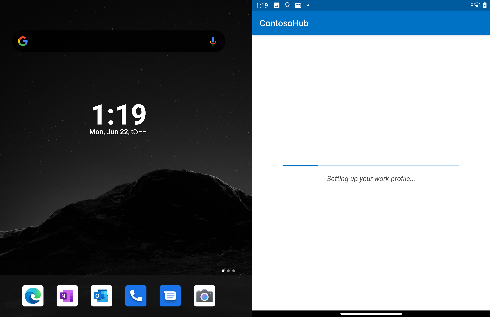
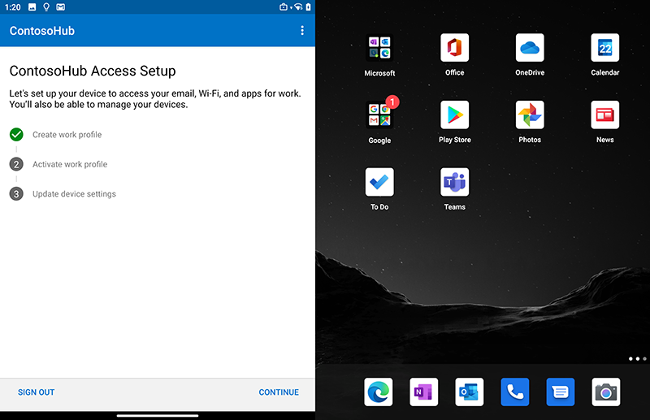
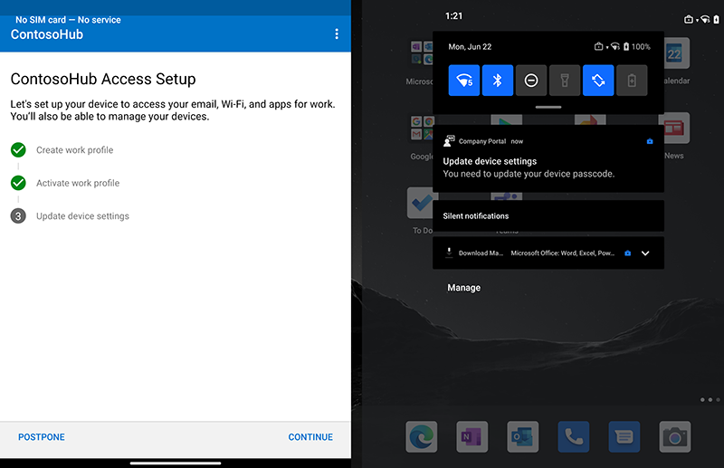
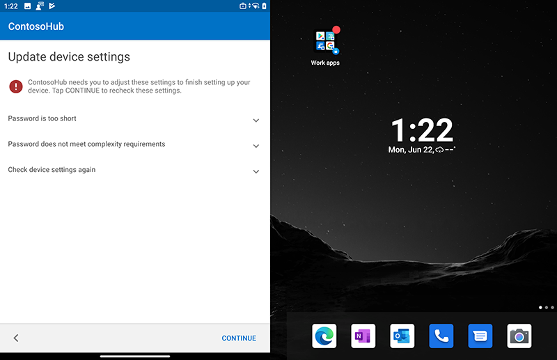
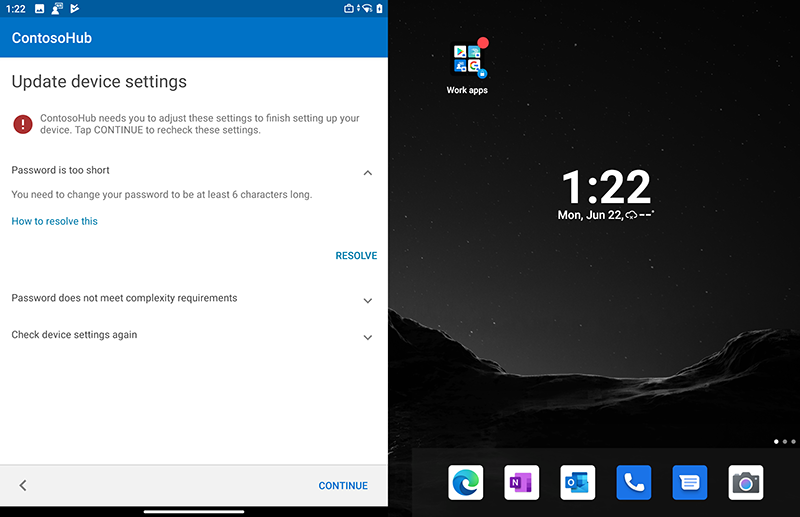
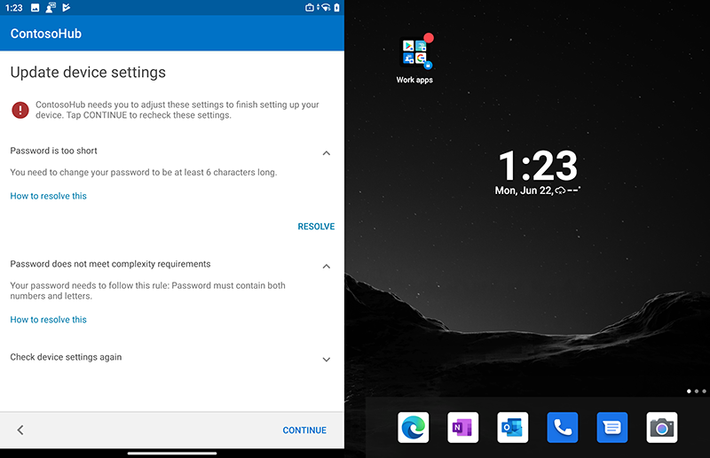

# Configure Android Enterprise Work Profile for Surface Duo

Targeted at  BYOD deployments, work profiles provide a separate space on Duo for work apps and data, giving organizations full control of their data, apps, and security policies without preventing employees from using their device for personal apps and data.

### Setup Android Enterprise Work Profile

Use work profiles to manage corporate data and apps on user-owned Android devices. By default, enrollment of personally owned work profile devices is enabled and requires no further admin configuration.  

**To enable Enterprise Work Profile:**

- In Endpoint Manager, select **Devices** > **Android** > **Android enrollment** and then select **Personal devices with work profile**.
  
 

 
**Sign into Surface Duo with Android Enterprise Work Profile**

1. Install the Company Portal app from Google Play Store and sign in with your Microsoft work or school account.  

 
2. On the Access Setup page, select **Begin**.  

3. Review the information on the privacy page and select **Continue**.  
 
  
 
 
4. When the work profile setup completes, select **Continue** to activate and register the device.  
 

5. Select **Continue**.  
 

6. When you have activated the work profile, select **Continue** to update device settings.  

> [!NOTE]
>  In this example, the work profile applies an MDM setting to require a stronger 6-digit alphanumeric password.   

   
7. Select **Resolve** to enter the required authentication and then select **Continue** to complete Work Profile setup.   
   
   

## Learn more

- [Set up enrollment of Android Enterprise work profile devices](https://docs.microsoft.com/mem/intune/enrollment/android-work-profile-enroll)

