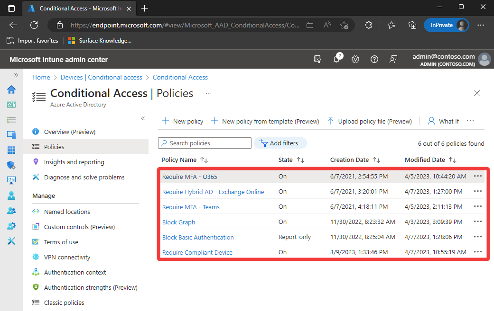

# Conditional Access for Surface Hub

## What it Conditional Access? ##
[Conditional Access](https://learn.microsoft.com/azure/active-directory/conditional-access/overview) is an Azure Active Directory (Azure AD) feature that allows organizations to configure policies to grant or block access to corporate resources. If incompatible policies are enforced on the Surface Hub device account or personal user accounts, you might experience one or more of the following issues on the device:

- Unable to add the device account to the Surface Hub
- Welcome Screen calendar not syncing with Exchange
- Teams Rooms client not signing in

 
Follow the guidance on this page to better understand how the Surface Hub interacts with Conditional Access and how to troubleshoot issues.
 
## Device account and Conditional Access ##
### Cloud apps ###
The Surface Hub device account uses the following cloud apps when signing in. Ensure your Conditional Access policies are configured to allow sign-in to these resources.

- Office365
- Office 365 Exchange Online
- Office 365 SharePoint Online (includes OneDrive)
- Graph Explorer
- Microsoft Teams

### Grant access controls ###
The Surface Hub device account isn't compatible with Conditional Access policies requiring the below types of Grant access controls. The device accounts needs to be **excluded** from such policies.

- Require multifactor authentication
- Require authentication strength (Preview)
- Require device to be marked as compliant
- Require Hybrid Azure AD joined device
- Require approved client app
- Require app protection policy
- Require password change

 
## Troubleshoot ##
If the Surface Hub device account is failing to sign in, first follow the guidance on troubleshooting Azure Sign-in Logs to determine if there are any sign in interrupts or failures. Looking at the details of the sign in should show if a Conditional Access policy is the cause.
 
The [What If](https://learn.microsoft.com/azure/active-directory/conditional-access/what-if-tool) tool can be used to determine which Conditional Access policies apply to the device account. When using the tool select the Surface Hub device account as the user and leave the default of "Any cloud app". More information can be found at [Troubleshooting Conditional Access using the What If tool](https://learn.microsoft.com/en-us/azure/active-directory/conditional-access/troubleshoot-conditional-access-what-if).
 
*Show GIF of running tool*
 
## Review Conditional Access Policies ##
If the Azure sign-in logs and What If tool doesn't reveal any Conditional Access policies affecting the account, it's recommended to manually review every Conditional Access policy to ensure the Surface Hub device account isn't affected.
 
### Step 1 ###
Navigate to your organization's Conditional Access policies within Endpoint Manager. To access this page, ensure the user has the correct [role](https://learn.microsoft.com/azure/active-directory/reports-monitoring/how-to-view-applied-conditional-access-policies#required-administrator-roles) assigned.

1. Sign into the [Endpoint Manager portal](https://endpoint.microsoft.com/#home)
2. Go to **Devices > Conditional Access**

### Step 2 ###
Select each Conditional Access policy and review its **Assignments** and **Access Controls**. Use the requirements listed at the beginning of this article to determine if the policy is compatible with the Surface Hub.
If not, the device account needs to be Excluded from such policies in order to sign-in.
 
>[!NOTE]
>Policies in *On* or *Report Only* states can affect the Surface Hub device account.

### Step 3 ###
**Exclude device account from unsupported Conditional Access policies**
Due to the limited number of policies the Surface Hub device account supports, it commonly needs to exclude from Conditional Access policies to allow sign-in. To exclude the device account from a Conditional Access policy do the following:

1. Under Assignments select **Users > Exclude**
2. Select Users and groups
3. Select each individual Surface Hub device account (or group of device accounts).
4. Select Save at the bottom of the screen.
 
Here's a [video](https://www.youtube.com/watch?v=5DsW1hB3Jqs&ab_channel=MicrosoftSecurity) demonstrating how to exclude user accounts from a Conditional Access policy.

>[!IMPORTANT]
select the Surface Hub device account **user** object, not the Surface Hub **device** object.
 

More troubleshooting details and examples of incompatible Conditional Access policies can be found in the How To: Troubleshoot Surface Hub Conditional Access page.

