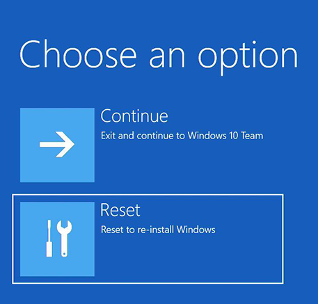
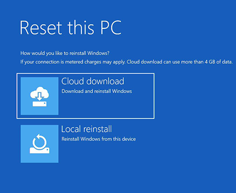
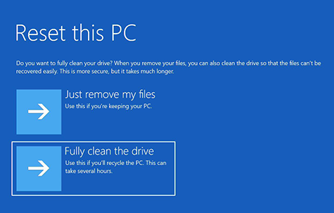
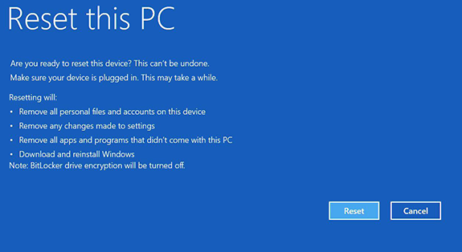
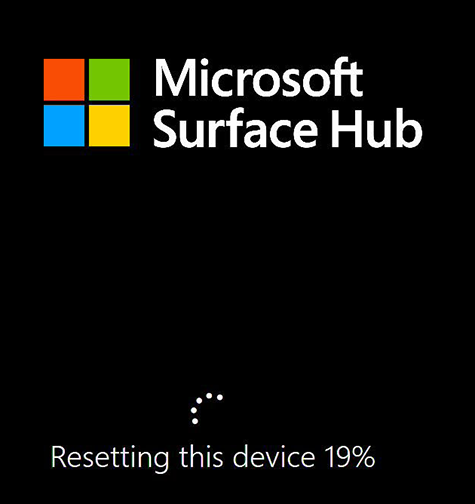

# Reset or recover a Surface Hub

This article describes how to reset or recover a Microsoft Surface Hub.  

[Resetting the Surface Hub](#reset-a-surface-hub) returns its operating system to the last cumulative Windows update, and removes all local user files and configuration information. The information that is removed includes the following:

- The device account
- Account information for the device's local administrators
- Domain-join or Azure AD-join information
- Mobile Device Management (MDM) enrollment information
- Configuration information that was set by using MDM or the Settings app

[Recovering a Surface Hub from the cloud](#recover-a-surface-hub-from-the-cloud) also removes this information. In addition, the Surface Hub downloads a new operating system image and installs it. You can specify whether the recovery process preserves other information that is stored on the Surface Hub. The same operating system image is used by the [Surface Hub Recovery Tool](surface-hub-recovery-tool.md) if you need to recover a Surface Hub for which neither of these options can be used.

## Reset a Surface Hub

You may have to reset your Surface Hub for reasons such as the following:

- You are re-purposing the device for a new meeting space and want to reconfigure it.
- You want to change how you locally manage the device.
- The user name or password for the device account or the Administrator account has been lost.
- After you install an update, the performance of the device decreases.

During the reset process, if you see a blank screen for long periods of time, please wait and do not take any action.

> [!WARNING]
> The device reset process may take up to six hours. Do not turn off or unplug the Surface Hub until the process has finished. If you interrupt the process, the device becomes inoperable. The device requires warranty service in order to become functional again.

1. On your Surface Hub, open **Settings**.

   

2. Select **Update & Security**.

   

3. Select **Recovery**, and then, under **Reset device**, select **Get started**.

   > [!IMPORTANT]
   > Ensure that you have your BitLocker key available before resetting the device, as you will be prompted for it later. To learn more, see [Save your BitLocker key](save-bitlocker-key-surface-hub.md). When the Hub reboots to the recovery partition, it will prompt you to enter the BitLocker key. Skipping that prompt will cause reset to fail.
   
   

   After the reset process finishes, the Surface Hub starts the [first run program](first-run-program-surface-hub.md) again. If the reset process encounters a problem, it rolls the Surface Hub back to the previously-existing operating system image and then displays the Welcome screen.

## Recover a Surface Hub from the cloud

If for some reason the Surface Hub becomes unusable, you can still recover it from the cloud without assistance from Microsoft Support. The Surface Hub can download a fresh operating system image from the cloud, and use that image to reinstall its operating system.

You may have to use this type of recovery process under the following circumstances:

- [The Surface Hub or its related accounts have entered an unstable state](#recover-a-surface-hub-in-a-bad-state)
- [The Surface Hub is locked](#recover-a-locked-surface-hub)

>[!IMPORTANT]
>The **Recover from the cloud** process requires a wired connection that provides open internet connectivity (no proxy or other authentication prompts).

### Recover a Surface Hub in a bad state

If the device account gets into an unstable state or if the administrator account encounters problems, you can use the Settings app to start the cloud recovery process. You should only use the cloud recovery process when the [device reset](#reset-a-surface-hub) process doesn't fix the problem.

1. On your Surface Hub, select **Settings** &gt; **Update & security** &gt; **Recovery**.

2. Under **Recover from the cloud**, select **Restart now**.

   

### Recover a locked Surface Hub

On rare occasions, a Surface Hub may encounter an error while cleaning up user and app data at the end of a session. When this happens, the device automatically restarts and tries the operation again. But if this operation fails repeatedly, the device automatically locks to protect user data. To unlock it, you must [reset the device](#reset-a-surface-hub) or, if that doesn't work, recover it from the cloud.

1. Locate the power switch on the bottom of Surface Hub. The power switch is next to the power cord connection. For more information about the power switch, see the [Surface Hub Site Readiness Guide (PDF)](surface-hub-site-readiness-guide.md).

2. While the Surface Hub displays the Welcome screen, use the power switch to turn off the Surface Hub.

3. Use the power switch to turn the Surface Hub back on. The device starts and displays the Surface Hub Logo screen. When you see spinning dots under the Surface Hub Logo, use the power switch to turn the Surface Hub off again.  

4. Repeat step 3 three times, or until the Surface Hub displays the "Preparing Automatic Repair" message. After it displays this message, the Surface Hub displays the Windows RE screen.

 
5. Select **Reset to re-install Windows**. 

8. Select **Cloud download.** 

   

>[!IMPORTANT]
>If you get an error message indicating **Unable to Download**, select **Cancel** and try again.

9. Select **Fully clean the drive.** 

10. You will be asked **Are you ready to reset this device?**. Select **Reset**. 

11. The download begins and the recovery process indicates **Resetting this device**. 

## Contact Support

If you have questions or need help, you can [create a support request](https://support.microsoft.com/supportforbusiness/productselection).

## Related topics

[Manage Microsoft Surface Hub](manage-surface-hub.md)

[Microsoft Surface Hub administrator's guide](surface-hub-administrators-guide.md)
