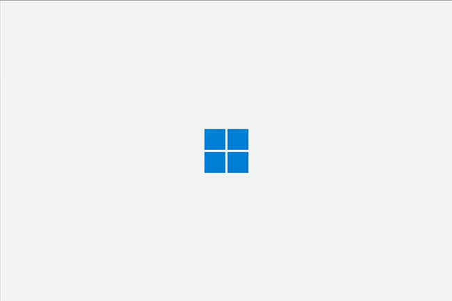

# First-time setup for Surface Hub 3

## Unboxing and hardware setup

Carefully unbox the Surface Hub 3 and set it up on its stand or mount it as per the instructions:

- [Install and mount Surface Hub 50 inch](surface-hub-install-mount.md)
- [Install and mount Surface Hub 85 inch](surface-hub-2s-85-install-mount.md)

Connect any peripherals that you will be using with the device, such as a keyboard or mouse, although these are not required for setup.

## Prerequisites

Before you start Surface Hub 3 for the first time, ensure that you have the following:

- An account with admin privileges
- A resource account with a [supported Microsoft Teams Rooms license](/microsoftteams/rooms/rooms-licensing)

> [!TIP]
> Review the [Microsoft Teams Rooms Deployment overview](/microsoftteams/rooms/rooms-deploy)

When you first start Surface Hub 3, the device automatically enters first-time Setup mode to guide you through account configuration and related settings.

## Use provisioning packages in enteprise environments

Although not required, you can automate the setup process with a provisioning package to ensure a consistent experience across multiple Surface Hubs. This optional technology allows for a streamlined setup process that can be performed without extensive IT intervention, saving time and resources in organizational and enterprise environments.

1. To begin, review the documentation in [Create provisioning packages](provisioning-packages-for-surface-hub.md) and save the provisioning package to a USB thumb drive.
2. Insert the USB thumb drive into one of the USB ports when you see the License Agreement page.
3. When prompted, choose the provisioning package you'd like to use.
4. Follow the rest of the steps, and remove the USB drive at the first reboot that occurs in the setup process.

## Surface Hub 3 OOBE setup

1. Press the power button to start the device.

 

2. Connect to a network.

 

> [!TIP]
> If you have already attached an Ethernet cable, Surface Hub 3 automatically connects to your network. Alternatively, you can connect to a wireless network. **Note:** You cannot connect to a wireless network in hotspots (captive portals) that redirect sign-in requests to a provider's website.

3. **Select your region.** Confirm the auto-detected region and select **Yes**.

 

4. **Confirm keyboard layout.** Select **Yes**.

 

5. To add a second keyboard, select **Add layout**. Otherwise, select **Skip**.

 

6. The setup experience automatically configures your work or school account.

 

 

## Microsoft Teams Rooms setup

Now you're ready to begin the Microsoft Teams Rooms setup experience.

1. Agree to Microsoft Software License Terms and acknowledge that you have read the privacy statement at [https://aka.ms/privacy](https://aka.ms/privacy). Select **Next**.

    

2. Enter your account and password. Select **Next**.

    

3. Enable Cortana Voice Activation if desired. Select **Next**.

    

4. Enter advanced settings including Exchange sign in and domain information. Select **Next**.

    
5. Select **Finish** to complete Microsoft Teams Rooms setup.

## Learn more

