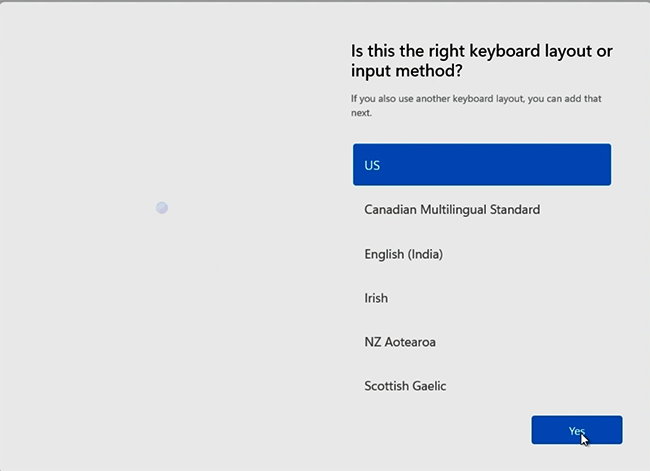

# First-time setup for Surface Hub 3

## Unboxing and hardware setup

Carefully unbox the Surface Hub 3 and set it up on its stand or mount it as per the instructions:

- [Install and mount Surface Hub 50 inch](surface-hub-install-mount.md)
- [Install and mount Surface Hub 85 inch](surface-hub-3-85-install-mount.md)

Connect any peripherals you will use with the device, such as a keyboard or mouse, although these are not required for setup.

## Prerequisites

Before you start Surface Hub 3 for the first time, ensure that you have the following:

- A resource account with a [supported Microsoft Teams Rooms license](/microsoftteams/rooms/rooms-licensing). We recommend use of the Teams Rooms Pro license. 
- The ability to log in with a resource account using your credentials or an IT-provided one-time passcode as set up in Teams Rooms Pro portal. 

> [!TIP]
> For guidance about deploying Microsoft Teams Rooms on Windows, see: [Deployment overview](/microsoftteams/rooms/rooms-deploy). For an overview of requirements to get the most out of Microsoft Teams Rooms, see: [Prepare your environment](/microsoftteams/rooms/rooms-prep). 

When you first start Surface Hub 3, the device automatically enters first-time Windows Setup mode as well as first time setup of the Microsoft Teams Rooms application, which guides you through logging in with a pre-configured device account. 

## Use provisioning packages in Enterprise environments

Although not required, you can automate the setup process with a provisioning package to ensure a consistent experience across multiple Surface Hubs. This optional technology allows for a streamlined setup process that can be performed without extensive IT intervention, saving time and resources in organizational and enterprise environments.

1. Review the documentation in [Create provisioning packages](provisioning-packages-for-surface-hub.md) and save the package to a USB thumb drive.
2. Insert the USB thumb drive into one of the USB ports when you see the License Agreement page.
3. When prompted, choose the provisioning package you want.
4. Follow the rest of the steps, and remove the USB drive at the first reboot that occurs in the setup process.

## Surface Hub 3 OOBE setup

> [!TIP]
> When you run first-time setup, ensure you stay connected to the Internet to automatically download required updates to enable the current user experience. We recommend connecting via a wired Ethernet cable. 

1. Press the power button to start the device.

   

2. Connect to a network.

   

   > [!TIP]
   > If you have already attached an Ethernet cable, Surface Hub 3 automatically connects to your network. Alternatively, you can connect to a wireless network.

   > [!NOTE]
   > You cannot connect to a wireless network in hotspots (captive portals) that redirect sign-in requests to a provider's website.

3. **Select your region.** Confirm the auto-detected region and select **Yes**.

   

4. **Confirm keyboard layout.** Select **Yes**.

   

5. To add a second keyboard, select **Add layout**. Otherwise, select **Skip**.

   

## Microsoft Teams Rooms setup

Now, you're ready to begin the Microsoft Teams Rooms setup experience.

1. Agree to Microsoft Software License Terms and acknowledge that you have read the privacy statement at [https://aka.ms/privacy](https://aka.ms/privacy). Select **Accept**.
2. If you received a verification code, enter it and select **Continue.** Otherwise, select **Manual setup** and enter your Teams resource account and password.
3. Select **Finish** to complete the Microsoft Teams Rooms setup.

## Understanding the platform configuration on Surface Hub 3

Your Surface Hub 3 is configured with two distinct Windows profiles, each serving a specific purpose:

1. **Skype profile (Kiosk mode)**
    - **Function:** This profile automatically logs in at boot. It operates in a custom kiosk mode, where the Microsoft Teams Rooms (MTR) application is the only user-accessible feature for non-administrators. Although commonly mistaken as the "platform" or "OS," it is essentially an app running in kiosk mode.
    - **Password:** There is no password for this account. If prompted for a password when switching between Windows accounts, simply press **Enter.**
2. **Administrator profile**
There are several ways to access the Admin account:

- **Method 1:** While in the MTR app/home screen, connect a keyboard and press the Windows key five times to reach the Windows login screen. The Admin account is usually located in the bottom left. Select it and enter the password **sfb** when prompted. This method keeps the Skype user/MTR app session active, which is necessary for certain administrative tasks.

- **Method 2:** In the MTR app, select **...** on the home screen, then **Settings.** Use your admin credentials (username: admin, password: sfb), and navigate to **Windows Settings** in the left panel. This action takes you to the Windows login screen, logging you out of the Skype user/MTR app session.
 
- **Method 3:** If the Admin account isn't visible and you see an **other user** login prompt, use the login credential **.\admin** to direct the login to the Administrator account and enter the password.

### Using Administrator Windows account

Once logged into the Administrator Windows account, you have access to standard Windows functionalities. This includes joining Wi-Fi networks, configuring Bluetooth audio devices, and running Hub-specific applications like the Surface App or Surface Hub Hardware Diagnostic tool.

## Next steps

- Although the OOBE process automatically downloads required updates, running Windows Update is recommended to ensure you have the latest. Sign in to Surface Hub 3 with an admin account, and open **Settings > Windows Update > Check for Updates**.
- Review [Surface Hub 3 security best practices](surface-hub-3-security.md). At a minimum, recommendations include changing the default Administrator password (factory set to **sfb**), adding a UEFI password, and implementing appropriate physical security measures.
- Optionally, you may need to [update Surface Hub Pen firmware](surface-hub-pen-firmware.md)
