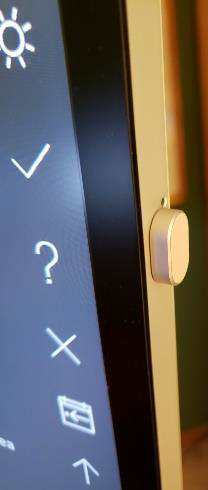

# Surface Hub desktop post install configuration

**Applies to: Surface Hub** 

Perform the following steps to configure your Surface Hub after installing Windows 10.

## Configure system settings

1. Sign in with an account that has local administrator privileges on the device.  On Azure AD joined devices, the user that performs the Azure AD join is automatically added to the local administrator group. Azure AD global administrators and Azure AD devices administrators are [also local administrators](https://docs.microsoft.com/azure/active-directory/devices/assign-local-admin). You can type **net localgroup administrators** at a command prompt to list the accounts that have local administrator rights.
2. Rename the device using a friendly name, for example: **username-SHub-Desktop**.
3. Click **Start** > **Settings** > **Accounts** > **Sync your settings** and turn **Sync settings** off. The configuration settings used here are intended to enable the best large-screen touch experience, and therefore you may not want to sync other devices.
4. Reboot the device.

## Enable the touch keyboard and touchpad

1. Right-click the taskbar and then click **Show touch keyboard button** and **Show touchpad button**.

     

2. Configure the touch keyboard to QWERTY and floating.
    1. Click the keyboard on the taskbar to show the touch keyboard.
    2. Click the keyboard icon in the upper left corner of the touch keyboard to open keyboard settings.
    3. Select the next to last keyboard type on the top row to enable QWERTY and the last option on the second row to enable floating.

     

3. Configure the soft keyboard settings.
    1. Search for and open **Typing settings** 
    2. Enable all the options under Spelling, Typing, and Touch keyboard.

## Configure bluetooth keyboard and mouse (optional)

Connect a keyboard and mouse if you are using the device as your primary Windows device, or you use it often for typing or precision work.

If your Surface Hub device is near to your laptop, you can use [Mouse without Borders](http://aka.ms/mm) to enable you to move seamlessly between your laptop and the Surface Hub. For more information, see [Microsoft download from The Garage: Mouse without Borders](https://blogs.microsoft.com/ai/microsoft-download-from-the-garage-mouse-without-borders/).

## OneDrive for Business

Use [OneDrive for Business](https://docs.microsoft.com/onedrive/onedrive) to easily share tools, logs, and other files between all your work devices.

- OneDrive enables you to share your work files between your laptops, Surface Hub Desktop, and your Intune-managed mobile devices. Files can be edited on any device, and all network connected devices will be updated with the changes.
- Considering the size of the Surface Hub SSD (128GB), if you configure OneDrive on your Surface Hub Desktop device, make sure the default configuration is to keep the files online and download files as you use them.

To configure OneDrive to download files only when needed, set the **Files On-Demand** setting to **Save space and download files as you use them**. For more information, see [Query and set Files On-Demand states in Windows](https://docs.microsoft.com/onedrive/files-on-demand-windows).

## Sharepoint and Teams

SharePoint and Teams Channel files can also sync locally to your desktop devices, such as laptops and Surface Hubs, using the OneDrive sync engine.

To sync internal corporate files to your local drive with the OneDrive sync app:

1. Go to a SharePoint site and navigate to the top-level document directory for files that you are interested in viewing or editing from your local device.
2. Click on the **Sync** button on the top of the SharePoint ribbon.
3. Click on **Open** on the popup **This site is trying to open Microsoft OneDrive**.
4. Verify that the SharePoint files are synchronizing to your local drive by clicking on the OneDrive icon at the bottom right of the taskbar.
5. Verify the configuration is set to keep the files online and download the files only as you use them:
    1. Open file explorer.
    2. Navigate to and right click on the **Microsoft \ <SharePoint Document Folder Name>**.
    3. Click **Free up space**.
    4. The Status column will display the status of files and folders. For more information, see [Sync SharePoint files with the OneDrive sync client](https://support.microsoft.com/office/sync-sharepoint-files-with-the-onedrive-sync-client-groove-exe-59b1de2b-519e-4d3a-8f45-51647cf291cd).
6. Teams Channel files are stored in SharePoint sites, with all of the same SharePoint document functionality, including version history and synchronizing to your local desktop devices. To sync Teams Channel files:
    1. Navigate to the Teams Channel of interest and click on the **Files** tab at the top. Then click **Sync**. The files will start synchronizing and will be visible in File Explorer at **Desktop \ Microsoft \ <name of the Teams Channel>**.
    2. Use the same procedure that you used for synchronizing SharePoint sites to keep the files in the cloud and only download them when you use them, by right-clicking in File Explorer on the Teams Channel name, and then clicking **Free up space**.

## Pair the Surface Hub pen

To pair the pen device:

1. Click **Start** > **Settings** > **Devices**.
2. Click **Add Bluetooth or other device**.
3. Choose **Bluetooth**.
4. Remove the pen cap and shake to disconnect the battery connection.
5. Put the cap back on and press and hold the cap until the pairing led flashes.
6. Choose **Surface Hub 2 Pen**.
7. Complete the pairing operation. If the pairing is not successful, reboot the device and then try again.

## Camera configuration

You can mount the camera on the top or on either side of the device. Mount the camera in a position to optimize the camera angle if you are using the Hub with a desktop stand instead of a cart, or are in close proximity to the Hub. The camera does not auto-rotate, so you need to have a 2mm hex key. 

For more information on how to side-mount the camera and rotate the camera manually, see [Surface Hub 2S camera lens orientation](https://support.microsoft.com/help/4509729/surface-hub-2s-camera-lens-orientation).

## Windows Hello configuration

Surface Hub 2S running Windows 10 Enterprise allows the full suite of Win32 desktop applications as well as biometric Windows Hello options. The Surface fingerprint reader accessory can be plugged into either side, or into the bottom USB-C port. 

After inserting the fingerprint reader, click **Start** > **Settings** > **Accounts** > **Sign-in options** > **Windows Hello Fingerprint** to enroll your fingerprint.

Face recognition using Windows Hello also works well on capable devices. However, the Surface Hub built-in camera does not support Windows Hello face recognition. 

## Applications

### Update installed apps

To update all installed Store apps:
1. Open Microsoft Store app and click the **See more** ellipsis in the top-right corner.
2. Click **Downloads and updates**.
2. Click **Get updates**.

### Microsoft Whiteboard

To install the Microsoft Whiteboard:
1. Select the **Windows Ink Workspace** icon on the lower right of the taskbar and download **Whiteboard**.

Alternatively, you can install Whiteboard from the Microsoft Store:
1. Open Microsoft Store app and search for **Whiteboard**.
2. Choose **No thanks** to sign in and use across devices.
3. Pin Whiteboard to the taskbar.

### Surface app

• Go to the Store
• Search for Surface
• Change the available on, to all devices
• Install the Surface app (should be the first one listed). Note: You may need to associate your MSA to the Store in order to install the app
• Pin Surface App to Taskbar

### Snip & Sketch

• Pin to the Taskbar
• Turn on “Auto copy to clipboard”, “Save snips” and “Multiple windows” (optional)

### Microsoft Office

https://portal.office.com/account#installs
• Pin Office applications to the taskbar
• Windows key
• Scroll down to Office application (e.g. “Excel”)
• Right Click
• Select “More”
• Select “Pin to taskbar”
• Set Outlook OST to only save last two weeks cache – vastly reduces disk usage and setup time
• File / Account Settings / Highlight your @microsoft.com account and then click the Change button
• Set the slider for Use Cached Exchange Mode to 14 days

### Microsoft Teams

• https://teams.microsoft.com/downloads
• Teams - change to not start on boot (optional – user preference)
• Windows key, search for "Startup Apps"
• Turn off Teams
• Pin Teams to the Taskbar
• Optional - you may also want to consider reducing Teams Notifications on the device to avoid distractions –
• To find the Settings, first click on your profile photo, then Settings

(screenshots here)

### Connect app

Windows Key
• Search for “Connect”
• Open the app and then close it (“Project to this PC” may not work unless the Connect app has been run at least once)
• Right-click to pin to Taskbar

### Projecdting to this PC

• Search for “Projection settings”
• Set devices can project to this PC
• If not on Corpnet, select “Available everywhere”, else if on Corpnet select “Available everywhere on secure networks”
• Ask to project to this PC: "First time only"
• Require pin = “Never”
Recommended configuration at home (or not on corporate Wi-Fi)
Recommended configuration on Corporate Wi-Fi___33:

(screenshots here)

### Your Phone

“Your Phone” is a preinstalled app on Windows 10, however it is not present, install it from the Windows Store
• If you need assistance setting up the app use the Windows Central guide to walk you through the steps to get started with this experience. Also, if you come across any problems or you have questions about the app, make sure to check out this other guide with troubleshooting steps and information you need to know about Your Phone

## Super Fancy Zones

• Super Fancy Zones helps users arrange windows to maximize screen real estate. It is now included in “PowerToys” on GitHub (https://github.com/microsoft/PowerToys/releases)

### Edge Chromium browser

https://www.microsoft.com/en-us/edge?form=MY01BL&OCID=MY01BL

## Additional settings

### Pen tail click to launch Whiteboard

• Windows key, search for "Pen” settings
• Select “Pen & Windows Ink"
• Scroll down and Set Pen Shortcuts
• “Click once = Microsoft Whiteboard” 

### Power and sleep settings

• Settings / System / Power & Sleep
• Set Power mode slider to “Best performance”
• Set values to your usage scenario, e.g.

(screenshot)

### Screen saver

• Windows key
• Search for “Lock Screen
• Set “Screen saver settings””
• Set values per your usage scenarios

(screenshot)

### Storage Sense

• Click Windows key and search for Storage
• Turn on “Storage Sense”
• Click on “Configure Storage Sense or run it now” and set values (best to be aggressive to keep files online as much as possible due to limited HD space). Recommended:
• Run Storage Sense=Every Day
• Delete temporary files = Every 7 days (at least)
• Delete files in my Downloads folder if they have been there for over 30 d

### Tablet mode

Turn on Tablet mode if desired for accessibility needs

### Power settings

• Windows Key
• Search for “Software Center” and Tap “Options” menu
• Expand the “Power management” section and select the checkbox “Do not apply power settings from my IT department to this computer”

(screenshot)

### Sound settings

• Go to the Sounds settings page
• Far right, tap “Sound Control Panel” and go the “Sounds” tab
• Change the Program Events sounds to “None” for:
• Device Connect
• Device Disconnect

### Silence notifications

• Open the Focus Assist settings page
• Select Alarms Only
• Avoids constant notification flyouts

### Disk Cleanup

• Windows Key
• Search for “Disk Cleanup”
• Select all files and then tap "Clean up system files"

## Complete and verify setup

1. Scan for and install all Windows Updates.
2. Update Group Policy
    1. At an elevated command prompt, enter **gpupdate /force**.
3. Reboot the device.
4. Verify taskbar apps.
    • Connect App
    • could not connect to hub first time w/o launching the connect app). Subsequent times worked most of the time
    • Lock Icon
    • Snip & Sketch
    • Teams
    • Office Apps
    • Surface App
    • Whiteboard
5. Verify presence detection.
    - Presence detection will be a green icon in the system tray

    (screenshot)
6. Verify projecting to this PC.
7. Verify power and sleep settings.
    • Screen Saver: 15 minutes, set to (none), Mystify or Blank; check box for requiring password is checked
    • Screen: 2 hours
    • PC: 4 hours
8. Verify Windows Hello is working.
9. Verify power settings.
10. Verify sync your settings is disabled.
11. Verify startup apps.

## Related topics

