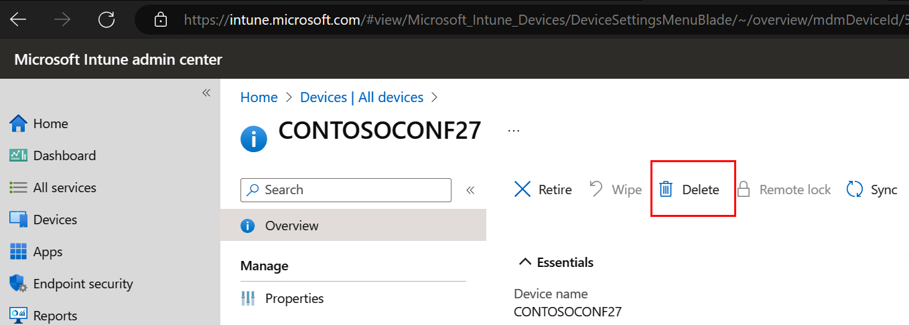
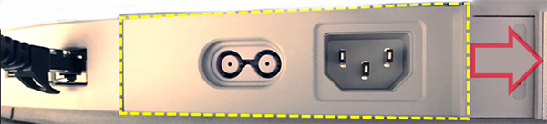
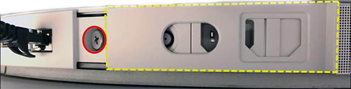
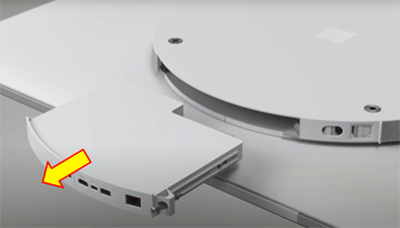
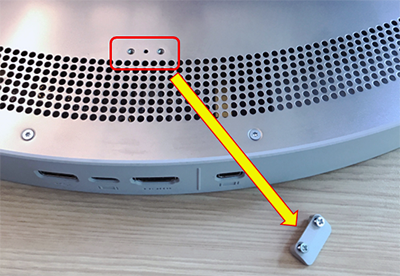

# Install and manage Surface Hub 3 Pack

The Surface Hub 3 Pack is a hardware upgrade that transforms your Surface Hub 2S device into a Surface Hub 3. To place an order, contact your [Surface device reseller](https://www.microsoft.com/surface/business/where-to-buy-microsoft-surface#DEVICESRESELLERS).

## Prerequisites

- A Surface Hub 2S, fully updated with the latest Windows Updates. By default, updates are installed automatically during nightly maintenance. To verify, go to **All apps** > **Settings** > **Update and Security** > **Windows Update**, and install all updates.

> [!TIP]
> You may need to restart the device and continue to check for available updates. Ensure Surface Hub 2S has received one of the following updates: **Microsoft Corporation - System Hardware Update - 5/24/2023** or **Microsoft Corporation - System Hardware Update - 8/18/2023**.

- An account with admin privileges. If you don't know your user name or admin password, you'll need to reset the device. For more information, see [Reset and recovery for Surface Hub 2S](/surface-hub/surface-hub-2s-recover-reset).
- A resource account with a [supported Microsoft Teams Rooms license](/microsoftteams/rooms/rooms-licensing).

> [!NOTE]
> Surface Hub 3 Pack runs Windows 11 IoT Enterprise and does not support downgrading to Windows 10 Team or Windows 10 Pro/Enteprise.

## Hub devices connected to Microsoft Entra ID (Azure AD)

If you manage Surface Hub 2S via Microsoft Intune or other mobile device management (MDM) provider, remove the device prior to installing Surface Pack 3.

1. Sign into Microsoft Intune admin center and go to **Devices > All devices**,  and select your Surface Hub 2S.
2. Select **Delete**.

  .

## Remove old cartridge from Surface Hub 2S

1. Shut down Surface Hub 2S, unplug all cables and slide the cover sideways.

  .

2. Use a Phillips-head screwdriver to remove the retaining screw to detach the cartridge from Surface Hub 2S.

  .

3. Slide the compute cartridge out. You can use the return label included in the packaging for the Surface Hub 3 Pack to send your old cartridge to Microsoft for recycling, if desired.

  

4. If you wish to rotate Surface Hub from landscape to portrait mode, remove the plastic tip on the new cartridge before inserting it (50" models only).

  

5. Take the Surface Hub 3 Pack and slide it into your Surface Hub.
6. Fasten the locking screw and slide the cover into place. Power on your new Surface Hub 3.  
7. Follow the instructions in:

- [First-time setup for Surface Hub 3](first-run-program-surface-hub-3.md).
- [Surface Hub 3 security best practices](surface-hub-3-security.md)

### Learn more

- [Surface Hub 3 Pack FAQ](surface-hub-3-pack-faq.md)
