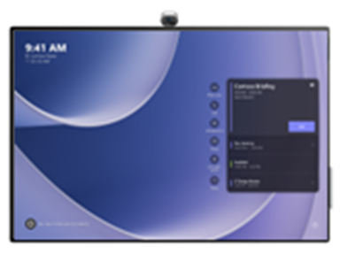

# Install wallpaper on Surface Hub 3

This article explains how to change the default wallpaper (background) on Surface Hub 3 running Microsoft Teams Rooms on Windows.

1. Download the [full-size Windows Bloom wallpaper](images/oembackgroundimage.png) and save it to a USB drive.

    

2. Copy the following XML into a text editor, name it **SkypeSettings.xml**, and save it to your USB drive.  

    ```xml

<SkypeSettings>
  <Theming>
       <ThemeName>Custom</ThemeName>
       <CustomThemeImageUrl>OEMBackgroundImage.png</CustomThemeImageUrl>
       <CustomThemeColor>
            <RedComponent>100</RedComponent>
            <GreenComponent>100</GreenComponent>
            <BlueComponent>100</BlueComponent>
       </CustomThemeColor>
  </Theming>
</SkypeSettings>
    ```

3. Insert the USB drive into the Surface Hub.
4. Connect an external keyboard and press the Windows key five times.
5. When the login Window appears, sign in with your admin credentials.
6. Save the wallpaper image file, oembackgroundimage.png, and **SkypeSettings.xml** in the following folder: 

- **C:\Users\Skype\AppData\Local\Packages\Microsoft.SkypeRoomSystem_8wekyb3d8bbwe\LocalState**

7. Restart Surface Hub to display the new wallpaper:

  .

## Related links

- [Manage settings with an XML configuration file](/microsoftteams/rooms/xml-config-file#manage-console-settings-with-an-xml-configuration-file)
