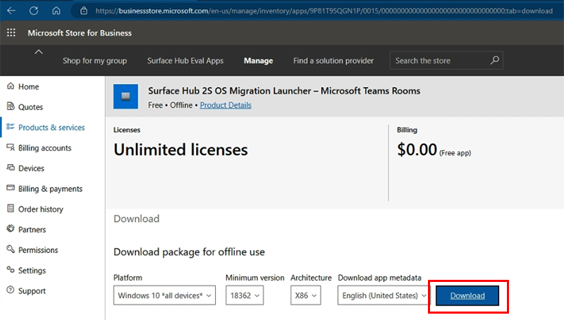
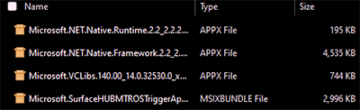
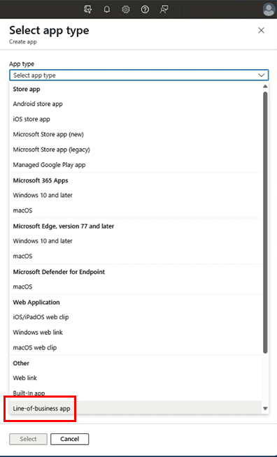
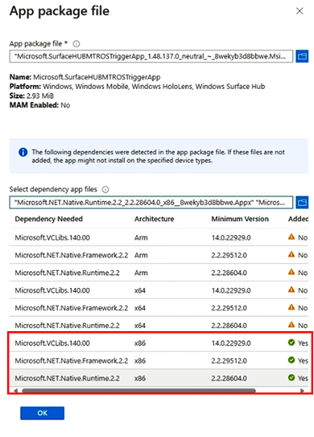
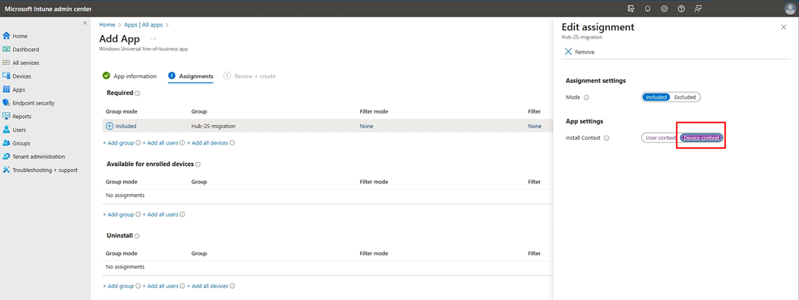
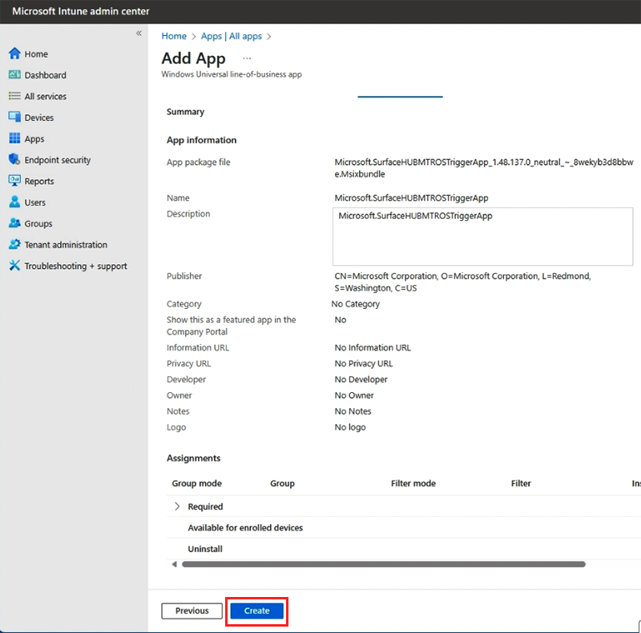

# Migrate Surface Hub 2S to Microsoft Teams Rooms on Windows

 This article provides IT admins with detailed instructions on how to software-migrate a Surface Hub 2S to the Microsoft Teams Rooms on Windows experience (the same software platform shipping on new Surface Hub 3 devices).

## Background

- Surface Hub 2S devices can be migrated provided they meet specific prerequisites.
- The migration process is initiated via the Surface Hub 2S OS Migration Launcher - Microsoft Teams Rooms app, which can be installed directly on a Surface Hub 2S or remotely via Intune or other cloud management tools.

> [!NOTE]
> The Migration Launcher app is specifically for Surface Hub 2S devices transitioning from the Windows 10 Team edition OS to Microsoft Teams Rooms on Windows experience (comprised of the Windows 11 IoT Enterprise 22H2 OS running the Microsoft Teams Rooms application).
Installing the Migration Launcher app on a Surface Hub 2S triggers the migration if the device meets the prerequisite conditions. The app provides no other functionality and no user interface.

> [!CAUTION]
> Do not install the Migration Launcher app on Surface Hub 2S unless you are prepared for immediate migration.

### Additional considerations

- Migration completely removes the Windows 10 Team edition OS.
- By electing to install the Migration Launcher application on a Surface Hub 2S and thereby initiate a software migration, customers acknowledge they will completely remove the Windows 10 Team edition OS, including uninstalling and removing any accounts, data, and other current configurations.
- The Microsoft Teams Rooms on Windows experience on a Surface Hub 2S  put the device into an increased energy consumption state due to the new software platform's different sleep state and power management characteristics.
- This app does not affect first-generation Surface Hub models (as neither software migration nor the Microsoft Teams Rooms on Windows experience are supported on first-generation Surface Hubs).
- The migration process involves downloading approximately 30 GB and requires a minimum amount of available storage on-system to create a temporary partition.

## Prerequisites

- Ensure Surface Hub 2S is connected to the Internet and has the latest Windows Updates, including  Microsoft Corporation - System Hardware Update - 11/21/2023.
- To get all the required updates, sign in with Admin credentials, go to **All apps > Settings** >**Update and Security** >**Windows Update**, and install all updates. Repeat this process to ensure you have all the available updates.
- Once updated, confirm that the UEFI version is **699.845.768.0** or later.
- Migration requires Windows 11 [OS Build19045.3758](https://support.microsoft.com/en-us/topic/november-30-2023-kb5032278-os-build-19045-3758-preview-0ae14f06-577e-4eb3-8fcb-c722f3f9dc29).
- Confirm network access to required sites: **.devices.microsoft.com and download.microsoft.com**.
- Validate that your network can handle a **30 GB download**.

## Install the Migration Launcher app to trigger a migration

Choose one of the following options:

- [Manually install Migration Launcher app on Surface Hub 2S](#manually-install-migration-launcher-app-on-surface-hub-2s). Designed for migrating individual Surface Hub 2S devices.
- [Remotely install Migration Launcher app via Intune.](#remotely-install-migration-launcher-app-via-intune) Designed for migrating multiple select Surface Hub 2S devices remotely.

### Manually install Migration Launcher app on Surface Hub 2S

1. Sign back in as admin. Go to **Surface Hub** >Apps & features** >**Open Store**.
2. Search for **Surface Hub 2S OS Migration Launcher – Microsoft Teams Rooms** and select **Get**.
3. To validate successful installation, select **All apps** and look for **Surface Hub 2S OS Migration Launcher**.
4. Once you see the Migration Launcher in the app list, the migration proceeds automatically upon restart into the Windows 10 Team OS. You can either manually restart Surface Hub 2S or wait until the system automatically restarts during the default nightly maintenance window.

> [!TIP]
> After this initial restart, do not interfere with the system; even though it may appear nothing is happening and you still see the old OS, the migration proceeds independently after completing all necessary backend processes (including downloading and unzipping the new OS image).

5. Typical migration time is around **90** minutes from restart after installing the Migration Launcher app, but the length can vary depending on many characteristics, including customer network bandwidth and related factors.
6. When migration is complete, the device displays the Windows first-time setup program, aka Out of the Box Experience (OOBE). To learn more, see [First time setup for Surface Hub 3](first-run-program-surface-hub-3.md).

### Remotely install Migration Launcher app via Intune

**Summary**

1. [Ensure your Surface Hub 2S devices are **enrolled in Intune**](#ensure-your-surface-hub-2s-devices-are-enrolled-in-intune).
2. [Add Surface Hub 2S devices to a **Device group**](#add-surface-hub-2s-devices-to-a-device-group).
3. [Associate Store for Business account with Intune](#associate-store-account-with-intune).
3. [Download **Migration Launcher app**](#download-migration-launcher-app) from the **Microsoft Store for Business**.
4. [Configure Microsoft Store for Business to display offline apps](#configure-microsoft-store-for-business-to-display-offline-apps)
4. [Deploy Migration Launcher app via **Intune**](#deploy-migration-launcher-app-via-intune).

#### Ensure your Surface Hub 2S devices are enrolled in Intune

- To verify enrollment, sign into **Entra ID**, go to **Devices** > **All devices** and look for the names of your target devices.

> [!TIP]
> This is a good opportunity to check that the OS version for the target devices meets the prerequisites listed above, specifically **OS version 19045.3758**.

#### Add Surface Hub 2S devices to a Device group

> [!WARNING]
> Any devices in the group targeted for Migration Launcher app deployment are migrated as soon as the app has deployed. To avoid unintended behavior, we recommend against using Dynamic Groups, and we encourage you to validate that only your intended devices are included in the group you selected.

1. Sign in to the [Microsoft Intune admin center](https://intune.microsoft.com/).
2. Select **Groups** and then select **New group**.
3. In the **Group type** field, choose **Security**.
4. Enter a **Group name** and **Group description** for the new group.
5. In the Membership type field, choose **Assigned**.
6. Select **Create** to create the new group.
7. Click into the Group, select  **Members** >**Add members** and add the Surface Hub 2S devices you're targeting for migration.

### Associate store account with Intune

Before you enable synchronization in the Microsoft Intune admin center, you must configure your store account to use Intune as a management tool:

1. Ensure that you sign into the [Microsoft Store for Business](https://www.microsoft.com/business-store) using the same tenant account you use to sign into Intune.
2. In the Business Store, choose **Manage**, select **Settings**, and choose **Distribute**.
3. If you don't already have Microsoft Intune available as a mobile device management tool, choose **Add management tool** to add Microsoft Intune. If you don't have Microsoft Intune activated as your mobile device management tool, select **Microsoft Intune** > **Activate**.

> [!TIP]
> Activate Microsoft Intune, not Microsoft Intune Enrollment.

### Download Migration Launcher app

Download the migration launcher app package from Microsoft Store for Business.

#### Configure Microsoft Store for Business to display offline apps

1. Sign in to the [Microsoft Store for Business](https://businessstore.microsoft.com/).
2. Select **Manage** >**Shop** and under Shopping experience, ensure that **Show offline apps** is enabled.

#### Get offline-licensed app package for Migration Launcher

1. Shop for the app and add it to your group inventory. Select **Shop for my group** and search for **Surface Hub 2S OS Migration Launcher – Microsoft Teams Rooms** (Alternatively, search using the app ID: **9P81T95QGN1P**).
2. On the app page, for License type, select **Offline** > **Get the app**. This adds the app to your Microsoft Store for Business group inventory. After you see a "toast message" indicating you successfully added the app to your library, select **Manage**, as shown below. (Note that the Manage button has replaced Get the app button).

3. After you select **Manage**, the page listing for the Migration Launcher app is displayed. Wait a few moments for the spinner to complete and the Download portion of the resulting page to appear.
4. Under Download package for offline use, select the desired architecture (X64, X86, ARM). We recommend using x86.
5. Select **Package details** and choose **Download** to initiate the download of the MsixBundle for the package identity name: **Microsoft.SurfaceHUBMTROSTriggerApp**.

- If you receive an error indicating the downloadable file is unsafe, select **Keep**.
- If further prompted in the Edge browser that **This file can't be downloaded securely**, select **Keep anyway**.

6. Under Required frameworks, download all three of the required frameworks on the page:

- **Microsoft.VCLibs.140.00_14.0.32530.0_x86__8wekyb3d8bbwe**
- **Microsoft.NET.Native.Framework.2.2_2.2.29512.0_x86__8wekyb3d8bbwe**
- **Microsoft.NET.Native.Runtime.2.2_2.2.28604.0_x86__8wekyb3d8bbwe**

7. If you receive an error indicating the downloadable files are unsafe, click **Keep** and **Keep anyway**.
8. You should now have four files (one MSIXBUNDLE File and three APPX Files) downloaded to your local computer and ready for the next step.

## Deploy Migration Launcher app via Intune

1. Sign in to [Microsoft Intune Admin Center](https://endpoint.microsoft.com/) and go to**Apps** >**All apps** >**Add**. Under App type, select **Line-of-business app**.

2. Configure app information on the Add App page. Under the App information section, click **Select app package file**. In the flyout pane, click the blue folder icon under App package file and navigate to select and upload your LOB app package, in this case, the Surface Hub 2S OS Migration Launcher – Microsoft Teams Rooms MSIXBUNDLE file downloaded in the earlier section.  
3. Select **Dependency app files** and click the blue folder icon to select and upload all three dependencies. The inventory of required files displays a green check box to indicate that you have all the required files uploaded.

> [!TIP]
> You only need to ensure the three check box icons appear for your specified architecture

4. Click **OK** after you've added all the necessary files.
5. Under **App information**, select **Next**.

**Assign app**
Under the Assignments tab, specify how the app is deployed to your Surface Hub 2S devices.
You can make the app available for enrolled devices or assign it as required.

1. Under **Required** >**Group mode**, select **Add group** and add your intended Device group.
2. Under **Required Group mode**>**Install Context**, select **User context** link, and in the flyout pane, change the App settings toggle to ensure **Device context** is selected and then select **OK**.

3. Select **Next**.

**Review and create**

- Under **Review + create**, review all settings and configurations. Click **Create** to deploy the app.

This may take a few minutes, depending on network connectivity or other factors. You can check the upload status under the Notifications tray.

**Monitor deployment**

- After deploying, monitor the deployment status in Intune.
- Navigate to the app in Intune and check the Overview and Assignments tabs to see the status and details of the deployment. Ensure you're checking the Device context status, not the User.

> [!NOTE]
> Several factors contribute to how long it takes for the app to finish deployment and installation on the target devices, including device power/sleep state, sync cadence/status with Intune, and related factors. Continue to monitor Intune status for indications of successful app deployment.

- Once the app is deployed, the next restart initiates migration, which - in this remote deployment scenario - is likely to be the automatic restart as part of the nightly maintenance window. Similar to the manual app deployment scenario, the migration process typically takes about 90 minutes after this restart (but many factors can impact migration time, as explained earlier, with a test example exceeding 5 hours on a slower network). Customers must test and validate sequences relative to their unique infrastructure and management approaches.
- When migration is complete, the device displays the Windows first-time setup program, aka Out of the Box Experience (OOBE). To learn more, see [First time setup for Surface Hub 3](https://learn.microsoft.com/surface-hub/first-run-program-surface-hub-3).

## Troubleshooting

### Quick checks

- Verify that Surface Hub 2S is fully updated and otherwise meets the prerequisites described earlier. To learn more, see [Troubleshoot Surface Hub not Updating](troubleshoot-surface-hub-not-updating.md)
- Ensure the Migration Launcher app has been installed on target Surface Hub 2S devices.
- Ensure the system has restarted after installing the Migration Launcher app.

### Event logs

- If migration does not proceed after 24 hours, check system event logs for possible errors, including a potential issue related to available storage space.

### Remote deployment via Intune

- If the Migration Launcher app fails to deploy, check any error messages in the Intune console.
- Verify that the Surface Hub 2S devices are correctly enrolled and online.
- Consider verifying whether another Store for Business offline-licensed application can be remotely deployed to Surface Hub 2S devices.

## Post-migration configuration

Review the following articles for recommended next steps:

- [Get started with Surface Hub 3](surface-hub-3-get-started.md)
- [First -time setup for Surface Hub 3](https://learn.microsoft.com/surface-hub/first-run-program-surface-hub-3)
- [Surface Hub 3 security best practices](surface-hub-3-security.md)
- [Install Windows Bloom wallpaper on Surface Hub 3](install-wallpaper-surface-hub.md)
