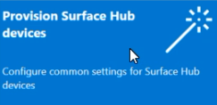
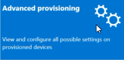

# Create provisioning packages for Surface Hub

Provisioning packages allow you to automate the deployment of key features, helping deliver a consistent experience across all Surface Hubs in your organization. Using  Windows Configuration Designer (WCD) on a separate PC, you can complete the following tasks:

- Enroll in Active Directory or Microsoft Entra ID
- Create a device administrator account
- Add applications and certificates
- Configure proxy settings
- Configure [Configuration Service Provider (CSP) settings](/windows/client-management/mdm/surfacehub-csp)

## Overview

Provisioning packages enable a streamlined setup process that can be performed without extensive IT intervention, saving time and resources in organizational and enterprise environments.

1. On a separate PC running Windows 10 or Windows 11, install [Windows Configuration Designer](https://www.microsoft.com/store/apps/9nblggh4tx22) from the Microsoft Store.
2. Select [**Provision Surface Hub devices**](#use-surface-hub-provisioning-wizard) to configure common settings using a wizard. Or select [Advanced provisioning](#use-advanced-provisioning) to view and configure all possible settings.
3. Create the provisioning package and save it to a USB drive.
4. Deploy the package to your Surface Hub during the first run setup or through the Settings app. To learn more, see [Create a provisioning package](/windows/configuration/provisioning-packages/provisioning-create-package).

## Use Surface Hub provisioning wizard

1. Open Windows Configuration Designer and select **Provision Surface Hub devices**. 
     
2. Name your project and select **Next**.

### Add certificates

> [!div class="mx-imgBorder"]
> 

To provision the device with a certificate:
Select **Add a certificate**.
Enter a name for the certificate, and then browse to select the certificate to be used.
For advanced provisioning options, refer to the section below [Add a certificate to your package](#add-a-certificate-to-your-package).

### Configure proxy settings

> [!div class="mx-imgBorder"]
> 

1. Toggle **Yes** or **No** for proxy settings. By default, Surface Hub automatically detects proxy settings. However, suppose your infrastructure was previously required to use a proxy server and has changed to not require a proxy server. You can use a provisioning package to revert your Surface Hub devices to the default settings by selecting **Yes** and **Automatically detect settings**.
2. If you toggle **Yes**, you can select to automatically detect proxy settings or manually configure the settings by entering one of the following:

    - A URL to a setup script.
    - A static proxy server address and port information.

3. If you intend to use a setup script or proxy server, turn off **Automatically detect settings**. You can use a setup script *or* a proxy server, not both.
4. Enter exceptions (addresses that Surface Hub should connect to directly without using the proxy server). **Example:** *.office365.com
5. Identify whether to use the proxy server for local addresses.

### Set up device admins

 > [!div class="mx-imgBorder"]
 > 

You can enroll the device in Active Directory and specify a security group to use the Settings app, enroll in Microsoft Entra ID to allow Global admins to use the Settings app, or create a local administrator account on the device.

> [!IMPORTANT]
> Microsoft recommends that you use roles with the fewest permissions. This helps improve security for your organization. Global Administrator is a highly privileged role that should be limited to emergency scenarios when you can't use an existing role. To learn more, see the recommended guidance in [Configure non-Global Admin accounts on Surface Hub](surface-hub-2s-nonglobal-admin.md).

1. To enroll the device in Active Directory, enter the credentials for a least-privileged user account to join the device to the domain. Then, specify the security group to have admin credentials on Surface Hub. If applying the package to a Surface Hub that was reset, you can use the same domain account as long as it's the same account that set up the Surface Hub initially. Otherwise, a different domain account must be used in the provisioning package.
2. Before you use Windows Configuration Designer to configure bulk Microsoft Entra enrollment, [Plan your Microsoft Entra join implementation](/azure/active-directory/devices/azureadjoin-plan). The **maximum number of devices per user** setting in your Microsoft Entra tenant determines how often the bulk token you get in the wizard can be used.
3. To enroll the device in Microsoft Entra ID, select that option and enter a friendly name for the bulk token you will obtain using the wizard. Set an expiration date for the token (maximum is 30 days from the date you get the token). Select **Get bulk token**. In the **Let's get you signed in** window, enter an account with permission to join a device to Microsoft Entra ID, and then the password. Select **Accept** to give Windows Configuration Designer the necessary permissions.
4. To create a local administrator account, select that option and enter a username and password.

> [!IMPORTANT]
> If you create a local account in the provisioning package, you must change the password using the **Settings** app every 42 days. If the password is not changed during that period, the account might be locked out and unable to sign in.

### Enroll in third-party MDM provider

> [!div class="mx-imgBorder"]
> 

Using a third-party mobile device management (MDM) provider, you can use this section to enroll Surface Hub. To enroll in Intune, first setup Microsoft Entra join, as described in the previous section, and follow the instructions in the following Intune documentation: [Quickstart: Set up automatic enrollment for Windows 10/11 devices](/mem/intune/enrollment/quickstart-setup-auto-enrollment).

1. Toggle **Yes** or **No** for enrollment in third party MDM.
2. If you toggle **Yes**, provide a service account and password or certificate thumbprint that is authorized to enroll the device and specify the authentication type.
3. If required by your MDM provider, enter the URLs for the discovery service, enrollment service, and policy service.

 To learn more, see [Manage Surface Hub with an MDM provider.](manage-settings-with-mdm-for-surface-hub.md)

### Add applications

> [!div class="mx-imgBorder"]
> 

For Surface Hub 2S running Windows 10 Team edition, you can install multiple Universal Windows Platform (UWP) apps in a provisioning package. To learn more, see [Provision PCs with apps](/windows/configuration/provisioning-packages/provision-pcs-with-apps).

> [!NOTE]
> At this time, the ability to add apps to a provisioning pack is not supported on Surface Hubs running Microsoft Teams Rooms on Windows.

> [!TIP]
> Although Windows Configuration Designer lets you add a Classic Win32 app to a provisioning package, Surface Hub only accepts UWP apps. If you include a Classic Win32 app, provisioning will fail.

### Password protect provisioning package

If you use a password,  you must enter it each time you apply the provisioning package to a device.

### Complete provisioning wizard

If you only need to configure common settings, select **Finish** > **Create** and skip to the section [Build your package](#build-your-package). Or continue configuring settings by switching to Advanced provisioning.

## Use Advanced provisioning

> [!TIP]
> Use the wizard to create a package with the common settings, then switch to the advanced editor to add other settings.   

1. If continuing from the previous section, select **Switch to advanced editor**; otherwise
open **Windows Configuration Designer** and select **Advanced provisioning**.

   

2. Name your project and select **Next**.

3. Select **Common to Windows 10 Team**, select **Next**, and then select **Finish**.

   

4. In the project, under **Available customizations**, select **Common Team settings**.

   :::image type="content" alt-text="WCD common settings." source="images/icd-common-settings.png":::

### Add a certificate to your package

You can use provisioning packages to install certificates allowing the device to authenticate to Microsoft Exchange.

> [!NOTE]
> Provisioning packages can only install certificates to the device (local machine) store, not the user store. If your organization requires that certificates be installed in the user store, use the Hub **Settings** app: **Update & Security** > **Certificates** > **Import Certificate**.
Alternatively, you can use  [**MDM policies**](manage-settings-with-mdm-for-surface-hub.md) to deploy certificates to either the device store or the user store.

> [!TIP]
> The **ClientCertificates** section is for .pfx files with a private key; .cer files for root CAs should be placed in the **RootCertificates** section and for Intermediate CAs in the **CACertificates** section.

1. In **Windows Configuration Designer** > **Available customizations** , go to **Runtime settings** > **Certificates** > **ClientCertificates**.
2. Enter a label for **CertificateName** and then select **Add**.
3. Enter the **CertificatePassword**.
4. For **CertificatePath**, browse and select the certificate.
5. Set **ExportCertificate** to **False**.
6. For **KeyLocation**, select **Software only**.

### Add a UWP app to your package

To add a UWP app to a provisioning package, you will need the app package (.appx or .appxbundle files) and any dependency files. If you acquired the app from the Microsoft Store for Business, you will need the *unencoded* app license. See [Distribute offline apps](/microsoft-store/distribute-offline-apps) to learn how to download these items from the Microsoft Store for Business.

**To add a UWP app:**

1. In the **Available customizations** pane, go to **Runtime settings** > **UniversalAppInstall** > **DeviceContextApp**.

2. Enter a **PackageFamilyName** for the app and then select **Add**. For consistency, use the app's package family name. If you acquired the app from the Microsoft Store for Business, you can find the package family name in the app license. Open the license file using a text editor, and use the value between the PFM tags.

3. For **ApplicationFile**, select **Browse** to find and select the target app ( .appx or .appxbundle).

4. For **DependencyAppxFiles**, select **Browse** to find and add any dependencies for the app. For Surface Hub, you will only need the x64 versions of these dependencies.

If you acquired the app from the Microsoft Store for Business, you must add the app license to your provisioning package.

**To add app license:**

1. Make a copy of the app license and rename it to use a **.ms-windows-store-license** extension. For example, rename "example.xml" to "example.ms-windows-store-license".

2. In Windows Configuration Designer, go to **Available customizations** > **Runtime settings** > **UniversalAppInstall** > **DeviceContextAppLicense**.

3. Enter a **LicenseProductId** and then select **Add**. For consistency, use the app's license ID from the app license. Open the license file using a text editor. Then, in the **License** tag, use the value in the **LicenseID** attribute.

4. Select the new **LicenseProductId** node. For **LicenseInstall**, select **Browse** to find and choose your renamed license file (example.ms-windows-store-license).

### Add a policy to your package

Surface Hub supports a subset of the policies in the [Policy configuration service provider](/windows/client-management/mdm/policy-configuration-service-provider). Some of those policies can be configured with Windows Configuration Designer.

 **To add [CSP policies](/windows/client-management/mdm/policies-in-policy-csp-supported-by-surface-hub):**

1. Go to  **Available customizations** > **Runtime settings** > **Policies**.
2. Select the component you want to manage and configure the policy setting as appropriate. For example, to prevent employees from using InPrivate website browsing on Surface Hub, select **AllowInPrivate** and then select **Disable**.  

   :::image type="content" alt-text="Configure policy setting." source="images/sh-prov-policies.png" lightbox="images/sh-prov-policies.png":::

### Add Surface Hub settings to your package

You can add settings from the [SurfaceHub configuration service provider](/windows/client-management/mdm/surfacehub-csp) to your provisioning package.

1. Go to **Available customizations** > **Common Team Edition Settings**.
1. Select the component you want to manage and configure the policy setting as appropriate.
1. When you are done configuring the provisioning package, select  **File** > **Save**.
1. Read the warning that project files may contain sensitive information, and select **OK**

### Build your package

When you build a provisioning package, you may include sensitive information in the project and provisioning package (.ppkg) files. Although you can encrypt the .ppkg file, project files are not encrypted. Store the project files in a secure location or delete them if no longer needed.

1. Open **Windows Configuration Designer** > **Export** > **Provisioning package**.

2. Change **Owner** to **IT Admin**.  

3. Set a value for **Package Version**, and then select **Next.**

   > [!TIP]
   > Setting the owner to IT Admin ensures that package settings maintain the appropriate "precedence properties" and remain in effect on Surface Hub if other provisioning packages are subsequently applied from other sources.

   > [!TIP]
   > You can modify existing packages and change the version number to update previously applied packages.

4. Optional: You can choose to encrypt the package and enable package signing:

    1. Select **Encrypt package** and then enter a password.
    1. Select **Sign package** > **Browse** and choose the certificate as appropriate.

    > [!IMPORTANT]
    > Including a trusted provisioning certificate in your provisioning package is recommended. When the package is applied to a device, the certificate is added to the system store, enabling subsequent packages to be applied silently.

5. Select **Next** to specify the output location. Windows Configuration Designer default uses the project folder as the output location. Or select **Browse** to change the default output location. Select **Next**.

6. Select **Build** to start building the package. The project information is displayed on the build page.

7. If your build fails, an error message appears with a link to the project folder. Review the logs to diagnose the error and try building the package again.

8. If your build succeeds, the name of the provisioning package, output directory, and project directory are displayed. Select **Finish** to close the wizard and return to the Customizations page.

9. Select  **output location**  to go to the package's location. Copy the .ppkg to an empty USB flash drive.

## Apply a provisioning package to Surface Hub

There are two ways of deploying provisioning packages to a Surface Hub:

- [First run setup.](#apply-a-provisioning-package-during-first-run) You can apply a provisioning package to customize multiple options, including Wi-Fi settings, proxy settings, device account details, Microsoft Entra join, and related settings.  
- [Settings app.](#apply-a-provisioning-package-using-the-settings-app) After the first run setup, you can apply a provisioning package via the Settings app. 

### Apply a provisioning package during first run

1. When you turn on the Surface Hub for the first time, the first-run program displays the [**Hi there page**](first-run-program-surface-hub.md). Make sure that the settings are correctly configured before proceeding.
2. Insert the USB flash drive containing the .ppkg file into the Surface Hub. If the package is in the drive's root directory, the first-run program will recognize it and ask if you want to set up the device. Select **Set up**.
3. The next screen asks you to select a provisioning source. Select **Removable Media** and tap **Next**.
4. Select the provisioning package (*.ppkg) that you want to apply, and tap **Next**. Note that you can only install one package during the first run.
5. The first-run program will show you a summary of the changes the provisioning package will apply. Select **Yes, add it**.

After the device restarts the first time, remove the USB flash drive. The settings from the provisioning package will be applied to the device, and OOBE can be completed.

### Apply a provisioning package using the Settings app

1. Insert the USB flash drive containing the .ppkg file into the Surface Hub.
2. From Surface Hub, start **Settings** and enter the admin credentials when prompted.
3. Navigate to **Surface Hub** > **Device management**. Under **Provisioning packages**, select **Add or remove a provisioning package** > **Add a package**.
4. Choose your provisioning package and select **Add**. If prompted, enter your admin credentials again.
5. You'll see a summary of the changes to be applied. Select **Yes, add it**.

## Learn more

- [Download Windows Configuration Designer](https://www.microsoft.com/store/apps/9nblggh4tx22)
- [Create a provisioning package](/windows/configuration/provisioning-packages/provisioning-create-package)
- [Manage Surface Hub with an MDM provider](manage-settings-with-mdm-for-surface-hub.md)
