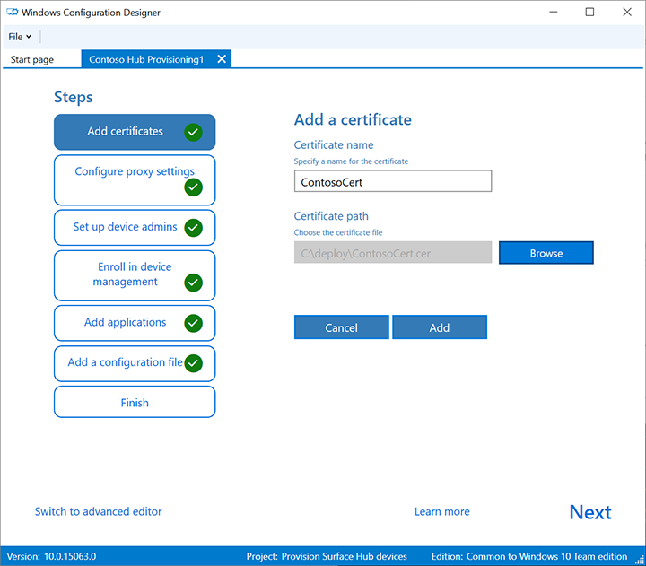
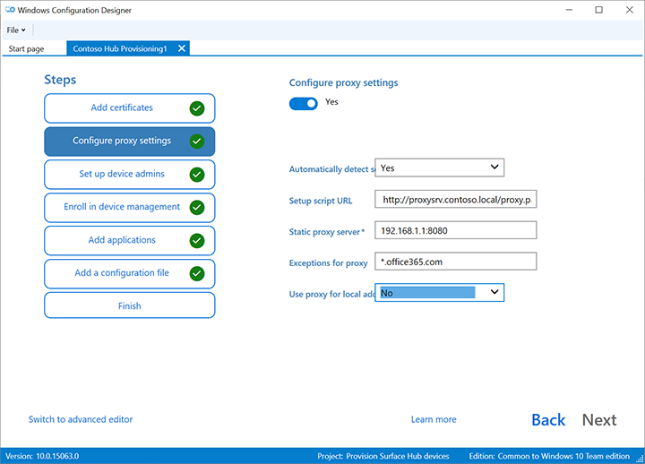
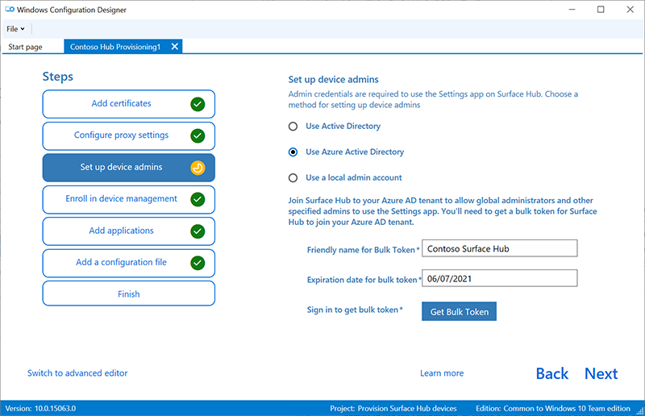
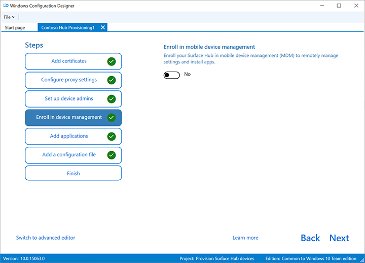
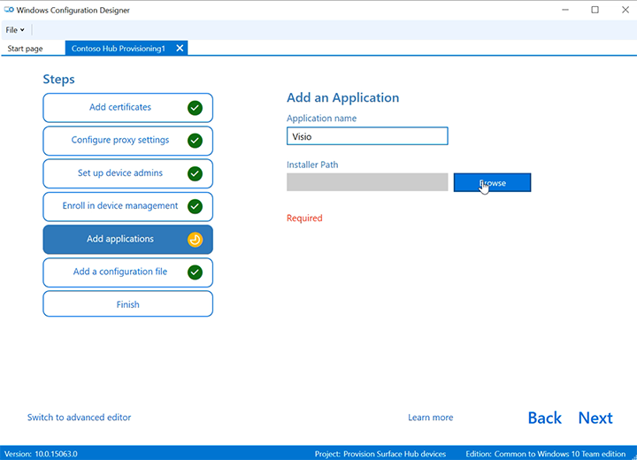

# Create provisioning packages for Surface Hub

Provisioning packages allow you to automate deployment of key features and deliver a consistent experience across all Surface Hubs in your organization.  Using  Windows Configuration Designer (WCD) on a separate PC, you can configure certificates, proxy settings,  device accounts, and other features, join Azure Active Directory, and install Universal Windows Platform (UWP) apps.

Begin by installing creating the provisioning package on a PC running Windows 10. Save the package to a USB drive and then deploy it to your Surface Hub during first-run setup, or through the Settings app. To learn more, see [Create a provisioning package for Windows 10](/windows/configuration/provisioning-packages/provisioning-create-package).

## Requirements

- Windows Configuration Designer, which can be installed from Microsoft Store or from the [Windows 10 Assessment and Deployment Kit (ADK)](https://go.microsoft.com/fwlink/p/?LinkId=845542).  For more information, see [Download and install the Windows ADK](/windows-hardware/get-started/adk-install).
- A USB stick.
- If you apply the package using the **Settings** app, you'll need device admin credentials.

## Supported items for Surface Hub provisioning packages

Using the **Provision Surface Hub devices** wizard, you can:

- Enroll in Active Directory, Azure Active Directory, or MDM
- Create an device administrator account
- Add applications and certificates
- Configure proxy settings
- Add a Surface Hub configuration file

Using the advanced provisioning editor, you can add these items to provisioning packages for Surface Hub:

- **Policies** - Surface Hub supports a subset of the policies in the [Policy configuration service provider](/windows/client-management/mdm/policy-configuration-service-provider).
- **Settings** - You can configure any setting in the [SurfaceHub configuration service provider](/windows/client-management/mdm/surfacehub-csp).

To learn more about supported settings, see [Windows Configuration Designer provisioning settings reference](/windows/configuration/wcd/wcd).

## Create  provisioning package

Use the Surface Hub provisioning wizard to create a package with common settings, then switch to the advanced editor to add other settings.

1. Open Windows Configuration Designer and select **Provision Surface Hub devices**.
2. Name your project and click **Next**.

### Add certificates

To provision the device with a certificate, select **Add a certificate**. Enter a name for the certificate, and then browse to and select the certificate to be used.

> [!div class="mx-imgBorder"]
> 

### Configure proxy settings

1. Toggle **Yes** or **No** for proxy settings. By default Surface Hub automatically detects proxy settings. However, if your infrastructure previously required using a proxy server and has changed to not require a proxy server, you can use a provisioning package to revert your Surface Hub devices to the default settings by selecting **Yes** and **Automatically detect settings**.

2. If you toggle **Yes**,  you can select to automatically detect proxy settings or manually configure the settings by:
    - Entering a URL to a setup script.
    - Entering a static proxy server address and port information.
3. If you intend to use a setup script or proxy server, turn off **Automatically detect settings** . You can use a setup script *or* a proxy server, not both.
4. Enter exceptions (addresses that Surface Hub should connect to directly without using the proxy server). Example: *.office365.com
5. Identify whether to use the proxy server for local addresses.

   

### Set up device admins

You can enroll the device in Active Directory and specify a security group to use the Settings app, enroll in Azure Active Directory to allow global admins to use the Settings app, or create a local administrator account on the device.

1. To enroll the device in Active Directory, enter the credentials for a least-privileged user account to join the device to the domain, and specify the security group to have admin credentials on Surface Hub. If a provisioning package that enrolls a device in Active Directory is going to be applied to a Surface Hub that was reset, the same domain account can only be used if the account listed is a domain administrator or is the same account that set up the Surface Hub initially. Otherwise, a different domain account must be used in the provisioning package.
2. Before you use Windows Configuration Designer to configure bulk Azure AD enrollment, [Plan your Azure AD join implementation](/azure/active-directory/devices/azureadjoin-plan). The **maximum number of devices per user** setting in your Azure AD tenant determines how many times the bulk token that you get in the wizard can be used.
3. To enroll the device in Azure AD, select that option and enter a friendly name for the bulk token you will get using the wizard. Set an expiration date for the token (maximum is 30 days from the date you get the token). Select **Get bulk token**. In the **Let's get you signed in** window, enter an account that has permissions to join a device to Azure AD, and then the password. Select **Accept** to give Windows Configuration Designer the necessary permissions.
4. To create a local administrator account, select that option and enter a user name and password.

    > [!div class="mx-imgBorder"]
    > 

> [!IMPORTANT]
> If you create a local account in the provisioning package, you must change the password using the **Settings** app every 42 days. If the password is not changed during that period, the account might be locked out and unable to sign in.

### Enroll in third party mobile device management (MDM)

If you use a third party MDM provider, you can use this section to enroll Surface Hub. To enroll in Intune, first setup Azure AD join, as described in the previous section, and follow the instructions in the following Intune documentation: [Set up automatic enrollment for Windows 10 devices](/mem/intune/enrollment/quickstart-setup-auto-enrollment).

> [!div class="mx-imgBorder"]
> 

1. Toggle **Yes** or **No** for enrollment in third party MDM.
2. If you toggle **Yes**, provide a service account and password or certificate thumbprint that is authorized to enroll the device and specify the authentication type.
3. If required by your MDM provider, enter the URLs for the discovery service, enrollment service, and policy service.

 To learn more, see [Manage Surface Hub with an MDM provider.](manage-settings-with-mdm-for-surface-hub.md)

### Add applications

You can install multiple Universal Windows Platform (UWP) apps in a provisioning package. To learn more, see [Provision PCs with apps](/windows/configuration/provisioning-packages/provision-pcs-with-apps).

> [!div class="mx-imgBorder"]
> 

> [!NOTE]
> Although WCD lets you add a Classic Win32 app to a provisioning package, Surface Hub will only accept UWP apps. If you include a Classic Win32 app, provisioning will fail.

### Add a configuration file

In addition to this provisioning package, you can use a Surface Hub configuration file to make it even easier to set up your devices. A Surface Hub configuration file contains a list of device accounts that your device can use to connect to Exchange and Skype for Business, and also friendly names for wireless projection. During first run, you'll get an option to choose a device account and friendly name from a configuration file.

To create a Surface Hub configuration file:

1. Using Microsoft Excel or another CSV editor, create a CSV file named SurfaceHubConfiguration.csv
2. Enter a list of device accounts and friendly names in this format:

```
<DeviceAccountName>,<DeviceAccountPassword>,<FriendlyName>
```

The configuration file must not contain column headers. When you apply the provisioning package to Surface Hub, if a Surface Hub configuration file is included on the USB drive, you can select the account and friendly name for the device from the file. To create the .CSV file, you can use either a UPN address (Rainier@contoso.com) or you can use domain\username (contoso\rainier).

- Rainier@contoso.com,password,Rainier Surface Hub
- Adams@contoso.com,password,Adams Surface Hub

3. Save the file to your project folder and copy it to the USB key with your provisioning package.

> [!NOTE]
> The configuration file can only be applied during the out-of-box setup experience (OOBE) and can only be used with provisioning packages created using the Windows Configuration Designer released with Windows 10, version 1703.

### Password protect provisioning package

You can set a password to protect your provisioning package. You must enter this password when you apply the provisioning package to a device.

## Use advanced provisioning

1. Open Windows Configuration Designer and select **Advanced provisioning**.
2. Name your project and select **Next**.
3. Select **Common to Windows 10 Team**, select **Next**, and then select **Finish**.

    
4. In the project, under **Available customizations**, select **Common Team settings**.
    

### Add a certificate to your package

You can use provisioning packages to install certificates that will allow the device to authenticate to Microsoft Exchange.
> [!NOTE]
> Provisioning packages can only install certificates to the device (local machine) store, and not to the user store. If your organization requires that certificates be installed to the user store, use the Hub **Settings** app: **Update & Security** > **Certificates** > **Import Certificate**.
Alternatively, you can use  [**MDM policies**](manage-settings-with-mdm-for-surface-hub.md) to deploy certificates to either the device store or the user store.

> [!TIP]
> The **ClientCertificates** section is for .pfx files with a private key; .cer files for root CAs should be placed in the **RootCertificates** section and for Intermediate CAs in the **CACertificates** section.

1. In **Windows Configuration** Designer > **Available customizations** , go to **Runtime settings** > **Certificates** > **ClientCertificates**.
2. Enter a label for **CertificateName** and then select **Add**.
3. Enter the **CertificatePassword**.
4. For **CertificatePath**, browse and select the certificate.
5. Set **ExportCertificate** to **False**.
6. For **KeyLocation**, select **Software only**.

### Add a Universal Windows Platform (UWP) app to your package

Before adding a UWP app to a provisioning package, you need the app package (either an .appx, or .appxbundle) and any dependency files. If you acquired the app from the Microsoft Store for Business, you will also need the *unencoded* app license. See [Distribute offline apps](/microsoft-store/distribute-offline-apps) to learn how to download these items from the Microsoft Store for Business.

1. In the **Available customizations** pane, go to **Runtime settings** > **UniversalAppInstall** > **DeviceContextApp**.
2. Enter a **PackageFamilyName** for the app and then select **Add**. For consistency, use the app's package family name. If you acquired the app from the Microsoft Store for Business, you can find the package family name in the app license. Open the license file using a text editor, and use the value between the PFM tags.
3. For **ApplicationFile**, select **Browse** to find and select the target app (either an *.appx or*.appxbundle).
4. For **DependencyAppxFiles**, select **Browse** to find and add any dependencies for the app. For Surface Hub, you will only need the x64 versions of these dependencies.

If you acquired the app from the Microsoft Store for Business, you will also need to add the app license to your provisioning package.

1. Make a copy of the app license, and rename it to use a **.ms-windows-store-license** extension. For example, "example.xml" becomes "example.ms-windows-store-license".
2. In ICD, in the **Available customizations** pane, go to **Runtime settings** > **UniversalAppInstall** > **DeviceContextAppLicense**.
3. Enter a **LicenseProductId** and then select **Add**. For consistency, use the app's license ID from the app license. Open the license file using a text editor. Then, in the **License** tag, use the value in the **LicenseID** attribute.
4. Select the new **LicenseProductId** node. For **LicenseInstall**, select **Browse** to find and select the license file that you renamed in Step 1.

### Add a policy to your package

Surface Hub supports a subset of the policies in the [Policy configuration service provider](/windows/client-management/mdm/policy-configuration-service-provider). Some of those policies can be configured with ICD.

1. In the **Available customizations** pane, go to **Runtime settings** > **Policies**.
2. Select the component you want to manage and configure the policy as appropriate.
3. Select and set the policy you want to add to your provisioning package.

### Add Surface Hub settings to your package

You can add settings from the [SurfaceHub configuration service provider](/windows/client-management/mdm/surfacehub-csp) to your provisioning package.

1. In the **Available customizations** pane, go to **Common Team Edition Settings**.
2. Select the component you want to manage and configure the policy as appropriate.
3. When you are done configuring the provisioning package, on the **File** menu, select **Save**.
4. Read the warning that project files may contain sensitive information, and select **OK**

### Build your package

When you build a provisioning package, you may include sensitive information in the project files and in the provisioning package (.ppkg) file. Although you have the option to encrypt the .ppkg file, project files are not encrypted. You should store the project files in a secure location and delete the project files when they are no longer needed.

1. Open **Windows Configuration Designer** > **Export** > **Provisioning package**.
2. Change **Owner** to **IT Admin**, which will set the precedence of this provisioning package higher than provisioning packages applied to this device from other sources.
3. Set a value for **Package Version**, and then select **Next.**

> [!TIP]
> You can make changes to existing packages and change the version number to update previously applied packages.

4. Optional: You can choose to encrypt the package and enable package signing.
    - Select **Encrypt package** and then enter a password.
    - Select **Sign package** > **Browse** and choose the certificate as appropriate.

> [!IMPORTANT]
> Including a trusted provisioning certificate in your provisioning package is recommended. When the package is applied to a device, the certificate is added to the system store, enabling subsequent packages to be applied silently.

5. Select **Next** to specify the output location. By default, Windows ICD uses the project folder as the output location. Or select **Browse** to change the default output location. Select **Next**.
6. Select **Build** to start building the package. The project information is displayed in the build page.
7. If your build fails, an error message appears with a link to the project folder. Review the logs to diagnose the error and try building the package again.
8. If your build is successful, the name of the provisioning package, output directory, and project directory are displayed. Select **Finish** to close the wizard and go back to the **Customizations Page**.
9. Select the **output location** link to go to the location of the package. Copy the .ppkg to an empty USB flash drive.

## Apply a provisioning package to Surface Hub

There are two options for deploying provisioning packages to a Surface Hub. [During the first run wizard](#apply-a-provisioning-package-during-first-run), you can apply a provisioning package that installs certificates, or after the first-run program is complete, you can apply a provisioning package that configures settings, apps, and certificates by using [Settings](#apply-a-provisioning-package-using-settings).

### Apply a provisioning package during first run

> [!IMPORTANT]
> During the first-run program, you can only use provisioning packages to install certificates. Use the **Settings** app to install apps and apply other settings.

1. When you turn on the Surface Hub for the first time, the first-run program will display the [**Hi there page**](first-run-program-surface-hub.md). Make sure that the settings are properly configured before proceeding.
2. Insert the USB flash drive containing the .ppkg file into the Surface Hub. If the package is in the root directory of the drive, the first-run program will recognize it and ask if you want to set up the device. Select **Set up**.
3. The next screen asks you to select a provisioning source. Select **Removable Media** and tap **Next**.
4. Select the provisioning package (*.ppkg) that you want to apply, and tap **Next**. Note that you can only install one package during first run.
5. The first-run program will show you a summary of the changes that the provisioning package will apply. Select **Yes, add it**.
6. If a configuration file is included in the root directory of the USB flash drive, you will see **Select a configuration**. The first device account in the configuration file will be shown with a summary of the account information that will be applied to the Surface Hub.
7. In **Select a configuration**, select the device name to apply, and then select **Next**.

The settings from the provisioning package will be applied to the device and OOBE will be complete. After the device restarts, you can remove the USB flash drive.

### Apply a provisioning package using Settings

1. Insert the USB flash drive containing the .ppkg file into the Surface Hub.
2. From the Surface Hub, start **Settings** and enter the admin credentials when prompted.
3. Navigate to **Surface Hub** > **Device management**. Under **Provisioning packages**, select **Add or remove a provisioning package**.
4. Select **Add a package**.
5. Choose your provisioning package and select **Add**. You may have to re-enter the admin credentials if prompted.
6. You'll see a summary of the changes that the provisioning package will apply. Select **Yes, add it**.
