# Configure Windows 10 Pro or Enterprise on Surface Hub 2

After you have completed the installation process of migrating to Windows 10 Pro or Enterprise, you can perform the following steps to configure apps and settings on your Surface Hub 2. These steps are recommended to ensure the best experience when using this personalized large screen touch and pen computer.

When performing these steps, you might find it useful to use a wired or wireless keyboard and mouse.

## Configure system settings

1. Sign in with an account that has local administrator privileges on the device.  
    - On Azure AD joined devices, the user that performs the Azure AD join is automatically added to the local administrator group. Azure AD global administrators and Azure AD devices administrators are [also local administrators](https://docs.microsoft.com/azure/active-directory/devices/assign-local-admin). 
    - You can type **net localgroup administrators** at a command prompt to list the accounts that have local administrator rights.
2. Rename the device using a friendly name, for example: **username-SHub-Desktop**.
3. Select **Start** > **Settings** > **Accounts** > **Sync your settings** and turn **Sync settings** off. 
    - The settings used here are intended to enable the best large-screen touch experience, and therefore you may not want to sync other devices.
4. Reboot the device.

## Enable the touch keyboard and touchpad

1. Tap and hold or right-click the taskbar and then select **Show touch keyboard button** and **Show touchpad button**. 
    - The touch keyboard is helpful for direct user input, and the virtual touchpad helps with precise selections, hovering screen tips, or as an alternative to tap and hold for right-click. 
    - See the following example.

     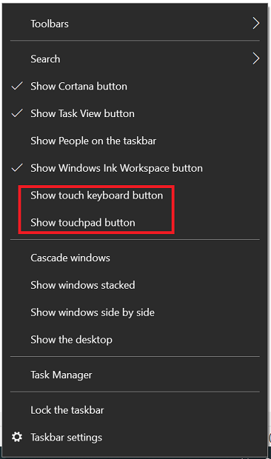

2. Configure the touch keyboard to QWERTY and floating.
    1. Select the **Keyboard** icon on the taskbar to show the touch keyboard.
    2. On the touch keyboard, select the keyboard icon in the upper left corner to open keyboard settings.
    3. Select the next to last keyboard type on the top row to enable QWERTY, and the last option on the second row to enable floating, which is very helpful on this large screen. See the following examples.

     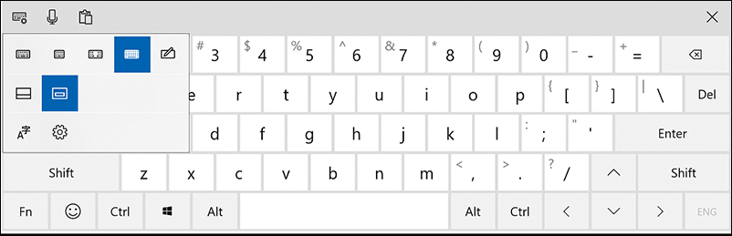

3. Configure the soft keyboard settings.

    1. Select the **Settings** icon on the touch keyboard or search for and open **Typing settings**.
    
    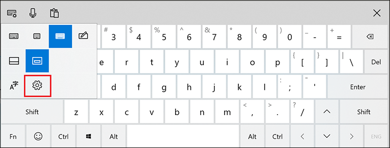

    1. Enable all the options under Spelling, Typing, and Touch keyboard.

The following example shows the trackpad, which is useful to navigate and select options. The onscreen keyboard is being used to search the Microsoft Store:

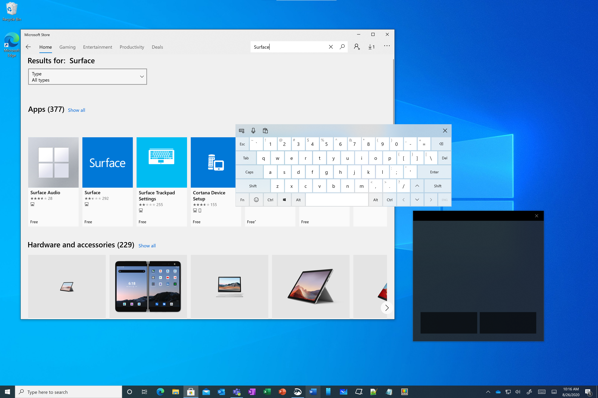

## Configure bluetooth keyboard and mouse (optional)

Connect a keyboard and mouse if you are using the device as your primary Windows device, or you use it often for typing or precision work.

If your Surface Hub device is near to a PC, you can use [Mouse without Borders](https://aka.ms/mm) to move seamlessly between the Surface Hub and the PC. For more information, see [Microsoft download from The Garage: Mouse without Borders](https://blogs.microsoft.com/ai/microsoft-download-from-the-garage-mouse-without-borders/).

## OneDrive for Business

Use [OneDrive for Business](https://docs.microsoft.com/onedrive/onedrive) to easily share tools, logs, and other files between all your work devices.

- OneDrive enables you to share your work files between your laptops, Surface Hub Desktop, and your Intune-managed mobile devices. Files can be edited on any device, and all network connected devices will be updated with the changes.
- Considering the size of the Surface Hub SSD (128GB), if you configure OneDrive on your Surface Hub Desktop device, make sure the default configuration is to keep the files online and download files as you use them.

To configure OneDrive to download files only when needed, set the **Files On-Demand** setting to **Save space and download files as you use them**. For more information, see [Query and set Files On-Demand states in Windows](https://docs.microsoft.com/onedrive/files-on-demand-windows).

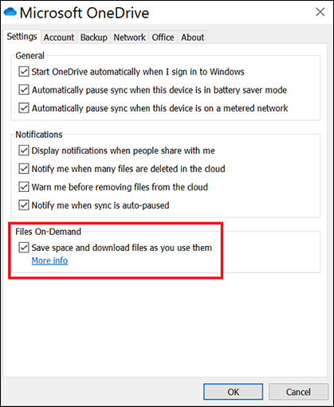

> [!NOTE]
> You can also repeat these steps to configure a personal OneDrive but be sure to conserve drive space and only download files as you need them.

## SharePoint and Teams

SharePoint and Teams Channel files can also sync locally to your desktop devices, such as laptops and Surface Hubs, using the OneDrive sync engine.

To sync internal corporate files to your local drive with the OneDrive sync app:

1. Go to a SharePoint site and navigate to the top-level document directory for files that you are interested in viewing or editing from your local device.
2. Select on the **Sync** button on the top of the SharePoint ribbon.
3. Select on **Open** on the popup **This site is trying to open Microsoft OneDrive**.
4. Verify that the SharePoint files are synchronizing to your local drive by selecting on the OneDrive icon at the bottom right of the taskbar.
5. Verify the configuration is set to keep the files online and download the files only as you use them:
    1. Open file explorer.
    2. Navigate to and right select on the **Microsoft \ \<SharePoint Document Folder Name\>**.
    3. Select **Free up space**.
    4. The Status column will display the status of files and folders. For more information, see [Sync SharePoint files with the OneDrive sync client](https://support.microsoft.com/office/sync-sharepoint-files-with-the-onedrive-sync-client-groove-exe-59b1de2b-519e-4d3a-8f45-51647cf291cd).
6. Teams Channel files are stored in SharePoint sites, with all of the same SharePoint document functionality, including version history and synchronizing to your local desktop devices. To sync Teams Channel files:
    1. Navigate to the Teams Channel of interest and select the **Files** tab at the top. Then select **Sync**. The files will start synchronizing and will be visible in File Explorer at **Desktop \ Microsoft \ \<name of the Teams Channel\>**.
    2. Use the same procedure that you used for synchronizing SharePoint sites to keep the files in the cloud and only download them when you use them, by tap and hold or right-click in File Explorer on the Teams Channel name, and then selecting **Free up space**.

## Surface Hub pen settings

**Pair the Bluetooth Surface Hub Pen**

Pair the pen to keep the pen firmware up to date and get battery charge information on the Bluetooth device settings page, or in the Surface app:

1. Select **Start** > **Settings** > **Devices**.
2. Select **Add Bluetooth or other device**.
3. Choose **Bluetooth**.
4. Remove the pen tail button and shake to disconnect the battery connection.
5. Put the cap back on and press and hold the cap until the pairing LED flashes.
6. On the Surface Hub Bluetooth settings, choose **Surface Hub 2 Pen**.
7. Complete the pairing operation. 
8. If the pairing is not successful, you can attempt to pair the pen again. If that doesn't work, you can test to see if the battery is charged by verifying the pen works in the Whiteboard application. If not, then replace the battery and then try to pair the pen again. If necessary, reboot the device and then try again.

**Set pen shortcuts**
The Surface Hub pen has a shortcut button sometimes referred to as a "tail click". Configuring shortcuts requires you to first pair the pen, as described earlier.
1. Search for Pen and select **Pen & Windows Ink settings**.
2. Near the bottom of the page, select Pen shortcuts which opens the dialog box, shown here:

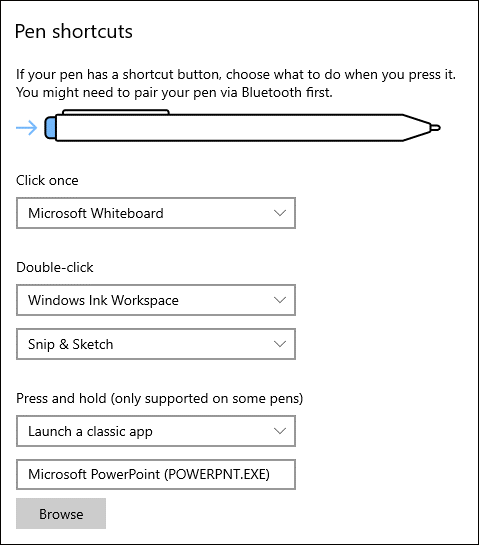

## Camera configuration

You can mount the camera on the top or on either side of the device. Mount the camera in a position to optimize the camera angle if you are using the Hub with a desktop stand instead of a cart, or are in close proximity to the Hub. The camera does not auto-rotate, so you need to have a 2mm hex key to manually rotate the camera. 

For more information on how to side-mount the camera and rotate the camera manually, see [Surface Hub 2S camera lens orientation](https://support.microsoft.com/help/4509729/surface-hub-2s-camera-lens-orientation).

## Windows Hello configuration

Surface Hub 2S running Windows 10 Enterprise allows the full suite of Win32 desktop applications as well as biometric Windows Hello options. The Surface Hub 2 Fingerprint Reader accessory can be plugged into any USB-C port on the device. 

To order a Surface Hub 2 Fingerprint Reader or view technical specs, see [Essential add-ons for Windows 10 Pro and Enterprise on Surface Hub 2](surface-hub-2-essential-add-ons.md). 

After inserting the fingerprint reader, select **Start** > **Settings** > **Accounts** > **Sign-in options** > **Windows Hello Fingerprint** to enroll your fingerprint.

Use a Windows Hello certified device for face recognition. The Surface Hub 2S camera does not support Windows Hello face recognition.

## Enable a Lock Screen shortcut icon on the taskbar

To add an icon to the taskbar that enables one-touch screen lock similar to the Windows-L keyboard shortcut: 

1.	Tap and hold or right-click on the desktop, select **New** > **Shortcut** > **Browse** > **Desktop** > **OK** > **Next**.

1.	Provide a name for the shortcut such as **Lock my PC**, and then select **Finish**.

1.	Right-click or tap and hold the newly created shortcut on the desktop, and select **Properties**. On the **Shortcut** tab, enter the following in the **Target** field: **Rundll32.exe User32.dll,LockWorkStation**

1.	Select the **Change Icon** button and browse to **C:\Windows\System32\imageres.dll** and select an icon to use. 

    See the following example:

    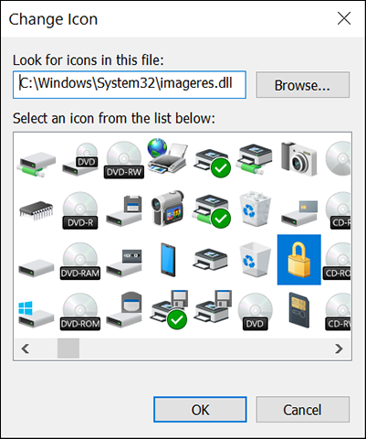
    
1.	Select **OK** to save the shortcut.

1.	Right-click or tap and hold the shortcut and select **Pin to taskbar**.

1. After you have pinned the lock shortcut to the taskbar, you can delete it from the desktop.

## Applications

### Update installed apps

To update all installed Store apps:

1. Open Microsoft Store app and select the **See more** ellipsis in the top-right corner.
2. Select **Downloads and updates**.
2. Select **Get updates**.

### Microsoft Whiteboard

To install the Microsoft Whiteboard:

 - Select the **Windows Ink Workspace** icon on the lower right of the taskbar and download **Whiteboard**.
 
    

Alternatively, you can install Whiteboard from the Microsoft Store:

1. Open Microsoft Store app and search for **Whiteboard**.
2. Choose **No thanks** to sign in and use across devices.
3. Pin Whiteboard to the taskbar.

### Surface app

1. In the Microsoft Store, search for **Surface**.
2. Set the **Available on** filter to **All devices**.
3. Install the **Surface** app. This should be the first app listed. You might need to associate your MSA to the Store in order to install the app.
4. Pin the **Surface** app to taskbar.

### Snip & Sketch

1. Open the **Snip & Sketch** app and pin it to the taskbar.
2. Select the ellipsis in the upper right corner and then select **Settings**.
3. In **Settings**, turn on **Auto copy to clipboard**, **Save snips**, and **Multiple windows** (optional).

### Microsoft Office

1. Open the [Office Portal](https://portal.office.com/account#installs) and install your desired applications.
2. Pin desired Office applications to the taskbar.
3. If Outlook is installed, be sure to set the Outlook OST to only save last two weeks cache. This will vastly reduce disk usage and setup time.
    - Select **File** > **Account Settings** and select your account.
    - Select **Change** and set the slider for **Use Cached Exchange Mode** to 14 days.

### Microsoft Teams

1. Download and install [Microsoft Teams](https://teams.microsoft.com/downloads).
2. Configure settings to Auto-start application (optional).
3. Pin Teams to the taskbar.
4. Consider reducing Teams notifications on the device to avoid distractions (optional).

  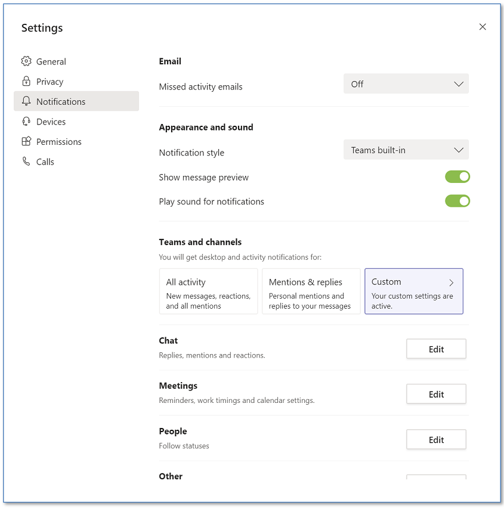

### Connect app

> [!IMPORTANT]
> In Windows 10, version 2004 and later, the Connect app for wireless projection using Miracast is not installed by default, but is available as an optional feature. If you have installed (or updated to) Windows version 2004 or later, you may see the following on the Projecting to this PC screen in settings:

    

1. To install the app from the “Projecting to this PC” settings page, select **Optional features** > **Add a feature** and then install the **Wireless Display** app.
2. Under **Some Windows and Android devices can project to this PC when you say it's OK**, choose
    - **Available everywhere** if the device is not on a corporate network.
    - Otherwise, choose **Available everywhere on secure networks**.
3. Under **Ask to project to this PC**, choose **First time only**.
4. Under **Require PIN for pairing**, choose **Never**.
5. To then launch the app and pin it to the taskbar, search for **Connect.**
6. Open the app. While the app is open, right-click on the Connect app icon on the taskbar, and select **pin to taskbar**.
7. Then close the Connect app. **Project to this PC** might not work unless the app has been run at least once.

Recommended configuration when not on the corporate network:

  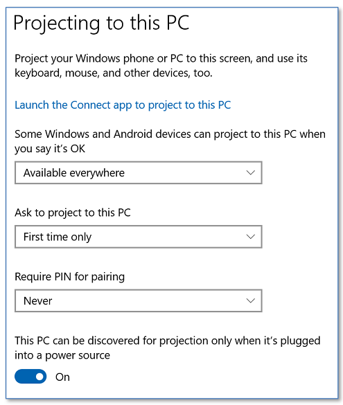

Recommended configuration on the corporate network:

  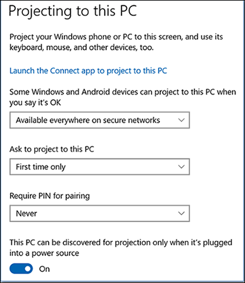

### Your Phone

The **Your Phone** app is installed by default on Windows 10. If it is not present, you can also install it from the Windows Store.

For information about setting up the app, see [How to set up Your Phone on Windows 10 and sync data between your PC and phone](https://www.windowscentral.com/how-set-your-phone-windows-10). Also see [How to fix common problems with Your Phone app on Windows 10](https://www.windowscentral.com/how-fix-common-problems-your-phone-app-windows-10).

### Super Fancy Zones

**Super Fancy Zones** helps users arrange windows to maximize screen real estate. It is now included in [PowerToys](https://github.com/microsoft/PowerToys/releases) on GitHub.

### Edge Chromium browser

Download and install the new [Edge Chromium browser](https://www.microsoft.com/en-us/edge?form=MY01BL&OCID=MY01BL).

## Additional settings

### Pen tail select to launch Whiteboard

1. Search for **Pen** and select **Pen & Windows Ink settings**.
2. Near the bottom of the page, under **Pen shortcuts** set **Select once** to **Microsoft Whiteboard**. 

### Power management

There are several power settings available to get the best experience using Windows 10 Pro or Enterprise on Surface Hub 2. This includes screen and pc timeouts and how they interact with the built-in human presence detection (Doppler), the screen saver and password protection, and then if appropriate how to by-pass group policy power settings intended for laptop / desktop users.

Windows 10 Pro or Enterprise on Surface Hub 2 keeps the screen from going to sleep by touch, mouse, and keyboard actions, as well as the built-in human occupancy detection (Doppler). Human occupancy detection is enabled by default, but if desired it can be disabled in UEFI by toggling the device option in the Surface UEFI Configurator tool either as part of the initial migration, or by building and applying a later UEFI configuration package. 

**Power Management: Screen and PC sleep settings**

1. Select **Start** > **Settings** > **System** > **Power & sleep**.
2. Set the power mode slider to **Best performance**.
3. Configure screen and sleep values to your preference while also accounting for Doppler presence detection that wakes up the device when movement is detected. Accordingly, as a best practice, 
it's recommended to set Screen to **Turn off after 2 hours** and the PC to **Turn off after 4 hours.**

**Power Management: Screen saver**

1. Search for **Lock Screen** and open **Lock screen settings**.
2. Configure **Screen timeout settings** and **Screen saver settings** to your preference. Recommended default values are:
 - Screen saver to (None) or a screen saver of your choice.
 - Wait” time to 15 minutes.
 - On resume, display logon screen.

**Power Management: Group Policy**

Before performing the following procedure, check with your IT department for approval to exclude a Surface Hub 2S device from global power management policy. Some power management settings can disable the presence detection function.
1. Search for **Software Center** and open it.
2. Select **Options**.
3. Expand the **Power management**  and select **Do not apply power settings from my IT department to this computer**.
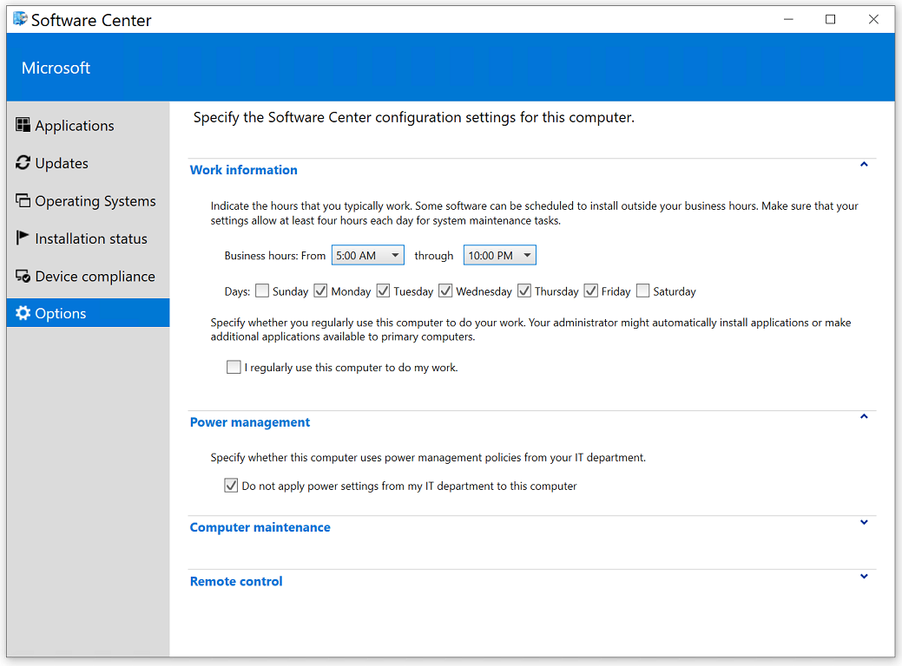

### Storage Sense

The Surface Hub 2 has a 128GB SSD for local storage, so it is necessary to consider the use of storage saving measures during normal usage.  To configure Storage Sense:

1.	Search for **storage settings**, which is found under **System settings**.
2.	Under **Settings**, select **Turn on storage sense** to open the **Storage** settings page.
3.	Turn Storage Sense to **On**.
4.	Select **Configure Storage Sense or run it now** and configure settings to keep files online as much as possible (due to limited drive space).

Recommended settings:
- Run Storage Sense = Every Day.
- Delete temporary files that my apps aren't using = Every 14 days (at least).
- Delete files in my Downloads folder if they have been there for over = 30 days.
- OneDrive: Content will become online-only if not opened for more than = 30 days.

### Tablet mode

Turn on Tablet mode if desired for accessibility needs.

### Sound settings

1. Search for **Sounds settings** and open this page.
2. Select **Sound Control Panel** on the right and select the **Sounds** tab.
3. Under **Program Events** set **Device Connect** and **Device Disconnect** to **None**.

### Silence notifications

1. Search for **Focus assist** and open this page.
2. Select **Alarms Only**. This will avoid constant notification flyouts.

### Disk Cleanup

1. Search for **Disk Cleanup** and open this app.
2. Under **Files to delete**, select the files you wish to delete. 
3. Also select **Clean up system files**.

## Complete and verify

1. Scan for and install all Windows Updates.
2. Update Group Policy
    1. At an elevated command prompt, enter **gpupdate /force /boot /wait:0**.
3. Reboot the device.
4. Verify taskbar apps.
    - Connect App
    - Lock Icon
    - Snip & Sketch
    - Teams (if applicable)
    - Office Apps (if applicable)
    - Surface App
    - Whiteboard
5. Verify presence detection.
    - Presence detection will be a green icon in the system tray
6. Verify projecting to this PC is enabled with the Connect App (the application does not need to be running before connecting).
7. Verify power and sleep settings.
    - Screen Saver: 15 minutes, set to (none), Mystify or Blank; check box for requiring password is checked
    - Screen: **Turn off after 2 hours.**
    - PC:  **Turn off after 4 hours.**
8. Verify Windows Hello is working.
9. Verify sync your settings is disabled.
10. Verify startup apps.

> [!TIP]
> After installing and configuring Windows 10, the Surface Hub 2S can be managed just like any other Windows 10 device.

## Related topics

[Migrate to Windows 10 Pro or Enterprise on Surface Hub 2](surface-hub-2s-migrate-os.md)
