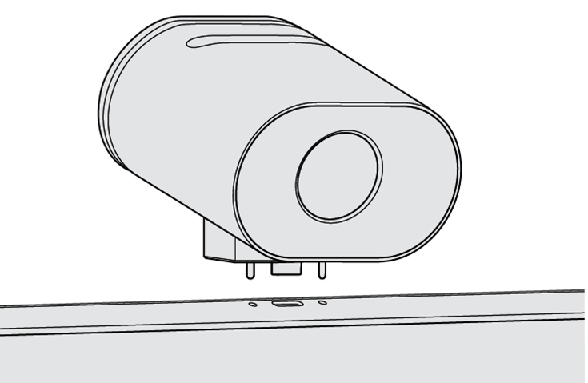
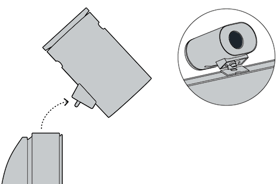

# Install and Manage Surface Hub 2 Smart Camera

Surface Hub 2 Smart Camera 1 is designed for hybrid teams and optimized for remote participants. With sharp focus on the foreground and background, remote participants can see people interact with content on the Surface Hub while also viewing everyone else in the room. Surface Hub 2 Smart Camera has a wide field of view greater than 136 degrees, Automatic framing, high-quality glass optics, and a low light sensor.

## System requirements

For Surface Hubs running Team OS, Surface Hub 2 Smart Camera requires the following updates for [Windows 10 Team 2020 update](surface-hub-2020-update-whats-new.md) (20H2) on Surface Hub 2:

- February 15, 2022 — update for Team based on KB5010415* (OS Build 19042.1566)
- January 21, 2022 — update for Surface Hub 2S

To learn more, refer to [Surface Hub update history](surface-hub-update-history.md).

> [!NOTE]
> No additional updates are required for Surface Hubs that have been migrated to run Windows 10 or Windows 11 Pro/Enterprise.

## Install smart camera

1. Attach the camera to the USB-C port in the middle of the top of Surface Hub 2. The indicator LED will light briefly when the camera is connected and continuously when the camera is in use.

     

2. To remove the camera, pull up and forward. A magnetic tether prevents the camera from being knocked off or pulled  backward.

    

> [!TIP]
> The camera includes a cover that magnetically snaps to the front of the camera for privacy when not in use and to the back of the camera for storage.

## Manage Automatic framing settings

Automatic framing automatically zooms and keeps you centered in the video when you move around. How you manage settings varies depending on the OS installed on Surface Hub:

- [Windows 10 Team 2020 update (20H2)](#windows-10-team-2020-update-20h2)
- [Windows 11 Desktop on Surface Hub](#windows-11-desktop-on-surface-hub)
- [Windows 10 Desktop on Surface Hub](#windows-10-desktop-on-surface-hub)

### Windows 10 Team 2020 update (20H2)

When you install the Surface Hub Smart Camera, automatic framing is enabled by default. You can manage automatic framing from the Settings app, via an On/Off toggle that sets the automatic framing state at the start of each Surface Hub session.

**To adjust automatic framing:**

1. On your Surface Hub 2S, sign in as **Admin**.

> [!NOTE]
> If you don't know your user name or admin password, you'll need to reset the device. For more information, see [Reset and recovery for Surface Hub 2S](/surface-hub/surface-hub-2s-recover-reset).

2. Open the **Settings** app and go to  **Surface Hub > Calling & Audio.**
3. Under **Automatic Framing**, adjust the toggle, as appropriate:

- **Set the Surface Hub 2 Smart Camera to automatically zoom and keep people centered in the video when they move around.**

If the toggle is set to **On**, Automatic framing will always be on by default when users begin a session on Surface Hub. If the toggle is set to **Off**, Automatic framing will always be off by default when starting a session on Surface Hub.

#### Manage camera settings via an MDM provider

You can manage Automatic framing via the [Surface Hub configuration service provider](/windows/client-management/mdm/surfacehub-csp) (CSP) from Intune or a third-party mobile device management (MDM) provider.

|CSP policy setting| Description|
|------------------|------------|
|DefaultAutomaticFraming|If you turn on this policy setting, Automatic framing is enabled. If you turn off this poicy setting, Automatic framing is disabled. If you do not configure this policy setting, Automatic framing is enabled. |

To learn more, refer to the following:

- [Manage settings with an MDM provider](/surface-hub/manage-settings-with-mdm-for-surface-hub#create-custom-configuration-profile)
- [SurfaceHub CSP - Windows Client Management](/windows/client-management/mdm/surfacehub-csp)

### Windows 11 Desktop on Surface Hub

If you have [migrated your Surface Hub](surface-hub-2s-migrate-os.md) to run Windows 11 Pro or Windows 11 Enterprise, you'll need to turn on Automatic framing for the Surface Hub Smart Camera. By default, Automatic framing is turned off.

- To turn on Automatic framing, go to **Settings > Bluetooth & devices > Manage Cameras>  Surface Hub 2 Smart Camera.**

### Windows 10 Desktop on Surface Hub

Automatic framing is always enabled and cannot be disabled or otherwise configured.

## Order Surface Hub 2 Smart Camera

Purchase Surface Hub 2 Smart Camera from your [authorized Microsoft Surface reseller](https://www.microsoft.com/surface/business/where-to-buy-microsoft-surface?).

## Learn more

- [What's new in Windows 10 Team 2020 updates](surface-hub-2020-update-whats-new.md)

### References

1. Surface Hub 2 Smart Camera, sold separately starting March 16, 2022, dynamically adjusts the video feed for remote participants. Surface Hub 2 Smart Camera will be included in the box with Surface Hub 2S 85” starting in May 2022.
