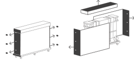
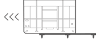
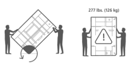
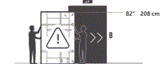
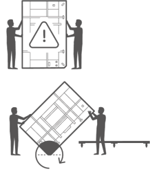
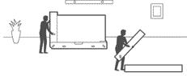
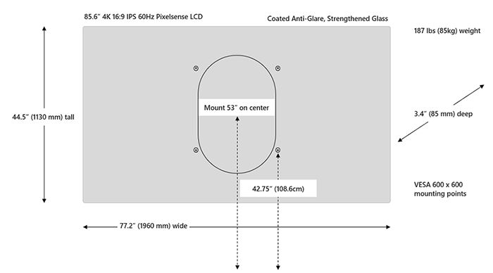
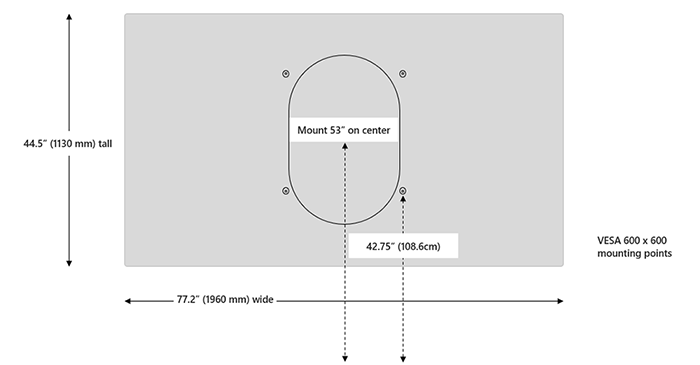

# Install and mount Surface Hub 2S 85”

This article provides guidance for physically installing Microsoft Surface Hub 2S 85" in commercial environments. 

## Handling and site prep

- Before moving the device to the place where it will be installed, survey the site to determine how to safely move it to the location where it will be unpacked and mounted.
- Always use at least two people for unpacking and installation.
- Once the device is unpacked, it should be mounted
immediately, so the mounting system should be in place before unpacking. If you’re mounting onto a rolling stand, lock or block the wheels of the stand before unpacking.
- To avoid tripping hazards, keep the assembly area clear of packing materials.

> [!WARNING]
> Heavy object/ergonomic lifting
> The device is very heavy. To reduce the risk of lifting-related injuries, death, or damage to the device, we recommend that a minimum of two or more people lift the device. It is important to use proper lifting posture when lifting and/or moving the device.

Use good ergonomic lifting practices, including but not limited to:

- Plan ahead. Make sure the lifting team agrees on the plan.
- Determine if you can lift the unit. Is it too heavy or too awkward?
- Decide if you need lifting aid.
- Check your environment for obstructions and slippery surfaces.
- Lift with your legs, not your back.
- Bend at your knees, keeping the back straight.
- Keep the unit close to your body.
- Center your body over the unit. Keep the feet about shoulder width apart.
- Lift straight up smoothly.
- Keep your torso straight; do not twist while lifting or after the load is lifted

 
 

## 1. Remove outer packaging materials
- Remove and recycle outer cover.
- Cut four (4) plastic straps.
- Open and remove the six (6) clips from the ends.
- Remove lid and then lift and remove front and back panels.

   

## 2. Remove black outer packaging foam

- Remove black corner foam pieces (4).
- Remove black center foam support.

   

> [!Caution]
> Do not remove any white foam, strapping or packaging materials until the Hub 2S is adjacent to the cart or wall mount on which it will be placed.
Additional strapping materials are provided in the small box located under the hand screw knobs on the back side of the package. Original or replacement strapping materials must be in place  before moving and especially before rotating the device and its protective package
 

## 3. Remove inner packaging frame from pallet

 
- Move pallet assembly to elevator location.
- Lock wheel brakes (4).
- Slide inner packaging off pallet.

   

## 4. Rotate packaging frame to fit elevator

- Rotate frame to fit elevator
- Rotate on beveled end of inner frame and slide into the elevator.

   

> [!NOTE]
> The wheeled pallet is custom fit to the inner frame packaging footprint and can be used throughout the installation site delivery process. Inner wood frame end piece has nylon skid plates.
 
## 5. Remove from elevator

- Slide out of elevator
- Lock wheel brakes (x4).

   

## 6. Place Surface Hub 85” back on pallet

- Using beveled end, rotate back onto pallet.
- Unlock wheel brakes (x4).
- Move product to location of wall or cart mount.

   

## 7. Place Surface Hub 85" on Wall Mount or Cart

- Place Hub 2S in front of wall mount or cart.
- Lock wheel brakes (x4).
- Slide inner packaging off pallet.
- Cut the 3 plastic straps.
- Remove lid.
- Remove white foam pieces.
- Remove Welcome Kit.
- Remove end piece by lifting vertically.
- Remove wood end pieces by the four hand knobs screws on the wood base.

   

> [!CAUTION]
>  Do not leave Hub 2S 85" unattended. An additional person is needed to hold device upright.
Once end pieces are removed, a minimum of one person needs to maintain contact with the Hub 2S until placement on wall mount or cart is completed.
- Lift plywood end piece up and back.
- Remove bump label from back.
- Lift the Hub 2S from the lower tray and place on cart or wall mount.

> [!NOTE]
> Following the cart or wall mount
manufactures instructions, prepare the mounting system prior to removing the Hub 2S from its inner packaging tray..
 
> [!NOTE]
> When grasping the Hub 2S, note the hand hold cut outs in the lower foam. Care must be taken care with the top hand not to grasp the device where the speakers are located.
Graphic on the ends of the device cover provide general speaker location.
 

- Loosen elastic tension clips (x2).
- Remove cloth cover.
- Note locations for placement of pens (x2), camera, and power cord.
- Attach pens (x2), camera, and power cord.
- Remove cling labels (x4).
- Press the power button on lower right. Installation is now complete.

 

 
## Mounting Surface Hub 2S 85" 

> [!WARNING]
>  The device is heavy and attaches to a cart or wall mount. To reduce the
risk of injury, death, or damage to the device:
Follow all instructions provided by the cart or wall mount manufacturer.

- Ensure the proposed mounting system will support the weight of this device.
- Only use the mounting hardware provided with mounting the system.
- Ensure all screws are securely tightened according to the manufacturer’s instructions.
- Do not release the device until you are certain device is fully engaged with mounting system attachment points.
- Microsoft recommends using carts or wall mounting systems designed for use with your device. Microsoft is not responsible for any damage, injuries, or death caused by the use of other mounting systems.
 
### Mounting dimensions

  

  

----------

## Supplemental Strapping Kit

An additional set of inner packaging strapping materials can be found in the kit attached at the back, lower right.

## More information

- [Steelcase Roam Collection](https://www.steelcase.com/products/collaboration/steelcase-roam/)