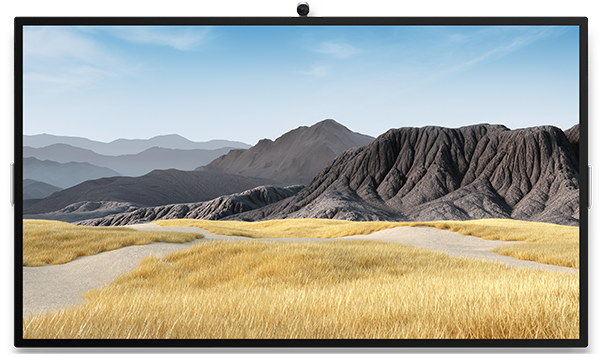

# Surface Hub 2S 85" overview & tech specs

The 85" version of the Surface Hub family brings the Surface Hub 2S experience to spaces requiring a larger screen such as conference rooms, board rooms, or larger huddle spaces. Available from January 2021, Surface Hub 2S 85” delivers the following experiences:

- **Designed for group collaboration.** Invites simultaneous inking in Microsoft Whiteboard plus larger-than-life remote attendees in Microsoft Teams.
- **Consistent Surface Hub 2S experience.** Provides the same premium design, 4K display technology, touch, pen/ink, compute cartridge, and camera support as Surface Hub 2S 50”.
- **Integration with existing and new A/V systems.** Combines with Microsoft Teams certified peripherals and integrates with Microsoft Teams Rooms.

> [!NOTE]
> *Surface Hub 2S coming in 2021; Pre-release products shown; products and features subject to regulatory certification/approval, may change, and may vary by country/region.*

## Surface Hub 2S 85" tech specs

| Component    | Description                                                                                                                                                                                                                                         |
| ----------------- | --------------------------------------------------------------------------------------------------------------------------------------------------------------------------------------------------------------------------------------------------------- |
| Dimensions        | 44.5” x 77.1” x 3.4” (1130mm x 1959mm x 85.6mm)                                                                                                                                                                                                        |
| Weight            | 185 lb. (84kg)                                                                                                                                                                                                                                            |
| Resolution        | 3840 x 2160                                                                                                                                                                                                                                               |
| Display           | PixelSense™ Display, 16:9 aspect ratio, 10-bit color, 30.5mm border width, anti-glare, IPS LCD, in-cell touch with 20 simultaneous touch points                                                                                                           |
| Compute           | Modular Compute Cartridge Quad-core 8th Generation Intel® Core™ i5 processor, 8GB RAM, 128GB SSD1                                                                                                                                                      |
| Software2         | Windows 10 Team OS3 Microsoft Teams for Surface Hub Skype for Business Microsoft Whiteboard Microsoft Office (Mobile) Microsoft Power BI                                                                                                   |
| Connections       | USB-A Mini-DisplayPort Video Output RJ45 Gigabit Ethernet HDMI Video Input USB-C® with DisplayPort Input (3) USB-C® (on display)                                                                                                           |
| Graphics          | Intel® UHD Graphics 620                                                                                                                                                                                                                                   |
| Audio/video       | 100Hz - 12KHz range 3-way stereo speakers, including (2) mid/high-range and (1) mid/low-range in rear bump.  Full band 8-element MEMS microphone array Microsoft Surface Hub 2 Camera, 4K, USB-C® connection, 90-degree HFOV |
| Pen               | Microsoft Surface Hub 2 Pen (active) Surface Slim Pen compatible                                                                                                                                                                                       |
| Sensors           | Doppler occupancy sensor4                                                                                                                                                                                                                                 |
| Wireless          | Wi-Fi 5: IEEE 802.11 a/b/g/n/ac compatible Bluetooth® Wireless 5.0 technology Miracast Display                                                                                                                                                      |
| Exterior          | Casing: Precision machined aluminum with mineral-composite resin Color: Platinum Physical Buttons: Power, Volume, Source                                                                                                                            |
| Warranty         | 1-year limited hardware warranty5                                                                                                                                                                                                                          |
| What’s in the box | (1) Surface Hub 2S (2) Surface Hub 2 Pen (1) Surface Hub 2 Camera 4m AC Power Cable Quick Start Guide                                                                                                                                         |

> [!NOTE]
> Surface Hub can be used continuously for a maximum of 18 hours a day. To optimize for efficiency, Surface Hub uses smart sensors to turn off the LED screen when presence is no longer detected, which means there is no need to power it down at the end of the day. If the unit is installed in a 24-hour workplace environment, the sensors can be disabled to comply with the 18 hour per day maximum use recommendation. Note that prolonged display of a video signal may cause burned-in or image retention to occur on the screen. To learn more about managing power settings, see:
>
> - [Local management Surface Hub settings](local-management-surface-hub-settings.md)
> - [SurfaceHub CSP - Windows Client Management](https://docs.microsoft.com/windows/client-management/mdm/surfacehub-csp)
### References

1. System software and updates use significant storage space. Available storage is subject to change based on system software and updates and apps usage. 1 GB = 1 billion bytes. 1 TB = 1,000 GB. See [Surface Storage](https://www.surface.com/storage) for more details.
2. Software license required for some features. Sold separately.
3. Migrating from Windows 10 Team to Windows 10 Pro or Enterprise is currently only available on Surface Hub 2S 50". Learn more at [Migrate to Windows 10 Pro or Enterprise on Surface Hub 2](https://docs.microsoft.com/surface-hub/surface-hub-2s-migrate-os).
4. Doppler sensor not available in Hong Kong, India, Kuwait, and Oman.
5. Microsoft's Limited Warranty is in addition to your consumer law rights. 

## Learn more

- [Surface Hub 2S 85" - Collaboration at a Massive Scale](https://techcommunity.microsoft.com/t5/surface-it-pro-blog/surface-hub-2s-85-quot-collaboration-at-a-massive-scale/ba-p/1669717)
