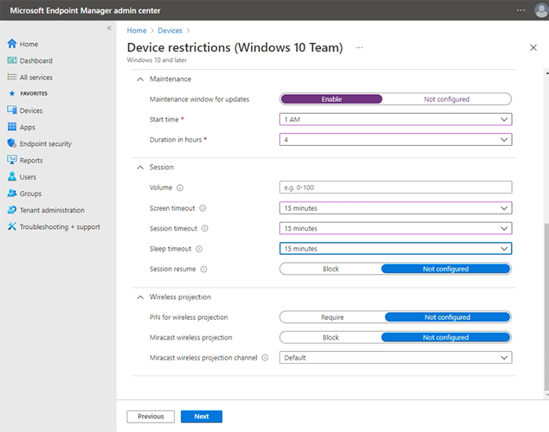

# Manage Surface Hub with an MDM provider

Surface Hub allows IT administrators to manage settings and policies using a mobile device management (MDM) provider such as Microsoft Intune. Surface Hub has a built-in management component to communicate with the management server, so there is no need to install additional clients on the device.

## Enrolling Surface Hub into MDM management 

You can enroll Surface into Microsoft Intune or other MDM provider via manual or auto enrollment.

### Manual enrollment

1. Open the **Settings** app and sign in as a local administrator. Select **Surface Hub** > **Device management** and then select **+Device management**.
2. You will be prompted to sign in with the account to use for your MDM provider. After authenticating, the device automatically enrolls into your MDM provider.

> [!TIP]
> If you’re using Intune and the server address is not detected, enter **manage.microsoft.com**.
   
> [!NOTE]
> The account used for authentication will be the MDM provider enrollment account.

### Auto Enrollment — Azure AD affiliated

During the initial setup process, when affiliating Surface Hub with an Azure Active Directory (AD) tenant that has Intune auto enrollment enabled, the device will automatically enroll with Intune. To learn more, refer to [Intune enrollment methods for Windows devices](https://docs.microsoft.com/intune/enrollment/windows-enrollment-methods). Azure AD affiliation and Intune auto enrollment is required for the Surface Hub to be a "compliant device" in Intune. 

## Manage Windows 10 Team settings with Intune

The foundational building block of policy settings management in Intune and other MDM providers is the XML-based Open Mobile Alliance - Device Management (OMA-DM) protocol. Windows 10 implements OMA-DM XML via one of many available Configuration service providers (CSPs) with names like AccountManagement CSP, DeviceStatus CSP, Wirednetwork-CSP, and so on. For a complete list, refer to [CSPs supported in Microsoft Surface Hub](https://docs.microsoft.com/windows/client-management/mdm/configuration-service-provider-reference#surfacehubcspsupport).

Microsoft Intune and other MDM providers use CSPs to deliver a UI that enables you to configure policy settings within Configuration profiles. Intune uses the Surface Hub CSP for its built in profile —  **Device restrictions (Windows 10 Team)** — letting you configure basic settings such as preventing Surface Hub from "waking up" whenever anyone moves nearby within its proximity range. To manage Hub settings and features outside of Intune's built-in profile, you'll need to create a custom profile, which is created similar to a built-in profile, as shown below. 

To summarize, options to configure and manage policy settings within Intune include the following: 
 
- **Create a Device restriction profile.** Use Intune's built in profile and configure settings directly in the Intune UI. See [Create device restriction profile](#create-device-restriction-profile).
- **Create a Device configuration profile.**  Select a template focused on a specific feature or technology such as Microsoft Defender or security certificates. See [Create Device configuration profile](#create-device-configuration-profile).
- **Create a Custom configuration profile.**  Extend your scope of management using an OMA Uniform Resource Identifier (OMA URI) from any of the [CSPs supported in Microsoft Surface Hub](https://docs.microsoft.com/windows/client-management/mdm/configuration-service-provider-reference#surfacehubcspsupport). See [Create custom configuration profile](#create-custom-configuration-profile).

## Create Device restriction profile

1. Sign in to [**Microsoft Endpoint Manager admin center**](https://endpoint.microsoft.com/), select **Devices** > **Configuration profiles** > **+** **Create profile**.
2. Under **Platform**, select **Windows 10 and later** >
3. Under ****Profile type**,** select **Templates** and then select **Device restrictions (Windows 10 Team)**
4. Select **Create**, add a name and then select **Next.**
6. You can now browse and choose from preset device restriction settings for Surface Hub across the following categories: Apps and experience, Azure operational insights, Maintenance, Session, and Wireless projection. The example shown in the following figure specifies a 4-hour maintenance window and a 15 minute timeout for screen, sleep and session resume.

     

For more information about creating and managing profiles, see [Restrict devices features using policy in Microsoft Intune](https://docs.microsoft.com/mem/intune/configuration/device-restrictions-configure#create-the-profile).
 
For more information about how to manage Surface Hub features and settings, see [Surface Hub Windows 10 Team device restrictions in Microsoft Intune](https://docs.microsoft.com/mem/intune/configuration/device-restrictions-windows-10-teams)
 

## Create Device configuration profile

1. Sign in to [**Microsoft Endpoint Manager admin center**](https://endpoint.microsoft.com/), select **Devices** > **Configuration profiles** > **+ Create profile**.
2. Under **Platform**, select **Windows 10 and later** >
3. Under **Profile type**, select **Templates** and choose from the following templates supported on Surface Hub:

    - Device restrictions (Windows 10 Team), as described in the [previous section](#create-device-restriction-profile).
    - Microsoft Defender for Endpoint (Windows 10 Desktop)
    - PKCS certificate
    - PKCS imported certificate
    - SCEP certificate
    - Trusted certificate

## Create Custom configuration profile

You can extend the scope of management by creating a custom profile using an OMA URI from any of the [CSPs supported in Microsoft Surface Hub](https://docs.microsoft.com/windows/client-management/mdm/configuration-service-provider-reference#surfacehubcspsupport). OMA-URIs function as the address or value that you apply to MDM. CSPs are documented on the following pages: 

- [Configuration service provider reference](https://docs.microsoft.com/windows/client-management/mdm/configuration-service-provider-reference#surfacehubcspsupport)
- [SurfaceHub CSP](https://docs.microsoft.com/windows/client-management/mdm/surfacehub-csp)
- [Policy CSPs supported by Microsoft Surface Hub](https://docs.microsoft.com/windows/client-management/mdm/policy-csps-supported-by-surface-hub)

To implement CSP-based policy settings, begin by generating an OMA URI and then add it to a custom configuration profile in Intune.

### Generate OMA URI for target setting
 
To generate the OMA URI for any setting:

1. In the [CSP documentation]([CSP documentation](https://docs.microsoft.com/windows/client-management/mdm/configuration-service-provider-reference#surfacehubcspsupport), identify the root node of the CSP. Generally, this looks like **./Vendor/MSFT/<name of CSP>**. 
    - **Example:** The root node of the [SurfaceHub CSP](https://docs.microsoft.com/windows/client-management/mdm/surfacehub-csp) is **./Vendor/MSFT/SurfaceHub**.
2. Identify the node path for the setting you want to use. 
    - **Example:** The node path for the setting to enable wireless projection is **InBoxApps/WirelessProjection/Enabled**.
3. Append the node path to the root node to generate the OMA URI. 
    - **Example:** The OMA URI for the setting to enable wireless projection is **./Vendor/MSFT/SurfaceHub/InBoxApps/WirelessProjection/Enabled.**
4. The data type is also stated in the CSP documentation. The most common data types are:
    - char (String)
    - int (Integer)
    - bool (Boolean)

### Add OMA URI to custom profile

1. In Endpoint Manager, select **Devices** > **Configuration profiles** > **Create profile**.
2. Under Platform select **Windows 10 and later.** Under Profile, select **Custom**, and then select **Create.**
3. Add a name and optional description and then select **Next.**
4. Under **Configuration settings** > **OMA-URI Settings**, select **Add**.

  
## Manage specific Surface Hub features

This section highlights information about features that you can manage via Intune or other MDM provider. This includes:

- [Quality of Service (QoS)](#quality-of-service-settings)
- [Microsoft Teams and Skype for Business](#microsoft-teams-and-skype-for-business-settings)

### Quality of Service settings

To ensure optimal video and audio quality on Surface Hub, add the following QoS settings to the device. 

| Name | Description | OMA-URI | Type | Value |
|:------ |:------------- |:--------- |:------ |:------- |
|**Audio Ports**| Audio Port range | ./Device/Vendor/MSFT/NetworkQoSPolicy/TeamsAudio/DestinationPortMatchCondition | String  | 3478-3479 |
|**Audio DSCP**| Audio ports marking | ./Device/Vendor/MSFT/NetworkQoSPolicy/TeamsAudio/DSCPAction | Integer | 46 |
|**Video Port**| Video Port range | ./Device/Vendor/MSFT/NetworkQoSPolicy/TeamsVideo/DestinationPortMatchCondition | String  | 3480 |
|**Video DSCP**| Video ports marking | ./Device/Vendor/MSFT/NetworkQoSPolicy/TeamsVideo/DSCPAction | Integer | 34 |
|**Sharing Port**| Sharing Port range | ./Device/Vendor/MSFT/NetworkQoSPolicy/TeamsSharing/DestinationPortMatchCondition | String  | 3481 |
|**Sharing DSCP**| Sharing ports marking | ./Device/Vendor/MSFT/NetworkQoSPolicy/TeamsSharing/DSCPAction | Integer | 18 |
|**P2P Audio Ports**| Audio Port range | ./Device/Vendor/MSFT/NetworkQoSPolicy/TeamsP2PAudio/DestinationPortMatchCondition | String  | 50000-50019 |
|**P2P Audio DSCP**| Audio ports marking | ./Device/Vendor/MSFT/NetworkQoSPolicy/TeamsP2PAudio/DSCPAction | Integer | 46 |
|**P2P Video Ports**| Video Port range | ./Device/Vendor/MSFT/NetworkQoSPolicy/TeamsP2PVideo/DestinationPortMatchCondition | String  | 50020-50039 |
|**P2P Video DSCP**| Video ports marking | ./Device/Vendor/MSFT/NetworkQoSPolicy/TeamsP2PVideo/DSCPAction | Integer | 34 |
|**P2P Sharing Ports**| Sharing Port range | ./Device/Vendor/MSFT/NetworkQoSPolicy/TeamsP2PSharing/DestinationPortMatchCondition | String  | 50040-50059 |
|**P2P Sharing DSCP**| Sharing ports marking | ./Device/Vendor/MSFT/NetworkQoSPolicy/TeamsP2PSharing/DSCPAction | Integer | 18 |

#### Skype for Business QoS settings

| Name                 | Description           | OMA-URI                                                                    | Type    | Value                          |
| -------------------- | --------------------- | -------------------------------------------------------------------------- | ------- | ------------------------------ |
| Audio Ports          | Audio Port range      | ./Device/Vendor/MSFT/NetworkQoSPolicy/SfBAudio/SourcePortMatchCondition    | String  | 50000-50019                    |
| Audio DSCP           | Audio ports marking   | ./Device/Vendor/MSFT/NetworkQoSPolicy/SfBAudio/DSCPAction                  | Integer | 46                             |
| Audio Media Source   | Skype App name        | ./Device/Vendor/MSFT/NetworkQoSPolicy/SfBAudio/AppPathNameMatchCondition   | String  | Microsoft.PPISkype.Windows.exe |
| Video Ports          | Video Port range      | ./Device/Vendor/MSFT/NetworkQoSPolicy/SfBVideo/SourcePortMatchCondition    | String  | 50020-50039                    |
| Video DSCP           | Video ports marking   | ./Device/Vendor/MSFT/NetworkQoSPolicy/SfBVideo/DSCPAction                  | Integer | 34                             |
| Video Media Source   | Skype App name        | ./Device/Vendor/MSFT/NetworkQoSPolicy/SfBVideo/AppPathNameMatchCondition   | String  | Microsoft.PPISkype.Windows.exe |
| Sharing Ports        | Sharing Port range    | ./Device/Vendor/MSFT/NetworkQoSPolicy/SfBSharing/SourcePortMatchCondition  | String  | 50040-50059                    |
| Sharing DSCP         | Sharing ports marking | ./Device/Vendor/MSFT/NetworkQoSPolicy/SfBSharing/DSCPAction                | Integer | 18                             |
| Sharing Media Source | Skype App name        | ./Device/Vendor/MSFT/NetworkQoSPolicy/SfBSharing/AppPathNameMatchCondition | String  | Microsoft.PPISkype.Windows.exe |

> [!NOTE]
> Both tables show default port ranges. Administrators may change the port ranges in the Skype for Business and Teams control panel.

### Microsoft Teams and Skype for Business settings

You can create a custom profile to manage Teams Coordinated Meeting, proximity join, and other features. To learn more, see [Manage Microsoft Teams configuration on Surface Hub](https://docs.microsoft.com/microsoftteams/rooms/surface-hub-manage-config).

#### Changing default business communications platform

The default business communications platform on Surface Hub varies depending on how you install Windows 10 Team 2020 Update (aka Windows 10 20H2). If you re-image Surface Hub to Windows 10 20H2, Microsoft Teams with Skype for Business functionality will be installed by default. But if you upgrade, Skype for Business with Teams functionality will remain as the default installation unless you previously configured Teams as your default. 

To change the default installation, use a [custom profile](https://docs.microsoft.com/mem/intune/configuration/custom-settings-configure) by setting the Teams App Mode as follows:  

- Mode 0 — Skype for Business with Microsoft Teams functionality for scheduled meetings.
- Mode 1 — Microsoft Teams with Skype for Business functionality for scheduled meetings.
- Mode 2 — Microsoft Teams only.

| Name | Description | OMA-URI | Type | Value |
|:--- |:--- |:--- |:--- |:--- |
|**Teams App ID**|App name|./Vendor/MSFT/SurfaceHub/Properties/VtcAppPackageId|String| Microsoft.MicrosoftTeamsforSurfaceHub_8wekyb3d8bbwe!Teams|
|**Teams App Mode**|Teams mode|./Vendor/MSFT/SurfaceHub/Properties/SurfaceHubMeetingMode|Integer| 0 or 1 or 2|

