# Migrate to Windows 10/11 Pro or Enterprise on Surface Hub 2

- [Article version history](#version-history)

Surface Hub 2S comes with Windows 10 Team installed. This customized edition of Windows 10 facilitates collaboration in meeting-room environments. You can now instead run Windows 10/11 Pro or Enterprise to use your Surface Hub 2S much like any other PC.

> [!IMPORTANT]
> This migration process requires you to follow the specific procedure that's described in this article. Before you continue, read [Solution components](#solution-components) and [Migration and installation workflow](#migration-and-installation-workflow-summary).

> [!NOTE]
> When you install Windows 10/11 Pro or Enterprise on your Surface Hub 2S, you need a new license that's distinct from the existing Windows 10 Team license provided with the device.

Start the migration from Windows 10 Team by using a separate PC and the downloadable *Surface UEFI Configurator* tool. The tool creates a package that contains a new UEFI setting that you apply to the Surface Hub 2S.  

Surface UEFI Configurator works as an interface into Surface Enterprise Management Mode (SEMM). It enables centralized management of firmware settings on Surface devices in a corporate environment. For more information, see [Microsoft Surface Enterprise Management Mode](/surface/surface-enterprise-management-mode).

## Solution components

- Surface Hub 2S device running Windows 10 Team
- Separate device running Windows 10
- Surface UEFI Configurator tool to create the SEMM package
- Windows 10/11 Pro or Enterprise OS image, version 20H2 or later
- Two USB drives that have 16 GB of storage, FAT32 format
- The drivers and firmware for Windows 10 Pro and Enterprise in a Surface Hub 2 Microsoft Windows Installer (MSI) file
- Internet connection
- Imaging solution (optional)

## Migration and installation workflow summary

| Step  | Action                                                                                                 | Summary                                                                                                                                                                                                                                                                                                                                                                                                  |
| - | ------------------------------------------------------------------------------------------------------ | -------------------------------------------------------------------------------------------------------------------------------------------------------------------------------------------------------------------------------------------------------------------------------------------------------------------------------------------------------------------------------------------------------- |
| 1 | [Verify the UEFI version on the Surface Hub 2S](#verify-the-uefi-version-on-surface-hub-2s).                                  | The UEFI version must be version *694.2938.768.0* or later.                                                                                                                                                                                                                                                                                                                                                      |
| 2 | [Download Surface UEFI Configurator and the Surface Hub 2 drivers and firmware.](#download-surface-uefi-configurator-and-surface-hub-2-drivers-and-firmware)                             | On the **[Surface Tools for IT](https://www.microsoft.com/download/details.aspx?id=46703)** page</a>, select **Download**. Then select and download the **Surface UEFI Configurator MSI file**, and install it on a separate PC. Also download the [Drivers and firmware for Windows 10 Pro and Enterprise OS on Surface Hub 2 MSI file](https://www.microsoft.com/download/details.aspx?id=101974).</a> Save this package for use in step 5. |
| 3 | [Prepare the SEMM certificate.](#prepare-the-semm-certificate)                                                                          | Prepare the certificate that's required to run Surface UEFI Configurator, or use your current certificate.                                                                                                                                                                                                                                                                                                      |
| 4 | [Create a SEMM package.](#create-a-semm-package)                                                                               | Start Surface UEFI Configurator to create a SEMM package on a USB drive. This package will contain the configuration files you need to apply on Surface Hub 2S. Copy these SEMM package files to a folder on your PC.                                                                                                                                                                                          |
| 5 | [Load a USB flash drive with Windows 10 image, the SEMM package, and drivers and firmware.](#load-a-usb-flash-drive-with-a-windows-10-image-semm-package-and-surface-hub-2-drivers-and-firmware) | Create a USB drive that contains a Windows 10 image. In this example, the drive is named *BOOTME*. Add the drivers and firmware for Windows 10 Pro and Enterprise OS on Surface Hub 2 (from step 2) and the SEMM package files (from step 4) to the *BOOTME* drive.                                                                                                                                                                                                  |
| 6 | [Update the UEFI on the Surface Hub 2S to enable OS migration.](#update-uefi-on-surface-hub-2s-to-enable-os-migration)                                              | Use the *BOOTME* drive to boot the Surface Hub 2S to the UEFI menu and install the SEMM package.|
| 7 | [Install Windows 10 Pro or Enterprise.](#install-windows-1011-pro-or-enterprise)                                        | Use the *BOOTME* drive to install Windows 10 Pro or Enterprise version *20H2* or later.                                                                                                                                                                                                                                                                                 |
| 8 | [Install drivers and firmware for Windows 10 Pro and Enterprise.](#install-surface-hub-2-drivers-and-firmware)                                        | To ensure that your device has all the latest updates and drivers, install the <a href="https://www.microsoft.com/download/details.aspx?id=101974" target="_blank">Drivers and firmware for Windows 10 Pro and Enterprise OS on Surface Hub 2 MSI file.</a>                                                                                                                                                                                                                                                                                  |
| 9 | [Configure Surface Hub 2S as a personal productivity device.](#configure-recommended-settings)                                        |  Enable the recommended settings and applications to optimize Surface Hub 2S as a personal productivity device.                                                                                                                                                                                                                                                                    |

### Verify the UEFI version on Surface Hub 2S

Before you migrate Surface Hub from Windows 10 Team to Windows 10 Desktop, you need UEFI version *694.2938.768.0* or later.

**To verify the UEFI version on your system:**

1. On the Surface Hub 2S home page, select **Start**, and then open the Surface app (**All Apps** > **Surface**).

1. Select **Your Surface** to display information about Surface Hub, including the current UEFI version on the device.

   - If the UEFI version is *694.2938.768.0* or later, as the following image shows, you can create the SEMM package to enable OS migration.

       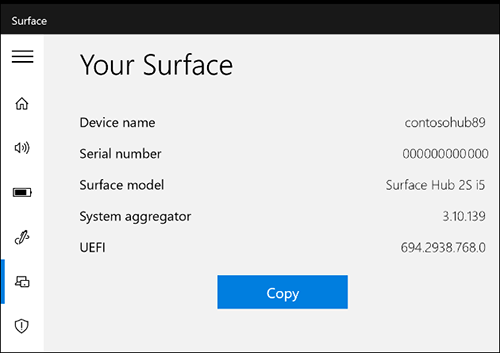

   - If the UEFI version is earlier than version *694.2938.768.0*, use one of the following methods to get a newer version

#### Update UEFI via Windows Update

1. On your Surface Hub 2S, sign in as **Admin**.

    >[!Note]
    > If you don't know your user name or admin password, you'll need to reset the device. For more information, see [Reset and recovery for Surface Hub 2S](/surface-hub/surface-hub-2s-recover-reset).

1. Go to **All apps** > **Settings** > **Update and Security** > **Windows Update**, and install all updates.

1. Restart the device.

1. Verify the UEFI version by using the Surface app. If the UEFI version isn't version *694.2938.768.0* or later, repeat these steps, or use the following procedure to get the latest UEFI version.

#### Update the UEFI via bare metal recovery (BMR) image

1. Go to the [Surface recovery site](https://support.microsoft.com/surfacerecoveryimage) and select **Surface Hub 2S**.

1. Enter your Hub serial number. It's located on the back of the Hub next to the power connection.

1. Follow the directions to download the image onto a formatted USB drive by installing the Windows 10 Team 2020 Update.

1. After the update, the device enters out-of-box-experience (OOBE) setup. You don't need to complete setup. The UEFI version is already updated. Instead power down the device by holding the power button until the screen turns off.

### Download Surface UEFI Configurator and Surface Hub 2 drivers and firmware

On a separate PC, follow these steps:

1. On the <a href="https://www.microsoft.com/download/details.aspx?id=46703" target="_blank"> Surface Tools for IT page</a>, select **Download**.  

1. Select and download the Surface UEFI Configurator MSI file, and install it on a separate PC. The Surface UEFI Configurator tool can't be run on a Surface Hub 2S while Windows 10 Team edition is installed.

1. Download the [Surface Hub 2 drivers and firmware Windows Installer MSI file](https://www.microsoft.com/download/details.aspx?id=101974). You'll use this file when you install the new operating system.

### Prepare the SEMM certificate

If you haven't used Surface UEFI Configurator before, you need to prepare a certificate. This certificate ensures that after a device is enrolled in SEMM, you can modify UEFI settings only by using packages that are created with the approved certificate.

How you get a certificate depends on the size or complexity of your organization:

- Enterprise organizations typically maintain their own infrastructure to generate certificates according to standard security practices.

- Medium-sized businesses and others often choose to get certificates from partner providers. This option is recommended for organizations that don't have as much IT expertise or lack a dedicated IT security team.

- Alternatively, you can generate a self-signed certificate by using a PowerShell script. For more information, see the [Surface Enterprise Management Mode certificate requirements](/surface/surface-enterprise-management-mode#surface-enterprise-management-mode-certificate-requirements). Or you can use PowerShell to create your own certificate. For more information, see the [Self-signed certificate](/dotnet/core/additional-tools/self-signed-certificates-guide#create-a-self-signed-certificate) documentation.

The SEMM package that Surface UEFI Configurator creates must be secured with a certificate. The certificate verifies the signature of configuration files before UEFI settings can be applied. For more information, see the [SEMM](/surface/surface-enterprise-management-mode) documentation.

### Create a SEMM package

1. On a separate PC, install the Surface UEFI Configurator tool that you downloaded earlier.

1. Open Surface UEFI Configurator, and then select **Start**.

      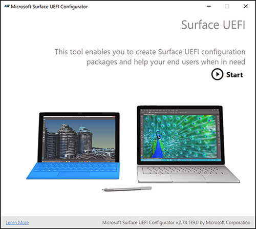

1. Select **Surface Devices**, and then select **Next**.

      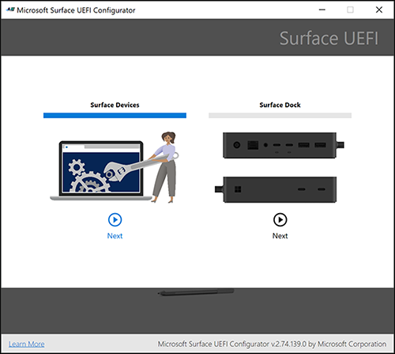
  
1. Select **Configuration Package**.

      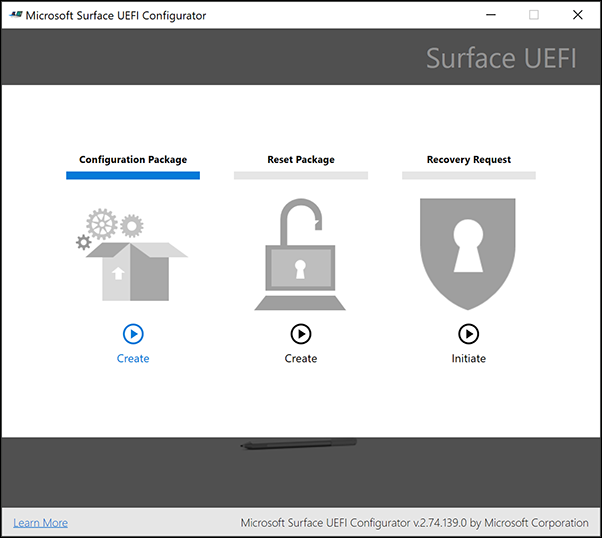

1. Select **DFI File**.

      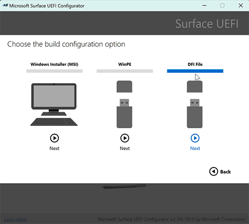
  
1. Select **Certificate Protection**.

      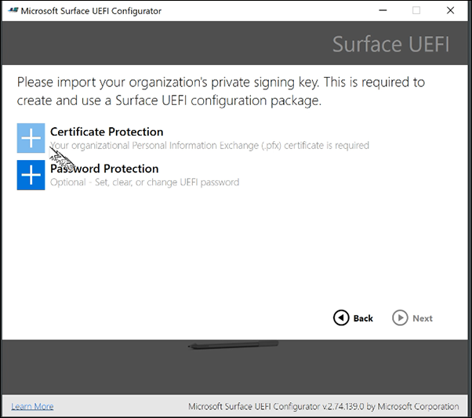

   You'll be prompted to add your certificate .pfx file.

      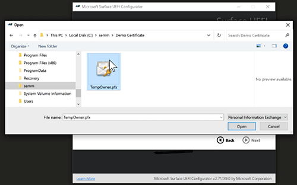

1. Enter your certificate password, and then select **OK**.

      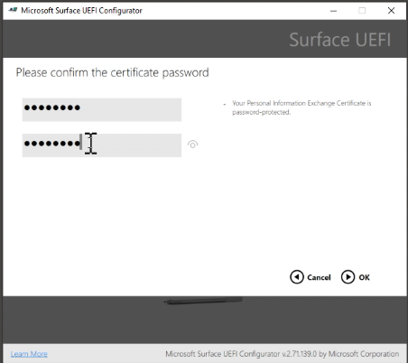

1. Select **Password Protection** to add a password to the Surface UEFI. You'll need this password whenever you boot to the UEFI. *We strongly recommend that you set a UEFI password that you'll use on Surface Hub 2S.*

      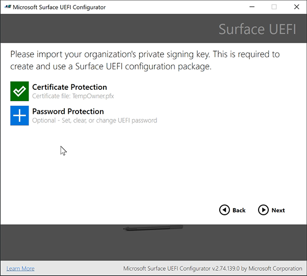

1. Set a UEFI password, and then select **OK**.

   > [!IMPORTANT]
   > Save the password in a secure location that's accessible to your IT admins who manage Surface Hub. *If this password is lost, it can't be recovered.*

      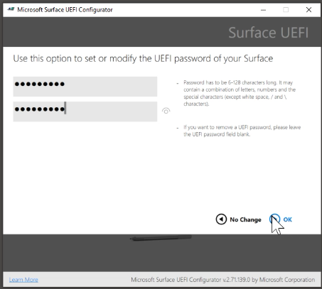

1. Select **Surface Hub 2S**, and then select **Next**.

      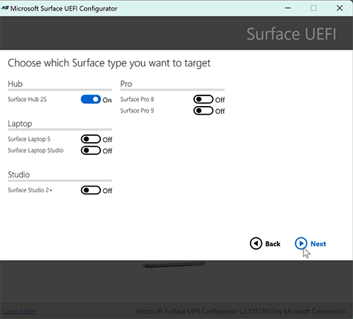

1. Select **Next** again.

     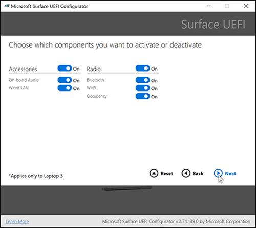

1. To allow installation of Windows 10/11 Pro or Enterprise, turn on **EnableOsMigration**, and then select **Next**.

     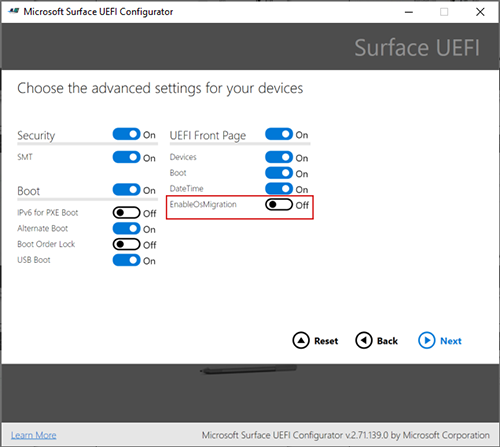

     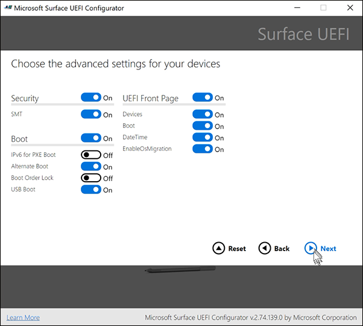

### Manage SEMM enrollment

Enrolling a device into SEMM affects how you can manage it. For example, after you apply a SEMM package, all UEFI settings are unavailable (locked) in the device's UEFI menu. Default values for other settings such as **IPv6 for PXE Boot** are also unavailable.

To change UEFI settings after you finish the migration, apply another SEMM package or unenroll the device from SEMM. If you apply another SEMM package to change the UEFI settings, you must use the original certificate when you build the new SEMM package. Use the UEFI Configurator tool and leave **EnableOSMigration** *off* (not *on* as in the original migration steps).

#### If you work with partners

If your company outsources the Surface Hub 2 migration to Windows 10/11 Pro or Enterprise, you may want to have the partner transfer the SEMM certificate, SEMM package, and UEFI password to you. Or, after you migrate the Hub, you can immediately unenroll it from SEMM. This step enables local administration of UEFI and transfer of the device to another party. But we still strongly recommend that you use a UEFI password, which can be configured after migration. To learn more, see [Manage Surface UEFI settings](/surface/manage-surface-uefi-settings).

#### To roll back to Windows 10 Team

If you choose to restore your device to Windows 10 Team after the migration [as described later in this article](#to-roll-back-to-windows-10-team), we recommend that you first unenroll Hub from SEMM. To learn more, see [Unenroll Surface devices from SEMM](/surface/unenroll-surface-devices-from-semm).

>[!WARNING]
>To unenroll a device from SEMM and restore user control of Surface UEFI settings, you must have the SEMM certificate that was used to enroll the device in SEMM. If this certificate becomes lost or corrupted, it is not possible to unenroll from SEMM. Back up and protect your SEMM certificate accordingly.

#### Save the SEMM package to a USB drive

1. Connect a USB drive to your PC.

1. Choose **Hub 2S**, and then select **Next**.

      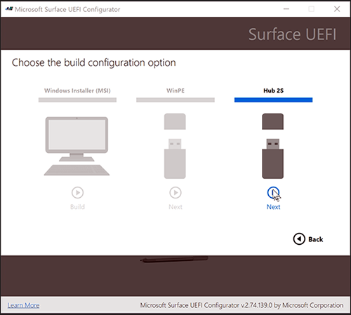

   > [!WARNING]
   > All existing data on the USB drive will be erased when the SEMM package is built. Before you build the SEMM package, remove any files that you need from the USB drive.

1. Select **Build**.

      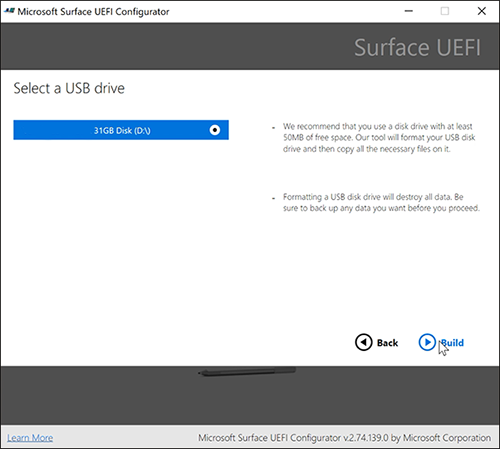

1. Capture a screenshot of this page, and then select **End**. Your SEMM package is now ready. It contains the SEMM package *DfciUpdate.dfi* and a text file that includes the SEMM *thumbprint*, which is the last two characters of the certificate's thumbprint.

      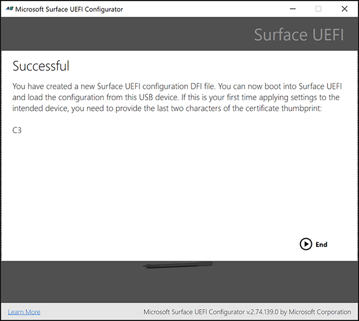

1. Save the certificate thumbprint's last two characters. You'll need these characters to activate SEMM when you apply the package on Surface Hub 2S.

### Load a USB flash drive with a Windows 10 image, SEMM package, and Surface Hub 2 drivers and firmware

You can install a Windows 10/11 Pro or Enterprise image (version *20H2* or later) by using one of the following options:

- Your current imaging solution.

- [Surface Deployment Accelerator](/surface/microsoft-surface-deployment-accelerator). Use this tool to create a bootable Windows 10 image. The image can include all current Windows 10 updates, Microsoft Office, other apps, and the required drivers and firmware.

- A USB flash drive that contains a Windows 10/11 Pro or Enterprise image. This option will not have Wi-Fi available until after out-of-box-experience (OOBE) setup. Once setup is complete, install the required [Surface Hub 2 drivers and firmware for Windows 10 Pro and Enterprise](https://www.microsoft.com/download/details.aspx?id=101974) on the device.

The following steps show how to create a USB flash drive from installation media and then add the SEMM package files and the drivers and firmware for Windows 10 Pro and Enterprise OS on Surface Hub 2 MSI file. If you use another deployment method, go to the [Update UEFI on Surface Hub 2S to enable OS migration](#update-uefi-on-surface-hub-2s-to-enable-os-migration) section of this article.

> [!NOTE]
> After you finish the installation, you'll need a valid license for Windows 10 Pro or Windows 10 Enterprise that's separate from your existing Windows 10 Team license.

1. To create a Windows 10 Pro installation, follow the instructions to download the media creation tool at [Download Windows 10](https://www.microsoft.com/software-download/windows10). To download Windows 10 Enterprise, go to the [Microsoft Volume Licensing Service Center](https://www.microsoft.com/licensing/servicecenter/default.aspx).

1. Insert a new USB storage drive.
1. Open the media creation tool, select **Create installation media**, and then select **Next**.

      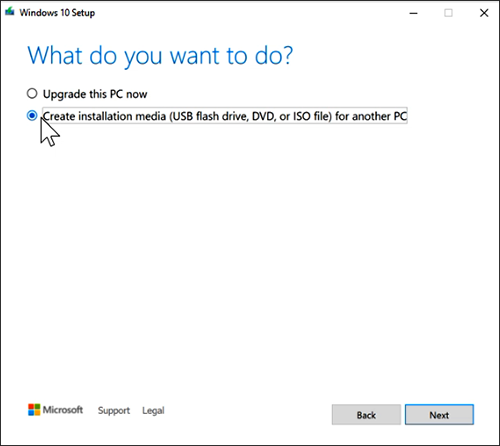

1. Select a language, and then select **Windows 10** and **64-bit (x64)**. Then select **Next**.

      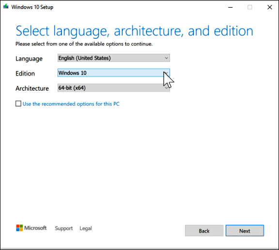

1. Select **USB flash drive**, and then select **Next**.

      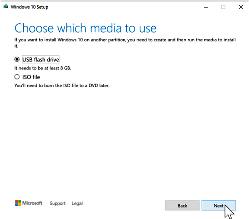

1. When the download finishes, select **Finish**.

      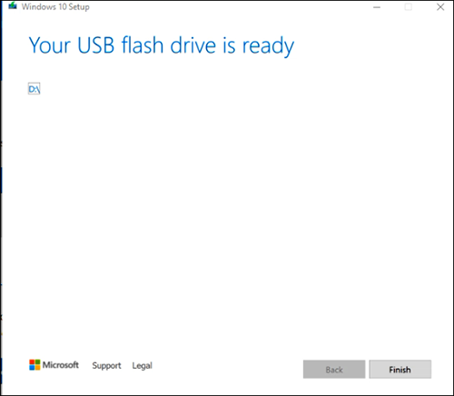

1. Copy the SEMM package files and the drivers and firmware for Windows 10 Pro and Enterprise OS on Surface Hub 2 (the MSI file) to the root of the USB flash drive (*BOOTME*) that contains your Windows 10 image. The BOOTME USB drive will contain:

   - Your Windows 10 bootable image.

   - The SEMM package files, copied to the root of the USB drive:

     - *DfciUpdate.dfi*.

     - A text file that includes the SEMM thumbprint. (In this example, the file is *SurfaceUEFI_2020Aug25_1058.txt*.) The automatically generated date-time stamp corresponds to the date that you created the file by using Surface UEFI Configurator.

   - The drivers and firmware for Windows 10 Pro and Enterprise OS on Surface Hub 2 (SurfaceHub2S_Win10_18362_20.082.25682.0.msi). Copy this file to the root of the USB drive.

### Update UEFI on Surface Hub 2S to enable OS migration

1. Insert your BOOTME drive into the USB-A port on the Surface Hub 2S. For a list of its required contents, see the previous section.

1. To boot into UEFI:

   1. Turn off (shut down) your Surface Hub 2S.
   
   1. Press and hold **Volume +**, and then press and release the power button. Keep holding **Volume +** until the UEFI menu appears.

         

1. When the device restarts, enter the UEFI password that you created earlier, if applicable (recommended).

      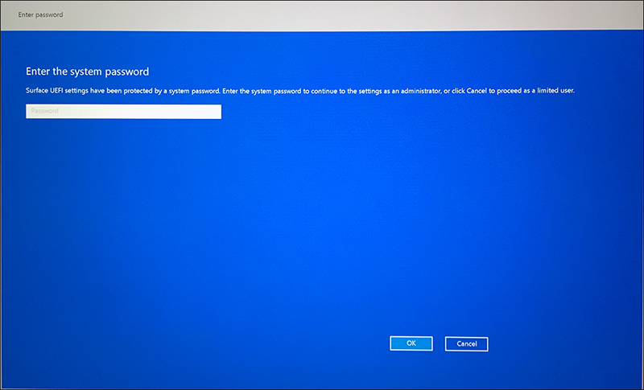

1. From the UEFI menu, select **Management**. Then select  **Install from USB**.

      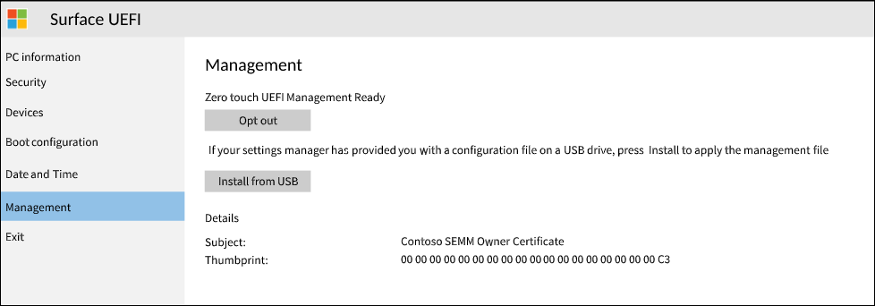

1. Select **Restart now**, as the following image shows. The device will restart. It will display a white Microsoft logo in the middle of the window and then shut down.

      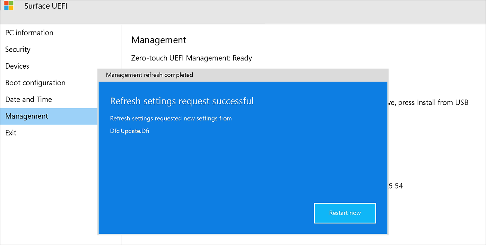

1. Press and release the power button. In the red dialog box that appears, choose to activate Surface Enterprise Management Mode.

1. Enter your two-character certificate thumbprint and your UEFI settings password. Then select **OK**.

      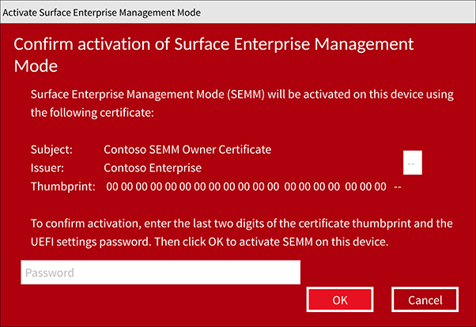

   > [!NOTE]
   > After you activate SEMM on your device, the new UEFI setting **EnableOSMigration** is applied. You can no longer access Windows 10 Team. Instead, you must continue to the next step and install Windows 10 Pro or Windows 10 Enterprise.

   The device reboots. It displays the white logo in the middle of the screen and then shuts down again.

### Install Windows 10/11 Pro or Enterprise

1. If your bootable Windows 10/11 Pro or Enterprise drive isn't already in the Surface Hub 2 USB-A port, insert it now. Then press and release the power button.

   When the device starts, you'll see the white logo in the middle of the screen. Then a spinning circle appears below the white logo.

1. If the Surface device doesn't automatically boot to the USB drive, power off the device (unplug the power cord and then plug it back in). After you plug in the power cord again, the device should boot after a few seconds. Then you'll see the white logo in the middle of screen.

   If the device doesn't turn on, press and release the power button. Immediately after you see the logo in the middle of the screen, press and hold the Volume down button until you see the spinning circle below the white logo.

     

1. When the out-of-box experience (OOBE) setup starts, follow the instructions to install Windows 10/11 Pro or Enterprise (version *20H2* or later).

### Install Surface Hub 2 drivers and firmware

To ensure that your Surface Hub 2 is up to date, install [drivers and firmware for Windows 10 Pro and Enterprise](https://www.microsoft.com/download/details.aspx?id=101974). Then reboot the device. Keep the Surface turned on for an hour, and then reboot it again. You won't be prompted for the second reboot. This pause and extra reboot ensures that the firmware has been fully updated.

## Configure recommended settings

To configure Surface Hub 2S as a personal productivity device, see [Configure Windows 10/11 Pro or Enterprise on Surface Hub 2](surface-hub-2-post-install.md).

> [!NOTE]
> If you can't successfully migrate your device to Windows 10/11 Pro or Enterprise for Surface Hub 2 by following the steps outlined in this article, contact [Surface Hub Support](https://support.microsoft.com/help/4037644/surface-contact-surface-warranty-and-software-support).

## To roll back to Windows 10 Team

If you want to restore your device to Windows 10 Team, see [Reset and recovery for Surface Hub 2S](surface-hub-2s-recover-reset.md). Before you roll back to Windows 10 Team, we recommend that you first unenroll the Surface Hub from SEMM. To learn more, see [Unenroll Surface devices from SEMM](/surface/unenroll-surface-devices-from-semm).

> [!WARNING]
> To unenroll a device from SEMM and restore user control of Surface UEFI settings, you must have the SEMM certificate that was used to enroll the device in SEMM. If this certificate becomes lost or corrupted, it is not possible to unenroll from SEMM. Back up and protect your SEMM certificate accordingly.

## Version history

The following table summarizes changes to this article.

| Version | Date               | Description                                                                                           |
| ------- | ------------------ | ----------------------------------------------------------------------------------------------------- |
| v. 1.5  | December 1, 2021  | Updated to show support for Windows 11
| v. 1.4  | December 14, 2020 | Provides [further info](#install-surface-hub-2-drivers-and-firmware) about installing the MSI file for "Drivers and firmware for Windows 10 Pro and Enterprise OS on Surface Hub 2," advising that a second reboot may be necessary depending on the state of your system.                                                          |
| v. 1.3  | December 3, 2020 | Updated with guidance about [managing SEMM enrollment](#manage-semm-enrollment).                                                       |
| v. 1.2  | September 29, 2020 | Miscellaneous updates that address usability feedback.                                                        |
| v. 1.1  | September 15, 2020 | Placed an additional note in the introduction that clarifies licensing requirements for installing a new OS. |
| v. 1.0  | September 1, 2020  | New article.                                                                                           |
