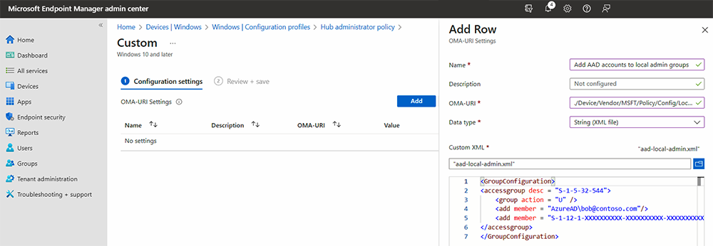

# Configure non Global admin accounts on Surface Hub

The Windows 10 Team 2020 Update adds support for configuring non Global admin accounts that limit permissions to management of the Settings app on Surface Hub devices joined to an Azure AD domain. This enables you to scope admin permissions for Surface Hub only and prevent potentially unwanted admin access across an entire Azure AD domain. Before you begin, make sure your Surface Hub is joined to Azure AD and Intune auto-enrolled. If not, you will need to reset Surface Hub and complete the first-time, out-of-the-box (OOBE) setup program, choosing the option to join Azure AD.

Windows 10 Team 2020 Update 2 adds support for [LocalUsersAndGroups configuration service provider](/windows/client-management/mdm/policy-csp-localusersandgroups). This replaces the [RestrictedGroups CSP](/windows/client-management/mdm/policy-csp-restrictedgroups), which remains available but is no longer recommended, as explained below.

## Summary

The process of creating non Global admin accounts involves the following steps:

1. In Microsoft Intune, create a Security group containing the admins designated to manage Surface Hub.
2. Obtain Azure AD Group SID using PowerShell.
3. Create an XML file containing Azure AD Group SID.
4. Create a Security Group containing the Surface Hub devices that the non-Global admins Security group will manage. 
5. Create a custom Configuration profile targeting the security group that contains your Surface Hub devices.

## Create Azure AD security groups

First, create a security group containing the admin accounts. Then create another security group for Surface Hub devices.  

### Create security group for Admin accounts

1. Sign in to Intune via the [Microsoft Endpoint Manager admin center](https://go.microsoft.com/fwlink/?linkid=2109431), select **Groups** > **New Group** > and under Group type, select **Security.**
2. Enter a Group name -- for example, **Surface Hub Local Admins** -- and then select **Create.**

     

3. Open the group, select **Members**, and choose **Add members** to enter the Administrator accounts you wish to designate as non Global admins on Surface Hub. To learn more about creating groups in Intune, see  [Add groups to organize users and devices](/mem/intune/fundamentals/groups-add).

### Create security group for Surface Hub devices

1. Repeat the previous procedure to create a separate security group for Hub devices; for example, **Surface Hub devices**.

     

## Obtain Azure AD Group SID using PowerShell

1. Launch PowerShell with elevated account privileges (**Run as Administrator**) and ensure your system is configured to run PowerShell scripts. To learn more, refer to [About Execution Policies](/powershell/module/microsoft.powershell.core/about/about_execution_policies?).
2. [Install Azure PowerShell module](/powershell/azure/install-az-ps).
3. Sign in to your Azure AD tenant.

    ```powershell
    Connect-AzureAD
    ```

4. When you're signed in to your tenant, run the following commandlet. It will prompt you to "Please type the Object ID of your Azure AD Group."

    ```powershell
    function Convert-ObjectIdToSid
    {    param([String] $ObjectId)   
         $d=[UInt32[]]::new(4);[Buffer]::BlockCopy([Guid]::Parse($ObjectId).ToByteArray(),0,$d,0,16);"S-1-12-1-$d".Replace(' ','-')
      
    }
    ```

5. In Intune, select the group you created earlier and copy the Object id, as shown in the following figure.

     

6. Run the following commandlet to get the security group's SID:

    ```powershell
    $AADGroup = Read-Host "Please type the Object ID of your Azure AD Group"
    $Result = Convert-ObjectIdToSid $AADGroup
    Write-Host "Your Azure Ad Group SID is" -ForegroundColor Yellow $Result
    ```

7. Paste the Object id into the PowerShell commandlet, press **Enter**, and copy the **Azure AD Group SID** into a text editor.

## Create XML file containing Azure AD Group SID

1. Copy the following into a text editor:

    ```xml
    <GroupConfiguration>
    <accessgroup desc = "S-1-5-32-544">
        <group action = "U" />
        <add member = "AzureAD\bob@contoso.com"/>
        <add member = "S-1-12-1-XXXXXXXXXX-XXXXXXXXXX-XXXXXXXXXX-XXXXXXXXXX"/>
    </accessgroup>
    </GroupConfiguration>
    ```
2. Replace the placeholder SID (beginning with S-1-12-1) with your **Azure AD Group SID** and then save the file as XML; for example, **aad-local-admin.xml**.

      > [!NOTE]
      > While groups should be specified via their SID, if you would like to add Azure users directly, specify their User Principal Names (UPNs) in this format: `<member name = "AzureAD\user@contoso.com" />`

## Create Custom configuration profile

1. In Endpoint Manager, select **Devices** > **Configuration profiles** > **Create profile**.
2. Under Platform select **Windows 10 and later.** Under Profile, select **Custom**, and then select **Create.**
3. Add a name and description and then select **Next.**
4. Under **Configuration settings** > **OMA-URI Settings**, select **Add**.
5. In the Add Row pane, add a name and under     **OMA-URI**, add the following  string:

    ```OMA-URI
     ./Device/Vendor/MSFT/Policy/Config/LocalUsersAndGroups/Configure
    ```

> [!NOTE]
> The **RestrictedGroups/ConfigureGroupMembership** policy setting also allows you to configure members (users or AAD groups) to a Windows 10 local group. However, it only allows for a complete replacement of the existing groups with the new members. You cannot selectively add or remove members.  Available in Windows 10 Team 2020 Update 2, it is recommended to use the **LocalUsersandGroups** policy setting instead of the RestrictedGroups policy setting. Applying both policy settings to Surface Hub is unsupported and may yield unpredictable results.

6. Under Data type, select **String XML** and browse to open the XML file you created in the previous step.

     

7. Click **Save**.
8. Click **Select groups to include** and choose the [security group you created earlier](#create-security-group-for-surface-hub-devices) (**Surface Hub devices**). Click **Next.**
9. Under Applicability rules, add a Rule if desired. Otherwise, select **Next** and then select **Create**.

To learn more about custom configuration profiles using OMA-URI strings, see [Use custom settings for Windows 10 devices in Intune](/mem/intune/configuration/custom-settings-windows-10).

## Non Global admins managing Surface Hub

Members of the **Surface Hub Local Admins** Security group can now sign in to the Settings app on Surface Hub and manage settings.

> [!IMPORTANT]
> The default access of global admins to the Settings app is removed (unless they are also members of this new security group).
