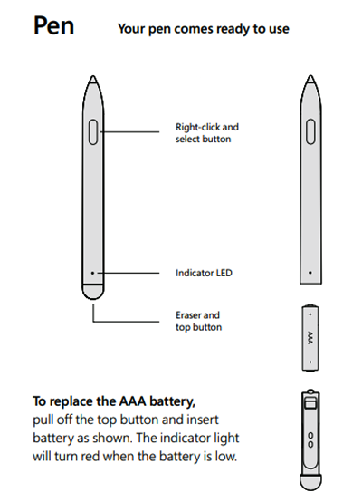

# Surface Hub 2S quick start

## Unpack Surface Hub 2S 

1. Use the handles on each side of the box to move it to the space where you'll set it up.
2. Before opening, remove the clips (4) on the front and back, then lift the top off the box using the handles.
3. In the base of the Surface Hub 2S, open the accessories box containing the setup guide, Surface Hub Pen, Surface Hub Smart Camera, and the power cable.
4. On the back of the Surface Hub 2S, an instructional label shows you where to attach the mounting hardware. Install them in place and remove the label.

See this video for more information about [unboxing and setup](https://youtu.be/fCrxdNXvru4).

## Install and adjust Pen

1. Attach the Surface Hub Pen magnetically to your preferred side of the device.

  

2. To adjust pen pressure, open the Surface app on Surface Hub 2S, select Pen, and adjust the slider.

  

## Install camera

Remove the lens cling from the camera and attach it to the USB-C port on the top of the Surface Hub 2S.

## Start Surface Hub 2S

1. Insert the power cable into the back of the device and plug it into a power outlet. Run the cable through any cable guides on your mounting solution and remove the screen clang.
2. To begin, press the power button on the bottom right.

  

### Learn more

- [Install and mount Surface Hub 50"](surface-hub-install-mount.md)
- [Install and mount Surface Hub 85"](surface-hub-2s-85-install-mount.md)
