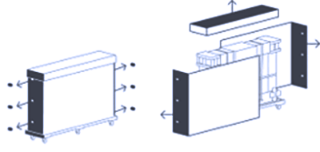
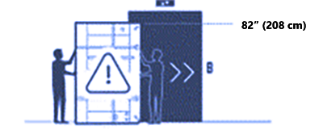
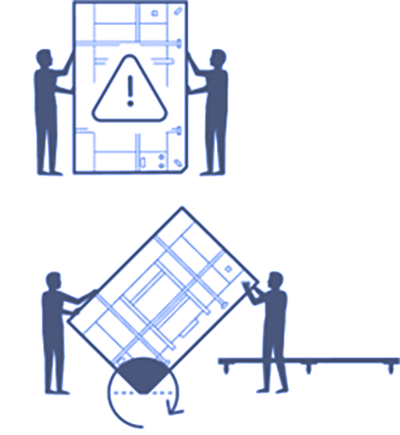
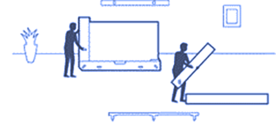
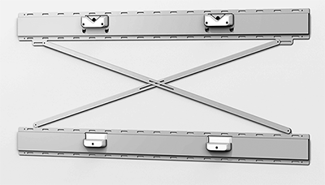

# Install and mount Surface Hub 3 85"

This article explains how to physically install Microsoft Surface Hub 3 85" in commercial environments.

## Unboxing video

Before you begin, please review the Unboxing and Set Up video:

> [!VIDEO https://www.microsoft.com/videoplayer/embed/RWwwgL]

## Follow all safety precautions

> [!WARNING]
> **Handling and site prep** 
>
> - The device is very heavy. To reduce the risk of personal injury, death, or damage to the device, which can occur due to its size and weight, it is essential to keep the device upright.
>- Before moving the device to where it will be installed, survey the site to determine how to safely move it to where it will be unpacked and mounted.
>- Always use at least two people for unpacking and installation.
>- Once the device is unpacked, it should be mounted
immediately, so the mounting system should be in place before unpacking. If you're mounting onto a rolling stand, lock or block the stand's wheels before unpacking.
>- To avoid tripping hazards, keep the assembly area clear of packing materials.

> [!IMPORTANT]
>Before proceeding, review the additional safety information listed in [Appendix A](#appendix-a-additional-safety-information) below.

## 1. Remove outer packaging materials

1. Remove and recycle outer cover.
2. Cut four (4) plastic straps.
3. Open and remove the six (6) clips from the ends.
4. Remove the lid, lift, and remove the front and back panels.

   

## 2. Remove black outer packaging foam

1. Remove black corner foam pieces (4).
2. Remove the black center foam support.

   

> [!Caution]
> Do not remove any white foam, strapping or packaging materials until the Hub 3 is adjacent to the cart or wall mount on which it will be placed.
Additional strapping materials are provided in the small box located under the hand screw knobs on the back side of the package. Original or replacement strapping materials must be in place before moving, especially before rotating the device and its protective package.

## 3. Remove inner packaging frame from pallet

1. Move the pallet assembly to the elevator location.
2. Lock wheel brakes (4).
3. Slide the inner packaging off the pallet.

   

## 4. Rotate packaging frame to fit elevator

1. Rotate the frame to fit elevator
2. Rotate on the beveled end of the inner frame and slide into the elevator.

   

> [!TIP]
> The wheeled pallet is custom fit to the inner frame packaging footprint and can be used throughout the installation site delivery process. The inner wood frame end piece has nylon skid plates.

## 5. Remove from elevator

1. Slide out of the elevator
2. Lock wheel brakes (x4).

   

## 6. Place Surface Hub 85" back on pallet

1. Using the beveled end, rotate back onto the pallet.
2. Unlock wheel brakes (x4).
3. Move the product to the location of the wall or cart mount.

   

## 7. Place Surface Hub 85" on Wall Mount or Cart

1. Place Hub 3 in front of the wall mount or cart.
2. Lock wheel brakes (x4).
3. Slide the inner packaging off the pallet.
4. Cut the three plastic straps.
5. Remove lid.
6. Remove white foam pieces.
7. Remove Welcome Kit.
8. Remove the end piece by lifting it vertically.
9. Remove wood end pieces by the four hand knobs screws on the wood base.

     

   > [!CAUTION]
   >  Do not leave Hub 3 85" unattended. An additional person is needed to hold the device upright. Once end pieces are removed, at least one person must maintain contact with the Hub 3 until placement on the wall mount or cart is completed.

10. Lift the plywood end piece up and back.
11. Remove the bump label from the back.
12. Lift the Hub 3 from the lower tray and place it on a cart or wall mount.

    > [!NOTE]
    > Following the cart or wall mount manufacturer's instructions, prepare the mounting system before removing the Hub 3 from its inner packaging tray.

    > [!TIP]
    > When grasping the Hub 3, note the lower foam's handhold cutouts. Care must be taken with the top hand not to grasp the device where the speakers are located. Graphics on the ends of the device cover provide a general speaker location.

13. Loosen elastic tension clips (x2).
14. Remove cloth cover.
15. Note locations for pens (x2), camera, and power cord placement.
16. Attach pens (x2), camera, and power cord.
17. Remove cling labels (x4).
18. Press the power button on the lower right. Installation is now complete.

## Mounting Surface Hub 3 85"

The Surface Hub 3 85" uses a 600 x 600 VESA mount pattern. As shown in the following image, Microsoft has partnered with [Steelcase](https://www.steelcase.com/products/collaboration/steelcase-roam/) to create mounting options compatible with the Surface Hub 3 85" unique design.

  

### Mounting dimensions

If using other (non-Steelcase) mounting options, you will need spacers to account for the compute enclosure on the back of the device. Spacers and other certified accessories are available from [Salamander Designs](http://www.salamandercommercial.com/surface-hub-2).

:::image type="content" source="images/sh2-85-measure2.png" alt-text="Surface Hub 85&#8221; dimensions detail for mounting.":::  

:::image type="content" source="images/sh2-85-measure1.png" alt-text="Surface Hub 85 &#8221; dimensions for mounting.":::  

## Supplemental Strapping Kit

An additional set of inner packaging strapping materials can be found in the kit attached at the back, lower right.

## Appendix A: Additional safety information

> [!WARNING]
> **Heavy object/ergonomic lifting** 
> The device is very heavy. We recommend that at least two or more people lift the device to reduce the risk of lifting-related injuries, death, or damage to the device. It is important to use proper lifting posture when lifting or moving the device.
> Use good ergonomic lifting practices, including but not limited to:
>
> - Plan. Make sure the lifting team agrees on the plan.
>- Determine if you can lift the unit. Is it too heavy or too awkward?
>- Decide if you need a lifting aid.
>- Check your environment for obstructions and slippery surfaces.
>- Lift with your legs, not your back.
>- Bend at your knees, keeping the back straight.
>- Keep the unit close to your body.
>- Center your body over the unit. Keep the feet about shoulder width apart.
>- Lift straight up smoothly.
>- Keep your torso straight; do not twist while lifting or after the load is lifted

> [!WARNING]
> **Proper mounting**  The device is heavy and attaches to a cart or wall mount. To reduce the risk of injury, death, or damage to the device:
>
>- Follow all instructions provided by the cart or wall mount manufacturer.
>- Ensure the proposed mounting system will support the weight of this device.
>- Only use the mounting hardware provided with mounting the system.
>- Ensure all screws are securely tightened according to the manufacturer's instructions.
>- Only release the device once you are sure it fully engages with mounting system attachment points.
>- Microsoft recommends using carts or wall mounting systems designed for use with your device. Microsoft is not responsible for any damage, injuries, or death caused by using other mounting systems.

> [!WARNING]
> **Unseen hazards in walls or other mounting surfaces**  
Walls and other mounting surfaces may contain electrical wires, gas lines, and other unseen hazards or obstacles. Cutting or drilling into an unseen hazard may cause serious personal injury or death.
It is the installer's responsibility to locate unseen hazards before and to avoid these hazards during installation. Assess the mounting environment and ensure there are no unseen hazards in the wall or other mounting surfaces before drilling or cutting.

> [!WARNING]
> **Tip hazard** 
> To avoid the risk of personal injury, death, or damage to a cart/stand-mounted device when it is moved:
>
> - Only use a cart/stand compatible with this device.
>- Follow all instructions provided by the cart/stand manufacturer for moving or relocating a stand-mounted device.
>- Do not hang or place heavy objects on the device or the cart/stand.
>- Disconnect the power cord and other cables before moving the cart/stand-mounted device. Use caution and move slowly when moving a cart/stand-mounted device. Follow the cart/stand manufacturer's instructions for moving or relocating the stand.
>- Use caution when transporting a cart/stand-mounted device up or down ramps. Never leave a cart/stand-mounted device unattended on or near a ramp.
>- Only adults should move the cart/stand-mounted device.

> [!CAUTION]
> **Touch-screen glass** 
The touch screen on the device, like most touch screens, is made of glass. The glass can break if the device is dropped or significantly impacted. To reduce the risk of personal injury, avoid touching the screen if the glass is broken, chipped or cracked and arrange to replace the screen.
A cracked or chipped touchscreen caused by misuse or abuse of your device is not covered under the product's limited warranty.

> [!WARNING]
> **Proper installation** 
To avoid hazards related to improper device installation, installation must be performed by people who have read and understand the installation instructions before beginning work. If you do not have the necessary equipment or expertise or are uncertain that the mounting surface can adequately support the device, consult a professional installer.

## More information

- [Steelcase Roam Collection](https://www.steelcase.com/products/collaboration/steelcase-roam/)
- [Salamander Designs](http://www.salamandercommercial.com/surface-hub-2)
