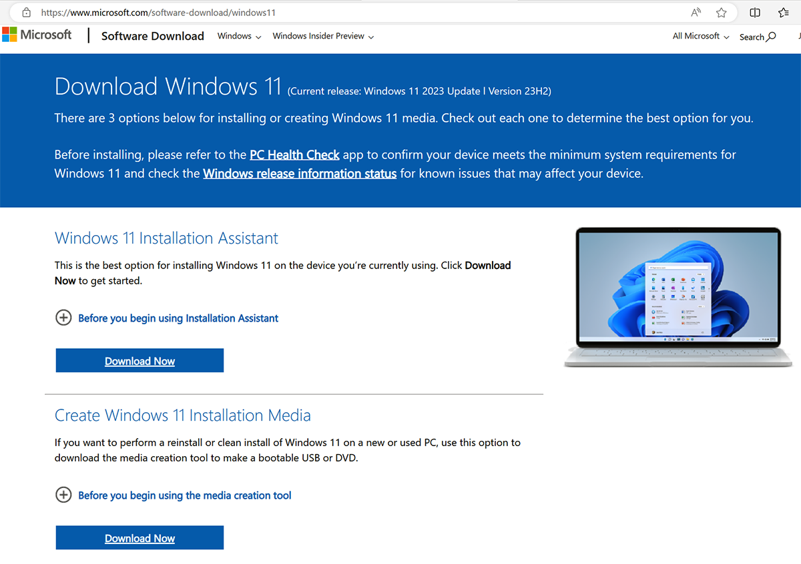

# Migrate to Windows 11 Pro or Enterprise on Surface Hub 3

This article describes how to convert the operating system to Windows 11 Pro or Enterprise and use Surface Hub 3 much like any other PC.

## Before you begin

1. Obtain a Windows 11 Pro or Enterprise license as explained in [Windows commercial licensing overview](/windows/whats-new/windows-licensing).

 

2. On your Surface Hub 3, backup your data using an external hard drive, cloud storage, or other preferred backup method.
3. On a separate PC, insert a USB drive with at least 8 MB of storage.

## Download Windows 11 and create a bootable USB drive

1. Go to the [Windows 11 software download page](https://www.microsoft.com/software-download/windows11). Under **Create Windows 11 Installation Media**, select **Download Now**.
2. Install the media creation tool, accept the license agreement and select **Next.**
3. Follow the instructions to create a bootable USB drive with the Windows 11 installation files.
4. Remove the USB drive and insert it into Surface Hub 3.
5. While pressing the **Volume down** button, press the **Power** button. Keep pressing both buttons until you see the Windows logo. Release the **Power** button, but hold the **Volume down** button until the Install UI begins.
6. Follow the on-screen instructions to install Windows 11. This will include selecting the language, time, keyboard input, and edition (Pro or Enterprise).
