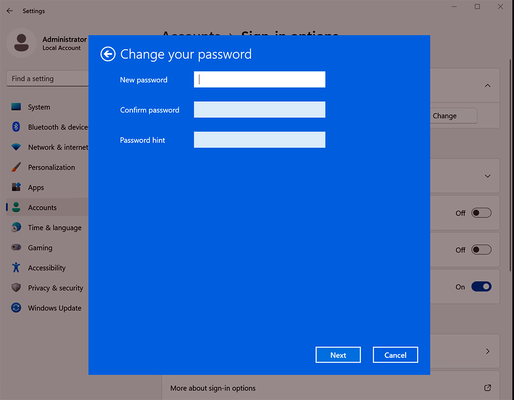
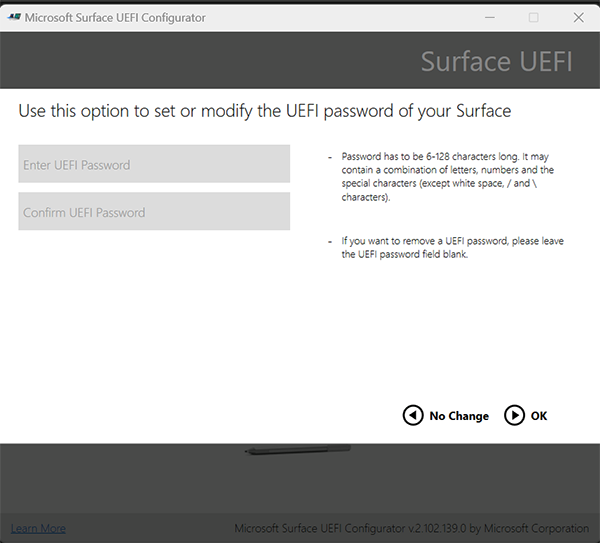
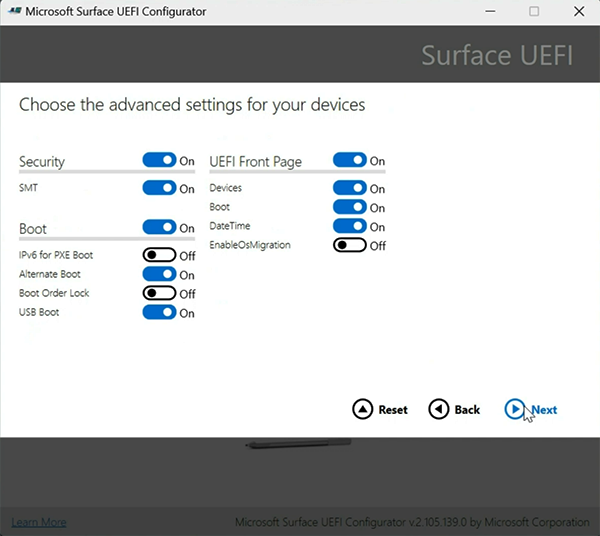

# Surface Hub 3 security best practices

In today's rapidly evolving digital landscape, ensuring the security of Windows devices is paramount. As IT admins, you are the frontline defense against a myriad of threats that seek to compromise your organization's data, infrastructure, and reputation. This article describes best practices for securing Surface Hub 3 running Microsoft Teams Rooms on Windows:

- [Change default local admin password](#change-default-local-admin-password)
- [Set a UEFI password](#set-a-uefi-password)
- [Physically secure Surface Hub 3](#physically-secure-surface-hub-3)

> [!TIP]
> Before you begin, review the guidance for [Microsoft Teams Rooms security](/microsoftteams/rooms/security?tabs=Windows), which primarily focuses on security for tabletop conference devices: [Teams Rooms certified systems](/microsoftteams/rooms/certified-hardware?tabs=Windows). For Surface Hub 3, start by treating it like any other Windows devices under your scope of management. (JK note: maybe there's a better way to state this but the point here is to stress the importance of ensuring that customers are familiar with the security options explained below so they approach secuirity depending on the needs of their organization)

## Change default local admin password

The default local admin account is a well-known entry point for malicious actors. At a minimum, it's important to change the local admin password on Surface Hub 3. If the default Admin password is not changed immediately after setup, the device may be vulnerable to data breaches, system manipulation, or other unauthorized access. 

### To change local admin password on Surface Hub 3 

1. Sign in with admin credentials and go to **Settings > Accounts > Sign-in options > Password > Change**
2. Enter the current password.
3. Create a new password, confirm the password, and add a hint. To learn more, see [Change or reset your Windows password](https://support.microsoft.com/windows/change-or-reset-your-windows-password-8271d17c-9f9e-443f-835a-8318c8f68b9c).

    

## Set a UEFI password

The Unified Extensible Firmware Interface (UEFI) is a specification that defines a software interface between an operating system and platform firmware. By setting a UEFI password, you add an additional layer of security, preventing unauthorized users from making changes to the device's firmware settings. Set a strong UEFI password and ensure it's stored in a secure location. 

Set a UEFI password via the downloable  UEFI Configurator and Surface Enterprise Management Mode (SEMM).

### Enroll Surface Hub 3 into SEMM

You will need a dedicated USB drive with at least 50 MB of storage space.  

1. Download Surface UEFI Configurator from [Surface Tools for IT](https://www.microsoft.com/download/details.aspx?id=46703).

2. Install UEFI Configurator and select **Start**.
3. Select Configuration Package > DFI
4. Add your organizational Personal Information Exchange (PFE) certificate. 
5. Now you're ready to set a UEFI password. Select **Password Protection**. Enter and confirm your password. Select **Next.**

    

6. Select **Hub** as the Surface type you want to target. 
7. Optionally, you can configure components and advanced settings. Otherwise, continue to select Next. 
8. Select your USB drive and click **Build**.
9. Upon successful creation of the package, the Configurator will display the last two characters of your certificate’s thumbprint. You need these characters when you import the configuration to Surface Hub 3.

## Physically secure Surface Hub 3

Physical security is as crucial a tool as digital security. Devices like the Surface Hub, placed in public conference rooms, can be susceptible to physical damage or tampering. Consider the following steps to protect Surface Hub. 

- **Tamper-evident seals:** Use tamper-evident seals on the device. If someone attempts to open the device, the seal will show signs of tampering.
- **Security cables and locks:** Use security cables and locks to secure the device to a heavy or immovable object, making it difficult for someone to walk away with it.
- **Surveillance:** Depending on the workplace environment, you can opt to install surveillance cameras in the conference room. The mere presence of cameras can deter potential wrongdoers.
## Microsoft Teams Rooms Pro Management 

It’s strongly recommended to use a licence for the Microsoft Teams Rooms Pro Management portal, a cloud-based management solution designed to proactively monitor and update Microsoft Teams Rooms devices and their peripherals. This service is intended for organizations aiming to enhance the meeting room experience for end users, facilitated by real-time monitoring and management for Microsoft Teams Rooms devices like Surface Hub 3. 

- **Intelligent Operations**: Utilizes software and machine learning to automate updates, detect problems, and resolve issues for Microsoft Teams Rooms.
- **Timely Security Patches**: Automated update management ensures that security patches are applied promptly as they become available, minimizing the window of vulnerability and protecting devices from known security threats.
- **Update Management**: Automates the orchestration of meeting application and Windows updates based on customer-configurable deployment rings.

To learn more, see [Microsoft Teams Rooms Pro Management](/microsoftteams/rooms/rooms-pro-management)   

### Enterprise Management

It's recommended to join Surface Hub 3 to Microsoft Entra ID (formerly named Azure AD) and manage the device using Microsoft Intune or equivalent mobile device management (MDM) solution. 

- **Device configuration profiles**: Use Intune's endpoint protection settings to configure Windows Defender, firewall settings, and other security features to protect the device from potential threats.
- **Device compliance policies**: Ensure the device remains compliant with your organization's security standards. If a device falls out of compliance (e.g., if a required update isn't installed), you can configure automated remediation actions or notifications.
- **Update management**: Use default update management settings to automatically install updates during a nightly maintenance window. Intune provides additonal options to customize if needed. 
- **App management**: - Use Intune to manage the apps installed on Surface Hub 3. Ensure only necessary apps related to Teams Rooms functionality are installed and regularly updated.
- **BitLocker encryption**: Ensure that the device's storage is encrypted using BitLocker. This protects data in case of unauthorized access or device theft. Note unlike Surface Hub 2S, Bitlocker is not installed by default. 
- **Conditional access**: Set up conditional access policies to ensure that the device can access corporate resources only when it meets specific conditions, such as being compliant with security policies.
- **Network security**: Ensure the device is connected to a secure network segment. Use Intune to configure Wi-Fi settings, VPNs, or other network configurations to ensure data in transit is protected.
- **Remote Wipe and Lock**: In case of any security incidents, ensure you can remotely lock or wipe the device using Intune.
- **Audit and monitoring**: Regularly review audit logs and set up alerts for any suspicious activities. Intune integrates with Microsoft Endpoint Manager and other Microsoft security solutions, providing a holistic view of device security.
- **User training**: Educate users about not leaving sensitive information visible on the screen.

utilize the Windows Local Administrator Password Solution (Windows LAPS). LAPS automatically manages local admin passwords, ensuring they're randomized and securely stored in Microsoft Entra ID. This reduces the risk associated with stale or widely-known admin passwords.

#### Assign policies in Microsoft Intune

### Manage UEFI settings with SEMM

SEMM provides additional security options that you may wish to implement depending on your environment or organization. As shown in the following figure, advanced UEFI settings provide additional options for hardening Surface Hub that you may wish to configure depending on the security posture of your organization.

   
   

#### Security

This setting displays the Security page when you boot into Surface UEFI, as described in [Manage Surface UEFI settings](/surface/manage-surface-uefi-settings). 

#### Simultaneous Multi-Threading (SMT)

Commonly known as hyperthreading in Intel processors, SMT allows a single physical CPU core to execute multiple threads concurrently. This can improve performance in multi-threaded applications. However, there are specific scenarios where you might want to control the SMT setting. 

Some vulnerabilities, like certain speculative execution side-channel attacks (for example, L1 Terminal Fault, MDS vulnerabilities), can potentially exploit SMT to access sensitive data. Disabling SMT can mitigate the risk associated with these vulnerabilities, although at the cost of some performance. SMT is enabled by default. 

#### IPv6 for PXE Boot

If your network infrastructure and security controls are primarily designed around IPv4 and are not yet fully equipped to handle IPv6 traffic securely, enabling IPv6 for PXE boot could introduce vulnerabilities. This is because IPv6 might bypass some of the existing security controls that are set up for IPv4.

While enabling IPv6 for PXE boot aligns with the broader industry move towards IPv6 adoption, it's essential to ensure that the network infrastructure, security controls, and operational practices are all equipped to handle IPv6 securely. If not, it might be safer to keep IPv6 for PXE boot disabled until those measures are in place.

#### Alternate Boot & USB Boot

The ability to boot from another source, such as a USB or Ethernet device, provides flexibility for system recovery but can also introduce vulnerabilies: 

- **Unauthorized Operating Systems**: If alternate boot is enabled, an attacker with physical access to the device could boot the system using an unauthorized operating system from a USB drive. This could bypass the security controls of the primary OS.
- **Data Extraction**: An attacker could boot from an external device to a system that allows direct access to the internal storage, potentially extracting sensitive data.
- **Malware Installation**: Booting from an untrusted source could introduce malware, rootkits, or other malicious software at the system level.

Given these implications, organizations in highly secure workplace environments may choose to disable Alternate Boot and USB Boot to reduce the risk of unauthorized access or tampering. 

#### Boot Order Lock

Enabling the "Boot Order Lock" enhances the security posture by ensuring it only boots from authorized sources. Boot Order Lock is disabled by default. 

## Differences with Windows 10 Team Edition

If you have already managed Surface Hub, it's important to note that the following security features are not enabled by default on Surface Hub 3: 

- BitLocker. To enable Bitlocker, see ??? WIP is there a page for this? 
- Code integrity policy

## Learn more

- [Secure Boot overview](/windows-hardware/design/device-experiences/oem-secure-boot)
- [BitLocker overview](/windows/security/information-protection/bitlocker/bitlocker-overview)
- [Application Control overview](/windows/security/threat-protection/windows-defender-application-control/windows-defender-application-control)
- [Secure and manage Surface Hub 2S with SEMM and UEFI](/surface-hub/surface-hub-2s-secure-with-uefi-semm)
- [Windows Defender Application Control and virtualization-based protection of code integrity](/windows/security/threat-protection/device-guard/introduction-to-device-guard-virtualization-based-security-and-windows-defender-application-control)
- [Surface Tools for IT](https://www.microsoft.com/download/details.aspx?id=46703)
- [FIPS 140-2 Level 2](/windows/security/threat-protection/fips-140-validation)
- [Common Criteria certification](/windows/security/threat-protection/windows-platform-common-criteria)
