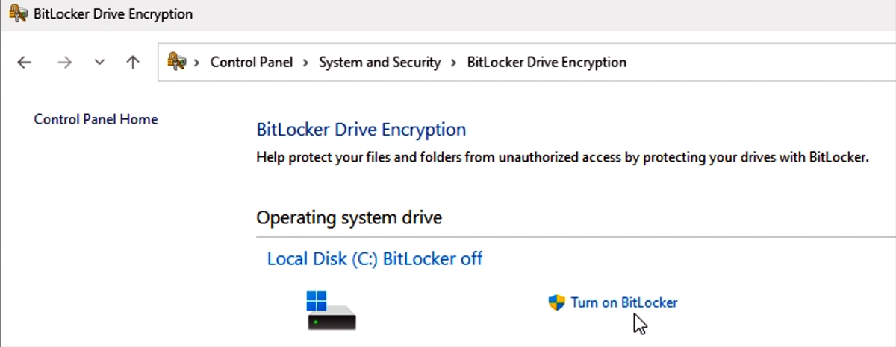

# Surface Hub 3 security best practices

Surface Hub 31 runs Microsoft Teams Rooms on Windows in Kiosk mode on Windows 11 IoT Enterprise. Depending on your organization's security posture, you may wish to take other security measures, as described in this article. At a minimum, we recommended the following:

- [Change default local admin password](#change-default-local-admin-password)
- [Set a UEFI password](#set-a-uefi-password)
- [Physically secure Surface Hub 3](#physically-secure-surface-hub-3)

> [!TIP]
> Before you begin, review the guidance for [Microsoft Teams Rooms security](/microsoftteams/rooms/security?tabs=Windows), which primarily focuses on security for tabletop conference devices: [Teams Rooms certified systems](/microsoftteams/rooms/certified-hardware?tabs=Windows). Surface Hub 3 runs Windows 11 IoT Enterprise in Kiosk Mode, providing IT admins with a range of centralized configuration and management options.  

## Change default local admin password

The default local admin account is a well-known entry point for malicious actors. If the default admin password remains unchanged after first-time setup, the device may be vulnerable to data breaches, system manipulation, or other unauthorized access.

### To change the local admin password on Surface Hub 3

1. Sign in with admin credentials and go to **Settings > Accounts > Sign-in options > Password > Change**
2. Enter the current password.
3. Create a new password, confirm the password, and add a hint. To learn more, see [Change or reset your Windows password](https://support.microsoft.com/windows/change-or-reset-your-windows-password-8271d17c-9f9e-443f-835a-8318c8f68b9c).

    

> [!TIP]
> When joined to Microsoft Entra ID (Azure AD), you can utilize Windows LAPS (Local Administrator Password Solution). Although LAPS doesn't remove local admin accounts, it automatically manages local admin passwords, ensuring they're randomized and securely stored in AD. This reduces the risk associated with stale or widely-known admin passwords. To learn more, see [Microsoft Intune support for Windows LAPS](/mem/intune/protect/windows-laps-overview).

## Set a UEFI password

The Unified Extensible Firmware Interface (UEFI) is an advanced firmware interface designed to replace the traditional BIOS (Basic Input/Output System), providing enhanced features like improved security, faster boot times, and support for larger hard drives in modern Windows operating systems.  By setting a UEFI password, you add an extra layer of security, preventing unauthorized users from changing the device's firmware settings. Set a strong UEFI password and ensure it's stored in a secure location.

Set a UEFI password via the downloadable [Surface UEFI Configurator](https://www.microsoft.com/download/details.aspx?id=46703) and [Surface Enterprise Management Mode (SEMM)](/surface/surface-enterprise-management-mode).

### Enroll Surface Hub 3 in SEMM

You need a dedicated USB drive with at least 50 MB of storage space.  

1. Download Surface UEFI Configurator from [Surface Tools for IT](https://www.microsoft.com/download/details.aspx?id=46703).

2. Install UEFI Configurator and select **Start**.
3. Select Configuration Package > DFI
4. Add your organizational Personal Information Exchange (PFE) certificate.

> [!NOTE]
> This article assumes that you either obtain certificates from a third-party provider or already have expertise in PKI certificate services and know how to create your own. See [Certificate Services Architecture](/windows/win32/seccrypto/certificate-services-architecture) documentation to learn more.

5. Now you're ready to set a UEFI password. Select **Password Protection**. Enter and confirm your password. Select **Next.**

    

6. Select **Hub** as the Surface type you want to target.
7. Optionally, you can configure components and advanced settings. Otherwise, continue to select Next.
8. Select your USB drive and click **Build**.
9. Upon successful creation of the package, the Configurator displays the last two characters of your certificate's thumbprint. You need these characters when you import the configuration to Surface Hub 3.

To learn more, refer to the [Surface Enterprise Management Mode (SEMM) documentation](/surface/surface-enterprise-management-mode).

## Physically secure Surface Hub 3

Physical security is as crucial a tool as digital security. Devices like the Surface Hub in public conference rooms can be susceptible to physical damage or tampering. Consider the following steps to protect Surface Hub.

- **Tamper-evident seals:** Use tamper-evident seals on the device. If someone attempts to open the device, the seal will show signs of tampering.
- **Security cables and locks:** Use security cables and locks to secure the device to a heavy or immovable object, making it difficult for someone to walk away with it.
- **Surveillance:** Depending on the workplace environment, you may opt to install surveillance cameras in the conference room. The mere presence of cameras can deter potential wrongdoers.

## Differences with Windows 10 Team on Surface Hub & Surface Hub 2S

The following security features are no longer enabled by default on Surface Hub 3:

- [BitLocker](/windows/security/information-protection/bitlocker/bitlocker-overview)
- [User Mode Code Integrity (UMCI)](/surface-hub/surface-hub-security#operating-system-defenses)

### BitLocker

You can enable BitLocker via Intune when joined to Entra ID (Azure AD). See [Encrypt Windows devices with BitLocker in Intune](/mem/intune/protect/encrypt-devices) to learn more.

#### To enable BitLocker on a stand-alone Surface Hub 3

1. Sign in to Surface Hub 3 with admin credentials.
2. Select Start, enter **Control** and open **Control Panel**.
3. Select **System & Security** > **BitLocker Drive Encryption** > **Turn on BitLocker.**

.

### User Mode Code Integrity (UMCI)

UMCI enforces code integrity policies and ensures that only trusted code runs in user mode, helping to prevent the execution of malicious or untrusted code. You can configure UMCI via Group Policy when Hub 3 is joined to Entra ID (Azure AD) or by using PowerShell cmdlets. UMCI is part of a set of features that you can manage with the Windows Defender Application Control (WDAC), which also includes configurable code integrity policies. To learn more, see [Understand Windows Defender Application Control (WDAC) policy rules and file rules](/windows/security/application-security/application-control/windows-defender-application-control/design/select-types-of-rules-to-create)

## Microsoft Teams Rooms Pro Management

It's strongly recommended to use a license for the Microsoft Teams Rooms Pro Management portal, a cloud-based management solution designed to proactively monitor and update Microsoft Teams Rooms devices and their peripherals. This service is intended for organizations aiming to enhance the meeting room experience for end users, facilitated by real-time monitoring and management for Microsoft Teams Rooms devices like Surface Hub 3.

- **Intelligent operations**: Utilizes software and machine learning to automate updates, detect problems, and resolve issues for Microsoft Teams Rooms.
- **Timely security updates**: Automated update management ensures that security patches are applied promptly as they become available, minimizing the window of vulnerability and protecting devices from known security threats.
- **Update management**: Automates the orchestration of meeting application and Windows updates based on customer-configurable deployment rings.

To learn more, see [Microsoft Teams Rooms Pro Management](/microsoftteams/rooms/rooms-pro-management)

### Enterprise Management of Surface Hub 3

We recommend you join Surface Hub 3 to Microsoft Entra ID (Azure AD) and manage the device using Microsoft Intune or equivalent mobile device management (MDM) solution. The following table describes configuration management options for Intune.

| Feature                           | Description                                                                                                                                                                                                                                                                              | Learn More                                                                                                                                                                                                                                                                 |
| --------------------------------- | ---------------------------------------------------------------------------------------------------------------------------------------------------------------------------------------------------------------------------------------------------------------------------------------- | -------------------------------------------------------------------------------------------------------------------------------------------------------------------------------------------------------------------------------------------------------------------------- |
| **Device configuration profiles** | Use Intune's endpoint protection settings to configure Windows Defender, firewall settings, and other security features to protect the device from potential threats.                                                                                                                    | [Create device profiles in Microsoft Intune](/mem/intune/configuration/device-profile-create)                                                                                                                                             |
| **Device compliance policies**    | Ensure the device complies with your organization's security standards. If a device falls out of compliance (e.g., if a required update isn't installed), you can configure automated remediation actions or notifications.                                                     | [Create device compliance policies in Microsoft Intune](/mem/intune/protect/create-compliance-policy)                                                                                                                                     |
| **Update management**             | Use default update management settings to automatically install updates during a nightly maintenance window. Intune provides more options to customize if needed.                                                                                                                  | [Windows Update settings you can manage with Intune Update Ring policies for Windows 10/11 devices.](/mem/intune/protect/windows-update-settings)                                                                                         |
| **App management**                | Use Intune to manage the apps installed on Surface Hub 3. Ensure only necessary apps related to Teams Rooms functionality are installed and regularly updated.                                                                                                                           | [Manage and secure apps in Intune](/mem/intune/fundamentals/manage-apps)                                                                                                                                               |
| **BitLocker encryption**          | Ensure that the device's storage is encrypted using BitLocker. This protects data in case of unauthorized access or device theft. Note that, unlike Surface Hub 2S, Bitlocker is not installed by default.                                                                                     | [Encrypt Windows devices with BitLocker in Intune](/mem/intune/protect/encrypt-devices)                                                                                                                                |
|**WindowsLocal Administrator Password Solution**|Windows LAPS automatically manages local admin passwords, ensuring they're randomized and securely stored in Microsoft Entra ID (Azure AD). This reduces the risk associated with stale or widely-known admin passwords.|[Microsoft Intune support for Windows LAPS](/mem/intune/protect/windows-laps-overview)
| **Conditional access**            | Set up conditional access policies to ensure the device can access corporate resources only when it meets specific conditions, such as compliance with security policies.                                                                                                                | [Use Conditional Access with Microsoft Intune compliance policies](/mem/intune/protect/conditional-access)                                                                                                             |
| **Network security**              | Ensure the device is connected to a secure network segment. Use Intune to configure Wi-Fi settings, VPNs, or other network configurations to protect data in transit.                                                                                                        | [Create a Wi-Fi profile for devices in Microsoft Intune](/mem/intune/configuration/wi-fi-settings-configure)   [Network endpoints for Microsoft Intune](/mem/intune/fundamentals/intune-endpoints) |
| **Remote Wipe and Lock**          | In case of any security incidents, ensure you can remotely lock or wipe the device using Intune.                                                                                                                                                                                         | [Retire or wipe devices using Microsoft Intune](/mem/intune/remote-actions/devices-wipe)                                                                                                                                                  |
| **Audit and monitoring**          | Regularly review audit logs and set up alerts for suspicious activities. Intune integrates with Microsoft Endpoint Manager and other Microsoft security solutions, providing a holistic view of device security.                                                                     | [Audit changes and events in Microsoft Intune](/mem/intune/fundamentals/monitor-audit-logs)                                                                                                                                               |
| **User training**                 | Educate users about not leaving sensitive information visible on the screen.   If your organization has Microsoft Purview Data Loss Prevention (DLP), you can define policies that prevent people from sharing sensitive information in a Microsoft Teams channel or chat session. | [Data loss prevention and Microsoft Teams](/purview/dlp-microsoft-teams)                                                                                                                                                                  |

### Manage UEFI settings with SEMM

SEMM enables IT admins to lock down features at the firmware level that you may wish to implement depending on the security posture of your environment.

   

The following table includes security-related settings that you may wish to modify depending on organizational security requirements. For a complete list of all SEMM settings and related information, see [Surface Enterprise Management Mode (SEMM)](/surface/surface-enterprise-management-mode.md).

| Setting                            | Description                                                                                                                                                                                        |
| ---------------------------------- | -------------------------------------------------------------------------------------------------------------------------------------------------------------------------------------------------- |
| IPv6 for PXE Boot                  | Allows you to manage IPv6 support for PXE boot. If you don't configure this setting, IPv6 support for PXE boot is enabled.                                                                               |
| Alternate Boot                     | Allows you to manage the use of an Alternate boot order to boot directly to a USB or Ethernet device by pressing both the Volume Down button and Power button during boot. If you don't configure this setting, Alternate boot is enabled. |
| Boot Order Lock                    | Allows you to lock the boot order to prevent changes. If you don't configure this setting, Boot Order Lock is disabled.                                                                                                        |
| USB Boot                           | Allows you to manage booting to USB devices. If you don't configure this setting, USB Boot is enabled.                                                                                                                 |
| Network Stack                      | Allows you to manage Network Stack boot settings. If you don't configure this setting,  the ability to manage Network Stack boot settings is disabled.                                                                                                           |
| Auto Power On                      | Allows you to manage Auto Power-on boot settings. If you don't configure this setting, Auto Power-on is enabled.                                                                                                        |
| Simultaneous Multi-Threading (SMT) | Allows you to manage Simultaneous Multi-Threading (SMT) to enable or disable hyperthreading. If you don't configure this setting, SMT is enabled.                                                  |

To learn more, see [Secure and manage Surface Hub with SEMM](surface-hub-secure-with-uefi-semm.md)

### References

1. Applies to Surface Hub 3 and Surface Hub 2S upgraded with Surface Hub 3 Pack.

## Learn more

- [Secure Boot overview](/windows-hardware/design/device-experiences/oem-secure-boot)
- [BitLocker overview](/windows/security/information-protection/bitlocker/bitlocker-overview)
- [Application Control overview](/windows/security/threat-protection/windows-defender-application-control/windows-defender-application-control)
- [Windows Defender Application Control and virtualization-based protection of code integrity](/windows/security/threat-protection/device-guard/introduction-to-device-guard-virtualization-based-security-and-windows-defender-application-control)
- [Surface Tools for IT](https://www.microsoft.com/download/details.aspx?id=46703)
