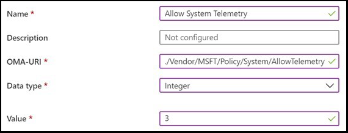

# Install Windows 10 Team 2020 Update Preview Build 

The latest update of the Surface Hub operating system, **Windows 10 Team 2020 Update**, is now available at no additional cost for the Surface Hub 50-inch and Surface Hub 2S 55-inch devices from the [Windows Insider Program](https://insider.windows.com). The Surface Hub 84-inch model will be supported in the final release of Windows 10 Team 2020 Update.

Windows 10 Team 2020 Update brings major improvements to device deployment and manageability along with the latest Windows 10 features. To learn more about what's new, see the following blog post: [New Surface Hub OS update released for public preview.](https://techcommunity.microsoft.com/t5/surface-it-pro-blog/new-surface-hub-os-update-released-for-public-preview/ba-p/1534823) For known issues, refer to the "Known issues" section below.
 
## Prerequisites

- Register with the [Windows Insider Program](https://insider.windows.com/).
- Download the Windows 10 Team 2020 Update Preview Build from the Windows Insider Program Fast Channel.
- After you install the Preview build, download the required firmware updates. Note: Firmware updates cannot be uninstalled even if you decide to leave the Windows Insider Program.

## Prepare your Surface Hub

Before you begin, check that your Surface Hub has the latest updates from Windows Update and make sure you save the BitLocker key associated with your device.

**To manually check for updates:**

1. On Surface Hub, open **Settings** and enter your admin credentials when prompted.
2. Navigate to **Update & Security** > **Windows Update** and then select **Check for updates**.

For more information, see [Manage Windows updates on Surface Hub](https://docs.microsoft.com/surface-hub/manage-windows-updates-for-surface-hub).

**To manually save your BitLocker key:**

1. Insert a USB drive into Surface Hub.
2. On Surface Hub, open **Settings** and enter your admin credentials when prompted.
3. Navigate to **Update & Security** > **Recovery**.
4. Under **BitLocker**, select **Save**. The BitLocker key is saved to a text file on the USB drive.

For more information, see [Save your BitLocker key](https://docs.microsoft.com/surface-hub/save-bitlocker-key-surface-hub).
 
## Install the Windows 10 Team 2020 Update Preview Build

1. On Surface Hub, open **Settings** and enter your admin credentials when prompted.
2. Navigate to **Privacy > Diagnostics & feedback** and set Diagnostic data to **Full**. Some regions or organizations may need to apply this setting via MDM policy or PPKG file:
   - **For MDM:** Set the following policy: .**/Vendor/MSFT/Policy/System/AllowTelemetry** with the integer value of 3:
    
        

    - **For PPKG:** Download the [PPKG file](https://aka.ms/HubTltmtry).

3. Navigate to **Update & Security** > **Windows Insider Program** and then select **Get started** to enroll.
4. Follow the prompts to register as a Windows Insider using either your work account (recommended) or your personal Microsoft account. For details on the benefits of registering with your work account, see [Register for the Windows Insider Program for Business](https://docs.microsoft.com/windows-insider/at-work-pro/wip-4-biz-register).
5. Under **Pick your Insider settings**, select **Fast**.
6. Allow the Surface Hub to automatically install the Preview Build and the required firmware updates over the next 3 to 4 days. The device will automatically download and install the updates during daily [maintenance windows](https://docs.microsoft.com/surface-hub/manage-windows-updates-for-surface-hub#maintenance-window). For example:

- During the first maintenance window, Surface Hub starts downloading the Preview Build from Windows Update.
- During a second maintenance window, the device restarts to complete the update.
- During a third maintenance window, the device downloads and installs the required firmware updates.

> [!IMPORTANT]
> Microsoft recommends reserving the Surface Hub for 3-4 days to allow the device to finish installing the Preview Build and the required firmware updates. You may experience graphics, audio, and user interface issues if you use the device during this process.

### If you choose to manually install the Preview Build and required firmware updates:

1. After you've registered with the Windows Insider Program, go to **Settings** > **Update & Security** > **Windows Update** and select **Check for updates** to install the Preview Build.
2. Once the Preview Build installs (it may take up to 14 hours), select **Restart now** to complete the installation.
3. After the device restarts, go to **Settings** > **Update & Security** > **Windows Update**, and select **Check for updates to install required firmware updates**.
4. Once the firmware installs, select **Restart now**.

> [!WARNING]
> You may see graphics, audio, and user interface issues if you install the Preview Build without installing the required firmware updates.

> [!NOTE]
> If you choose to leave the Windows Insider Program and revert your Surface Hub to an older version of the operating system, you must first [reset your device](https://docs.microsoft.com/surface-hub/device-reset-surface-hub). Afterwards, you will need to go through the [first run program](https://docs.microsoft.com/surface-hub/first-run-program-surface-hub) to re-configure your device.
 

## Learn more

- [Known issues: Windows 10 Team 2020 Update](surface-hub-2020-team-update-known-issues.md)
- [New Surface Hub OS update released for public preview.](https://techcommunity.microsoft.com/t5/surface-it-pro-blog/new-surface-hub-os-update-released-for-public-preview/ba-p/1534823)
- [Getting started with the Windows Insider Program for Business](https://docs.microsoft.com/windows-insider/at-work-pro/wip-4-biz-manage)