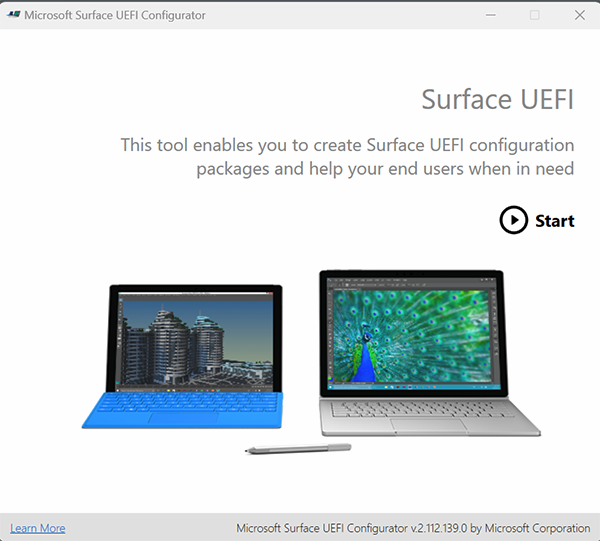
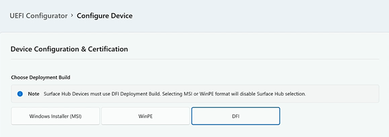
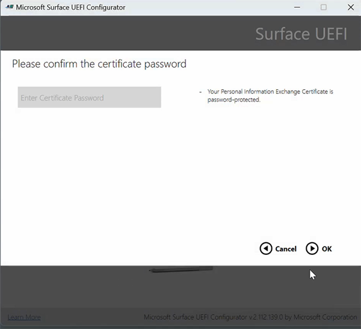
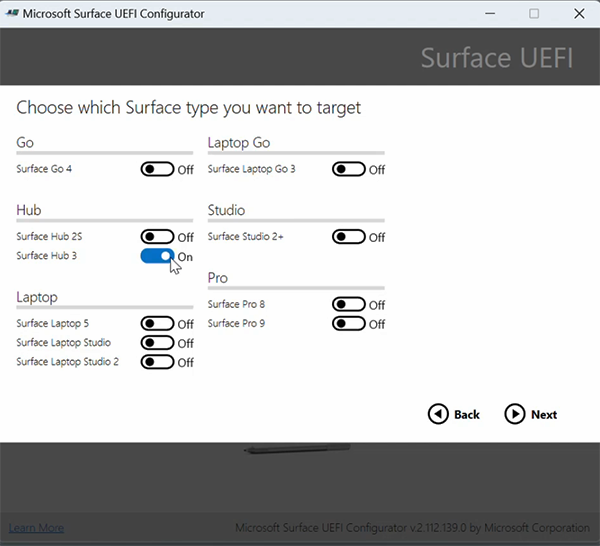
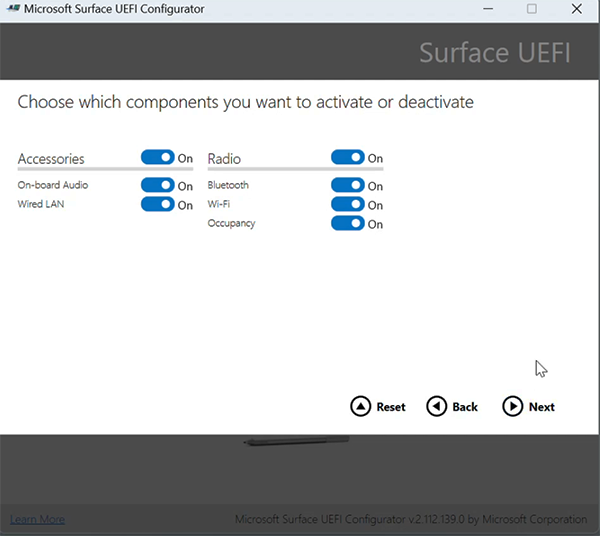
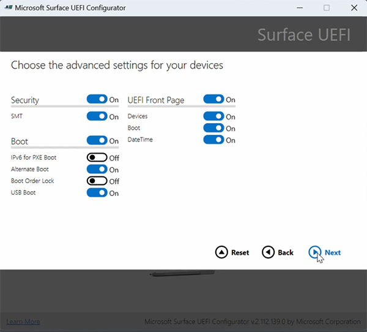
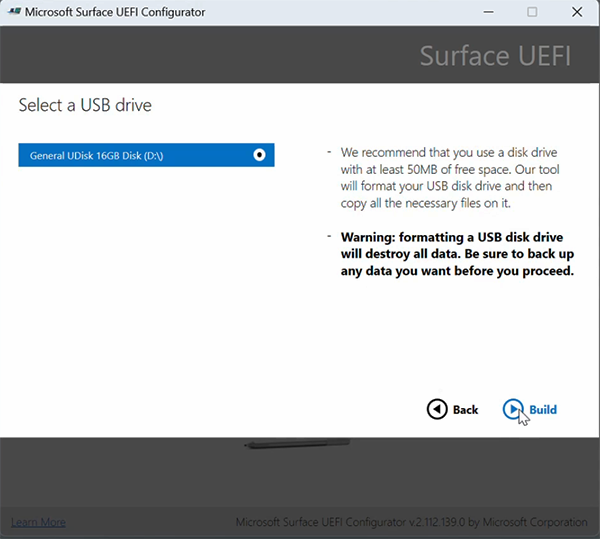
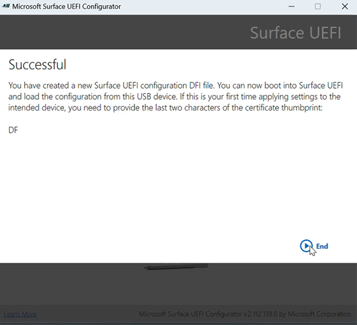

# Secure and manage Surface Hub with SEMM

You can use [Microsoft Surface Enterprise Management Mode](/surface/surface-enterprise-management-mode) (SEMM) to manage UEFI settings on one or more Surface Hub devices. Use the Microsoft Surface UEFI Configurator to control the following components:

- On-board Audio
- Wired LAN
- Bluetooth
- Wi-Fi
- Occupancy sensor

Use the Microsoft Surface UEFI Configurator to turn on or off the following UEFI settings:

**Security**

- SMT (Simultaneous Multi-Threading)

**Boot**

- IPv6 for PXE Boot
- Alternate Boot
- Boot Order Lock
- USB Boot

**UEFI Front Page**

- Devices
- Boot
- Date/Time

> [!TIP]
> To learn more about the security implications of configuring SEMM settings, see [Manage UEFI settings with SEMM](/surface-hub/surface-hub-3-security#manage-uefi-settings-with-semm)

## Create UEFI configuration image

Unlike other Surface devices, you cannot use an MSI file or a Win PE image to apply these settings on Surface Hub. Instead, you need to create a USB image to load into the device. To create a Surface Hub UEFI configuration image, download and install the latest version of the Microsoft Surface UEFI Configurator from [Surface Tools for IT](https://www.microsoft.com/download/details.aspx?id=46703).

## To configure UEFI on Surface Hub

1. Open **UEFI Configurator** and select **Start**.

    

2. Select **Configuration Package** > **DFI**.

    

3. Add your organizational Personal Information Exchange (PFE) certificate.

> [!NOTE]
> This article assumes that you either obtain certificates from a third-party provider or already have expertise in PKI certificate services and know how to create your own. See [Certificate Services Architecture](/windows/win32/seccrypto/certificate-services-architecture) documentation to learn more.

4. Enter the certificate’s private key’s password.

    

5. After importing the private key, you have the option of setting a UEFI password, a recommended security best practice.

    

6. Choose **Surface Hub 2S** or **Surface Hub 3** as the target for the UEFI configuration package.

    

7. Choose the components that you want to activate or deactivate and select **Next**.

   

8. Choose the advanced settings that you wish to configure and select **Next**.

   .

9. Connect a USB drive and select **Build** to export the file.

    

10. Upon successful creation of the package, the Configurator displays the last two characters of your certificate's thumbprint. You need these characters when you import the configuration to Surface Hub 3.

    

## Apply SEMM package to Surface Hub 2S or Surface Hub 3

To apply the package and enroll a Surface Hub into SEMM, insert the USB drive into the USB-A port and boot directly into the UEFI menu.

1. Turn off Surface Hub. Press and hold the **Volume up** button and press the **Power** Button. Keep holding the **Volume up** button until the UEFI menu appears.

## Learn more

- [Surface Hub 3 security best practices](surface-hub-3-security.md)