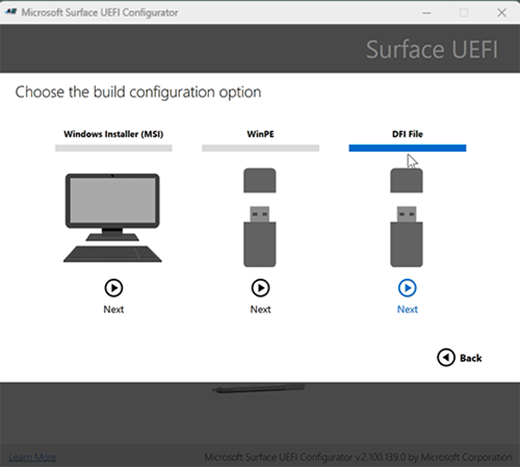
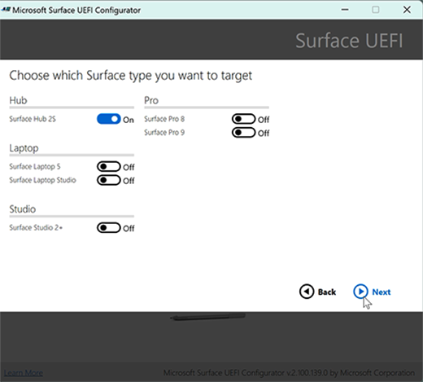

# Secure and manage Surface Hub with SEMM

You can use Surface Enterprise Management Mode (SEMM) to manage UEFI settings on one or more Surface Hub devices. Use the Microsoft Surface UEFI Configurator to control the following components:

- Wired LAN
- Cameras
- Bluetooth
- Wi-Fi
- Occupancy sensor

Use the Microsoft Surface UEFI Configurator to turn on or off the following UEFI settings:

- Boot

  - IPv6 for PXE Boot
  - Alternate Boot
  - Boot Order Lock
  - USB Boot
- UEFI Front Page

  - Devices
  - Boot
  - Date/Time

## Create UEFI configuration image

Unlike other Surface devices, you cannot use an MSI file or a Win PE image to apply these settings on Surface Hub. Instead, you need to create a USB image to load into the device. To create a Surface Hub UEFI configuration image, download and install the latest version of the Microsoft Surface UEFI Configurator from the [Surface Tools for IT](https://www.microsoft.com/download/details.aspx?id=46703) page in the Microsoft Download Center. For more information about using UEFI and SEMM, see [Microsoft Surface Enterprise Management Mode](/surface/surface-enterprise-management-mode).

## To configure UEFI on Surface Hub

1. Start the UEFI Configurator and on the first screen, choose **Configuration Package**.  
    
2. Select **DFI File** as the build configuration option. 
  
1. To add the certificate to your package, you must have a valid certificate with the private key in a .pfx file format to sign and protect the package. Select **+ Certificate Protection.**  
   
1. Enter the certificate’s private key’s password. 
   
1. After importing the private key, continue creating the package. 
   
1. Choose **Surface Hub 2S** or **Surface Hub 3** as the target for the UEFI configuration package. 
   
1. Choose the components and settings you want to activate or deactivate on Surface Hub. 
   
1. Use the USB option to export the file. 
   
1. Insert and choose the USB drive you’d like to use for this package. The USB drive will be formatted and you lose any information you have on it. 
   
1. Upon successful creation of the package, the Configurator will display the last two characters of your certificate’s thumbprint. You need these characters when you import to the configuration to Surface Hub. 
  

## To boot into UEFI

Turn off Surface Hub. Press and hold the **Volume Up** button and press the **Power** Button. Keep holding the Volume Up button until the UEFI menu appears.
