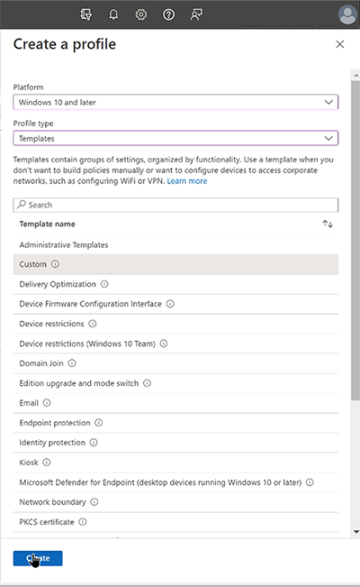
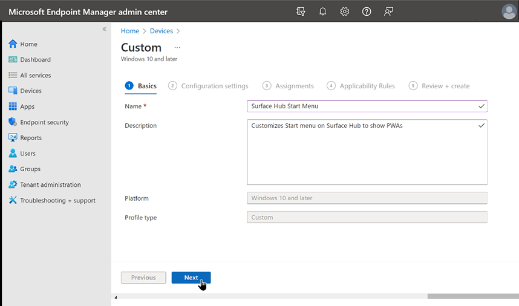

# Configure Surface Hub Start menu

Surface Hub ships with a default Start menu that admins can modify with specific apps to meet organizational requirements. For example, you can install Progressive Web Apps and include them in the Start menu for quick user access at the start of every Hub session.

## Overview

The Surface Hub Start menu is rendered from a [simple XML file](#default-surface-hub-start-layout-xml) that includes App ID values (AppUserModelID) for default applications such as Microsoft PowerPoint, Word, and Excel. You can replace the default values with the AppUserModelID associated with the apps you wish to display. You deploy the modified Start menu XML file to targeted Surface Hubs via a mobile device management (MDM) provider such as Microsoft Intune.

When you apply a customized Start menu layout to Surface Hub, users cannot pin, unpin, or uninstall apps from Start.

### Differences between Surface Hub and desktop Start menu

There are a few key differences between Start menu customization for Surface Hub and a Windows 10 desktop:

- You cannot use **[DesktopApplicationTile](/windows/configuration/start-layout-xml-desktop#startdesktopapplicationtile)** in your Start layout XML because Windows desktop applications (Win32) are not supported on Surface Hub.
- You cannot use the Start layout XML to configure the taskbar or the Welcome screen for Surface Hub.
- The Start layout policy should be assigned only to devices, not users.
- The OMA-URI setting to use in the policy is `./Device/Vendor/MSFT/Policy/Config/Start/StartLayout`
- Surface Hub supports a maximum of 6 columns (6 1x1 tiles). However, you **must** define GroupCellWidth=8 even though Surface Hub will only display tiles in columns 0-5, not columns 6 and 7.
- Surface Hub supports a maximum of 6 rows (6 1x1 tiles)
- `SecondaryTile`, used for links, will open the link in Microsoft Edge.

## Modify the default Surface Hub Start menu

1. On a separate PC, copy the [default Surface Hub Start menu XML](#default-surface-hub-start-layout-xml) into a text editor.
2. Search for **AppUserModelID** values of the apps you wish to remove. Replace with the AppUserModelIDs for the apps you want to include.

### Example

This example removes PowerPoint, Word, and Excel from the Start menu and adds the following Progressive Web Apps:

| **App** | **AppUserModelID**                          |
| ------- | ------------------------------------------- |
| Zoom    | zoom.us-F576B427_j0dtdqw38r40m!App          |
| WebEx   | signin.webex.com-8846C236_2aab1d9x9fqba!App |
| YouTube | www.youtube.com-756BE99A_pd8mbgmqs65xy!App  |

3. See [Appendix A](#appendix-a-extract-appusermodelids-from-installed-apps) for instructions on obtaining the AppUserModelID for other apps installed on Surface Hub.
4. Save the modified Start menu XML locally and [follow the instructions below](#to-apply-a-customized-start-menu-to-surface-hub) to deploy it to targeted Surface Hubs.

### Default Surface Hub Start layout XML

```xml
<LayoutModificationTemplate Version="1" xmlns="http://schemas.microsoft.com/Start/2014/LayoutModification">
  <LayoutOptions StartTileGroupCellWidth="8" />
  <DefaultLayoutOverride>
    <StartLayoutCollection>
      <defaultlayout:StartLayout GroupCellWidth="8" xmlns:defaultlayout="http://schemas.microsoft.com/Start/2014/FullDefaultLayout">
        <start:Group Name="" xmlns:start="http://schemas.microsoft.com/Start/2014/StartLayout">
        <start:DesktopApplicationTile
            DesktopApplicationID="MSEdge"
            Size="2x2"
            Row="0"
            Column="0"/>
        <start:Tile
            AppUserModelID="Microsoft.Getstarted_8wekyb3d8bbwe!App"
            Size="4x2"
            Row="0"
            Column="2"/>
        <start:Tile
            AppUserModelID="Microsoft.Office.PowerPoint_8wekyb3d8bbwe!Microsoft.pptim"
            Size="2x2"
            Row="2"
            Column="0"/>
        <start:Tile
            AppUserModelID="Microsoft.Office.Word_8wekyb3d8bbwe!Microsoft.Word"
            Size="2x2"
            Row="2"
            Column="2"/>
        <start:Tile
            AppUserModelID="Microsoft.Office.Excel_8wekyb3d8bbwe!Microsoft.Excel"
            Size="2x2"
            Row="2"
            Column="4"/>
        <start:Tile
            AppUserModelID="c5e2524a-ea46-4f67-841f-6a9465d9d515_cw5n1h2txyewy!App"
            Size="2x2"
            Row="4"
            Column="0"/>
        <start:Tile
            AppUserModelID="microsoft.microsoftskydrive_8wekyb3d8bbwe!App"
            Size="2x2"
            Row="4"
            Column="2"/>
        <start:Tile
            AppUserModelID="Microsoft.MicrosoftPowerBIForWindows_8wekyb3d8bbwe!Microsoft.MicrosoftPowerBIForWindows"
            Size="2x2"
            Row="4"
            Column="4"/>
        </start:Group>
      </defaultlayout:StartLayout>
    </StartLayoutCollection>
  </DefaultLayoutOverride>
</LayoutModificationTemplate>
```

### Surface Hub Start layout XML modified for Progressive Web Apps

The following modified Start layout XML includes PWAs for Zoom, WebEx, and YouTube.

```xml
<LayoutModificationTemplate Version="1" xmlns="http://schemas.microsoft.com/Start/2014/LayoutModification">
  <LayoutOptions StartTileGroupCellWidth="8" />
  <DefaultLayoutOverride>
    <StartLayoutCollection>
      <defaultlayout:StartLayout GroupCellWidth="8" xmlns:defaultlayout="http://schemas.microsoft.com/Start/2014/FullDefaultLayout">
        <start:Group Name="" xmlns:start="http://schemas.microsoft.com/Start/2014/StartLayout">
        <start:DesktopApplicationTile
            DesktopApplicationID="MSEdge"
            Size="2x2"
            Row="0"
            Column="0"/>
        <start:Tile
            AppUserModelID="zoom.us-F576B427_j0dtdqw38r40m!App"
            Size="4x2"
            Row="0"
            Column="2"/>
        <start:Tile
            AppUserModelID="signin.webex.com-8846C236_2aab1d9x9fqba!App"
            Size="2x2"
            Row="2"
            Column="0"/>
        <start:Tile
            AppUserModelID="www.youtube.com-756BE99A_pd8mbgmqs65xy!App"
            Size="2x2"
            Row="2"
            Column="2"/>
        <start:Tile
            AppUserModelID="Microsoft.Office.Excel_8wekyb3d8bbwe!Microsoft.Excel"
            Size="2x2"
            Row="2"
            Column="4"/>
        <start:Tile
            AppUserModelID="c5e2524a-ea46-4f67-841f-6a9465d9d515_cw5n1h2txyewy!App"
            Size="2x2"
            Row="4"
            Column="0"/>
        <start:Tile
            AppUserModelID="microsoft.microsoftskydrive_8wekyb3d8bbwe!App"
            Size="2x2"
            Row="4"
            Column="2"/>
        <start:Tile
            AppUserModelID="Microsoft.MicrosoftPowerBIForWindows_8wekyb3d8bbwe!Microsoft.MicrosoftPowerBIForWindows"
            Size="2x2"
            Row="4"
            Column="4"/>
        </start:Group>
      </defaultlayout:StartLayout>
    </StartLayoutCollection>
  </DefaultLayoutOverride>
</LayoutModificationTemplate>
```

## To apply a customized Start menu to Surface Hub

1. Sign in to the Intune portal at [**Microsoft Endpoint Manager admin center**](https://endpoint.microsoft.com/).
2. Go to **Devices** > **Configuration** **Policies** > **Create profile**.
3. Under Platform, select **Windows 10 and later**. Under Profile type, select **Templates**. Under Template name, select **Custom** and choose **Create**.

   

5. Name the profile, enter an optional description, and select **Next**.

  

6. On the configuration settings page, select **Add.** Enter a name and optional description.
7. For OMA-URI, enter the following string:
`./Device/Vendor/MSFT/Policy/Config/Start/StartLayout`

> [!TIP]
> The Configuration profile **must** be assigned to devices and targeted to the device URI. Do not use: ./User/Vendor/MSFT/Policy/Config/Start/StartLayout.
  
  

8. For Data type, select **String (XML file) and** open your modified Start layout XML file. Select **Save** and then click **Next**.
   
  
9. On the Assignments page, under **Included groups**, select **Add groups**.
10. Under **Select groups to include**, enter the name of a group containing the Surface Hubs you wish to target, choose **Select**, and then click **Next**. To learn more about assigning a Configuration profile to a group, see [Add groups to organize users and devices](/mem/intune/fundamentals/groups-add).

  

11. On the Applicability Rules page, enter optional criteria if desired. Otherwise, select **Next**.
12. Review the Configuration profile and select **Create**.

    

13. To apply te Configuration profile immediately, select **Devices** > **All devices** and find the Surface Hub you targeted. Open its Overview pane, and select **Sync**.

   
   
14. Once applied, you will see the customized Start menu on your Surface Hub.

## Appendix A: Extract AppUserModelIDs from installed apps

To obtain the AppUserModelID of apps installed on Surface Hub:

1. Sign in to Surface Hub as an admin, open **Settings**, and select **Update & Security**.
2. Select Logs. Insert a USB drive, then select **Collect logs.**
3. On a separate PC, open the USB drive and unzip the Log folder.
4. In the Registry folder, open **HKLM_SOFTWARE_Microsoft.txt**.
5. Search for the **ApplicationUserModelId** associated with the app you want to include in the Start menu.

  

## Appendix B: Start layout with Microsoft Edge link


This example shows a link to a website and a .pdf file. The secondary tile for Microsoft Edge uses a 150 x 150-pixel icon.

```xml
<LayoutModificationTemplate Version="1" xmlns="http://schemas.microsoft.com/Start/2014/LayoutModification">
  <LayoutOptions StartTileGroupCellWidth="8" />
  <DefaultLayoutOverride>
    <StartLayoutCollection>
      <defaultlayout:StartLayout GroupCellWidth="8" xmlns:defaultlayout="http://schemas.microsoft.com/Start/2014/FullDefaultLayout">
        <start:Group Name="" xmlns:start="http://schemas.microsoft.com/Start/2014/StartLayout">
    <start:Tile
              AppUserModelID="Microsoft.Office.PowerPoint_8wekyb3d8bbwe!Microsoft.pptim"
              Size="2x2"
              Row="0"
              Column="0"/>
          <start:Tile
              AppUserModelID="Microsoft.Office.Word_8wekyb3d8bbwe!Microsoft.Word"
              Size="2x2"
              Row="0"
              Column="2"/>
          <start:Tile
              AppUserModelID="Microsoft.Office.Excel_8wekyb3d8bbwe!Microsoft.Excel"
              Size="2x2"
              Row="0"
              Column="4"/>
          <start:DesktopApplicationTile
              DesktopApplicationID="MSEdge"
              Size="2x2"
              Row="2"
              Column="0"/>
    <start:Tile
              AppUserModelID="microsoft.microsoftskydrive_8wekyb3d8bbwe!App"
              Size="2x2" 
             Row="2"
             Column="2"/>   
  <start:SecondaryTile
            AppUserModelID="Microsoft.MicrosoftEdge_8wekyb3d8bbwe!MicrosoftEdge"
           TileID="2678823080"
           DisplayName="Bing"
           Arguments="https://www.bing.com/"
           Square150x150LogoUri="ms-appx:///"
           Wide310x150LogoUri="ms-appx:///"
           ShowNameOnSquare150x150Logo="true"
           ShowNameOnWide310x150Logo="false"
           BackgroundColor="#ffe9e7e7"
           ForegroundText="dark"
           Size="2x2"
           Column="4"
           Row="2"  />
    <start:Tile
              AppUserModelID="Microsoft.Windows.Photos_8wekyb3d8bbwe!App"
              Size="2x2"
              Row="4"
              Column="0"/>
    <start:SecondaryTile
             AppUserModelID="Microsoft.MicrosoftEdge_8wekyb3d8bbwe!MicrosoftEdge"
             TileID="6153963000"
             DisplayName="cstrtqbiology.pdf"
             Arguments="-contentTile -formatVersion 0x00000003 -pinnedTimeLow 0x45b7376e -pinnedTimeHigh 0x01d2356c -securityFlags 0x00000000 -tileType 0x00000000 -url 0x0000003a https://www.ada.gov/regs2010/2010ADAStandards/Guidance_2010ADAStandards.pdf"
             Square150x150LogoUri="ms-appx:///Assets/MicrosoftEdgeSquare150x150.png"
             Wide310x150LogoUri="ms-appx:///" 
             ShowNameOnSquare150x150Logo="true"
             ShowNameOnWide310x150Logo="false"
             BackgroundColor="#ff4e4248"
             Size="4x2" 
             Row="4"
             Column="2"/>
        </start:Group>
      </defaultlayout:StartLayout>
    </StartLayoutCollection>
  </DefaultLayoutOverride>
</LayoutModificationTemplate>
```

>[!NOTE]
>The default value for `ForegroundText` is light; you don't need to include `ForegroundText` in your XML unless you're changing the value to dark.
