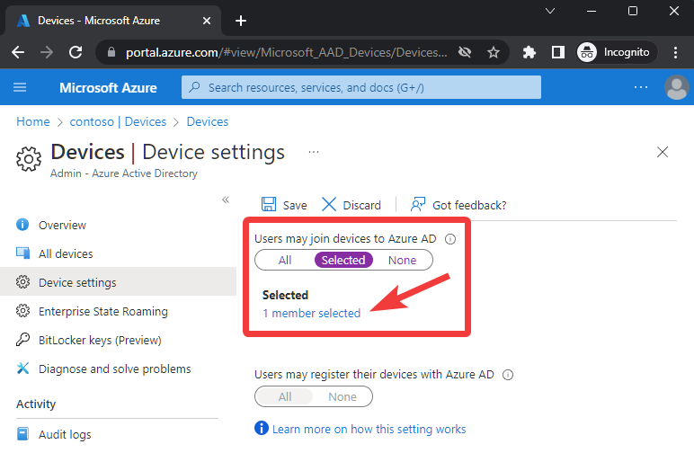
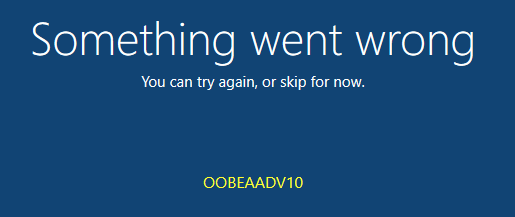

# Troubleshoot Azure AD Join on Surface Hub

If you can't join Surface Hub to Azure AD during the first run Out of Box Experience (OOBE), follow the troubleshooting guidance on this page.

## Azure AD permissions

A common reason a user cannot join a device to Azure AD is related to Azure AD permissions. To confirm which users can join devices to Azure AD:

- Go to the [Azure AD portal](https://portal.azure.com/#view/Microsoft_AAD_IAM/ActiveDirectoryMenuBlade/%7E/Overview) and select **Devices > Device settings**. Ensure "Users may join devices to Azure AD" is set to **All** or **Selected**. For Selected users, confirm the account used to join Azure AD is included in the assigned group.

## Maximum number of devices

Errors can also occur if the user exceeds the maximum number of devices allowed to join to Azure AD. If a user reaches this limit, they can't add more devices until one or more existing devices are removed. The default value is 50 devices and can be increased to 100 within [Azure AD](/azure/active-directory/devices/device-management-azure-portal#configure-device-settings).

## Unable to reach Azure AD

If error OOBEAADV10 is shown, the Surface Hub cannot reach the necessary Microsoft 365 endpoints. If encountered, follow the below troubleshooting steps in order.

| **Step** | **Troubleshooting Step**                                                                                                                  | **Purpose**                                                                                                                                                  | **Additional Information**                                                                                                                                                                                                                                                                                                                                                                                                                                                                                                                                                                                              |
| -------- | ----------------------------------------------------------------------------------------------------------------------------------------- | ------------------------------------------------------------------------------------------------------------------------------------------------------------ | ----------------------------------------------------------------------------------------------------------------------------------------------------------------------------------------------------------------------------------------------------------------------------------------------------------------------------------------------------------------------------------------------------------------------------------------------------------------------------------------------------------------------------------------------------------------------------------------------------------------------- |
| 1        | If your organization uses a proxy, ensure the proxy settings and required certificates are installed on the Surface Hub.          | Allows Surface Hub to reach necessary Microsoft endpoints to Azure AD join the device.                                                                       | To configure proxy settings on a Surface Hub during OOBE, a [provisioning package](/surface-hub/provisioning-packages-for-surface-hub) needs to be created and [installed](/surface-hub/provisioning-packages-for-surface-hub#apply-a-provisioning-package-to-surface-hub). If a certificate is required, refer to the instructions included in [Create provisioning packages for Surface Hub](/surface-hub/provisioning-packages-for-surface-hub#add-a-certificate-to-your-package). |
| 2        | Connect Surface Hub to a less restrictive network, such as a different VLAN, guest network or mobile Wi-Fi hotspot.                       | Using a less restrictive network may resolve the connectivity issue.                                                                               |                                                                                                                                                                                                                                                                                                                                                                                                                                                                                    |
| 3        | Mirror network port the Surface Hub is using to capture and log network traffic. Analyze logs to determine if something is being blocked. | Third-party network packet capture software can't be installed natively on the Surface Hub. Mirroring the network port allows for this data to be captured. | Visit [Office 365 URLs and IP address ranges](/microsoft-365/enterprise/urls-and-ip-address-ranges) for a detailed list of Microsoft endpoints that should be reachable.                                                                                                                                                                                                                                                                                                                                                                                           |
