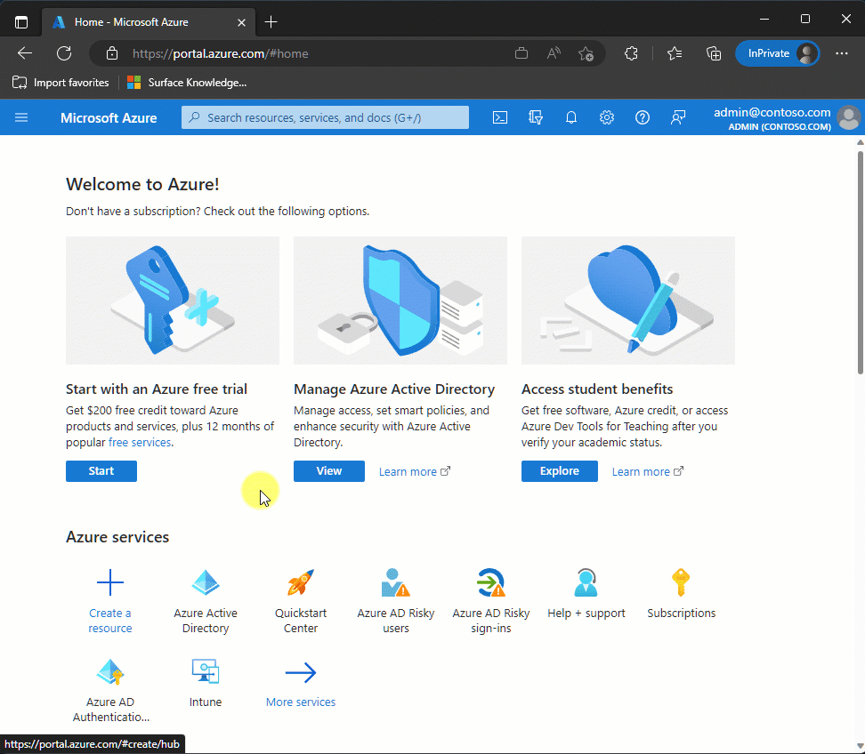
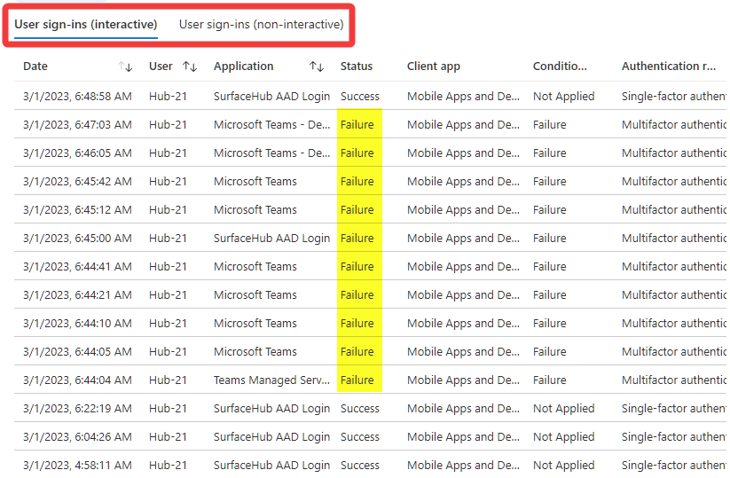
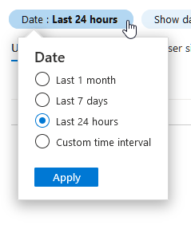
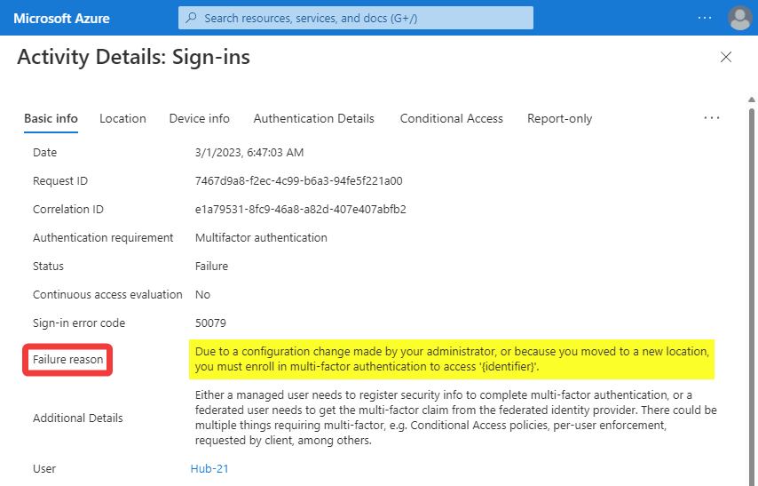
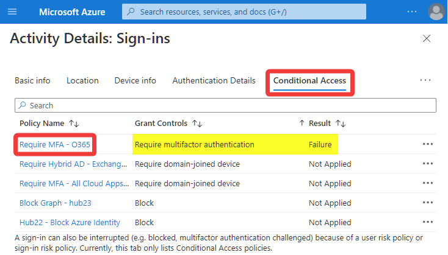

# Troubleshoot Azure Sign-in Logs for Surface Hub

## What are Azure sign-in logs? ##
Azure [sign-in logs](/azure/active-directory/reports-monitoring/concept-sign-ins) provide information on successful and failed sign-in attempts that occur within an Azure AD tenant. The Azure sign-in logs provide a detailed view of all sign-in activities for an account. When sign-in issues are encountered on the Surface Hub, an IT administrator can review these logs to see if any interrupts or failures are seen. Common reasons these logs are helpful for troubleshooting Surface Hub issues include:

- Unable to add the device account to the Surface Hub
- Device account no longer syncing with Exchange Online
- Teams Rooms client not signing in
- Users unable to personally sign into the device
 
If you're experiencing sign-in issues with the Surface Hub device account or personal user sign-in, follow the troubleshooting steps on this page.
 
## View sign-in logs ##
To access the Azure sign-ins log for a tenant, a user must have the necessary [role](azure/active-directory/reports-monitoring/concept-all-sign-ins#how-do-you-access-the-sign-in-logs) assigned.

1. Sign into the [Azure portal](https://portal.azure.com/)
2. Go to **Azure Active Directory** > **Users**
3. Locate or search for the account you're troubleshooting and select it.
4. Select **Sign-in logs**
5. If the below banner is displayed, select **Try out our new sign-ins preview** link.

>[!NOTE]
>It may take 5-10 minutes for the sign-in logs to propagate to Azure.

## Analyze sign-in logs ##
Scroll through both the interactive and non-interactive sign-ins noting the **Status** column. If any failures or interrupts are seen, select the sign-in for additional details. You can optionally [filter the sign-in logs](/azure/active-directory/reports-monitoring/concept-all-sign-ins#filter-the-results) by status to only show Failures and Interrupts.
 

If analyzing sign-in activity older than 24 hours, extend the timeframe by selecting the Date field.

## Additional sign-in details ##
After selecting the sign-in attempt the activity details pane shows the reason for the failure or interrupt. In this example, the failure is caused by multi-factor authentication (MFA), which the Surface Hub device account doesn't support.
 

Selecting the Conditional Access tab reveals the policy that is enforcing MFA on the device account.

Follow the guidance on [Conditional Access for Surface Hub](conditional_access_for_surface_hub.md) to better understand the requirements for Surface Hub and how to [exclude](conditional_access_for_surface_hub.md#exclude-device-account-from-unsupported-conditional-access-policies) the device account from unsupported policies.
 
Additional details on how to view and analyze the sign-in logs can be found on the [Sign-in logs in Azure Active Directory (preview)](azure/active-directory/reports-monitoring/concept-all-sign-ins) page.

