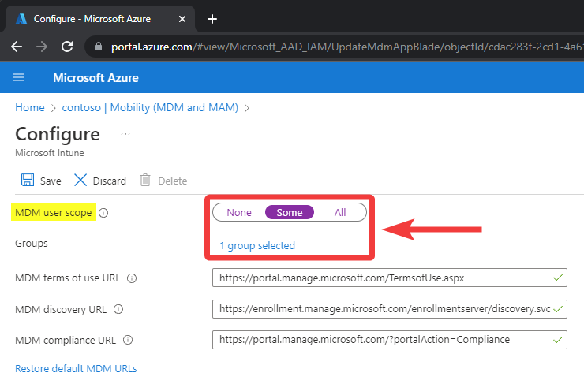
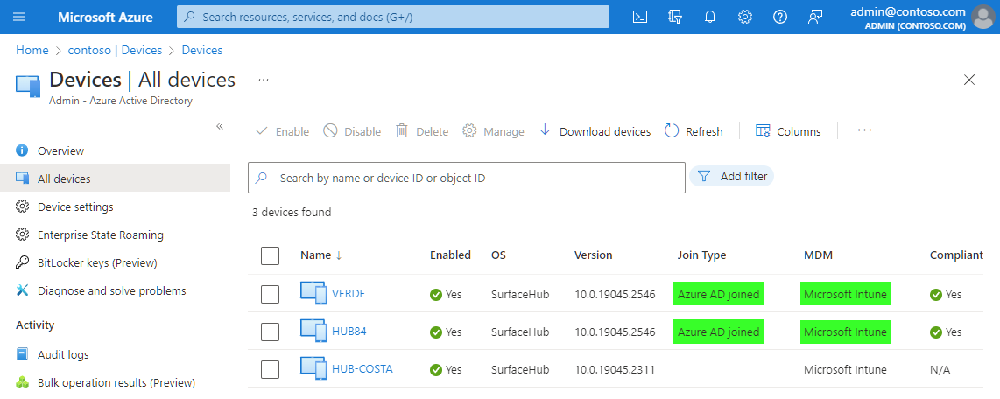

# Troubleshoot Intune Auto Enrollment on Surface Hub

Azure AD joining with Intune auto enrollment allows the Surface Hub to enroll into Intune without any additional steps. Doing this also allows the Surface Hub to be configured with the [non Global admin policy](https://learn.microsoft.com/en-us/surface-hub/surface-hub-2s-nonglobal-admin) and for the device to be marked as "compliant" for use with user based Conditional Access policies.
 
## Verify Surface Hub was Auto Enrolled into Intune

We can verify the Surface Hub was successfully auto enrolled into Intune by navigating to the Devices page within the Azure AD portal. 
 
Locate the Surface Hub device and note the Join Type and MDM values. If Join Type is "Azure AD joined" and MDM is "Microsoft Intune" the device was successfully auto enrolled into Intune. If either of these show something different then this, the Surface Hub was not auto enrolled into Intune.

**Microsoft Azure > Devices > All Devices**

## Check MDM User Scope

If Intune auto enrollment isn't occurring that likely means the account used to Azure AD join was not scoped correctly to auto enroll. We can verify this by opening the Azure AD portal and navigating to the Mobility (MDM and MAM) configuration page. 
 
MDM user scope defines the accounts capable of Intune auto enrollment. Ensure the account being used to Azure AD join the Surface Hub is included in the MDM user scope group. Otherwise, devices will not be auto enrolled into Intune during the Azure AD join process.

**Microsoft Azure > Mobility (MDM and MAM) > Microsoft Intune > MDM User Scope**

