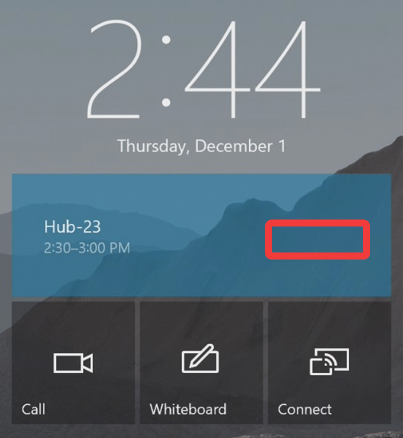
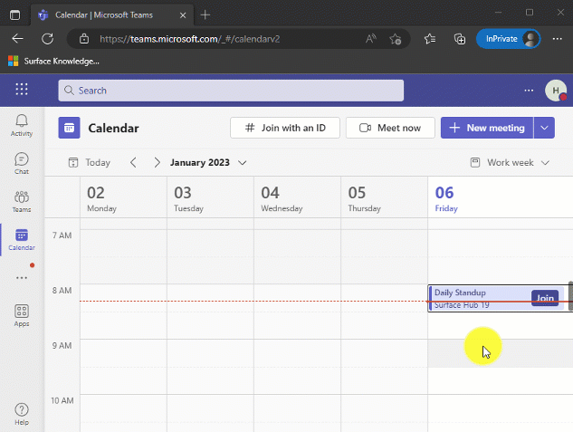
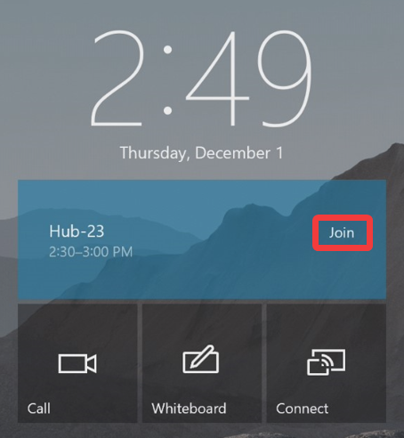

# Troubleshoot One-click Join from the Welcome Screen calendar

When a user invites the Surface Hub to a Teams or Skype for Business meeting, the invitation should appear on the Welcome Screen with a Join button. Tapping the invitation allows the user to join the meeting with one click. If the Join button is missing from the invitation, follow the troubleshooting steps on this page.

  

## How Welcome Screen calendar works

The Welcome Screen calendar parses the meeting join URL from the invitation comments and uses it to join the meeting. If the meeting join URL isn't present in the comments of the invite, the Surface Hub doesn't display the join button.

> [!NOTE]  
> If the Surface Hub is invited to a Cisco WebEx or Zoom meeting, the Welcome Screen calendar won't display the join button.

## Analyze meeting invitation comments

The most common reason you won't see the join button is if the device account’s Exchange properties are incorrect, causing Exchange to delete the meeting join URL from the invitation comments. This happens if the device account [Exchange property](/surface-hub/exchange-properties-for-surface-hub-device-accounts) **DeleteComments** is set to **True**. You can confirm if this is happening via the following steps:

1. Open a web browser and navigate to [teams.microsoft.com](https://teams.microsoft.com/).
2. Sign in with the Surface Hub device account credentials.
3. Open the calendar and locate the Teams meeting that failed to display the join button on the Welcome Screen calendar.
4. Select the meeting and press the expand icon.
5. Below meeting info verify if the Teams meeting join URL is present or not. If missing, follow the [PowerShell](/surface-hub/troubleshoot-one-click-join-from-welcome-screen-calendar?branch=pr-en-us-1251#get-and-set-deletecomments-value) commands below to check the value of DeleteComments.
6. If the Teams meeting URL is present, analyze the hyperlink to ensure it begins with "https://teams.microsoft.com" and doesn't redirect to a different site. If redirected, the Surface Hub may not understand the URL and therefore not display a join button. [Safe Links](/microsoft-365/security/office-365-security/safe-links-about) rewritten URLs, or any other third-party link scanning service isn't compatible with One-click join. Set up a [Safe Links policy](/microsoft-365/security/office-365-security/safe-links-policies-configure) to exclude the Surface Hub device account from this feature.

  

## Get and set DeleteComments value

PowerShell can be used to verify the current value of DeleteComments, and change it if needed. For Surface Hub to display the join button, DeleteComments must be set to False.

 1. Connect to Exchange Online PowerShell.

 ```PowerShell
 Connect-ExchangeOnline
 ```

 2. This example gets the current value of DeleteComments for account ConferenceRoom01@contoso.com.

 ```PowerShell
 Get-CalendarProcessing -Identity "ConferenceRoom01"  | Select DeleteComments
 ```

 3. If DeleteComments is set to True, change it to False with this command.

 ```PowerShell
 Set-CalendarProcessing -Identity "ConferenceRoom01" -DeleteComments $false
 ```

 After making this change invite the Surface Hub to a new Teams meeting, where the join button should be displayed and allow you to join.

  
