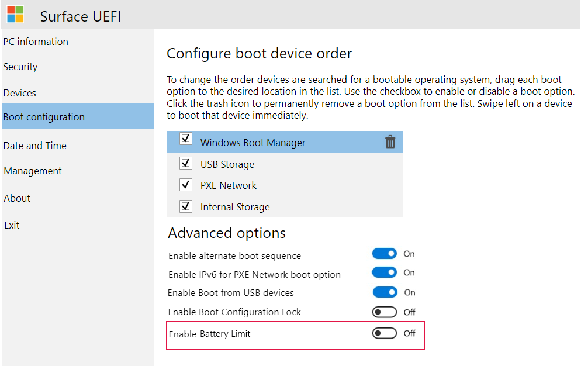
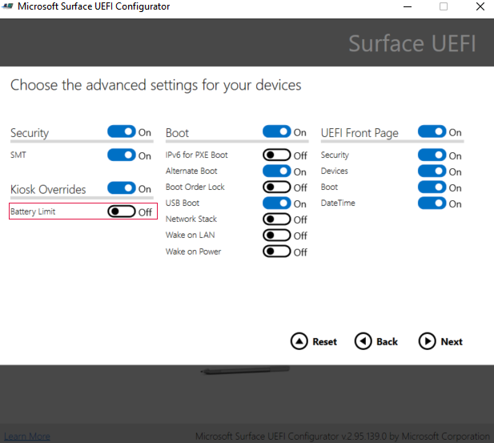

# Battery Limit setting

The Battery Limit option is a UEFI setting that changes how the Surface device battery is charged and may prolong its longevity. This setting is recommended for devices continuously connected to power such as kiosk scenarios.

## How Battery Limit works

Setting the device on Battery Limit changes the protocol for charging the device battery. When Battery Limit is enabled, the battery charge will be limited to 50% of its maximum capacity. The charge level reported in Windows will reflect this limit. Therefore, it will show that the battery is charged up to 50% and won't charge beyond  this limit. If you enable Battery Limit while the device is above 50% charge, the Battery icon shows the device is plugged in but discharging until the device reaches 50% of its maximum charge capacity.  

## Supported devices

The Battery Limit UEFI setting is built into Surface devices by default including:

- Surface Pro 7 and later
- Surface Laptop 3 and later
- Surface Book 3
- Surface Laptop Studio
- Surface Laptop Go
- Surface Laptop Go 2
- Surface Laptop SE
- Surface Go and later

## Enabling Battery Limit in Surface UEFI (Surface Pro 4 and later)

The Surface UEFI Battery Limit setting can be configured by booting into Surface UEFI (**Power + Vol Up** when turning on the device). Choose **boot configuration**, and then, under **Advanced Options**, toggle **Enable Battery Limit Mode** to **On**.  

## Enable battery limit on Surface Go (all generations)

The Surface Battery Limit setting can be configured by booting into Surface UEFI (**Power + Vol Up** when turning on the device). Choose **boot configuration**, and then, under **Kiosk Mode**, move the slider to the right to set Battery Limit to **Enabled**.  

## Enable Battery Limit using Surface Enterprise Management Mode (SEMM) o

The Surface UEFI battery limit is also available for configuration via the following methods:

- Surface Pro 4 and later
  - [Microsoft Surface UEFI Configurator](surface-enterprise-management-mode.md)  
    - Surface UEFI Manager PowerShell scripts (SEMM_Powershell.zip) in the [Surface Tools for IT downloads](https://www.microsoft.com/download/details.aspx?id=46703)

### Use Microsoft Surface UEFI Configurator

To configure Battery Limit mode, set the **Kiosk Overrides** setting on the **Advanced Settings** configuration page in SEMM (Surface Pro 4 and later).

### Using Surface UEFI Manager PowerShell scripts

The battery limit feature is controlled via the following setting:  

`407 = Battery Profile`

**Description**:  Active management scheme for battery usage pattern

**Default**:  `0`

Configure setting to `1` to enable Battery Limit.
