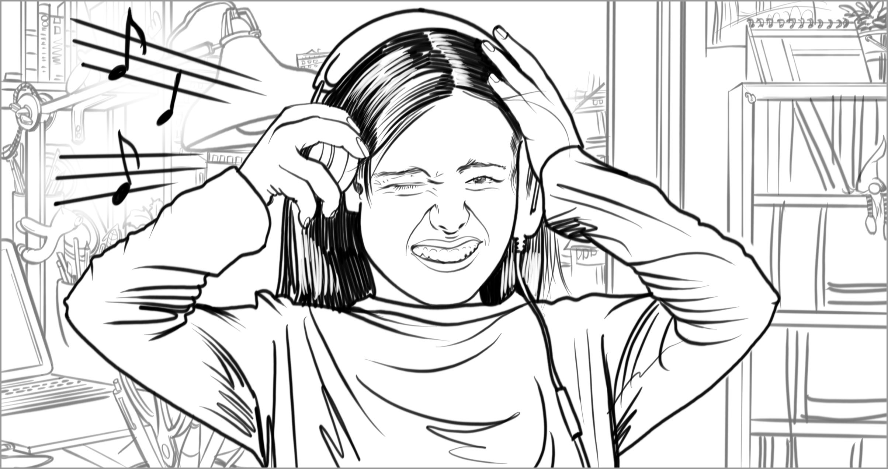

# Hearing loss (asymmetrical)

**Hearing loss that is greater in one ear than the other.**

Degrees of hearing loss don’t always occur equally in both ears. Someone may be deaf in one ear or have an ear infection on one side that causes temporary diminished hearing. Someone with asymmetrical hearing loss may benefit from the ability to increase the volume coming from the right side of their device, without having to increase volume coming from the left. Adjusting overall volume to compensate for hearing loss in one ear may be too loud or irritating for the other ear. Versatility in volume control for those with asymmetrical hearing ability, or any other disability, is important when designing for inclusivity.

Hearing symmetry differences can be caused by permanent conditions or by temporary conditions such as an ear infection or an injured eardrum.

## Barriers
* Experiences that require sound to be heard from both sides of the body in order to complete tasks (such as video games where shooting noises only come from the left ear of a headphone without a visual indicator of where shots are coming from)

## Facilitators
* Support for unilateral volume adjustment (such as turning volume up to compensate for hearing loss on one side without being too loud on the unaffected side)​
* Using alternate output methods as a means of conveying information (such as visual, tactile, haptic)

## Examples

BARRIER — A person with asymmetric hearing loss may need to increase the volume. The output on one side of their headphones may become too loud for the other side to be just right. 

FACILITATOR — The ability to adjust audio output on the left and right side of the device, separately, allows a person to choose what is most comfortable for them. 

[comment]: # (Footer statement)
___
The purpose of this reference is to provide concepts people can use to document and discuss aspects of function. Design should happen with people with disabilities, this reference is meant to support that activity, not replace it. 