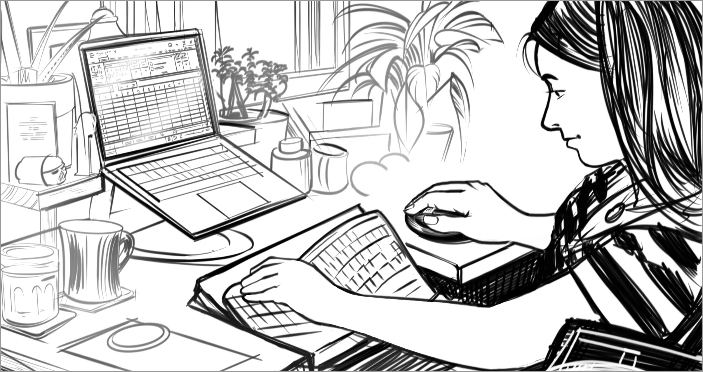

# Chronic pain

**Pain that persists or progresses over a long period of time.**

Chronic pain is persistent and can last months to years. It often negatively impacts daily life and enjoyment. Chronic pain can affect any part of the body, causing a person to limit or avoid activities, movements, or postures that increase pain. If a device doesn’t offer options for interaction, it may cause physical discomfort. For example, if someone with arthritic hands uses the standard Xbox controller, the repetitive button presses may cause pain. But if they use the Xbox Adaptive Controller, they can choose button arrays that make their gameplay more comfortable. People may be excluded from device use if they don’t have alternate ways to access a computer—such as support for ergonomic keyboards, enlarged mice, or switch buttons that eliminate clicking motions.

Chronic pain can be caused by conditions that affect the nerves such as carpal tunnel syndrome, sciatica, phantom limb pain, and many other conditions.

## Barriers
* Experiences that require prolonged or repetitive movements to complete a task (such as video game play, typing)​
* Experiences that require a person to maintain a certain posture during use (such as sitting upright at a computer screen to use a mouse and keyboard)

## Facilitators

* Support for alternate input methods that don’t elicit pain (such as compatible ergonomic mice or compatible assistive technology hardware)​
* Support for hands-free interaction with products (such as voice commands, dictation)​
* Support for accessible mounting hardware that allows a person to use a device in the position of their choice

## Examples

BARRIER — Typing on a flat surface like a laptop keyboard may be bothersome for someone with chronic hand pain. 

FACILITATOR — The ability to use any external hardware, such as ergonomic keyboards or mice, allows users to choose what is most comfortable for them. 

[comment]: # (Footer statement)
___
The purpose of this reference is to provide concepts people can use to document and discuss aspects of function. Design should happen with people with disabilities, this reference is meant to support that activity, not replace it. 