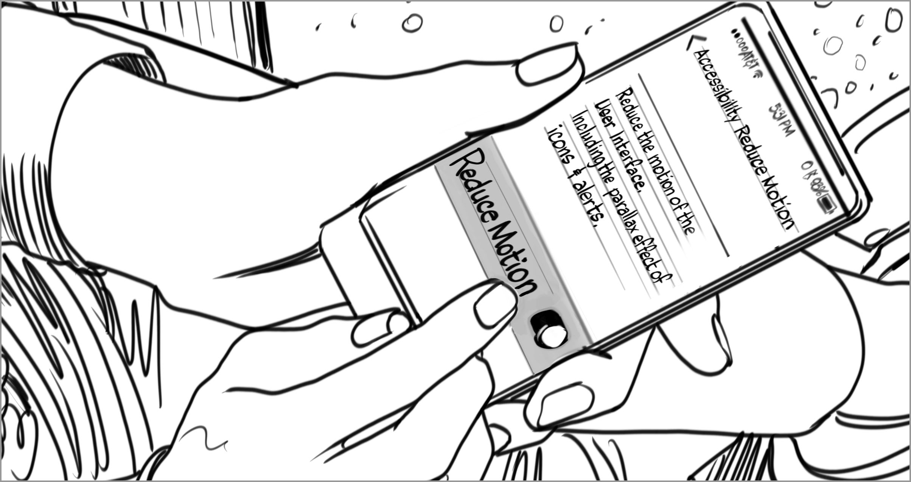

# Vestibular

**A sensory system that informs our sense of balance and orientation in our environment.**

Our vestibular system provides us with information about our sense of balance and where we are in relation to our environment. When someone has a situational or permanent condition that impacts their vestibular system, they may experience dizziness, nausea, and imbalance. Dizziness and imbalance can prevent someone from using a device. Screens and displays can also elicit dizziness and imbalance in a person with vestibular sensitivity. Intensity of lighting or brightness alone can cause discomfort, but often the movement or flickering of content on a screen can cause disturbances in someone’s vestibular system. Actions that require rotation of the head or rapid eye movements can also elicit negative experiences or cause exclusion. In some instances, noise cancellation headphones can cause nausea and dizziness in users—potentially due to the ways in which cancellation vibrations affect the inner ear.

Vestibular sensitivity can be affected by things like ear infection, congestion and headache, or long-term conditions like vertigo, Meniere’s disease, or permanent damage to the inner ear.

## Barriers
* Experiences that elicit responses of the vestibular system (such as Virtual Reality headsets, noise cancellation technology, or moving screen content such as videos and video game play)​
* Flashing lights or onscreen flickers​
* Displays with slow pixel repopulation rates that may be detected as “flickers” for someone with a hypersensitive vestibular system

## Facilitators
* Ability to turn off functions that may elicit negative responses (for example, turning off noise cancellation features of a headset, but still using it for audio)​
* Ability to eliminate flashes or flickering on screen​
* Ability to turn off animations and moving objects (such as when it’s possible to hide scroll bars, or eliminate screen transitions)

## Examples

BARRIER — Motion of objects across a screen may be undetectable to some, while causing extreme dizziness or sickness to others. 

FACILITATOR — The ability to reduce the motion of objects across a screen can enhance the usability and safety of an experience. 

[comment]: # (Footer statement)
___
The purpose of this reference is to provide concepts people can use to document and discuss aspects of function. Design should happen with people with disabilities, this reference is meant to support that activity, not replace it. 