# Secure Surface Dock ports with Surface Enterprise Management Mode (SEMM)

SEMM for Dock enables IT admins to secure and manage ports on Surface Dock 2 or Surface Thunderbolt 4 Dock by configuring UEFI settings in a Windows Installer configuration package (.msi file) deployed to compatible Surface devices across a corporate environment.

## Supported devices

Managing Surface Dock 2 or Surface Thunderbolt 4 Dock with SEMM is available for docks connected to Surface Laptop Studio (all generations), Surface Laptop 6, Surface Laptop 5, Surface Laptop 4, Surface Laptop 3, Surface Laptop Go (all generations), Surface Pro 10, Surface Pro 9, Surface Pro 9 with 5G, Surface Pro 8, Surface Pro 7+, Surface Pro 7, Surface Pro X, and Surface Book 3. 

> [!TIP]
> These compatible Surface devices are commonly referred to as **host devices**. A package is applied to host devices based on whether a host device is **Authenticated** or **Unauthenticated**. Configured settings reside in the UEFI layer on host devices, enabling IT admins to manage compatible Surface Docks like any other built-in peripheral, such as the camera.

## Scenarios

Restricting Surface Dock 2 or Surface Thunderbolt 4 Dock to authorized persons signed into a corporate host device provides another layer of data protection. This ability to lock down Surface Docks is critical for specific customers in highly secure environments who want the functionality and productivity benefits of the dock while maintaining compliance with strict security protocols. SEMM used with Surface Dock 2 or Surface Thunderbolt 4 Dock is helpful in open offices and shared spaces, especially for customers who want to lock USB ports for security reasons. 

- **Granular USB-C Disablement.** Managing USB-C ports with their support for DisplayPort and USB Power Delivery provides more options beyond turning off all functionality. For example, you can prevent data connectivity to stop users from copying data from USB storage but retain the ability to extend displays and charge the device via a USB-C dock. Beginning with Surface Pro 8, Surface Laptop Studio, and Surface Go 3, these options are now available via the SEMM PowerShell scripts.

- **Dynamic USB-C Disablement.** Dynamic USB-C Disablement enables customers operating in highly secure work environments to prevent USB theft of confidential data and provide more control to organizations. When paired with the Surface Thunderbolt 4 Dock, IT admins can lock down USB-C ports whenever an eligible Surface device is undocked or connected to an unauthorized dock. 

> [!TIP]
> This feature is available on Surface Pro 10, Surface Laptop 6, and Surface Laptop Studio 2. 

With Dynamic USB-C Disablement when users are connected to an authorized dock in the office, the USB-C ports will have full functionality over their devices. However, when they go off-site, they can still connect to a dock to use accessories or a monitor but cannot use the USB ports to transfer data. 

As described in the following sections, Managing USB-C ports for these scenarios involves the following tasks:  

- Provision (aka enroll) your host devices and Surface dock into SEMM via an .msi package generated by UEFI Configurator. 
- Create a separate .msi package containing the UEFI policy settings for "Authenticated" and "Unauthenticated" devices. 
- Configure Granular USB-C Disablement or Dynamic USB-C Disablement via Powershell scripts following the instructions in [Manage USB ports on Surface devices](manage-usb-ports-on-surface.md) and [Use Microsoft Configuration Manager to manage devices with SEMM](use-system-center-configuration-manager-to-manage-devices-with-semm.md). 

## Configuring and deploying UEFI settings for Surface Docks

This section provides step-by-step guidance for the following tasks:

1. Install **Surface UEFI Configurator** from [Surface Tools for IT](https://www.microsoft.com/download/details.aspx?id=46703).
1. Create or obtain public key certificates.
1. Create an .msi configuration package.
   1. Add your certificates.
   1. Enter the 16-digit RN number for your Surface Dock 2 or Surface Thunderbolt 4 Dock devices.
   1. Configure UEFI settings.
1. Build and apply the configuration package to targeted Surface devices.

>[!IMPORTANT]
>The **Random Number (RN)** is a unique 16-digit hex code identifier provisioned at the factory and printed in small type on the dock's underside. The RN differs from most serial numbers because it can't be read electronically. This ensures proof of ownership is established only by reading the RN when physically accessing the device. The RN may also be obtained during the purchase transaction and is recorded in Microsoft inventory systems.

### Install SEMM and Surface UEFI Configurator

Install SEMM by running Surface UEFI Configurator:

- For Intel/AMD devices, download: **SurfaceUEFI_Configurator_v2.105.139.0_x64.msi** 
- For ARM devices, download: **SurfaceUEFI_Configurator_v2.105.139.0_x86.msi**

UEFI Configurator is available via a standalone installer and contains everything you need to create and distribute configuration packages for Surface Dock 2 or Surface Thunderbolt 4 Dock.

- Download **Surface UEFI Configurator** from [Surface Tools for IT](https://www.microsoft.com/download/details.aspx?id=46703).

## Create public key certificates

This section provides specifications for creating the certificates needed to manage ports for Surface Dock 2 or Surface Thunderbolt 4 Dock.

### Prerequisites

This article assumes that you either obtain certificates from a third-party provider or already have expertise in PKI certificate services and know how to create your own. You should be familiar with and follow the general recommendations for creating certificates as described in [Surface Enterprise Management Mode (SEMM)](surface-enterprise-management-mode.md) documentation, with one exception. The certificates documented on this page require expiration terms of 30 years for the **Dock Certificate Authority** and 20 years for the **Host Authentication Certificate**.

For more information, see [Certificate Services Architecture](/windows/win32/seccrypto/certificate-services-architecture) documentation and review the appropriate chapters in [Windows Server 2019 Inside Out](https://www.microsoftpressstore.com/store/windows-server-2019-inside-out-9780135492277), or [Windows Server 2008 PKI and Certificate Security](https://www.microsoftpressstore.com/store/windows-server-2008-pki-and-certificate-security-9780735640788) available from Microsoft Press.

### Root and host certificate requirements

Before creating the configuration package, you need to prepare public key certificates that authenticate ownership of Surface Dock 2 or Surface Thunderbolt 4 Dock and facilitate any subsequent changes in ownership during the device lifecycle. The host and provisioning certificates require entering EKU IDs, otherwise known as **Client Authentication Enhanced Key Usage (EKU) object identifiers (OIDs)**.

The required EKU values are listed in Table 1 and Table 2.

> [!CAUTION]
> Keep certificates in a safe location and ensure they're properly backed up. Without them it's impossible to reset Surface UEFI, change managed Surface UEFI settings, or remove SEMM from an enrolled Surface device.

#### Table 1. Root and Dock Certificate requirements

|Certificate|Algorithm|Description|Expiration|EKU OID|
|---|---|---|---|---|
|Root Certificate Authority|ECDSA_P384|- Root certificate with 384-bit prime Elliptic Curve Digital Signature Algorithm (ECDSA) - Secure Hash Algorithm (SHA) 256 Key Usage: CERT_DIGITAL_SIGNATURE_KEY_USAGE - CERT_KEY_CERT_SIGN_KEY_USAGE CERT_CRL_SIGN_KEY_USAGE|30 years|N/A
|Dock Certificate Authority|ECC P256 curve|- Host certificate with 256-bit Elliptic Curve Cryptography (ECC) - SHA 256 Key Usage: CERT_KEY_CERT_SIGN_KEY_USAGE - Path Length Constraint = 0|20 years|1.3.6.1.4.1.311.76.9.21.2 1.3.6.1.4.1.311.76.9.21.3|

   >[!NOTE]
   >The dock CA must be exported as a .p7b file.

### Provisioning Administration Certificate requirements

Each host device must have the doc CA and two certificates, as shown in Table 2.

#### Table 2. Provisioning administration certificate requirements

|Certificate|Algorithm|Description|EKU OID|
|---|---|---|---|
|Host authentication certificate|ECC P256 SHA 256|Proves the identity of the host device.|1.3.6.1.4.1.311.76.9.21.2|
|Provisioning administration certificate|ECC P256 SHA256|Enables you to change dock ownership or policy settings by allowing you to replace the current CA installed on the dock.|1.3.6.1.4.1.311.76.9.21.3 1.3.6.1.4.1.311.76.9.21.4|

   >[!NOTE]
   >The host authentication and provisioning certificates must be exported as .pfx files.

### Create a dock provisioning package

When you've obtained or created the certificates, you can build the .msi provisioning package that will be applied to target devices.

1. Run Surface **UEFI Configurator**.

   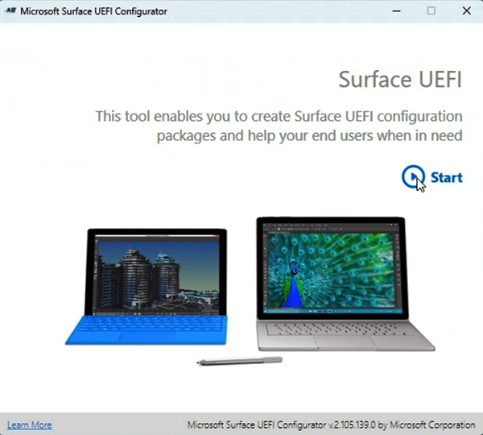

2. Select **Surface Dock**.

   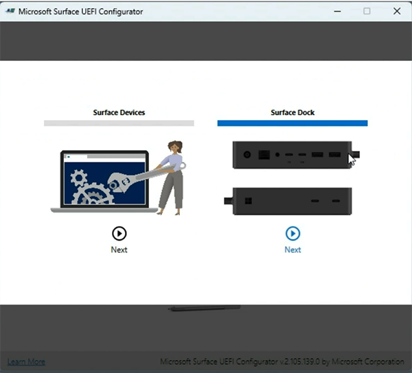

3. Select your Surface Dock device. 

   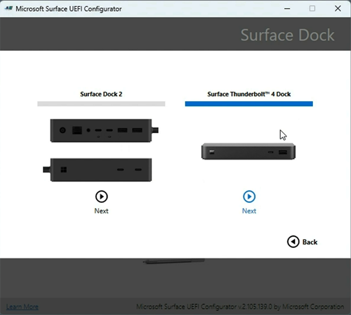

4. Choose **Provisioning** and select **Next**.

   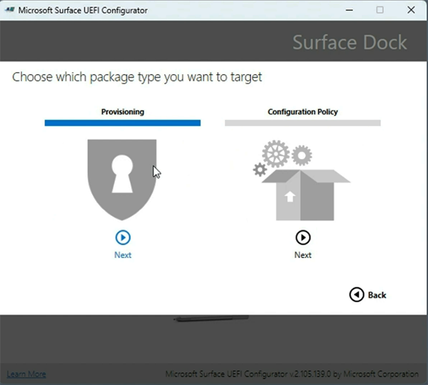

5. Choose how you want to provision Surface Dock and select **Next:**
  - **Organizational Unit**, designed for corporate-wide use.
  - **Departmental Unit**, designed for more granular settings configuration; for example, a department handling highly sensitive information.

    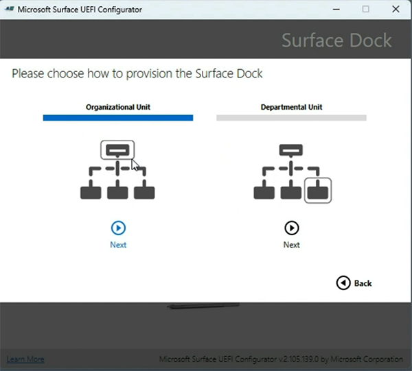   

6. Import your certificate authority and certificate files and enter the password for each file. This example shows organizational provisioning.

    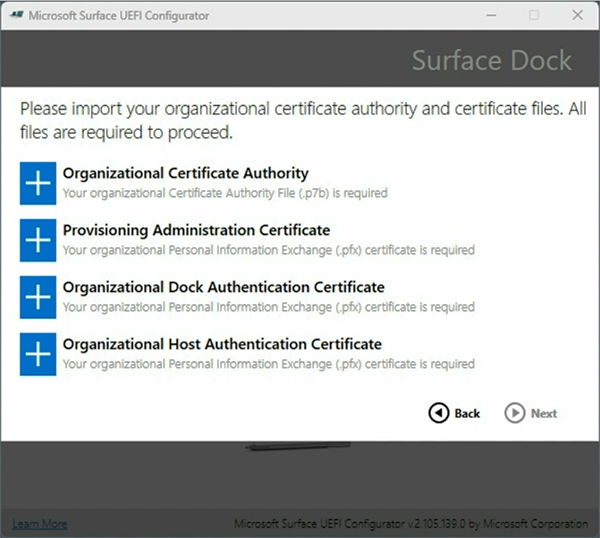 

7. When you finish adding the certificates, select **Next**.

    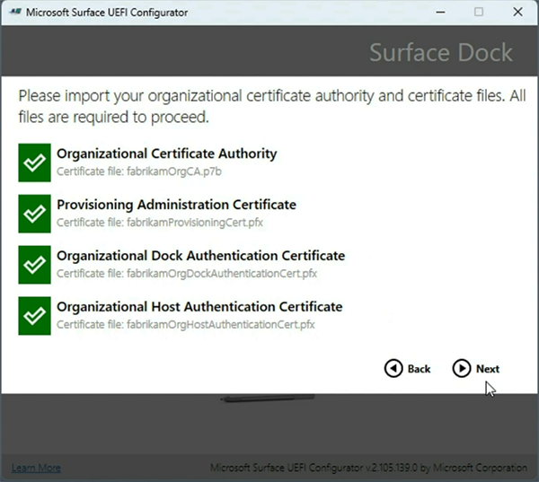 

8. Add the Surface Dock ID numbers associated with the docks you intend to manage. For multiple docks, enter the numbers in a .csv file without a header, meaning the first line of the file should not contain column names or descriptions.

    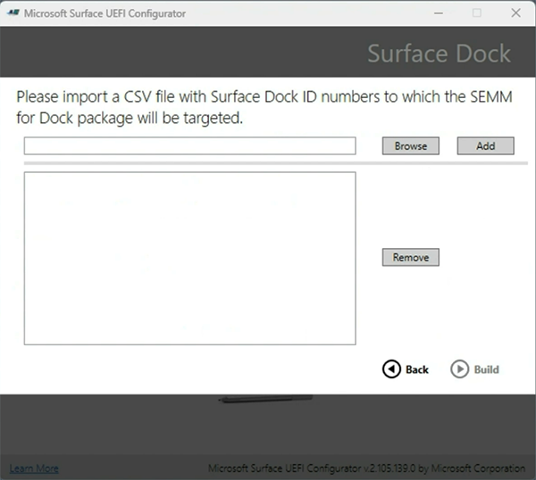. 

9. After the import, select **Build** and save the resulting .msi provisioning package.

    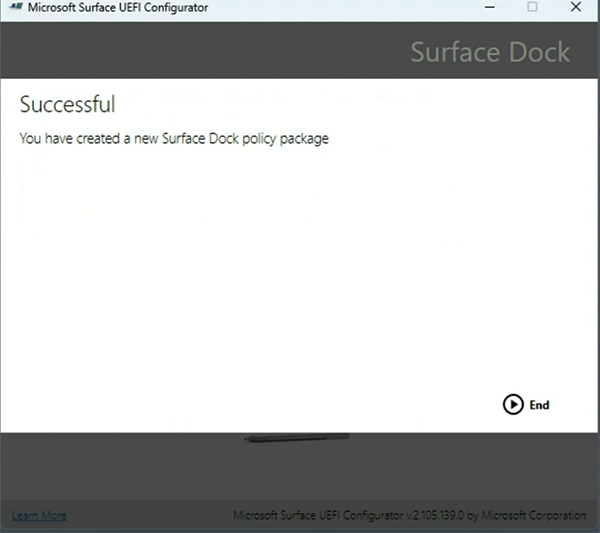. 

### Apply the provisioning package to a Surface Dock 

1. Take the .msi file that the Surface UEFI Configurator generated and install it on a Surface host device.
1. Connect the host device to Surface Dock 2 or Surface Thunderbolt 4 Dock. When you connect the dock, UEFI policy settings are applied.

## Configure UEFI policy settings for target devices

Now, you can specify policy settings for USB data, Ethernet, and Audio ports. UEFI Configurator lets you configure policy settings for authenticated users (Authenticated Policy) and unauthenticated users (Unauthenticated Policy). 

1. Open **UEFI Configurator** and select **Start > Surface Dock > Surface Dock 2** or **Surface Thunderbolt 4 Dock**.  
1. Select **Configuration Policy > Next**.

    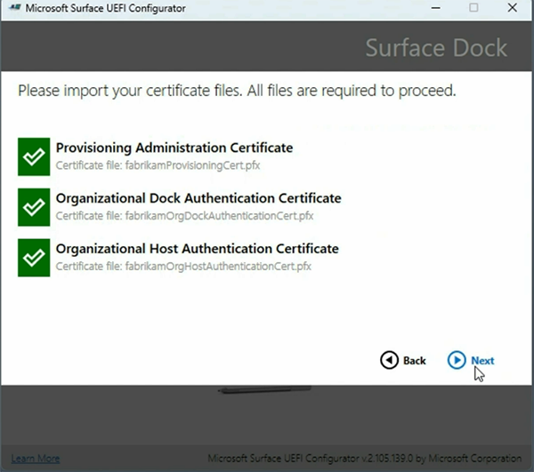

1. Choose the intended use -- **Organizational Unit** or **Departmental Unit** -- and select **Next.**
1. Import your certificate files and select **Next.** 
1. Import your .csv file containing the Surface Dock ID numbers associated with the docks you intend to manage and select **Next**.
1. Choose which components you want to activate or deactivate. The following figure shows port access turned on for authenticated users and turned off for unauthenticated users.

   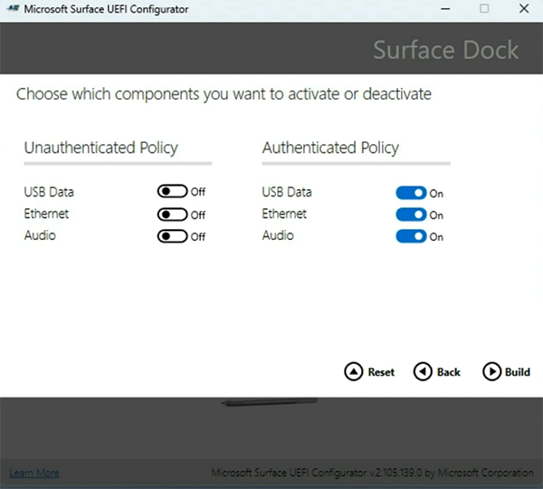

   - **Authenticated Policy** refers to a Surface Device with the appropriate certificates installed, as configured in the .msi configuration package you applied to target devices. 
   - **Unauthenticated Policy** refers to any other device.
   - Select **Reset** to create a special "Reset" package to remove any previous configuration package applied to the managed dock.

1. Select **Build** to create the package.

### Apply the configuration package to a Surface Dock 

1. Take the .msi file that the Surface UEFI Configurator generated and install it on a Surface host device. 
1. Connect the host device to Surface Dock 2 or Surface Thunderbolt 4 Dock. When you connect the dock, UEFI policy settings are applied.

## Verify managed state using the Surface App

Once you've applied the configuration package, you can quickly verify the resultant policy state of the dock directly from the Surface App, installed by default on all Surface devices. If the Surface App isn't on the device, you can download and install it from the Microsoft Store.

### Test scenario

Objective: Configure policy settings to allow port access by authenticated users only.

1. Turn on all ports for authenticated users and turn them off for unauthenticated users.

   

1. Apply the configuration package to your target device and connect the dock.

1. Open **Surface App** and select **Surface Dock** to view the resultant policy state of your Surface Dock. If the policy settings are applied, Surface App (shown here for Surface Thunderbolt 4 Dock and Surface Dock 2) indicates that ports are available.

   

   

1. Now, you need to verify that the policy settings have successfully turned off all ports for unauthenticated users. Connect Surface Dock 2 or Surface Thunderbolt 4 Dock to an unmanaged device, for example, any Surface device outside the scope of management for the configuration package you created.

1. Open **Surface App** and select **Surface Dock**. The resultant policy state (shown here for Surface Thunderbolt 4 Dock and Surface Dock 2) indicates that ports are turned off. 

   

   

>[!TIP]
>If you want to keep ownership of the device but allow all users full access, you can make a new package with everything turned on. If you wish to completely remove the restrictions and ownership of the device (make it unmanaged), select **Reset** in Surface UEFI Configurator to create a package to apply to target devices.

Congratulations. You have successfully managed Surface Dock ports on targeted host devices.

## Learn more

- [Manage USB ports on Surface devices](manage-usb-ports-on-surface.md) 
- [Surface Enterprise Management Mode (SEMM) documentation](surface-enterprise-management-mode.md)
- [Certificate Services Architecture](/windows/win32/seccrypto/certificate-services-architecture)
- [Windows Server 2019 Inside Out](https://www.microsoftpressstore.com/store/windows-server-2019-inside-out-9780135492277)
- [Windows Server 2008 PKI and Certificate Security](https://www.microsoftpressstore.com/store/windows-server-2008-pki-and-certificate-security-9780735640788)
- For a video demo, check out [SEMM for Surface Dock 2](https://youtu.be/VLV19ISvq_s)

