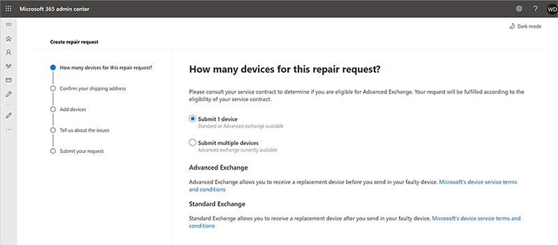
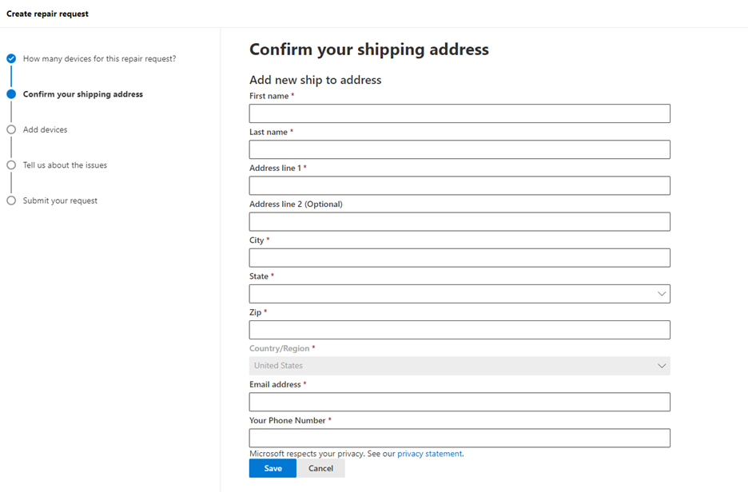
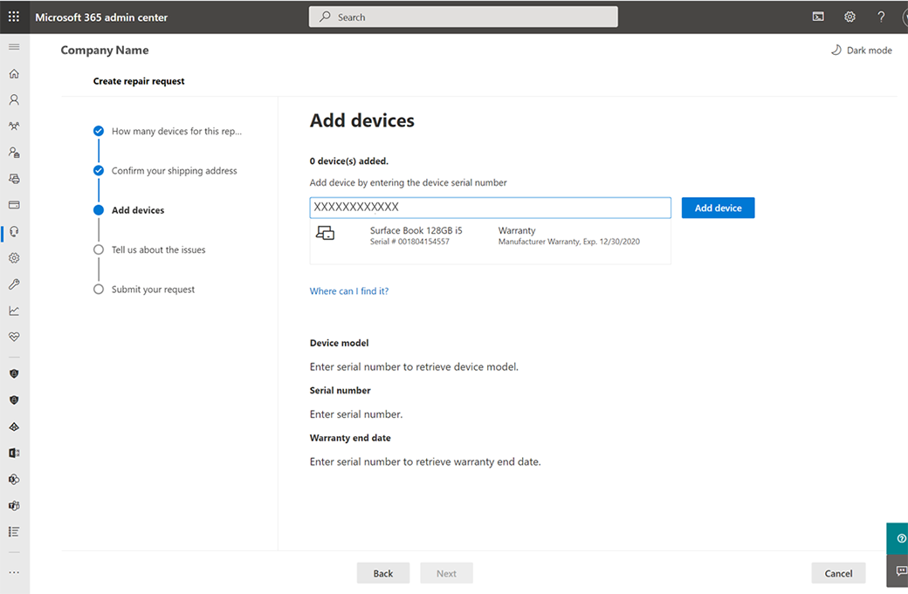
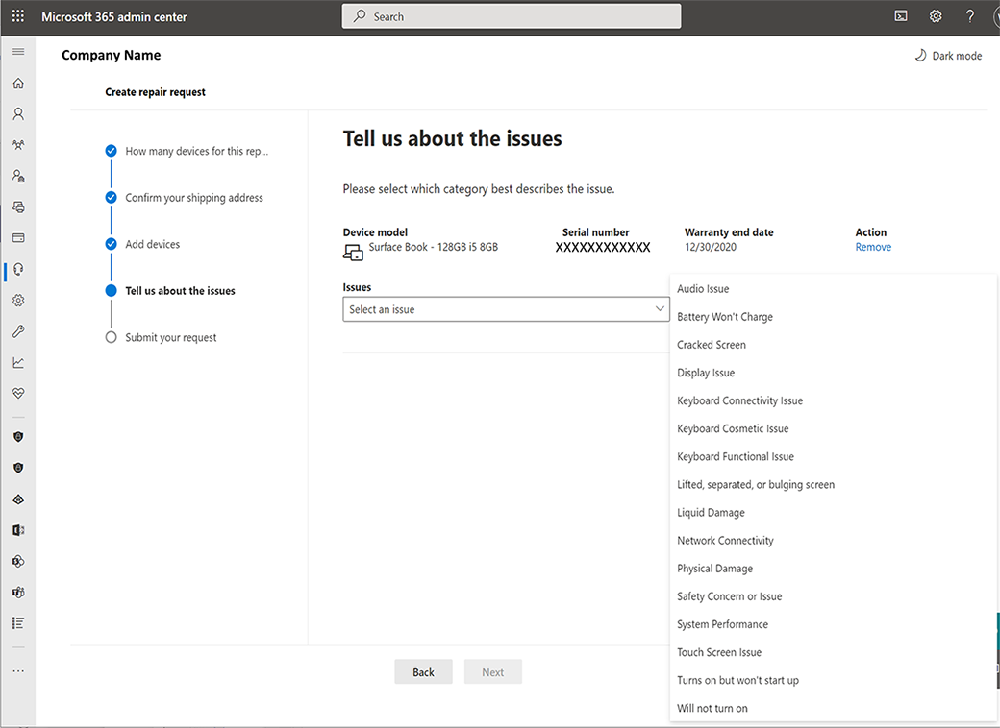

# Surface self-serve warranty and service

Microsoft 365 Business customers may be eligible to use the beta Surface Self Serve Warranty and Service node in the Microsoft Admin Center to create and manage service orders. This new feature allows Global Admins to designate permissions to individuals within their company responsible for supporting warranty and service claims including:

- Uploading serial numbers for the devices requiring service
- Adding multiple shipping addresses
- Creating a single service order for one or many devices and type covers
- Seeing real-time service order status
- Shipping to and receiving Advance Exchange shipments in bulk if devices are covered by an extended warranty or Advanced Exchange was included as part of the device purchase

Contact your Microsoft Customer Success Account Manager or Customer Success Manager to learn more about the experience and how to participate in the beta program.

## Role-based Permissions

The Surface Self-Serve Warranty and Service allows a Microsoft 365 Global Admin the ability to grant different permissions for creating and managing service orders by assigning roles to users.

When a Microsoft 365 tenant is onboarded to the beta, the following roles have additional permissions available to them

| Role                  | Permissions                                                                                                                         |
| --------------------- | ----------------------------------------------------------------------------------------------------------------------------------- |
| Global Admin          | View Repair Requests Create/Manage Repair Requests Add/Edit/Delete Ship to Address(es) Create/Manage users and their roles |
| Service Support Admin | View Repair Requests Create/Manage Repair Requests                                                                               |
| Billing Admin         | View Repair Requests Create/Manage Repair Requests Add/Edit/Delete Ship to address(es)                                        |

For more information about users and permissions, see [Microsoft Admin Center Overview](/microsoft-365/admin/admin-overview/about-the-admin-center).

## Create and manage a service order

1. Go to the Microsoft 365 Admin Center at [https://admin.microsoft.com](https://go.microsoft.com/fwlink/p/?linkid=2024339) and sign in with the appropriate admin permissions. To learn more, see  [Who has admin permissions in my business?](/microsoft-365/business-video/admin-center-overview#who-has-admin-permissions-in-my-business)
2. Go to **Support** > **Surface Device Repairs** and select **Create repair request**. (If you do not see this repair option, you do not have permission to access this page.)

    > [!div class="mx-imgBorder"]
    > 

3. You can create a repair request for one or multiple devices. Select either **Submit 1 device** at a time or **Submit multiple devices** to use a .csv file to upload multiple serial numbers and click **Next**.

    > [!NOTE]
    > **For multiple devices:**
    >
    > - Download the sample CSV template, add the information required and save it to your local drive.
    > - Click **Upload CSV file for bulk entries**, select the .csv file you saved to your local drive and click **Open.**
    > - Your device serial numbers will upload. Click **Next** to continue the creating the repair.

4. Under **Ship replacement to**, select a shipping address. Or select  **Add new address**.
    > [!div class="mx-imgBorder"]
    > 

    > [!NOTE]
    >
    > - Permissions allow certain Admins to add new ship to addresses. If you have permissions,  > you can add new addresses. Enter the required info and then select  **Save**.
    > - The form automatically validates address information and you may be corrected to make changes if the address is not recognized by the local postal system. The email address is used to send notifications and communications for the repair request.

5. Add device by entering the device serial number in the text block. To learn more, see [device serial numbers](https://support.microsoft.com/help/4036293/surface-find-the-serial-number-on-surface). If the serial number is valid, an image and product information including warranty date and model number will appear. Select **Add Device** if information is correct.

    > [!div class="mx-imgBorder"]
    > 

6. Repeat steps 1-2 to add multiple devices (up to 20 total) to the request.
7. From the drop down menu, select the issue type that best describes the issue and click **Next.**

    > [!div class="mx-imgBorder"]
    > 

8. Review your order. If any information is incorrect, choose **Back** to correct errors.
9. Accept the terms of conditions.
10. If request summary is correct, click **Submit your request**

    > [!div class="mx-imgBorder"]
    > 

When the home page displays, you can view your service request in the summary list and receive a confirmation email.

## Frequently asked questions

### Why am I getting error code 400 “Generic client service error”, 401 “Unauthorized service error” or error 403 “Forbidden service error”?

There may be an issue with the Microsoft 365 account or the user does not have permissions to access the content. Reach out to your Microsoft 365 Global Admin for assistance.

### When I enter my shipping address and I get an error message that no shipping offers are available?

The Surface Self-Serve Warranty and Service Beta has limited availability at this time. Offers will only be available if the address is located in one of the following countries:

Austria, Bahrain, Belgium, Bulgaria, Croatia, Cyprus, Czech Republic, Denmark, Estonia, Finland, France, Germany, Greece, Hungary, Ireland, Italy, Kuwait, Latvia, Lithuania, Luxembourg, Malta, Netherlands, Oman, Poland, Portugal, Romania, Slovakia, Slovenia, South Africa, Spain, Sweden and the United Kingdom (excluding Northern Ireland).

### Where can I see orders that I have placed through the Microsoft 365 portal?

Go to [Microsoft 365 admin center - Service requests](https://admin.microsoft.com/Adminportal/Home?source=applauncher#/support/devicerepairs) and sign in with your Microsoft 365 credentials.

Orders created through Microsoft Customer Support will not be visible in the Self-Serve Warranty and Service Management module.

### Why am I unable to add, edit or delete a shipping address?

The ability to add, edit, or delete a shipping address can only be done by your Microsoft 365 Global or Billing Admin. Reach out to them for assistance.  

### How can I Contact Microsoft Support for the Surface Self-Serve Warranty and Service beta?

You can contact support directly through the Surface Support module in the Microsoft Admin Center.

1. Sign in to the Microsoft Admin Center using your Microsoft 365 credentials.
2. Select **Support** > **Surface Device Repairs > Need help?** and describe the issue.
3. If the results don't help, select **Contact support**, and enter a description of your issue. Confirm your contact number and email address, select your preferred contact method, and then select **Contact me**.
