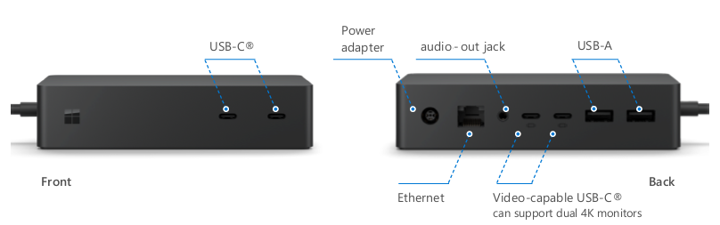

# What’s new in Surface Dock 2

Surface Dock 2, the next-generation Surface dock, lets users connect external monitors and multiple peripherals for a fully modernized desktop experience from a Surface device. Built to maximize efficiency at the office, in a flexible workspace, or at home, Surface Dock 2 features seven ports, including two front-facing USB-C ports, with 15 watts of fast charging power for phones and accessories.

## Full device management support

Surface Dock 2 is designed to simplify IT management, enabling admins to automate firmware updates using Windows Update or centralize updates with internal software distribution tools.

- Surface Enterprise Management Mode (SEMM) enables IT admins to secure ports on Surface Dock 2. For more information, see [Secure Surface Dock 2 ports with Surface Enterprise Management Mode](secure-surface-dock-ports-semm.md).
- Windows Management Instrumentation (WMI) support enables IT admins to remotely monitor and manage the latest firmware, policy state, and related data across Surface Dock 2 devices. For more information, see [Manage Surface Dock 2 with WMI](surface-dock2-wmi.md).
- Centralize updates on your local network using software distribution tools. [Download Surface Dock 2 Firmware and Drivers](https://www.microsoft.com/download/details.aspx?id=101317).

## General system requirements

- Windows 10 version 1809 and later. There's no support for Windows 7, Windows 8, or non-Surface host devices. Surface Dock 2 works with the following Surface devices:

  - Surface Pro (5th Gen) and later
  - Surface Laptop (1st Gen) and later
  - Surface Book 2 and later
  - Surface Go and later
  - Surface Laptop Go and later
  - Surface Laptop Studio
  - Surface Studio 2 and later

## Surface Dock 2 Components

### USB

- Two front-facing USB-C ports
- Two rear-facing USB-C (gen 2) ports
- Two rear-facing USB-A ports

### Video
  
- Dual 4K@60Hz. Supports up to two displays on the following devices:

  - Surface Laptop Studio
  - Surface Book 3
  - Surface Pro 8
  - Surface Pro 7
  - Surface Pro 7+
  - Surface Pro X
  - Surface Laptop 3
  - Surface Laptop 4
  - Surface Pro 9 
  - Surface Pro 9 with 5G

- Dual 4K@30Hz. Supports up to two displays on the following devices:

  - Surface Pro 6
  - Surface Pro (5th Gen)
  - Surface Laptop 2
  - Surface Laptop (1st Gen)
  - Surface Go
  - Surface Go 2
  - Surface Go 3
  - Surface Book 2

### Ethernet

- 1-gigabit Ethernet port.

### External Power supply

- 199 watts supporting 100V-240V.

## Compare Surface Dock

**Table 1. Surface Dock and USB-C Travel Hub**
.

| Component                           | Surface Dock                                                | Surface Dock 2                                                                                      | USB-C Travel Hub |
| ----------------------------------- | ----------------------------------------------------------- | --------------------------------------------------------------------------------------------------- | ---------------- |
| Surflink                            | Yes                                                         | Yes                                                                                                 | No               |
| USB-A                               | 2 front facing USB 3.1 Gen 1 2 rear facing USB 3.1 Gen 1 | 2 rear facing USB 3.2 Gen 2 (7.5W power)                                                            | 1 USB 3.1 Gen 2  |
| Mini Display port                   | 2 rear facing (DP1.2)                                       | None                                                                                                | None             |
| USB-C                               | None                                                        | 2 front facing USB 3.2 Gen 2 (15W power) 2 rear facing USB 3.2 Gen 2 (DP1.4a) (7.5W power) | 1 USB 3.2 Gen 2  |
| 3.5 mm Audio in/out                 | Yes                                                         | Yes                                                                                                 | Yes              |
| Ethernet                            | Yes, 1 gigabit                                              | Yes 1 gigabit                                                                                       | Yes, 1 gigabit   |
| DC power in                         | Yes                                                         | Yes                                                                                                 |                  |
| Kensington lock                     | Yes                                                         | Yes                                                                                                 |                  |
| Surflink cable length               | 65 cm                                                        | 80 cm                                                                                                | 20 cm             |
| Surflink host power                 | 60 W                                                         | 120 W                                                                                                | N/A              |
| USB load power                      | 30 W                                                         | 60 W                                                                                                 |                  |
| USB bit rate                        | 5 Gbps                                                      | 10 Gbps                                                                                             | 10 Gbps          |
| Monitor support                     | 2 x 4K @30fps, or 1 x 4K @ 60 fps                         | 2 x 4K @ 60 fps  or 1 x 4K @120fps                                                                                     | 1 x 4K @ 60 fps   |
| Wake-on-LAN from Connected Standby1 | Yes                                                         | Yes                                                                                                 |    Yes              |
| Wake-on-LAN from S4/S5 sleep modes  | No                                                          | Yes                                                                                                 |          Yes        |
| Network PXE boot                    | Yes                                                         | Yes                                                                                                 |        Yes          |
| SEMM host access control            | No                                                          | Yes                                                                                                 | No               |
| SEMM port access control2          | No                                                          | Yes                                                                                                 | No               |
| Servicing support                   | MSI                                                         | Windows Update or MSI                                                                               |                  |

1. *Devices must be configured for Wake on LAN via Surface Enterprise Management Mode (SEMM) or Device Firmware Control Interface (DFCI) to wake from hibernation or power-off states. Wake from hibernation or power-off is supported on Surface Laptop Studio, Surface Pro 9 & Surface Pro 9 with 5G, Surface Pro 8, Surface Pro 7+, Surface Pro 7, Surface Laptop 5, Surface Laptop 4, Surface Laptop 3, Surface Pro X, Surface Book 3, Surface Go 3, and Surface Go 2.  Software license required for some features. Sold separately.*

2. *Software license required for some features. Sold separately.*

## Streamlined device management

Surface has released streamlined management functionality via Windows Update enabling IT admins to utilize the following enterprise-grade features:

- **Frictionless updates**. Update your docks silently and automatically, with Windows Update or Microsoft Endpoint Configuration Manager (formerly System Center Configuration Manager - SCCM) or other MSI deployment tools.
- **Wake from the network**. Manage and access corporate devices without depending on users to keep their devices powered on. Even when a docked device is in sleep, hibernation, or power off mode, your team can wake from the network for service and management, using Endpoint Configuration Manager or other enterprise management tools.
- **Centralized IT control**. Control who can connect to Surface Dock 2 by turning ports on and off. Restrict which host devices can be used with Surface Dock 2. Limit dock access to a single user or configure docks for access only by specific users in your team or across the entire company.

## Next steps

- [Secure Surface Dock 2 ports with Surface Enterprise Management Mode](https://techcommunity.microsoft.com/t5/surface-it-pro-blog/secure-surface-dock-2-ports-with-surface-enterprise-management/ba-p/1418999)
- [Surface Enterprise Management Mode](surface-enterprise-management-mode.md)
- [Best practice power settings for Surface devices](maintain-optimal-power-settings-on-Surface-devices.md)
