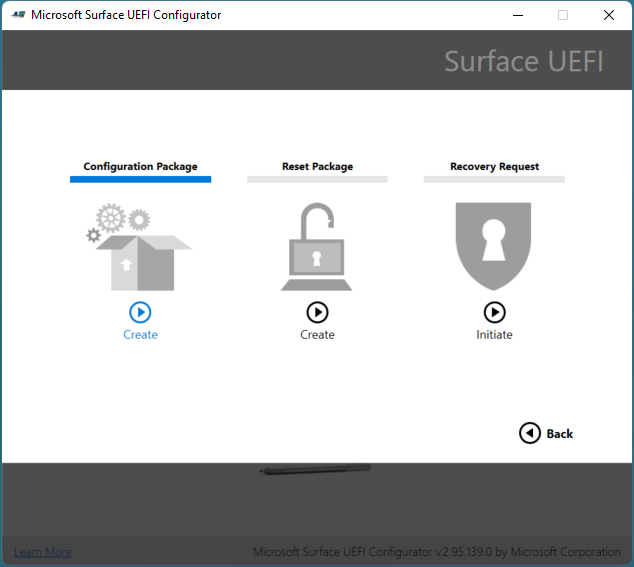
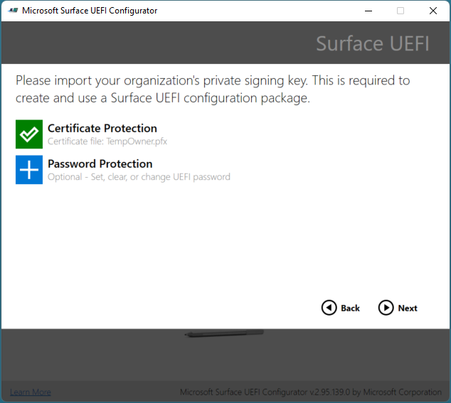
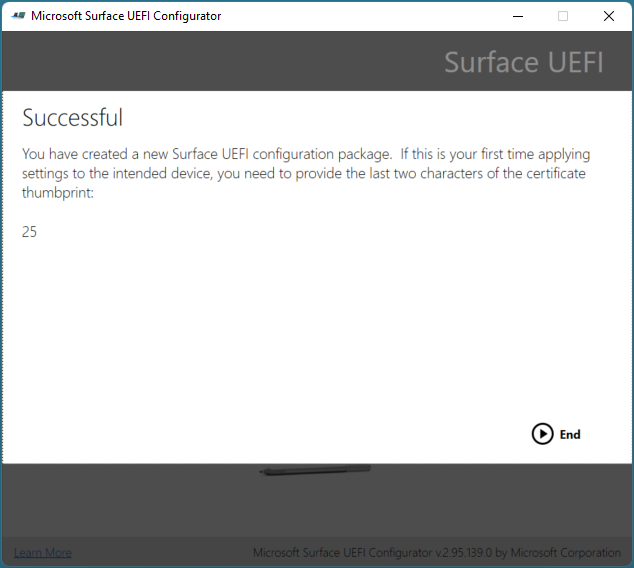

# Microsoft Surface Enterprise Management Mode

Microsoft Surface Enterprise Management Mode (SEMM) is a feature of Surface devices with Surface Unified Extensible Firmware Interface (UEFI). You can use SEMM to:

- Secure and manage firmware settings in your organization.
- Prepare UEFI settings configurations and install them on a Surface device.

SEMM also uses a certificate to protect the configuration from unauthorized tampering or removal. To migrate a Surface Hub 2S to Windows 10 Pro or Windows Enterprise, SEMM is required.

## Supported devices

SEMM is only available on devices with Surface UEFI firmware including: 

- Surface Pro 8 (commercial SKUs only)
- Surface Pro 4 and later (all SKUs)
- Surface Pro X (all SKUs)
- Surface Laptop SE (all SKUs)
- Surface Laptop Studio (commercial SKUs only) 
- Surface Hub 2S
- Surface Laptop 4 (commercial SKUs only; Intel or AMD processors)
- Surface Laptop 3 (commercial SKUs only; Intel processors)
- Surface Laptop Go (commercial SKUs only)
- Surface Book (all generations)
- Surface Go, Surface Go 2
- Surface Go 3 (commercial SKUs only)
- Surface Studio 

## Getting started 

When Surface devices are configured by SEMM and secured with the SEMM certificate, they're considered *enrolled* in SEMM. When the SEMM certificate is removed and control of UEFI settings is returned to the user of the device, the Surface device is considered *unenrolled* in SEMM.

There are two administrative options that you can use to manage SEMM and enroll Surface devices:

- SEMM standalone tool, Microsoft Surface UEFI Configurator, is described in this article.

- Integration with Microsoft Endpoint Configuration Manager. For information, see [Use Microsoft Endpoint Configuration Manager to manage devices with SEMM](use-system-center-configuration-manager-to-manage-devices-with-semm.md).

## Microsoft Surface UEFI Configurator

The primary workspace of SEMM is Microsoft Surface UEFI Configurator, as shown in Figure 1.

You can use Microsoft Surface UEFI Configurator to:

- Create Windows Installer (.msi) packages.
- Use WinPE images to enroll, configure, and unenroll SEMM on a Surface device.

These packages contain a configuration file that specifies the UEFI settings. SEMM packages also contain a certificate that's installed and stored in firmware and is used to verify the signature of configuration files before UEFI settings are applied.

>[!TIP]
>You can now use Surface UEFI Configurator and SEMM to manage ports on Surface Dock 2. To learn more, see [Secure Surface Dock 2 ports with SEMM](secure-surface-dock-ports-semm.md).



*Figure 1. Microsoft Surface UEFI Configurator*

You can use the Microsoft Surface UEFI Configurator tool in three modes:

- [Surface UEFI Configuration Package](#configuration-package). Use this mode to create a Surface UEFI configuration package to enroll a Surface device in SEMM and to configure UEFI settings on enrolled devices.
- [Surface UEFI Reset Package](#reset-package). Use this mode to unenroll a Surface device from SEMM.
- [Surface UEFI Recovery Request](#recovery-request). Use this mode to respond to a recovery request to unenroll a Surface device from SEMM where a Reset Package operation is not successful.

### Download Microsoft Surface UEFI Configurator

You can download Microsoft Surface UEFI Configurator from the [Surface Tools for IT](https://www.microsoft.com/download/details.aspx?id=46703) page in the Microsoft Download Center.

- For Intel/AMD devices, download: **SurfaceUEFI_Configurator_v2.94.139.0_x64.msi**
- For ARM devices, download: **SurfaceUEFI_Configurator_v2.94.139.0_x86.msi.**

### Configuration package

Surface UEFI configuration packages are the primary mechanism to implement and manage SEMM on Surface devices. These packages contain a configuration file and a certificate file, as shown in Figure 2. The configuration file contains UEFI settings that are specified when the package is created in Microsoft Surface UEFI Configurator. When a configuration package runs for the first time on a Surface device that's not already enrolled in SEMM, it provisions the certificate file in the device’s firmware and enrolls the device in SEMM. When enrolling a device in SEMM, and before the certificate is stored and the enrollment finishes, you're prompted to confirm the operation by providing the last two digits of the SEMM certificate thumbprint. This confirmation requires a user to be physically present at the device during enrollment to perform the confirmation.



*Figure 2. Secure a SEMM configuration package with a certificate*

For more information about the requirements for the SEMM certificate, see the [Surface Enterprise Management Mode certificate requirements](#surface-enterprise-management-mode-certificate-requirements) section later in this article.

>[!TIP]
>You have the option to require a UEFI password with SEMM. If you do, the password is required to view the **Security**, **Devices**, **Boot Configuration**, and **Enterprise Management** pages of Surface UEFI.

After a device is enrolled in SEMM, the configuration file is read, and the settings specified in the file are applied to UEFI. When you run a configuration package on a device that's already enrolled in SEMM, the signature of the configuration file is checked against the certificate that's stored in the device firmware. If the signature doesn't match, no changes are applied to the device.

### Enable or disable devices in Surface UEFI with SEMM

The following list shows all the available devices that you can manage in SEMM:

- Docking USB port
- On-board audio
- Digital graphics processing unit
- Type cover
- Micro SD card
- Front camera
- Rear camera
- Infrared camera (for Windows Hello)
- Bluetooth only
- Wireless network and Bluetooth
- Long-term evolution (LTE)

 >[!NOTE]
>On the UEFI Devices page, the built-in devices might vary, depending on your device or corporate environment. For example, the UEFI Devices page isn't supported on Surface Pro X; LTE appears only on LTE-equipped devices.

### Configure advanced settings with SEMM

**Table 1. Advanced settings**

| Setting                            | Description                                                                                                                                                                                        |
| ---------------------------------- | -------------------------------------------------------------------------------------------------------------------------------------------------------------------------------------------------- |
| IPv6 for PXE Boot                  | Allows you to manage IPv6 support for PXE boot. If you don't configure this setting, IPv6 support for PXE boot is disabled.                                                                               |
| Alternate Boot                     | Allows you to manage the use of an Alternate boot order to boot directly to a USB or Ethernet device by pressing both the Volume Down button and Power button during boot. If you don't configure this setting, Alternate boot is enabled. |
| Boot Order Lock                    | Allows you to lock the boot order to prevent changes. If you don't configure this setting, Boot Order Lock is disabled.                                                                                                        |
| USB Boot                           | Allows you to manage booting to USB devices. If you don't configure this setting, USB Boot is enabled.                                                                                                                 |
| Network Stack                      | Allows you to manage Network Stack boot settings. If you don't configure this setting,  the ability to manage Network Stack boot settings is disabled.                                                                                                           |
| Auto Power On                      | Allows you to manage Auto Power On boot settings. If you don't configure this setting, Auto Power on is enabled.                                                                                                        |
| Simultaneous Multi-Threading (SMT) | Allows you to manage Simultaneous Multi-Threading (SMT) to enable or disable hyperthreading. If you don't configure this setting, SMT is enabled.                                                  |
|Enable Battery limit| Allows you to manage Battery limit functionality. If you don't configure this setting, Battery limit is enabled |
| Security                           | Displays the Surface UEFI **Security** page. If you don't configure this setting, the Security page is displayed.                                                                                                                 |
| Devices                            | Displays the Surface UEFI **Devices** page. If you don't configure this setting,  the Devices page is displayed.                                                                                                                     |
| Boot                               | Displays the Surface UEFI **Boot** page. If you don't configure this setting, the Boot page is displayed.                                                                                                                                                            |
| DateTime                           | Displays the Surface UEFI **DateTime** page. If you don't configure this setting, the DateTime page is displayed.                                                                                                                |
| EnableOSMigration                          | Allows you to migrate Surface Hub 2 from Windows 10 Team to Windows 10 Pro or Enterprise. If you don't configure this setting, Surface Hub 2 devices can run only the Windows 10 Team OS. Note: Dual booting between Windows 10 Team and Windows 10 Pro/Enterprise isn't available on Surface Hub 2.                                                                                                           |

>[!TIP]
>When you create a SEMM configuration package, two characters are shown on the **Successful** page, as shown in Figure 3.



*Figure 3. Display of the last two characters of the certificate thumbprint on the Successful page*

These characters are the last two characters of the certificate thumbprint and should be written down or recorded. The characters are required to confirm enrollment in SEMM on a Surface device, as shown in Figure 4.


*Figure 4. Enrollment confirmation in SEMM with the SEMM certificate thumbprint*

>[!TIP]
>Administrators with access to the certificate file (.pfx) can read the thumbprint at any time by opening the .pfx file in CertMgr. To view the thumbprint with CertMgr:
>
>1. Select and hold (or right-click) the .pfx file, and then select **Open**.
>2. In the navigation pane, expand the folder.
>3. Select **Certificates**.
>4. In the main pane, select and hold (or right-click) your certificate, and then select **Open**.
>5. Select the **Details** tab.
>6. In the **Show** drop-down menu, **All** or **Properties Only** must be selected.
>7. Select the **Thumbprint** field.

To enroll a Surface device in SEMM or apply the UEFI configuration from a configuration package, run the .msi file with administrative privileges on the intended Surface device. You can use application deployment or operating system deployment technologies, like [Microsoft Endpoint Configuration Manager](/mem/configmgr) or the [Microsoft Deployment Toolkit](/mem/configmgr/mdt). When you enroll a device in SEMM, you must be physically present to confirm the enrollment on the device. When you apply a configuration to devices that are already enrolled in SEMM, user interaction isn’t required.

For a step-by-step walkthrough of how to enroll a Surface device in SEMM or apply a Surface UEFI configuration with SEMM, see [Enroll and configure Surface devices with SEMM](enroll-and-configure-surface-devices-with-semm.md).

### Reset package

A Surface UEFI reset package is used to perform only one task — to unenroll a Surface device from SEMM. The reset package contains signed instructions to remove the SEMM certificate from the device’s firmware and to reset UEFI settings to the factory default settings. Like a Surface UEFI configuration package, a reset package must be signed with the same SEMM certificate that’s provisioned on the Surface device. When you create a SEMM reset package, you’re required to supply the serial number of the Surface device that you intend to reset. SEMM reset packages aren’t universal — they’re specific to one device.

### Recovery request

In some scenarios, it might be impossible to use a Surface UEFI reset package. (For example, if Windows becomes unusable on the Surface device.) In these scenarios you can unenroll the Surface device from SEMM through the **Enterprise Management** page of Surface UEFI (shown in Figure 5) with a Recovery Request operation.

> [!div class="mx-imgBorder"]
> 

*Figure 5. Initiate a SEMM recovery request on the Enterprise Management page*

When you use the process on the **Enterprise Management** page to reset SEMM on a Surface device, you’re given a Reset Request. This Reset Request can be saved as a file to a USB drive, copied as text, or read as a QR Code with a mobile device to be easily emailed or messaged. Use the Microsoft Surface UEFI Configurator Reset Request option to load a Reset Request file or to enter the Reset Request text or QR Code. Microsoft Surface UEFI Configurator generates a verification code that can be entered on the Surface device. If you enter the code on the Surface device and select **Restart**, the device is unenrolled from SEMM.

>[!NOTE]
>A Reset Request expires two hours after it's created.

For a step-by-step walkthrough of how to unenroll Surface devices from SEMM, see [Unenroll Surface devices from SEMM](unenroll-surface-devices-from-semm.md).

## Surface Enterprise Management Mode certificate requirements

When you use SEMM with Microsoft Surface UEFI Configurator and want to apply UEFI settings, a certificate is required to verify the signature of configuration files. This certificate ensures that after a device enrolls in SEMM, only packages created with the approved certificate can be used to modify the UEFI settings.

>[!NOTE]
>To make any modification to SEMM or Surface UEFI settings on enrolled Surface devices, the SEMM certificate is required. If the SEMM certificate is corrupt or lost, SEMM can’t be removed or reset. Manage your SEMM certificate accordingly with an appropriate solution for backup and recovery

Packages created with the Microsoft Surface UEFI Configurator tool are signed with a certificate. This certificate ensures that after a device is enrolled in SEMM, only packages created with the approved certificate can be used to modify the settings of UEFI.

### Recommended certificate settings

The following settings are recommended for the SEMM certificate:

- **Key Algorithm** – RSA
- **Key Length** – 2048
- **Hash Algorithm** – SHA-256
- **Type** – SSL Server Authentication
- **Key Usage** – Digital signature, Key Encipherment
- **Provider** – Microsoft Enhanced RSA and AES Cryptographic Provider
- **Expiration Date** – 15 Months from certificate creation
- **Key Export Policy** – Exportable

It's also recommended that the SEMM certificate be authenticated in a two-tier public key infrastructure (PKI) architecture where the intermediate certification authority (CA) is dedicated to SEMM, enabling certificate revocation. For more information about a two-tier PKI configuration, see [Test Lab Guide: Deploying an AD CS Two-Tier PKI Hierarchy](/previous-versions/windows/it-pro/windows-server-2012-R2-and-2012/hh831348(v=ws.11)).

### Self-signed certificate

You can use the following example PowerShell script to create a self-signed certificate for use in proof-of-concept scenarios.
To use this script, copy the following text into Notepad, and then save the file as a PowerShell script (.ps1).

> [!NOTE]
> This script creates a certificate with a password of `12345678`. The certificate generated by this script isn't recommended for production environments.
  
```powershell
if (-not (Test-Path "Demo Certificate"))  { New-Item -ItemType Directory -Force -Path "Demo Certificate" }
if (Test-Path "Demo Certificate\TempOwner.pfx") { Remove-Item "Demo Certificate\TempOwner.pfx" }

# Generate the Ownership private signing key with password 12345678
$pw = ConvertTo-SecureString "12345678" -AsPlainText -Force

$TestUefiV2 = New-SelfSignedCertificate `
  -Subject "CN=Surface Demo Kit, O=Contoso Corporation, C=US" `
  -Type SSLServerAuthentication `
  -HashAlgorithm sha256 `
  -KeyAlgorithm RSA `
  -KeyLength 2048 `
  -KeyUsage KeyEncipherment `
  -KeyUsageProperty All `
  -Provider "Microsoft Enhanced RSA and AES Cryptographic Provider" `
  -NotAfter (Get-Date).AddYears(25) `
  -TextExtension @("2.5.29.37={text}1.2.840.113549.1.1.1") `
  -KeyExportPolicy Exportable

$TestUefiV2 | Export-PfxCertificate -Password $pw -FilePath "Demo Certificate\TempOwner.pfx"
```

>[!IMPORTANT]
>For use with SEMM and Microsoft Surface UEFI Configurator, the certificate must be exported with the private key and with password protection. Microsoft Surface UEFI Configurator prompts you to select the SEMM certificate file (.pfx) and certificate password.

To create a self-signed certificate:

1. On your C: drive, create the folder where you'll save the script; for example, C:\SEMM.
2. Copy the example script into Notepad (or equivalent text editor), and then save the file as a PowerShell script (.ps1).
3. Sign in to your computer with administrator credentials, and then open an elevated PowerShell session.
4. Make sure that your permissions are set to allow scripts to run. By default, scripts are blocked from running unless you modify the execution policy. To learn more, see [About Execution Policies](/powershell/module/microsoft.powershell.core/about/about_execution_policies).
5. At the command prompt, enter the full path of the script and then press **Enter**. The script creates a Demo Certificate named TempOwner.pfx.

Alternatively, you can create your own self-signed certificate using PowerShell. For more information, see [New-SelfSignedCertificate](/powershell/module/pkiclient/new-selfsignedcertificate).

>[!NOTE]
>For organizations that use an offline root in their PKI infrastructure, Microsoft Surface UEFI Configurator must be run in an environment connected to the root CA to authenticate the SEMM certificate. The packages generated by Microsoft Surface UEFI Configurator can be transferred as files, so they can be transferred outside the offline network environment with removable storage, such as a USB stick.

### Managing certificates FAQ

The recommended *minimum* length is 15 months. You can use a certificate that expires in less than 15 months or use a certificate that expires in longer than 15 months.

>[!NOTE]
>When a certificate expires, it doesn't automatically renew.

**Will an expired certificate affect the functionality of SEMM-enrolled devices?**<br><br>
No, a certificate only impacts IT admin management tasks in SEMM and has no effect on device functionality when it expires.

**Will the SEMM package and certificate need to be updated on all machines that have it?**<br><br>
If you want SEMM reset or recovery to work, the certificate needs to be
valid and not expired.

**Can bulk reset packages be created for each surface that we order? Can one be built that resets all machines in our environment?**<br><br>
The PowerShell samples that create a config package for a specific device type can also be used to create a reset package that's serial-number independent. If the certificate is still valid, you can create a reset package using PowerShell to reset SEMM.

## Version history

### Version 2.94.139.0

This version of SEMM includes:

- Support for Surface Laptop Studio, Surface Pro 8, and Surface Go 3

### Version 2.83.139.0

This version of SEMM includes:

- Support for Surface Laptop 4
- Support for simultaneous multithreading option for Surface Pro 7
- Removal of obsolete SEMM settings  
- Improved MSI signing

### Version 2.79.139.0

This version of SEMM includes:

- Support for Surface Pro 7+.
- User experience improvements.

### Version 2.78.139.0

This version of SEMM includes:

- Support for Surface Laptop Go and Surface Pro X.
- Notifications for new version releases.
- The ability to create custom packages to change ownership.
- Bug fixes.

### Version 2.73.136.0

This version of SEMM includes:

- The ability for audio to be disabled on Surface Hub2S using SEMM.
- Support for Surface Pro X for Dock 2.
- Support for UEFI Manager for Dock 2-related operations.
- A Surface Go reset package bug fix.
- Support for migrating Surface Hub 2 devices from Windows 10 Team OS to Windows 10 Pro or Enterprise.

### Version 2.71.139.0

This version of SEMM adds support for Surface Dock 2 management features for Surface Book 3, Surface Laptop 3, and Surface Pro 7. It includes:

- The ability to enable audio (lock/unlock), and Ethernet and USB ports.
- The ability to create dock packages for both authenticated and unauthenticated hosts.

### Version 2.70.130.0

This version of SEMM includes:

- Support for Surface Go 2.
- Support for Surface Book 3.
- Bug fixes.

### Version 2.59.139.0

This version of SEMM includes:

- Support for Surface Pro 7, Surface Pro X, and Surface Laptop 3 13.5" and 15" models with Intel processor.
    >[!NOTE]
    >Surface Laptop 3 15" AMD processor isn't supported.
- Support for the Wake on Power feature.

### Version 2.54.139.0

This version of SEMM includes:

- Support for Surface Hub 2S.
- Bug fixes.

### Version 2.43.136.0

This version of SEMM includes:

- Support to enable/disable simultaneous multithreading.
- Separate options for wireless networking and Bluetooth for some devices.
- Battery Limit removed for Surface Studio.

### Version 2.26.136.0

This version of SEMM includes:

- Support for Surface Studio 2.
- Battery Limit feature.

### Version 2.21.136.0

This version of SEMM includes:

- Support for Surface Pro 6.
- Support for Surface Laptop 2.

### Version 2.14.136.0

This version of SEMM includes:

- Support for Surface Go.

### Version 2.9.136.0

This version of SEMM includes:

- Support for Surface Book 2.
- Support for Surface Pro LTE.
- Accessibility improvements.

### Version 1.0.74.0

This version of SEMM includes:

- Support for Surface Laptop.
- Support for Surface Pro.
- Bug fixes and general improvements.

## Related topics

- [Enroll and configure Surface devices with SEMM](enroll-and-configure-surface-devices-with-semm.md)
- [Unenroll Surface devices from SEMM](unenroll-surface-devices-from-semm.md)
- [Secure Surface Dock 2 ports with SEMM](secure-surface-dock-ports-semm.md)
