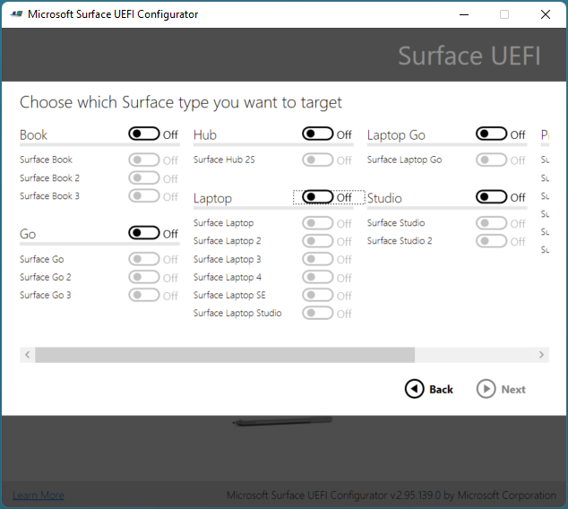
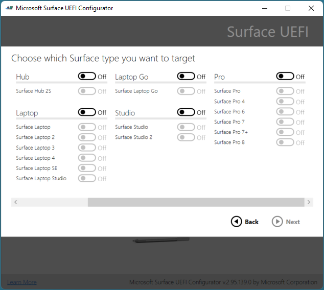
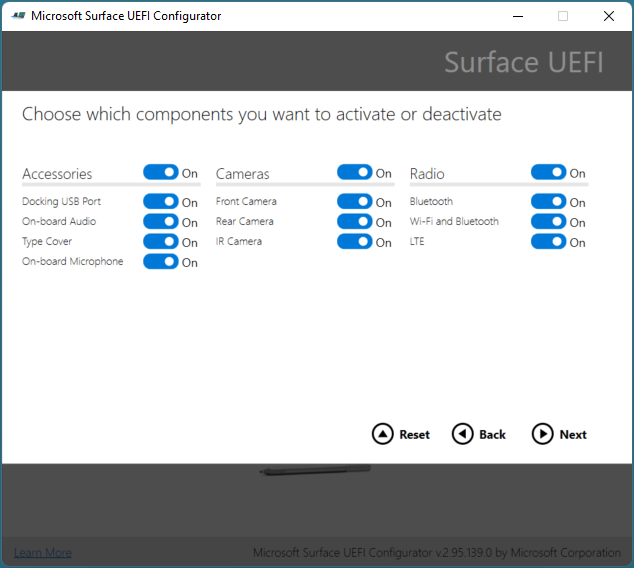
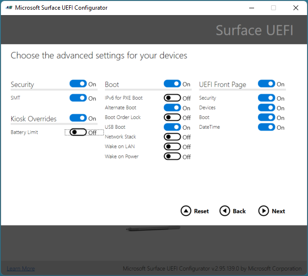

# Configure UEFI settings for Surface devices

Microsoft Surface Enterprise Management Mode (SEMM) is a feature of Surface devices with Surface Unified Extensible Firmware Interface (UEFI). You can use SEMM to:

- Secure and manage firmware settings in your organization.
- Prepare UEFI settings configurations and install them on a Surface device.

SEMM also uses a certificate to protect the configuration from unauthorized tampering or removal. 

## Enroll and configure Surface devices with SEMM

When a Surface device is managed by SEMM, that device is considered *enrolled* (sometimes referred to as activated). This article shows you how to create a Surface UEFI configuration package to enable or disable hardware components at the firmware level and enroll a Surface device in SEMM.

As an alternative to SEMM, newer Surface devices support remote management of a subset of firmware settings via Microsoft Intune. For more information,see [Manage DFCI on Surface devices](surface-manage-dfci-guide.md).

## Supported devices

SEMM is only available on devices with Surface UEFI firmware including:

- Surface Book (all generations)
- Surface Go 4 (commercial SKUs only)
- Surface Go 3 (commercial SKUs only)
- Surface Go 2 (all SKUs)
- Surface Go (all SKUs)
- Surface Hub 2S
- Surface Laptop 6 (commercial SKUs only)
- Surface Laptop 5 (commercial SKUs only)
- Surface Laptop 4 (commercial SKUs only)
- Surface Laptop 3 (Intel processors only)
- Surface Laptop 2 (all SKUs)
- Surface Laptop (all SKUs)
- Surface Laptop Go 3 (commercial SKUs only)
- Surface Laptop Go 2 (commercial SKUs only)
- Surface Laptop Go (all SKUs)
- Surface Laptop SE (all SKUs)
- Surface Laptop Studio 2 (commercial SKUs only)
- Surface Laptop Studio (commercial SKUs only)
- Surface Pro 10 (commercial SKUs only)
- Surface Pro 9 (commercial SKUs only)
- Surface Pro 9 with 5G (commercial SKUs only)
- Surface Pro 8 (commercial SKUs only)
- Surface Pro 7+ (commercial SKUs only)
- Surface Pro 7 (all SKUs)
- Surface Pro 6 (all SKUs)
- Surface Pro 5th Gen (all SKUs)
- Surface Pro 4 (all SKUs)
- Surface Pro X (all SKUs)
- Surface Studio 2+ (commercial SKUs only)
- Surface Studio 2 (all SKUs)
- Surface Studio (all SKUs)

>[!TIP]
> Commercial SKUs (aka Surface for Business) run Windows 10 Pro/Enterprise or Windows 11 Pro/Enterprise; consumer SKUs run Windows 10/Windows 11 Home. To learn more, see [View your system info](https://support.microsoft.com/windows/view-your-system-info-a965a8f2-0773-1d65-472a-1e747c9ebe00).

## Getting started

When Surface devices are configured by SEMM and secured with the SEMM certificate, they're considered *enrolled* in SEMM. When the SEMM certificate is removed and control of UEFI settings is returned to the user of the device, the Surface device is considered *unenrolled* in SEMM.

There are two administrative options that you can use to manage SEMM and enroll Surface devices:

- Surface UEFI Configurator in Surface IT Toolkit, as described in this article.

- Integration with Microsoft Endpoint Configuration Manager. For information, see [Use Microsoft Endpoint Configuration Manager to manage devices with SEMM](use-system-center-configuration-manager-to-manage-devices-with-semm.md).

<!--[!NOTE]
> SEMM is supported on Surface Pro X via the UEFI Manager only. For more information, see [Deploying, managing, and servicing Surface Pro X](surface-pro-arm-app-management.md).-->

## Create a Surface UEFI configuration package

The Surface UEFI configuration package performs both the role of applying a new configuration of Surface UEFI settings to a Surface device managed with SEMM and the role of enrolling Surface devices in SEMM. The creation of a configuration package requires you to have a signing certificate to be used with SEMM to secure the configuration of UEFI settings on each Surface device. For more information about the requirements for the SEMM certificate or create a test certficate, see [Appendix A] on this page.

To create a Surface UEFI configuration package, follow these steps:

1. Open **Surface IT Toolkit**, select **UEFI Configurator** > **Configure Surface Device**.
2. Under **Import Certificate Proection**, select  **Add** to add your exported certificate file with private key (.pfx). Select **Next**.
:::image type="content" source="images/ueficonfig-start.png" alt-text="Screenshot of UEFI Configuration.":::
3. Select the devices to be configured. Choose from your Managed Devices or go to All Devices to select your device and model. Select **Next**.
:::image type="content" source="images/ueficonfig-select-devices.png" alt-text="Screenshot of device selection for UEFI Configuration.":::
4. In the Device Configuration Settings page, select the components you wish to configure.
:::image type="content" source="images/ueficonfig-device-config-settings.png" alt-text="Screenshot ofDevice Configuration Settings page.":::

### Enable or disable components in Surface UEFI 

The following components can be turned or off:

- Docking USB port
- On-board audio
- Digital graphics processing unit
- Type cover
- Micro SD card
- Front camera
- Rear camera
- Infrared camera (for Windows Hello)
- Bluetooth only
- Wireless network and Bluetooth
- Long-term evolution (LTE)
- Discrete GPU (dGPU)
- On-board microphone
- MAC address emulation
- Wired LAN
- Near-field communication (NFC)

### Configure advanced settings with SEMM

**Table 1. Advanced settings**

| Setting                            | Description                                                                                                                                                                                        |
| ---------------------------------- | -------------------------------------------------------------------------------------------------------------------------------------------------------------------------------------------------- |
| IPv6 for PXE Boot                  | Allows you to manage IPv6 support for PXE boot. If you don't configure this setting, IPv6 support for PXE boot is enabled.                                                                               |
| Alternate Boot                     | Allows you to manage the use of an Alternate boot order to boot directly to a USB or Ethernet device by pressing both the Volume Down button and Power button during boot. If you don't configure this setting, Alternate boot is enabled. |
| Boot Order Lock                    | Allows you to lock the boot order to prevent changes. If you don't configure this setting, Boot Order Lock is disabled.                                                                                                        |
| USB Boot                           | Allows you to manage booting to USB devices. If you don't configure this setting, USB Boot is enabled.                                                                                                                 |
| Network Stack                      | Allows you to manage Network Stack boot settings. If you don't configure this setting,  the ability to manage Network Stack boot settings is enabled.                                                                                                           |
| Auto Power On                      | Allows you to manage Auto Power-on boot settings. If you don't configure this setting, Auto Power-on is enabled.                                                                                                        |
| Simultaneous Multi-Threading (SMT) | Allows you to manage Simultaneous Multi-Threading (SMT) to enable or disable hyperthreading. If you don't configure this setting, SMT is enabled.                                                  |
| Enable Battery limit               | Allows you to manage Battery limit functionality. If you don't configure this setting, Battery limit is enabled |
| Security                           | Displays the Surface UEFI **Security** page. If you don't configure this setting, the Security page is displayed.                                                                                                                 |
| Devices                            | Displays the Surface UEFI **Devices** page. If you don't configure this setting,  the Devices page is displayed.                                                                                                                     |
| Boot                               | Displays the Surface UEFI **Boot** page. If you don't configure this setting, the Boot page is displayed.                                                                                                                                                            |
| DateTime                           | Displays the Surface UEFI **DateTime** page. If you don't configure this setting, the DateTime page is displayed.                                                                                                                |
| EnableOSMigration                  | Allows you to migrate Surface Hub 2S from Windows 10 Team to Windows 10/11 Pro or Enterprise. If you don't configure this setting, Surface Hub 2S devices can run only the Windows 10 Team OS. Note: Dual booting between Windows 10 Team and Windows 10/11 Pro/Enterprise isn't available on Surface Hub 2S.                                                                                                           |
| Secured Core                       | Allows you to manage Secured Core functionality. If you don't configure this setting, Secured Core functionality is enabled on supported devices.                                                                                                         |
| Wake-on-LAN                        | Allows you to manage Wake-on-LAN functionality. If you don't configure this setting, Wake-on-LAN is enabled on supported devices.                                                                                                            |
| Wake-on-Power                      | Allows you to manage Wake-on-Power functionality. If you don't configure this setting, Wake-on-Power is disabled on supported devices.                                                                                                          |

## Protect UEFI settings with password

It's strongly recommended to set a password when creating UEFI configuration packages. A password helps prevent unauthorized access to the firmware settings. This is crucial because firmware controls the initial operations of the hardware before the operating system loads. If unauthorized users access UEFI settings, they could potentially disable security features or make changes detrimental to the security and functionality of the device.

:::image type="content" source="images/ueficonfig-set-password.png" alt-text="Screenshot showing the addition of a password to protect UEFI settings from being modified by uanauthorized persons."::: 

<!--6. Select **Password Protection** to add a password to Surface UEFI. This password is required whenever you boot to UEFI. If this password isn't entered, only the **PC information**, **About**, **Enterprise management**, and **Exit** pages are displayed. This step is optional.

7. When prompted, enter and confirm your chosen password for Surface UEFI, and then select **OK**. Leave the password field blank if you want to clear an existing Surface UEFI password.

8. If you don't want the Surface UEFI package to apply to a particular device, on the **Choose which Surface type you want to target** page, select the slider beneath the corresponding device so that it is in the **Off** position, as shown in Figure 3.
   > [!TIP] 
   > You must select a device as none are selected by default. 

   

   

   *Figure 3. Choose the devices for package compatibility*

9. Select **Next**.

10. If you want to deactivate a component on managed Surface devices, on the **Choose which components you want to activate or deactivate** page, select the slider next to any device or group of devices you wish to deactivate so that the slider is in the **Off** position. (Shown in Figure 4.) The default configuration for each device is **On**. Select the **Reset** button to return all sliders to the default position.

    

    *Figure 4. Disable or enable individual Surface components*

11. Select **Next**.

12. To enable or disable advanced options in Surface UEFI or the display of Surface UEFI pages, on the **Choose the advanced settings for your devices** page, select the slider beside the desired setting to configure that option to **On** or **Off** (shown in Figure 5). In the **UEFI Front Page** section, you can use the sliders for **Security**, **Devices**, and **Boot** to control what pages are available to users who boot into Surface UEFI. (For more information about Surface UEFI settings, see [Manage Surface UEFI settings](https://technet.microsoft.com/itpro/surface/manage-surface-uefi-settings).) When finished, select **Build**. 

    

    *Figure 5. Control advanced Surface UEFI settings and Surface UEFI pages with SEMM*

13. In the **Save As** dialog box, specify the Surface UEFI configuration package name, browse to the location where you would like to save the file, and select **Save**.

14. When the package is created and saved, the **Successful** page is displayed.

    >[!NOTE]
    >Record the certificate thumbprint characters displayed on this page, as shown in Figure 6. You will need these characters to confirm enrollment of new Surface devices in SEMM. Click **End** to complete package creation and close Microsoft Surface UEFI Configurator.
    
    
    
    *Figure 6. The last two characters of the certificate thumbprint are displayed on the Successful page*

After you create a Surface UEFI configuration package, you can enroll or configure Surface devices.

>[!TIP]
>When a Surface UEFI configuration package is created, a log file is displayed on the desktop with details of the configuration package settings and options.

## Enroll a Surface device in SEMM

When the Surface UEFI configuration package is executed, the SEMM certificate and Surface UEFI configuration files are staged in the firmware storage of the Surface device. When the Surface device reboots, Surface UEFI processes these files and begins the process of applying the Surface UEFI configuration or enrolling the Surface device in SEMM, as shown in Figure 7.

*Figure 7. The SEMM process for configuration of Surface UEFI or enrollment of a Surface device*

Before you enroll a Surface device in SEMM, ensure that you have the last two characters of the certificate thumbprint on hand. You need these characters to confirm the device’s enrollment (see Figure 6).

To enroll a Surface device in SEMM with a Surface UEFI configuration package, follow these steps:

1. Run the Surface UEFI configuration package .msi file on the Surface device you want to enroll in SEMM. This provisions the Surface UEFI configuration file in the device’s firmware.
2. Select the **I accept the terms in the License Agreement** check box to accept the End User License Agreement (EULA), and select **Install** to begin the installation process.
3. Select **Finish** to complete the Surface UEFI configuration package installation and restart the Surface device when you're prompted to do so.
4. Surface UEFI loads the configuration file and determines that SEMM isn't enabled on the device. Surface UEFI begins the SEMM enrollment process, as follows:
   * Surface UEFI verifies that the SEMM configuration file contains a SEMM certificate.
   * Surface UEFI prompts you to enter the last two characters of the certificate thumbprint to confirm enrollment of the Surface device in SEMM, as shown in Figure 8.

      

      *Figure 8. SEMM enrollment requires the last two characters of the certificate thumbprint.*

   * Surface UEFI stores the SEMM certificate in firmware and applies the configuration settings that are specified in the Surface UEFI configuration file.
   
5. The Surface device is now enrolled in SEMM.

You can verify if a Surface device is successfully enrolled in SEMM by looking for **Microsoft Surface Configuration Package** in **Programs and Features** (as shown in Figure 9), or in the events stored in the **Microsoft Surface UEFI Configurator** log, found under **Applications and Services Logs** in Event Viewer (as shown in Figure 10).

:::image type="content" alt-text="Verify enrollment of Surface device in SEMM in Programs and Features." source="images/surface-semm-enroll-fig9.png":::

*Figure 9. Verify the enrollment of a Surface device in SEMM in Programs and Features.*

:::image type="content" alt-text="Verify enrollment of Surface device in SEMM in Event Viewer." source="images/surface-semm-enroll-fig10.png":::

*Figure 10. Verify the enrollment of a Surface device in SEMM in Event Viewer.*

You can also verify that the device is enrolled in SEMM in Surface UEFI – while the device is enrolled, Surface UEFI contains the **Enterprise management** page (as shown in Figure 11).

:::image type="content" alt-text="Surface UEFI Enterprise management page." source="images/surface-semm-enroll-fig11.png":::

*Figure 11. The Surface UEFI Enterprise management page*

## Configure Surface UEFI settings with SEMM

After a device is enrolled in SEMM, you can run Surface UEFI configuration packages signed with the same SEMM certificate to apply new Surface UEFI settings. These settings are applied automatically the next time the device boots, without any interaction from the user. You can use application deployment solutions like Microsoft Endpoint Configuration Manager to deploy Surface UEFI configuration packages to Surface devices to change or manage the settings in Surface UEFI.

For more information about how to deploy Windows Installer (.msi) files with Configuration Manager, see [Deploy and manage applications with Microsoft Endpoint Configuration Manager](/mem/configmgr/apps/deploy-use/deploy-applications).

Suppose you secured Surface UEFI with a password. In that case, users without the password who attempt to boot to Surface UEFI only have the **PC information**, **About**, **Enterprise management**, and **Exit** pages displayed to them.

If you haven't secured Surface UEFI with a password or a user enters the password correctly, settings configured with SEMM are dimmed (unavailable) indicating  **Some settings are managed by your organization**, as shown in Figure 12.

:::image type="content" alt-text="Settings managed by SEMM are disabled in Surface UEFI." source="images/surface-semm-enroll-fig12.png":::

*Figure 12. Settings managed by SEMM will be disabled in Surface UEFI.*

## UEFI settings 

This section provides additional guidance for key UEFI settings. 

### Surface Battery Limit setting

The Battery Limit option is a Surface UEFI setting that changes how the Surface device battery is charged and may prolong its longevity. This firmware setting (similar to BIOS) is recommended for devices intended to be always connected to power. Examples include devices configured for point of sale, RFID, and related kiosk scenarios. The Battery Limit UEFI setting is built into Surface devices by default including:

- Surface Go (all generations)
- Surface Pro 7 and later
- Surface Laptop 3 and later
- Surface Book 3
- Surface Laptop Studio (all generations)
- Surface Laptop Go (all generations)
- Surface Laptop SE

Many other devices also support Battery Limit with a firmware update, as described in the following section: [Battery Limit support on other Surface devices](#battery-limit-support-on-other-surface-devices).

## How it works

When you enable the Battery Limit setting, the battery stops charging when it reaches 50% of maximum charge capacity. If you enable Battery Limit when your device is more than 50% charged, the battery won't resume charging until it drops below 50% of maximum charge.

Enable Battery Limit via one of the following methods:

- [Modify Surface UEFI on an individual device](#modify-surface-uefi-on-an-individual-device)
- [Create a Surface UEFI configuration package for remote deployment to multiple devices](#create-a-surface-uefi-configuration-package-for-remote-deployment-to-multiple-devices)

## Modify Surface UEFI on an individual device

1. Boot into Surface UEFI: Press **Power + Vol Up** when turning on the device.
2. Choose **Boot configuration** > **Advanced Options**, and toggle **Enable Battery Limit** to **On**.

   :::image type="content" source="images/enable-bl.png" lightbox="images/enable-bl.png" alt-text="Screenshot of Battery Limit Advanced options." :::

   > [!TIP]
   > On Surface Go (all generations): Choose **Boot configuration** > **Kiosk Mode**, and move the slider to the right to set Battery Limit to **Enabled**.  

## Create a Surface UEFI configuration package for remote deployment to multiple devices

If you're an advanced IT admin, you can use [Surface UEFI Configurator](enroll-and-configure-surface-devices-with-semm.md) to modify Surface UEFI and remotely deploy it to multiple devices via [Surface Enterprise Management Mode (SEMM)](surface-enterprise-management-mode.md). Alternatively, you can use Surface UEFI Manager PowerShell scripts (SEMM_Powershell.zip) available from [Surface Tools for IT](https://www.microsoft.com/download/details.aspx?id=46703).

> [!NOTE]
> To use SEMM, most eligible devices must be commercial SKUs, branded as "Surface for Business." For a complete list of compatible devices, see [Supported devices](/surface/surface-enterprise-management-mode#supported-devices).

### Use Microsoft Surface UEFI Configurator

1. Open [UEFI Configurator](enroll-and-configure-surface-devices-with-semm.md).
2. On the **Advanced Settings** configuration page, toggle the **Kiosk Overrides** setting to **On**.
3. Toggle **Battery Limit** to **On**.

   :::image type="content" source="images/semm-bl.png" alt-text="Screenshot of advanced settings showing option to enable Battery Limit." :::

### Use Surface UEFI Manager PowerShell scripts

The battery limit feature is controlled via the following setting:  

`407 = Battery Profile`

**Description**:  Active management scheme for battery usage pattern

**Default**:  `0`

Configure setting to `1` to enable Battery Limit.

### Battery Limit support on other Surface devices

The following devices require a firmware update to support this feature:

- Surface Pro 3 - [September 10, 2018 update](https://support.microsoft.com/surface/surface-pro-3-update-history-78dc8c2a-97ba-fd87-f24f-ed76e8a66a38). Surface Embedded Controller firmware version 38.14.80.0 and later versions.
- Surface 3 - [December 6th, 2018 update](https://support.microsoft.com/surface/surface-3-update-history-5d86a7bc-03f7-2d27-d858-e90ce637fb52). Surface UEFI firmware version 1.51116.218.0 and later versions.
- Surface Pro 4 - [September 10, 2018 update](https://support.microsoft.com/surface/surface-pro-4-update-history-bc6b3a9b-a2a7-5d29-7590-46290d69218b). Surface Embedded Controller firmware version 103.2241.256.0 and later versions.
- Surface Book - [October 10, 2018 update](https://support.microsoft.com/surface/surface-book-update-history-3c36b18d-1261-2cfa-4ae8-67e1a84bb175). Surface Embedded controller firmware version 90.2226.256.0 and later versions.

  > [!NOTE]
  > This feature only applies to the battery in the detachable clipboard.

- Surface Laptop (1st gen) - [January 24, 2019 update](https://support.microsoft.com/surface/surface-laptop-1st-gen-update-history-0f7552c1-3476-a9e3-7cdb-e176102d1b6d). Surface System Aggregator firmware version 145.106.139.09 and later versions.
- Surface Pro (5th gen) and Surface Pro with Advanced LTE Model 1807 - [August 1, 2019 update](https://support.microsoft.com/surface/surface-pro-5th-gen-update-history-5203144a-90c1-63df-ce0b-7ec7ff32ff10). Surface System Aggregator firmware version 239.2660.257.0 and later versions.
- Surface Book 2 - [July 9, 2020 update](https://support.microsoft.com/help/4055398). Surface System Aggregator firmware version 182.2107.139.0 and later versions will apply Battery Limit Mode on the battery in the keyboard base, in addition to the detachable clipboard.
- Surface Go - [November 9, 2018 update](https://support.microsoft.com/surface/surface-go-update-history-c069f02e-5025-54b6-5fc1-2f5567783510). Surface UEFI firmware Version 1.0.10.0 and later versions.
- Surface Pro 6 - [August 1, 2019 update](https://support.microsoft.com/surface/surface-pro-6-update-history-1c611758-6d57-0a45-047b-ac358460033d). Surface System Aggregator firmware version 239.3101.139.0 and later versions.
- Surface Laptop 2 - [January 24, 2019 update](https://support.microsoft.com/surface/surface-laptop-2-update-history-33ead443-0d84-54ab-c22f-66c3e4cca855). Surface System Aggregator firmware version 145.106.1339.0 and later versions.
- Surface Go with LTE Advanced - [July 23, 2019 update](https://support.microsoft.com/surface/surface-go-update-history-c069f02e-5025-54b6-5fc1-2f5567783510). Surface UEFI firmware version 1.1.12.0 and later versions.

## Appendix A:-->