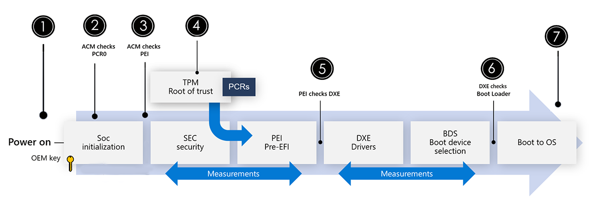

# Surface security overview

Recent advances in security research demonstrate that as more protections are built into the OS and connected services, attackers are looking for other avenues of exploitation with firmware emerging as a top target.

Today, managing device firmware is an inconsistent experience and often involves third-party providers making firmware difficult to monitor and complicated to maintain. Ultimately, this can limit the ability of hardware manufacturers to detect and push out timely updates in response to threats.

Microsoft Surface has been using a unified approach to firmware protection and device security since 2015 through complete end-to-end ownership of the hardware design, in-house firmware development, and a holistic approach to device updates and management.

For Surface, our Unified Extensible Firmware Interface (UEFI)[1](#references) is maintained in-house, regularly updated through Windows Update, and seamlessly deployed for management through Windows Autopilot, minimizing risk and maximizing control at the firmware level before the device boots. Microsoft provides fully transparency of the code base in our UEFI through the Open Source [Project Mu](https://microsoft.github.io/mu/) on GitHub, managed by Microsoft Endpoint Manager.

## Microsoft designed and built components

Every layer of Surface from chip to cloud is developed and maintained by Microsoft, giving you ultimate control, proactive protection, and peace of mind wherever and however work gets done. Surface devices ship with the strongest security protocols Microsoft offers and enables streamlined management that reduce IT complexity that helps users stay focused on their work.

Surface drives security through a defense in-depth approach by utilizing a layering of independent defensive sub-components. From chip to cloud, or a UEFI that ensures a Root of Trust to the AI powered Microsoft Defender for Endpoint that works to prevent, detect, investigate, and respond to advanced threats, Surface enforces the position that built-in from Microsoft is better than bolt-on.

| Feature                         | Description                                                                                                                                                                                                                                                                                                                         | Learn more                                                                                                                                                                   |
| ------------------------------- | ----------------------------------------------------------------------------------------------------------------------------------------------------------------------------------------------------------------------------------------------------------------------------------------------------------------------------------- | ---------------------------------------------------------------------------------------------------------------------------------------------------------------------------- |
| Microsoft Built UEFI            | Software that configures the device and boots Windows 10 Controls initial boot of device and Windows 10, then provides firmware runtime services to the  OS. ensures significantly more control over the hardware of a device through SEMM on-prem management and DFCI cloud-based management through Microsoft Endpoint Manager | [Manage Surface UEFI settings](manage-surface-uefi-settings.md)                                                                        |
| Physical TPM 2.0                | Trusted Platform Module - Dedicated microcontroller designed to secure hardware through integrated cryptographic keys. Encrypts and stores keys (BitLocker, Windows Hello, AD Credentials,) PCR - Platform Configuration Registers that secure measurements and relevant metrics to detect changes to previous configuration  | [Trusted Platform Module Technology Overview](/windows/security/information-protection/tpm/trusted-platform-module-overview)                 |
| Windows Hello for Business      | Replaces passwords with strong two-factor authentication on PCs and mobile devices. This biometric authentication consists of a new type of user credential that is tied to a device and uses a biometric or PIN.                                                                                                                   | [How Windows Hello for Business works - Microsoft 365 Security](/windows/security/identity-protection/hello-for-business/hello-how-it-works) |
| Integrated encryption           | Integrated encryption is enabled by BitLocker to secure and encrypt your data, and Windows Hello to enable passwordless login, combined with physical TPM and UEFI.                                                                                                                                                                 | [BitLocker (Windows 10) - Microsoft 365 Security](/windows/security/information-protection/bitlocker/bitlocker-overview)                     |
| Microsoft Defender for Endpoint | Provides an enterprise endpoint security platform designed to help enterprise networks prevent, detect, investigate, and respond to advanced threats.                                                                                                                                                                               | [Microsoft Defender for Endpoint](/microsoft-365/security/defender-endpoint/microsoft-defender-endpoint)                 |

## Factory level security protocols and inspection

From firmware to operating system and every component of hardware before final assembly, Surface devices are safe from supply chain attacks in our physically secured development and manufacturing facilities.

By definition, a secure supply chain delivers finished products that meet quality, performance, and operational goals. Simply put, a secure supply chain ensures that all components are genuine and free of unauthorized or malicious manipulation or sabotage. We manufacture devices in highly secured factories where everything from the UEFI firmware to the operating system comes directly from Microsoft. No third-party BIOS vendors are involved. This is a strong part of how we protect against supply chain attacks for Surface products. We have reduced the attack Surface in our UEFI by removing any unused code including system management mode SMM functions that are devices do not need.

Protecting facilities from external Internet-based attacks, intrusion, and other threats requires an ongoing investment across key areas including:

- Rigorous inspection and testing of all components at final assembly locations.
- Maintaining high levels of physical security at the factory.
- Use of only Microsoft developed & maintained firmware, drivers, and OS.
- Secure logistics and trusted carrier delivery of Surface devices direct to Microsoft resellers.

Upon leaving the factory, Surface for Business devices are protected via Windows Update throughout the lifecycle.

## Advanced Windows security features

Escalation of privilege attacks are a malicious actor’s best friend, and they often target sensitive information stored in memory. These kinds of attacks can turn a minor user mode compromise into a full compromise of your OS and device. To combat these kinds of attacks, Microsoft developed virtualization-based security (VBS) and Hypervisor-protected code integrity (HVCI, also commonly referred to as memory integrity). VBS and HVCI use the power of hardware capabilities like virtualization to provide better protection against common and sophisticated malware by performing sensitive security operations in an isolated environment.

Surface ships with these Windows enhanced hardware security features enabled out of the box to give customers even stronger security that is built-in and turned on by default.

## Virtualization-based security

Virtualization-based security, or VBS, uses hardware virtualization features to create and isolate a secure region of memory from the normal operating system. Windows can use this "virtual secure mode" to host a number of security solutions, providing them with greatly increased protection from vulnerabilities in the operating system, and preventing the use of malicious exploits which attempt to defeat protections.

### Hypervisor-Enforced Code Integrity (HVCI)

HVCI uses VBS to significantly strengthen code integrity policy enforcement. Kernel mode code integrity checks all kernel mode drivers and binaries before they're started and prevents unsigned drivers or system files from being loaded into system memory. As shown in the following diagram, HVCI runs in an isolated execution environment and verifies the integrity of the kernel code according to kernel signing policy.

Both VBS and HVCI are enabled out of the box in the following Surface devices:

- Surface Laptop 4
- Surface Pro 7+
- Surface Book 3,
- Surface Laptop Go,
- Surface Pro X

## Secure boot and boot guard

Surface devices’ Root of Trust checks signatures and measurements to tightly ensure each stage is secure and authentic before allowing the next phase of boot to proceed. Enabled by UEFI and TPM 2.0, Secure Boot ensures that only code signed, measured, and correctly implemented code can execute on a Surface device.

As shown in Figure 2, the integrity of the firmware is checked at each stage from pressing the power button to running the operating system.

 > [!div class="mx-imgBorder"]
 > 
 *Figure 1. Secure Boot for Surface devices*

| Step  | Secure Boot Phase                                                                                                                                                                                                                                      |
| ----- | ------------------------------------------------------------------------------------------------------------------------------------------------------------------------------------------------------------------------------------------------------ |
| **1** | Security is instantiated every time the power button is pressed from a root of trust provided by the TPM. When a device is first powered on, the system runs a series of security checks to ensure device firmware has not been tampered or corrupted. |
| **2** | When powered on, the SoC uses a chipset vendor key to validate and initiates the loading of microcode using the Authenticated Code Module (ACM) (on Intel-based devices).                                                                              |
| **3** | The ACM measures the UEFI code before loading and compares it to the known measurement in the TPM's Platform Configuration Register [PCR] to ensure the UEFI code has not been altered.                                                                |
| **4** | Before allowing UEFI to run, Boot Guard checks that the UEFI is signed with a Surface OEM key. The initially checked UEFI module is the SEC security and the PEI Pre-EFI sections shown in the diagram.                                                |
| **5** | The PEI section checks for a Surface signature on the driver execution environment, the DXE module, as it is loaded. The DXE module includes the boot device selection phase.                                                                          |
| **6** | Once the boot device is selected, UEFI reads the boot device and checks the signature of the OS boot loader before allowing it to execute.                                                                                                             |
| **7** | The OS then checks its signatures on its main component as it brings up the OS.

### Malware protection

To help protect your device from malicious software attacks, Surface enables Secure boot to ensure an authentic version of Windows 10 is started and that the firmware is as genuine as it was when it left the factory.

The SoC on Surface devices has a security processor that's separate from every other core. When you first start
Surface device, only the security processor starts before anything else can be loaded. Secure Boot is used to verify that the components of the boot process, including drivers and the operating system, are validated against a database of valid and known signatures. This helps prevent attacks from a cloned or modified system running malicious code hidden in what appears to be an otherwise normal user experience. For more information, see [Secure Boot overview](/windows-hardware/design/device-experiences/oem-secure-boot).

Once the operating system is verified as originating from Microsoft and your Surface device successfully completes the boot process, the device scrutinizes the executable code. Our approach to securing the operating system involves identifying the code signature of all executables, allowing only those that pass our restrictions to be loaded into the runtime. This code signing method enables the operating system to verify the author and confirm that code was not altered prior to running on the device.

## DRTM protection in AMD devices

Surface devices containing AMD processors implement Secure Boot in an equivalent manner. Surface Laptop 4 with AMD Ryzen Microsoft Surface Edition processor protects firmware from the initial power-on using Dynamic Root of Trust Measurements (DRTM).DRTM controls all the CPUs, forcing execution along a measured path, and reestablishes trust at various stages to verify the integrity of the system firmware/software. Transitioning into this trusted state early provides added protection against potential attacks in the boot stages.

DRTM protects measurements by ensuring they are encrypted using Total System Memory Encryption (TSME). Once TSME is set if cannot be cleared except by a system reset. A new encryption key for each reset ensures single use encryption for security.

Runtime calls to System Management Mode (SMM) execute at the highest level, which can be risky if the SMM code has any issues. Surface Laptop 4 with AMD Ryzen guards the system by intercepting the System Management Interrupts (SMI) and dispatches the execution of the SMM code to a lesser level (user) to protect the system from invalid access to code and data. SMM protection uses hardware protections to restrict the code, data, and system resources that can be accessed, further enforcing protection against inadvertent or malicious incidents.

Surface Laptop 4 with AMD Ryzen supports [NIST 800-193 Platform Firmware Resiliency Guidelines](https://nvlpubs.nist.gov/nistpubs/SpecialPublications/NIST.SP.800-193.pdf), in addition to the robust firmware update support. The resilient update mechanism for boot firmware uses an A-B Recovery mechanism that provides auto-recovery to a backup copy of firmware should the boot sequence detect a corrupted copy of the firmware during boot.

To learn more about DRTM and SMM, see [How a Windows Defender System Guard helps protect Windows 10 - Windows security | Microsoft Docs](/windows/security/threat-protection/windows-defender-system-guard/how-hardware-based-root-of-trust-helps-protect-windows)

## Remote device management control

IT admins can remotely manage Surface devices without having to physically touch every device. Microsoft Endpoint Manager with Intune and Windows Autopilot enables full remote management of Surface devices from the Azure Cloud, delivering fully configured devices to users upon startup. Wipe and retire features allow IT to repurpose a device easily for a new remote user and wipe a device that's been stolen. This enables rapid and secure response capabilities in the event of loss or theft of a Surface device allowing you to remotely remove all company data and reconfigure Surface as an entirely new device.

| Feature                                        | Description                                                                                                                                                                                                                                                                                                                                                                                                        | Learn more                                                                                                                                                                                                                                                              |
| ---------------------------------------------- | ------------------------------------------------------------------------------------------------------------------------------------------------------------------------------------------------------------------------------------------------------------------------------------------------------------------------------------------------------------------------------------------------------------------ | ----------------------------------------------------------------------------------------------------------------------------------------------------------------------------------------------------------------------------------------------------------------------- |
| DCFI (Device Firmware Configuration Interface) | Delivers cloud-scale remote firmware management with zero-touch device provisioning. Microsoft’s own UEFI allows stronger DCFI implementation, enabling organizations to disable hardware elements and remotely lock UEFI using Intune. ¹                                                                                                                                                                          | [Intune management of Surface UEFI settings](surface-manage-dfci-guide.md)   [Manage Surface UEFI settings](manage-surface-uefi-settings.md)                                          |
| SEMM (Surface Enterprise Management Mode)      | Enables centralized enterprise engagement of UEFI firmware settings across on-premises, hybrid, and cloud environments.¹                                                                                                                                                                                                                                                                                           | [Surface Enterprise Management Mode](surface-enterprise-management-mode.md)                                                                                                                                                       |
| Windows Update for Business                    | Enables IT admins to keep the Windows 10 devices in their organization always up to date with the latest security defenses, Windows features, and Surface firmware by directly connecting these systems to Windows Update service. You can use Group Policy or MDM solutions such as Microsoft Intune to configure the Windows Update for Business settings that control how and when Surface devices are updated. | [Windows Update for Business](/windows/deployment/update/waas-manage-updates-wufb)   [Manage and deploy Surface driver and firmware updates](manage-surface-driver-and-firmware-updates.md) |

## References

1. Surface Go and Surface Go 2 use a third-party UEFI and do not support DFCI. DFCI is currently available for Surface Laptop Studio, Surface Pro 8, Surface Go 3, Surface Laptop 4, Surface Laptop Go, Surface Book 3, Surface Laptop 3, Surface Pro 7+, Surface Pro 7, and Surface Pro X. 

## Learn more

- [New Surface PCs enable virtualization-based security (VBS) by default to empower customers to do more, securely](https://www.microsoft.com/security/blog/2021/01/11/new-surface-pcs-enable-virtualization-based-security-vbs-by-default-to-empower-customers-to-do-more-securely/)
- [Study highlights critical role of Surface firmware protection](https://techcommunity.microsoft.com/t5/surface-it-pro-blog/study-highlights-critical-role-of-surface-firmware-protection/ba-p/2245244)
- [Enhancing security and compliance with Microsoft Surface and Microsoft 365](https://techcommunity.microsoft.com/t5/surface-it-pro-blog/enhancing-security-and-compliance-with-microsoft-surface-and/ba-p/2283062)
- [Manage Surface UEFI settings](manage-surface-uefi-settings.md)
- [Intune management of Surface UEFI settings](surface-manage-dfci-guide.md)
- [Project Mu](https://microsoft.github.io/mu/)
