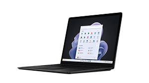
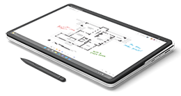
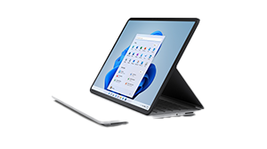
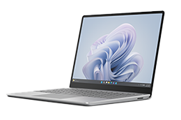
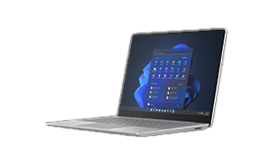
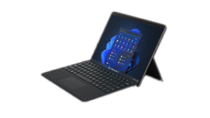
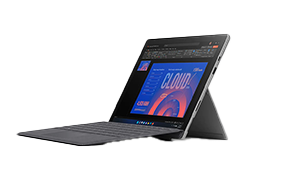
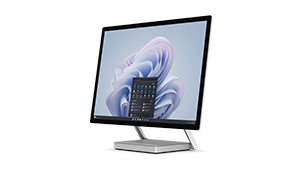

# Surface for Business service and repair

Built with integrity by design, many Microsoft Surface devices are now easier to repair1 and maintain, providing commercial customers with greater flexibility while extending the use of devices. 

Commercial customers can obtain service for Surface for Business devices in several ways. You can get service [directly from Microsoft](microsoft-in-region-same-unit-repair.md) or use a third party [Authorized Service Provider](authorized-service-providers.md). Or with skilled technicians, you can repair2 devices yourself following the applicable [Surface Service Guide](https://www.microsoft.com/download/100440) or [article](https://support.microsoft.com/surface/replace-the-feet-on-surface-devices-791bcf1d-db4a-4807-816e-06d30072383d).

To learn more, see [Surface service options](surface-service-options.md).

## Surface devices and replacement components

Microsoft recommends that only technically inclined individuals with the knowledge, experience, and requisite tools perform repairs following the relevant [Surface Service Guide instructions](https://www.microsoft.com/download/100440). 

> [!NOTE]
> Replacement components may be new or refurbished. To  learn more about Microsoft's commitment to replacement components, see our [Self-repair information FAQ](https://support.microsoft.com/surface/self-repair-information-for-your-surface-device-56655149-c27a-432a-9936-bacd609a4b03).

| Device | Replacement Components | Instructional Video |
| ------ | ---------------------- | ------------------- |
| **Surface Laptop 6**   | - Display assembly (including camera) - Keyboard assembly - Removable solid-state drive - Battery - Motherboard module (main processor and main memory) - Surface Connect - Thermal module - Audio jack - Speakers - Touchpad - Enclosure - Feet| Repair video coming soon |
| **Surface Laptop 5**  | - Display - Keyboard - Surface connect charging port - Feet - Battery and Enclosure - Thermal Module - Motherboard - Removable solid-state drive (rSSD) | [Repair video for Surface Laptop 5](https://www.youtube.com/watch?v=6aCpzyfDUnk) |
| **Surface Laptop 4**  | - Display - Keyboard - Feet & Screws - Removable solid-state drive (rSSD) | [Repair video for Surface Laptop 4](https://youtu.be/g54Ay92gR5E?si=Jv0mO53QNDNlbv0m) |
| **Surface Laptop 3**  | - Display - Keyboard - Feet & Screws - Removable solid-state drive (rSSD) |[Repair video for Surface Laptop 3](https://youtu.be/g54Ay92gR5E?si=Jv0mO53QNDNlbv0m)   |
| **Surface Laptop Studio 2**  | - Display - Keyboard - Motherboard - Surface connect charging port - USB-C & and USB-A port connectors - Removable solid-state drive (rSSD) - Cosmetic Plate - Battery and Enclosure - Feet - MicroSD card reader - Audio Jack | [Repair video for Surface Laptop Studio 2](https://www.youtube.com/watch?v=-TOjHqVYfAw) |
| **Surface Laptop Studio**  | - Display - Keyboard - Battery and Enclosure - Charging Port - USB-C & Audio Jacks - Removable solid-state drive (rSSD) - Cosmetic Plate - Keyboard/Trackpad - Feet | [Repair video for Surface Laptop Studio](https://www.youtube.com/watch?v=cnBAeUD0Li4) |
| **Surface Laptop Go 3**  | - Display - Removable solid-state drive (rSSD) - Keyboard - Feet - Battery - Motherboard - Keyboard with Fingerprint Reader - Surface connect charging port | [Repair video for Surface Laptop Go 3](https://www.youtube.com/watch?v=ZNzZbvkbmyo&t=5s)|
| **Surface Laptop Go 2**  | - Display - Removable solid-state drive (rSSD) - Keyboard - Feet - Battery - Keyboard with Fingerprint Reader - Surface connect charging port | [Repair video for Surface Laptop Go 2](https://www.youtube.com/watch?v=ZNzZbvkbmyo&t=5s) |
| **Surface Laptop SE**  | - Display - Keyboard - Enclosure - Feet - Speaker & Wi-Fi Modules - Motherboard - Battery - Power Port | [Repair video for Surface Laptop SE](https://www.youtube.com/watch?v=fVjjSqfp75g&t=7s) |
| **Surface Pro 10**  | - Display module - Removable solid-state drive - Battery - Motherboard (including main processor and main memory) - Surface Connect  - Thermal module - Microphone module - Solid-state drive door - Speakers - Enclosure (bucket) - Front camera - Rear camera - Power and volume buttons - Kickstand - Device entry kit - SIM card connector | Repair video coming soon |
| **Surface Pro 9**  | - Kickstand - Display (Screen) - Enclosure - Speaker - Battery - Surface connect charging port - Thermal Module - Camera Front & Rear - Camera & Wi-Fi Deck - Power & Volume Button - Motherboard - SSD Door - Removable solid-state drive (rSSD) | [Repair video for Surface Pro 9](https://www.youtube.com/watch?v=S_i5OQNUbh8&t=7s) |
| **Surface Pro 9 with 5G**  | - Kickstand - Enclosure4 - Speaker - Battery - Surface connect charging port - Thermal Module - Camera Front & Rear - Camera Deck - Screen (Display) - Power & Volume Button - Motherboard - SSD Door - Removable solid-state drive (rSSD) | [Repair video for Surface Pro 9 with 5G](https://youtu.be/73fpevAn54o?si=339i0-9p3kGWW2bM) |
| **Surface Pro 8**  | - Kickstand - SSD Door - Removable solid-state drive (rSSD) - Display (Screen) | [Repair video for Surface Pro 8](https://youtu.be/ajDU3SW0XUo?si=EjReG4jE-Oh8CaAk)|
| **Surface Pro 7+**  | - Kickstand - SSD door - Removable solid-state drive (rSSD) |  [Repair video for Surface Pro 7+](https://youtu.be/iDiN8VwLJTM?si=ocTsac2RNIF7WA26) |
| **Surface Go 4**  | - Display - Battery and Enclosure - Kickstand - Hinge - Motherboard - MicroSDXC card reader - Type Cover connector - Front camera - Rear camera - Windows Hello camera - Speakers | [Repair video for Surface Go 4](https://www.youtube.com/watch?v=UBvLAHRbWmM&t=3s) |
| **Surface Studio 2+**  | - Removable solid-state drive (rSSD) - Motherboard - Display - Thermal Module - Feet - Power Supply Unit | [Repair video for Surface Studio 2+](https://youtu.be/KFPJ2s26JUw?si=ZStxfO4bT3tDyTAS) |

## Surface service guides & related documentation

Downloadable service guides provide step-by-step instructions for servicing specific devices. This documentation is intended for use by skilled technicians and IT professionals. 

- [Download service guides](https://www.microsoft.com/download/100440)
- [Replace the feet on Surface devices](https://support.microsoft.com/surface/replace-the-feet-on-surface-devices-791bcf1d-db4a-4807-816e-06d30072383d)

> [!CAUTION]
> Opening or repairing your device can present electric shock, device damage, fire and personal injury risks, and other hazards. Use caution if undertaking do-it-yourself repairs. Further, any resulting damage caused will not be covered under Microsoft's Limited Hardware Warranty or purchased protection plan.

## Support

- [Surface Support for Business and Education customers](contact-surface-business-education-support.md)
- [In-store Support](https://support.microsoft.com/surface/find-a-participating-best-buy-service-center-for-in-person-support-in-the-us-9c30c2ba-a8d3-4657-b9df-9c00239751a2)
- [Purchase replacement components at our Authorized Resellers](https://www.microsoft.com/surface/business/where-to-buy-microsoft-surface#DEVICESRESELLERS)

## Self help tips & tools

- [Full playlist of Surface repair videos](https://www.youtube.com/watch?v=X3w9pnWpMwM&list=PLNA-j_cL4mURqC1MFKHV-_ju-BOSPPhne)
- [Surface Diagnostic Toolkit for Business](surface-diagnostic-toolkit-business.md)
- [Top support solutions for Surface devices](support-solutions-surface.md)
- [Microsoft 365 admin center](https://admin.microsoft.com/adminportal/home?ref=homepage) (Microsoft Manager Centralized solution)
- [Preparing Surface devices for service](https://support.microsoft.com/surface/how-to-prepare-your-surface-for-service-e6fe1f6a-c516-0cd5-5a96-0377d82e7fc5)
- [Microsoft Packing and Shipping Instructions](https://support.microsoft.com/surface/packing-and-shipping-instructions-for-surface-devices-0847468e-0eaf-4b01-269f-566b71dcb373)
- [Protect data during service](https://support.microsoft.com/help/4023508/surface-faq-protecting-your-data-service)

### References

1. Repairing your device with a replacement component does not impact Microsoft's Limited Warranty; however, any damage to the device resulting from a repair performed by someone other than Microsoft or an Authorized Service Provider will not be covered under Microsoft's warranty or protection plan.
2. Customer self-repair is only available on Microsoft devices with a removable component per the product's technical specifications. Microsoft recommends that self-repair be performed by technically inclined individuals with the knowledge, experience and required tools while following the applicable [Surface Service Guide](https://www.microsoft.com/download/100440) or [article](https://support.microsoft.com/surface/replace-the-feet-on-surface-devices-791bcf1d-db4a-4807-816e-06d30072383d). Opening or repairing your device can present various risks, such as electric shock, device damage, fire and personal injury risks, and other hazards. Use caution if undertaking do-it-yourself repairs. Further, any resulting damage caused will not be covered under Microsoft's Limited Hardware Warranty or purchased protection plan.
3. Microsoft's Limited Hardware Warranty is in addition to any right you might have under consumer or other laws applicable to you.
4. Enclosure for Surface Pro 9 with 5G is only available in select markets and is currently unavailable in the US. 