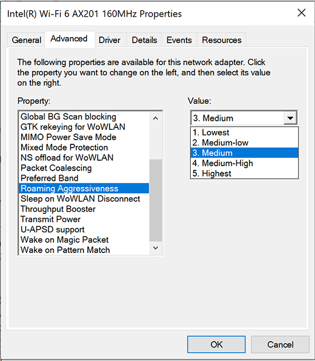

# Optimize Wi-Fi connectivity on Surface devices

To stay connected with all-day battery life, Surface devices implement wireless connectivity settings that balance performance and power conservation. Outside of the most demanding mobility workloads, users can maintain sufficient wireless connectivity without modifying default network adapter or related settings. This page highlights key wireless connectivity considerations in mobile scenarios using Surface devices.

## Prerequisites

This document assumes you have successfully deployed a wireless network that supports 802.11n (Wi-Fi 4) or later following best practice recommendations from leading equipment vendors.

## Configuring access points for optimal roaming capabilities

Suppose you’re managing a wireless network that’s typically accessed by many different types of client devices. In that case, it’s recommended to enable specific protocols on access points (APs) in your WLAN, as described in [Fast Roaming with 802.11k, 802.11v, and 802.11r](/windows-hardware/drivers/network/fast-roaming-with-802-11k--802-11v--and-802-11r). Surface devices can take advantage of the following wireless protocols:

- **802.11r.** “**Fast BSS Transition”** accelerates connecting to new wireless access points by reducing the number of frames required before your device can access another AP as you move around with your device. In the new generation of Surface devices released since 2019, end-users may gain access to roaming aggressiveness settings on their device. Although modifying default settings is not recommended, users should be aware of this capability and understand how specific settings can impact their ability to remain connected.
- **802.11k.** **“Neighbor Reports”** provides devices with information on current conditions at neighboring access points. It can help your Surface device choose the best AP using criteria other than signal strength, such as AP utilization.

Specific Surface devices can also use 802.11v “BSS Transition Management Frames,” which functions much like 802.11k in providing information on nearby candidate APs. These include Surface Pro 8, Surface Pro 7+, Surface Laptop Studio, Surface Go 3, Surface Go 2, Surface Go, Surface Pro 7, Surface Pro X, and Surface Laptop 3.

## Managing user settings

You can achieve optimal roaming capabilities through a well-designed network that supports  802.11r and 802.11k across all access points. Ensuring that your network is appropriately configured to provide users with the best wireless experience is the recommended approach versus managing user settings on individual devices.

### Recommended user settings and best practices

In certain situations, modifying advanced network adapter settings built into Surface devices may facilitate a more reliable connection. However, keep in mind that an inability to connect to wireless resources is more often due to an access point issue, networking design flaw, or environmental site issue.

> [!TIP]
> How you hold your Surface Pro or Surface Go can also affect signal strength. If you’re experiencing a loss of bandwidth, check that you’re not holding the top of the display, where the Wi-Fi radio receiver is located. Although holding the top of the display does not block wireless signals, it can trigger the device driver to initiate changes that reduce connectivity.

### Keep default Auto setting for dual bandwidth capability

On most Surface devices, you can configure client network adapter settings to only connect to wireless APs over 5 gigahertz (GHz), only connect over 2.4 GHz, or let the operating system choose the best option (default Auto setting).

**To access network adapter settings, go to:**

- **Start** > **Control panel** > **Network and Sharing Center** > **your Wi-Fi adapter** > **Properties** > **Configure** > **Advanced**.

  

Keep in mind that 2.4 GHz has some advantages over 5 GHz: It extends further and more easily penetrates through walls or other solid objects. Unless you have a clear use case that warrants connecting to 5 GHz, leaving the Band setting in the default state is recommended to avoid possible adverse consequences. For example:

- Many hotspots found in hotels, coffee shops, and airports still only use 2.4 GHz, effectively blocking access to devices if Band is set to 5 GHz Only.
- Since Miracast wireless display connections require the initial handshake to be completed over 2.4 GHz channels, devices won’t be able to connect at 5 GHz Only.

> [!NOTE]
> By default, Surface devices will prefer connecting to 5 GHz if available. However, Surface will first look for a 2.4 GHz connection to preserve power in a low battery state.

You can also toggle the band setting as needed to suit your environment. For example, users living in high-density apartment buildings with multiple Wi-Fi hotspots  —  amid the presence of consumer devices all broadcasting via 2.4 GHz  —  will likely benefit by setting their Surface device to connect on 5 GHz only and then revert to Auto when needed.

### Roaming aggressiveness settings on Surface devices with Intel adapters

Users may wish to select a signal strength threshold that prompts the device to search for a new access point when the signal drops (roaming aggressiveness). By default, Surface devices with Intel adapters attempt to roam to a new access point if the signal strength drops below **Medium** (72 percent signal strength). Organizations can also implement purpose-built wireless protocols across multiple network access points to facilitate roaming congested network environments, as explained earlier on this page.

While increasing roaming aggressiveness above **Medium** may yield improved connectivity in highly congested office or residential environments, it can result in degraded connectivity when stepping outside of these environments.

Leave the roaming aggressiveness setting in the default state unless you encounter connectivity issues in specific mobile scenarios such as conducting environmental site inspections while maintaining voice and video connectivity during a conference meeting. If you don’t notice any improvement, revert to the default Medium state. Note that if you increase roaming aggressiveness, you also accelerate battery power consumption.

**To enable roaming aggressiveness on Surface:**

1. Go to **Start** > **Device Manager**.
2. Under **Network adapters**, select **Intel Wi-Fi 6** and then right-click **Properties**.
3. Select the **Advanced** tab.
4. Select **Roaming Aggressiveness** and choose your preferred value from the drop-down menu.

  

### Roaming aggressiveness settings on Surface Go and Surface Pro X

Front-line workers using Surface Go may wish to select a signal strength threshold that prompts the device to search for a new access point when signal strength drops (roaming aggressiveness). By default, Surface devices attempt to roam to a new access point if the signal strength drops below **Medium** (50 percent signal strength). Note that whenever you increase roaming aggressiveness, you accelerate battery power consumption.

Leave the roaming aggressiveness setting in the default state unless you encounter connectivity issues in specific mobile scenarios such as conducting environmental site inspections while maintaining voice and video connectivity during a conference meeting. If you don’t notice any improvement revert,to the default **Medium** state.

**To enable roaming aggressiveness on Surface Go:**

1. Go to **Start > Control Panel** > **Network and Internet** > **Network and Sharing Center.**
2. Under **Connections**, select **Wi-Fi** and then choose **Properties.**
3. Select **Client for Microsoft Networks** and then select **Configure**
4. Select **Advanced** > **Roaming Aggressiveness** and choose your preferred value from the drop-down menu.

  

## Conclusion

Surface devices are designed with default settings for optimal wireless connectivity balanced alongside the need to preserve battery life. The most effective way of enabling reliable connectivity for Surface devices is through a well-designed network that supports 802.11r and 802.11k. Users can adjust network adapter settings or roaming aggressiveness but should only do so in response to specific environmental factors and revert to default state if there’s no noticeable improvement.
