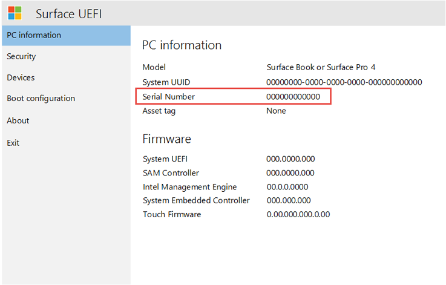
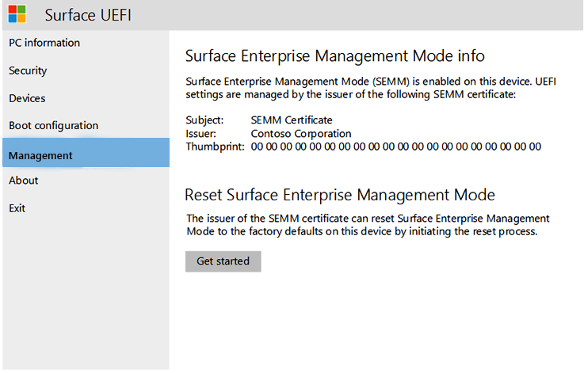

# Unenroll Surface devices from SEMM

This article describes how to unenroll a device from SEMM using the [Surface IT Toolkit](surface-it-toolkit.md). When a Surface device is enrolled in Surface Enterprise Management Mode (SEMM), a certificate is stored in the firmware of that device. The presence of that certificate and the enrollment in SEMM prevent any unauthorized changes to Surface Unified Extensible Firmware Interface (UEFI) settings or options while the device is enrolled in SEMM. To restore control of Surface UEFI settings to the user, the Surface device must be unenrolled from SEMM, a process sometimes described as reset or recovery.

> [!WARNING]
> To unenroll a device from SEMM and restore user control of Surface UEFI settings, you must have the SEMM certificate that was used to enroll the device in SEMM. If this certificate becomes lost or corrupted, it is not possible to unenroll from SEMM. Back up and protect your SEMM certificate accordingly.

For more information about SEMM, see [Microsoft Surface Enterprise Management Mode](surface-enterprise-management-mode.md).

## Unenroll a Surface device from SEMM with a Surface UEFI reset package

The Surface UEFI reset package is the primary method you use to unenroll a Surface device from SEMM. Like a Surface UEFI configuration package, the reset package is a Windows Installer (.msi) file that configures SEMM on the device. Unlike the configuration package, the reset package resets the Surface UEFI configuration on a Surface device to its default settings, remove the SEMM certificate, and unenroll the device from SEMM.

 The Surface IT Toolkit generates a universal reset package that applies to all supported devices except Surface Go 2. To begin the process of creating a reset package, you need the serial number of the device you want to unenroll, and the SEMM certificate used to enroll the device. You can find the serial number of your Surface device on the **PC information** page of Surface UEFI, as shown in the following figure. This page is displayed even if Surface UEFI is password protected and the incorrect password is entered.

> [!NOTE]
> To boot to Surface UEFI, press **Volume Up** and **Power** simultaneously while the device is off. Hold **Volume Up** until the Surface logo is displayed and the device begins to boot.

## Unenroll a Surface device from SEMM with a Recovery Request

In some scenarios, a Surface UEFI reset package might not be a viable option to unenroll a Surface device from SEMM (for example, if Windows is unusable). In these scenarios, you can unenroll the device by using a Recovery Request generated from within Surface UEFI. The Recovery Request process can be initiated even on devices where you don't have the Surface UEFI password.

The Recovery Request process is initiated from Surface UEFI on the Surface device, approved with  [Surface UEFI Configurator](surface-it-toolkit-uefi-config.md) on another computer, and then completed in Surface UEFI. Like the reset package, approving a Recovery Request with UEFI Configurator requires access to the SEMM certificate that was used to enroll the Surface device.

To initiate a Recovery Request, follow these steps:

1. Boot the Surface device that is to be unenrolled from SEMM to Surface UEFI.
2. Type the Surface UEFI password if you're prompted to do so.
3. Select the **Management** page. You might need to select **Configure** to display the SEMM and Reset info, as shown in the following figure.

   

4. Select **Get Started**.
5. Select **Next** to begin the Recovery Request process.
   > [!NOTE]
   > A Recovery Request expires two hours after it is created. If a Recovery Request is not completed in this time, you will have to restart the Recovery Request process.
6. Select **SEMM Certificate** from the list of certificates displayed on the **Choose a SEMM reset key** page and then Select **Next**.

   

7. On the **Enter SEMM reset verification code** page, you can select the **QR Code** or **Text** buttons to display your Recovery Request (Reset Request)  or the **USB** button to save your Recovery Request (Reset Request) as a file to a USB drive.

   

   

   - To use a QR Code Recovery Request (Reset Request), use a QR reader app on a mobile device to read the code. The QR reader app translates the QR code into an alphanumeric string. You can then email or message that string to the administrator that produces the reset verification code with UEFI Configurator.
   - To use a Recovery Request (Reset Request) saved to a USB drive as a file, use the USB drive to transfer the file to your admin computer where UEFI Configurator will be used to produce the Reset Verification Code. The file can also be copied from the USB drive on another device to be emailed or transferred over the network.
   - To use the Recovery Request (Reset Request) as text, type the text directly into UEFI Configurator.

To create a Surface UEFI reset request:

1. Open the [Surface IT Toolkit](surface-it-toolkit.md) and go to the **UEFI Configurator** section.
2. Select the **Recovery Request** to initiate the unenrollment process for Surface devices from SEMM (Surface Enterprise Management Mode).

    :::image type="content" source="images/ueficonfig-reset.png" alt-text="Screenshot that shows the start of a Recovery Request.":::

3. In the **Certificate Protection** section, import your organization's private signing key by selecting the **Certificate File** and entering the associated **Certificate Password**. This certificate should match the one applied to the requesting device.

    :::image type="content" source="images/ueficonfig-reset-import1.png" alt-text="Screenshot that shows import of certificate.":::

4. Select **Next** to proceed to the **Add the reset request provided by your user** section.
5. Import or enter the **Reset Request** code. This can either be done by importing the file directly or entering the code manually, which the end user's device generates within the UEFI.
    :::image type="content" source="images/ueficonfig-reset-import.png" alt-text="Screenshot of Recovery Request.":::

6. Once the code is imported or entered, select **Next** to generate the **Reset Verification Code**.
7. Provide the generated **Reset Verification Code** to the end user to complete the recovery process on their device. The verification code is time-sensitive and should be used within 2 hours for it to be valid.
8. Select **Finish** to complete the Recovery Request process.

    :::image type="content" source="images/ueficonfig-recovery-request.png" alt-text="Screenshot that shows completion of Recovery Request.":::

- If you displayed the Recovery Request (Reset Request) as text on the Surface device being reset, use the keyboard to type the Recovery Request (Reset Request)  in the provided field.
- If you displayed the Recovery Request (Reset Request) as a QR Code and then used a messaging or email application to send the code to the computer with UEFI Configurator, copy and paste the code into the provided field.
- If you saved the Recovery Request (Reset Request) as a file to a USB drive, select the **Import** button, browse to and select the Recovery Request (Reset Request) file, and then select **OK**.

8. Direct the user to enter the reset verification code in the provided field on the Surface device and then Select **Verify** to reset the device and unenroll the device from SEMM.
9. Select **Restart now** on the **SEMM reset successful** page to complete the unenrollment from SEMM, as shown in the following figure.

    

### Learn more

- [Surface IT Toolkit](surface-it-toolkit.md)
- [Get started with SEMM](surface-enterprise-management-mode.md)