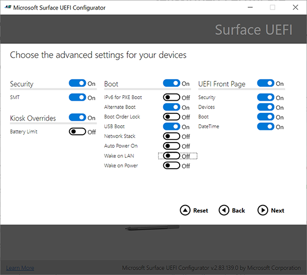

# Wake On LAN for Surface devices

To keep devices fully up to date, IT admins need to be able to manage devices when they’re not in use, typically during nightly maintenance windows. Wake on LAN (WOL) enables admins to remotely wake up devices and automatically perform management tasks with Microsoft Intune or other mobile device management (MDM) providers.

## Requirements

Devices must be connected to AC power and have a wired connection with one of the following compatible Ethernet adapters:

- Surface USB 3.0 Gigabit Ethernet Adapter
- Surface Ethernet Adapter
- Surface USB-C to Ethernet and USB Adapter
- Microsoft USB-C Travel Adapter Hub
- Surface Dock
- Surface Dock 2

> [!NOTE]
> Surface Dock 2 provides the best support for Wake on LAN without the need for any additional IT configuration. To learn more, see [Wake on LAN for Surface Dock 2](wake-on-lan-surface-dock2.md)

## How it works

When not in use, Surface devices enter an idle, low powered state known as Modern Standby or Connected Standby. IT admins can remotely trigger devices using a wake request (magic packet) that contains the Media Access Control (MAC) address of the target Surface device. Many management solutions, such as Microsoft Endpoint Configuration Manager and third-party Microsoft Store apps provide built-in support for WOL. To learn more about waking devices with Endpoint Configuration Manager, see [Configure Wake on LAN - Configuration Manager](https://docs.microsoft.com/mem/configmgr/core/clients/deploy/configure-wake-on-lan).

Support for Wake on LAN varies depending on sleep state:  Connected Standby or Hibernation (S4 power state).

## Connected Standby

By default, Windows 10 supports Wake on LAN for Surface devices in Connected Standby.

### Supported Surface devices - Connected Standby

- Surface Laptop 3 (Intel processors only)
- Surface Laptop 4 (Intel processors only)
- Surface Pro 7
- Surface Pro 7+
- Surface Pro X
- Surface Go 2
- Surface Laptop Go
- Surface Book 3

## Hibernation

To wake devices out of Hibernation requires enabling a UEFI policy setting via [Surface Enterprise Management Mode](surface-enterprise-management-mode.md) (SEMM) (not required for devices connected to Surface Dock 2).

### Supported Surface devices - Hibernation

- Surface Laptop 3 (Intel processors only)
- Surface Laptop 4 (Intel processors only)
- Surface Pro 7
- Surface Pro 7+
- Surface Laptop Go
- Surface Book 3

### To enable Wake on LAN UEFI setting

To enable the Wake on LAN UEFI setting you need to enroll target devices into SEMM, create a configuration package, and apply the package to the devices. For more information, refer to:

- [Surface Enterprise Management Mode](surface-enterprise-management-mode.md)
- [Enroll and configure Surface devices with SEMM](enroll-and-configure-surface-devices-with-semm.md)

1. Download and install [**Surface UEFI Configurator**](https://www.microsoft.com/download/details.aspx?id=46703).
2. Select **Start** > **Configuration Package** > **Create** >**+ Certificate Protection**.
3. Go to **Advanced settings** and switch **Wake on LAN** to **On**.
4. Apply the package to target devices.

    > [!div class="mx-imgBorder"]
    > 

## Learn more

- [Wake on LAN for Surface Dock 2](wake-on-lan-surface-dock2.md)
- [Microsoft Surface USB-C to Ethernet and USB Adapter](https://www.microsoft.com/p/surface-usb-c-to-ethernet-and-usb-adapter/8wt81cglrblp?)
- [Surface USB 3.0 Gigabit Ethernet Adapter](https://www.microsoft.com/p/surface-usb-30-gigabit-ethernet-adapter/8xn9fqvzbvq0?)
