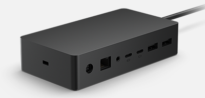

# Wake On LAN with Surface Dock 2

To keep devices fully up to date, IT admins need to be able to manage devices when they’re not in use, typically during nightly maintenance windows. Surface Dock 2 provides the best support for Wake on LAN (WOL) enabling admins to remotely wake up Surface devices and automatically perform management tasks with Microsoft Endpoint Manager or other third party solutions.

## Requirements

Devices must have a wired connection with Surface Dock 2 and stay connected to AC Power.

> [!div class="mx-imgBorder"]
> 

> [!NOTE]
> Waking devices connected to Surface Dock 2 does not require using Surface Enterprise Management Mode (SEMM) or enabling any UEFI policy settings.
 
## Supported Surface devices

- Surface Laptop 4 (Intel processors)
- Surface Laptop 4 (AMD processors)
- Surface Laptop 3 (Intel processors)
- Surface Pro 7+
- Surface Pro 7
- Surface Pro X
- Surface Go 2
- Surface Laptop Go
- Surface Book 3

Surface Dock 2 provides WOL support for devices in the following power states:

- Connected standby
- Hibernation (S4 power state)
- Shutdown (S5 “soft off” power state)

To learn more about power states, see [System Power States](/windows/win32/power/system-power-states).

## How it works

When not in use, Surface devices enter an idle, low powered state known as Modern Standby or Connected Standby. Or devices may be in hibernation (S4) or shutdown (S5) power state based on the power settings configured on the device. IT admins can remotely trigger devices using a wake request (magic packet) that contains the Media Access Control (MAC) address of the target Surface device. Many management solutions, such as Microsoft Endpoint Configuration Manager and third-party Microsoft Store apps provide built-in support for WOL.

To enable WOL on devices without Surface Dock 2, see:

- [Wake on LAN for Surface devices](wake-on-lan-for-surface-devices.md)

## Learn more

- [Surface Dock 2](https://www.microsoft.com/p/surface-dock-2-for-business/8q4hgc6kbmdq?)
- [Wake On LAN for Surface devices](wake-on-lan-for-surface-devices.md)
- [System Power States](/windows/win32/power/system-power-states)

